+++
title = "Antropologija med štirimi stenami"
summary = ""
weight = 1
date = "2019-05-12"
+++

Spoznavanje družbe in sebe med pandemijo

Založba ZRC

Ljubljana, 2020

## Antropologija med štirimi stenami: Spoznavanje družbe in sebe med pandemijo

Avtor: Dan Podjed

Urednika: Ingrid Slavec Gradišnik in Jurij Fikfak

Spremna beseda: Vesna Milek

Jezikovni pregled: Ingrid Slavec Gradišnik

Oblikovanje: Samira Kentrić

Prelom: Brane Vidmar

Založnik: Založba ZRC

Zanj: Aleš Pogačnik

Izdajatelj: ZRC SAZU, Inštitut za slovensko narodopisje

Zanj: Ingrid Slavec Gradišnik

Naklada: 500 izvodov

Ljubljana 2020; prva izdaja, prvi natis

Na strani (slika 2) je ponatisnjena naslovnica knjige *The Caves of
Steel* (Isaac Asimov, Boardman, 1954), na strani (slika 23) s soglasjem
avtorja strip iz serije Fowl Language, na strani (slika 36) pa
naslovnica plošče *Relax* skupine Frankie Goes to Hollywood. Sliki na
straneh (sliki 18, 19) sta pridobljeni po Facebooku, slika na strani
(slika 20) pa je iz posnetka, ki so ga predvajali na Televiziji
Slovenija. Druge fotografije in slike so iz avtorjevega osebnega arhiva.

CIP

© 2020, ZRC SAZU, Inštitut za slovensko narodopisje. Vse pravice
pridržane. Noben del te knjige ne sme biti reproduciran, shranjen ali
prepisan v kateri koli obliki oz. na kateri koli način, bodisi
elektronsko, mehansko, s fotokopiranjem, snemanjem ali kako drugače,
brez predhodnega pisnega dovoljenja lastnikov avtorskih pravic.

## Zahvale

Ta knjiga je nastala v dialogu med antropologom, ki sem v spletnih
zapisih opisoval svoj vsakdanjik med pandemijo covid-19, in bralci, ki
so pisanje sproti komentirali. Da bi ohranili pristnost besedila, smo se
z urednikoma odločili le za najnujnejše jezikovne posege. V mojih
dnevniških zapisih je popravljen kaka nerodnost, nastala ob dnevni
naglici pisanja, v komentarjih bralcev, ki na družbenih omrežjih pišejo
sproščeno, pa samo opaznejše tipkarske in pravopisne napake, npr.
manjkajoča ločila. Kljub temu, da so avtorice in avtorji spletnih
komentarjev v besedilu anonimni, se vsakemu od njih zahvaljujem za
podane misli. Zaradi njihovih prispevkov to ni moja, temveč naša knjiga.

Najlepša hvala urednikoma Ingrid Slavec Gradišnik in Juriju Fikfaku, ki
sta zapise napravila bolj berljive. Zahvaljujem se še Alešu Pogačniku,
vodji in glavnemu uredniku Založbe ZRC, ki je poskrbel, da je knjiga
izšla, in Agati Tomažič, promotorki raziskovalnih vsebin
Znanstvenoraziskovalnega centra SAZU, ki je pomagala širiti glas o njej.

Na koncu iskrena hvala mojim najdražjim, ki so zdržali z mano med
štirimi stenami: Petru, Gregorju in Marku Podjedu in Sari Arko.

Čeprav je besedilo zapisano v poljudnem slogu, vključuje nekatere
znanstvene izsledke programa in projekta, ki ju iz državnega proračuna
sofinancira Javna agencija za raziskovalno dejavnost Republike
Slovenije: *Etnološke in folkloristične raziskave kulturnih prostorov in
praks* (P6--0088) in *Nevidno življenje odpadkov: Razvoj etnografsko
utemeljene rešitve za upravljanje z odpadki v gospodinjstvih*
(L6--9364). Knjiga predstavi tudi rezultate mednarodnega projekta
*Ustvarjaj za povezave \> Ustvarjaj za vpliv*, ki ga v programu
Ustvarjalna Evropa financira Evropska unija.

## Predgovor: Zastoj

Ponedeljkovo jutro, petnajsti dan po preklicu epidemije. Ura je pol
devetih. Debele dežne kaplje udarjajo ob vetrobransko steklo, brisalca
pa odrivata vodo sem in tja ter se v enakomernem gibanju nenadoma povsem
zlijeta z ritmom skladbe iz radia: »Čas bo zacelil svet, čas bo
pomlajšal ta planet. In ko naju ne bo, ostalo bo rožnato nebo ...«

»Si v redu?« vprašam šestletnega sina, ki sedi za mano na svojem
varnostnem sedežu. Ne odgovori mi. Pogledam v vzvratno ogledalo in
preverim, ali ni morda zaspal. Še je buden. Skoz stransko steklo
zamišljeno gleda kolono avtomobilov, ki se ob nama počasi pomika proti
drugemu delu mesta. »Obtičala sva v prometu,« mu rečem in pojasnim, da
se temu pravi zastoj, on pa pokima in modro pripomni: »Ati, včasih pa ni
bilo toliko zastojev.«

Res, še pred slabim mesecem sva zjutraj švignila skoz mesto. Ceste so
bile prazne, avtomobili so čakali na parkiriščih, avtobusi so počivali,
ljudje niso hiteli v službo, šole so bile zaprte, vrtci tudi. Prometnih
zastojev takrat res ni bilo, zdelo pa se je, kakor da je ves svet
zastal. Ustavil ga je drobni virus, ki se je razširil po svetu in čez
noč postal glavni sovražnik človeštva in hkrati največji zvezdnik --
zavzel je več medijskega prostora od vseh vplivnežev in vplivnic skupaj,
vštevši Kim Kardashian in Challeta Salleta.

Virus SARS-Cov-2 je vplivnežem odščipnil prostor in nam odžrl čas,
hkrati pa je ponudil priložnost, da se ustavimo in premislimo, kaj
pravzaprav potrebujemo in česa si želimo. So jutranji zastoji in
vsakdanje dirke na delo res ideal, h kateremu naj si prizadevamo v
prihodnosti? Ali si lahko izmislimo nove načine premikanja in
produkcije, ki bodo bolj ukrojeni po meri ljudi in drugih bitij, s
katerimi sobivamo na tem planetu?

Glede na to, kako hitro in brezbrižno smo po karanteni planili nazaj v
življenje, v varno zavetje leta 2019, vse bolj dvomim, da se nam bo
posrečilo ob virusnem pretresu bistveno spremeniti družbo. Res pa je, da
je intersubjektivna izkušnja s karanteno, ki smo jo doživljali skupaj in
hkrati vsak po svoje, vsakogar med nami nekoliko spremenila -- in nas
morda vsaj malo premaknila kot globalno skupnost.

Da bi med pandemijo popisal spreminjanje družbe in sebe, sem se lotil
zapisovanja, ki je začelo nastajati organsko in nenačrtno. Prvi zapis je
nastal po tem, ko sem obiskal bližnje nakupovalno središče in ugotovil,
da ni nič več tako, kakor je bilo, če parafraziram nekdanjega
slovenskega predsednika. Ljudje so med nakupovanjem nosili zaščitne
maske, premikali so se drugače kakor pred razglasitvijo epidemije in
kupovali ogromne količine toaletnega papirja -- ali pa se mi je tako
vsaj zdelo. Kot antropolog, ki se mora po nenavadnost in drugačnost
navadno odpraviti kam daleč, po možnosti v tujino, sem začutil neznosno
željo, da popišem, kaj se dogaja okoli mene. Čudnost je bila nenadoma
tu, pred nosom.

Opis lastne nakupovalne izkušnje sem že zvečer objavil po omrežjih
Facebook, Twitter, Instagram in LinkedIn, in sicer tako v slovenskem kot
tudi angleškem jeziku, saj sem skušal tudi tistim, s katerimi sem
povezan v tujini, prenesti informacije o tem, kaj se med pandemijo godi
»za devetimi gorami in devetimi vodami«. Zatem sem pisal vsak dan, in to
več kot mesec dni, ter zapise sproti prevajal. Iz enkratnega dogodka je
popisovanje stanja postalo najprej obred, pozneje pa skoraj že služba.
Ob zapisih se je namreč začelo oglašati vse več ljudi. Nekateri so
pisanje hvalili, drugi pa so ugotavljali, da postajam v izolaciji
nekoliko blazen. Všeč so jim bile strategije za preživetje v domačem
ujetništvu in nasveti, kaj brati med karanteno, razburilo pa jih je, da
sem obut v kroksice ozmerjal fante, ki so igrali košarko na zaklenjenem
šolskem igrišču. Mnogim se zdelo nekoliko noro tudi, da sva z ženo
toliko časa in truda namenila pranju hrane, ki sva jo prinesla iz
trgovine, drugi pa so mi pisali, da tudi sami počnejo enako ...

Spletni dnevnik se je postopoma spreminjal v dialog med mano in družbo,
ki je sicer nisem videl, je pa bila ves čas nekje blizu, na drugi strani
zaslona. Med štirimi stenami tako nisem obtičal le z družino, temveč je
naše doživljanje krize spremljalo veliko ljudi, med katerimi mnogih
sploh nisem poznal. Nekateri od njih so mi celo svetovali, o čem naj
pišem, in negodovali, če sem kakšno temo obravnaval na način, ki je bil
po njihovem mnenju zgrešen.

Zaradi občinstva, ki je vsak dan pričakovalo novo zgodbo, sem
zapisovanje vse bolj čutil kot obveznost, hkrati pa sem se iz
posameznika začel spreminjati v medij. Že zjutraj sem ženo začel
nadlegovati z vprašanjem, o čem naj tokrat pišem, na sprehodih po
»ozunju« pa sem nenehno oprezal, kje bi lahko posnel dobro fotografijo,
ki bi jo zvečer priložil zapisu. Pisati sem običajno začel zvečer, ko so
šli otroci spat, in potem potreboval uro, dve za slovenski zapis, potem
vsaj še uro za prevod v angleščino in zatem še približno uro za
obdelovanje fotografij in širjenje zapisa po omrežjih. Delo pa se potem
sploh ni končalo. Po vsaki objavi so začeli deževati komentarji, na
katere je bilo treba sproti odgovarjati in braniti lastno pozicijo.

Tako mi je iz rok vse bolj polzel čas, ki sem ga med karanteno nameraval
porabiti zase. Ko je država oznanila, da bomo v naslednjih tednih
preživeli večino časa med štirimi stenami, sem si namreč pomel roke in
si skrivaj rekel: »Odlično!« Mislil sem, da bom imel končno več časa za
branje in sprehode v naravo, in se veselil, da bomo z družino odigrali
namizne igre, ki so se leta prašile na omari. Navdušen sem bil nad
mislijo, da bova z ženo pogosteje kuhala zdrave jedi, pripravljene iz
zelenjave, ki bo zrasla na domačem vrtu, in sanjaril o romantičnih
večerih, ki si jih bova privoščila v osami. In kaj se je dejansko
zgodilo? Obtičal sem pred zaslonom in pisal predvsem o tistem, kar se mi
je pletlo v glavi. In tako dan za dnem. Ko se mi je dokončno uprlo zreti
v lasten popek, sem se odločil končati z zapisi in pritisnil zadnjo
piko. Občinstvo ni bilo posebej navdušeno, da je »prve sezone« konec,
razočaran nad sabo pa sem bil tudi sam. Zdelo se mi je, kot da sem
lastno medijsko hišo poslal v stečaj.

Približno mesec zatem, ko sem na 36. dan karantene končal s
karantenskimi zapisi in ugonobil medij, ki sem ga poimenoval
*Antropologija med štirimi stenami*, sem se zazrl nazaj in ugotovil, da
je bil zastoj pravzaprav kar koristen. Med njim je namreč nastala ta
knjiga, ki je dejansko nisem spisal sam, temveč smo jo ustvarili s
tistimi, ki so moje pisanje brali in komentirali po omrežjih. Dnevniški
zapisi, ki sem jih širil po spletu, so namreč celoviti in pestri prav
zato, ker jih dopolnjujejo mnenja ljudi, s katerimi smo se znašli v
nenavadnem zastoju, med katerim smo bili sicer sami, a hkrati skupaj --
podobno kakor na cesti, ko tičimo vsak za svojim volanom, ujeti v
izoliranih celicah na štirih kolesih. Medtem ko nekateri po radiu
poslušamo skladbo o času in zraven mrmramo refren, so drugi priključeni
na drugačne frekvence. Na vse pa tačas pada isti dež. In vsi stojimo in
čakamo, da se spet prižge zelena luč na semaforju. In potem speljemo in
se ustavimo in speljemo ...

S sinom sva se po polurni vožnji končno pripeljala na drugi del mesta.
Dež je medtem nekoliko pojenjal, kaplje pa so risale kroge v ogromni
mlaki, sredi katere sva parkirala. »Previdno stopi na pločnik, da si ne
zmočiš čevljev!« sem mu zabičal, medtem ko sem pridržal vrata, da je
lahko stopil iz vozila. Tedaj me je prešinilo: pozabil sem vzeti
nahrbtnik s škornji! V glavi sem sočno zaklel in sina prijel za roko ter
ga previdno vodil med lužami, da bi ostal suhih nog.

Ko sva prišla do tašče in tasta, sem jima najprej pojasnil, da se bom
takoj vrnil in prinesel še opremo za dež, ki je ostala doma. »Ni treba,«
sta pomirjujoče rekla, »saj ne bomo hodili ven.« Meni pa je bilo jasno,
da bo treba še enkrat na pot. Ni bilo dovolj, da sem zastoj doživel
enkrat -- vajo bo treba ponoviti in znanje utrditi. Tako prepevajo tudi
Dan D na koncu pesmi, ki je prej igrala po radiu: »Čas bo rekel stop,
čas je za še en krog, čas je za še en krog ...«

## 5. dan karantene: Jezdeci apokalipse

»Hej, kaj pa počneš?« je blagajničarka z zaščitno masko na obrazu
zavpila mladeniču, ki je v eni roki držal pivo, z drugo pa si je v usta
basal sendvič. Da sta imela zatem burno debato, sem od daleč zgolj
slutil in sklepal po gestah, a očitno je bilo, da je gospa besna na
neodgovorneža, ki si je drznil z golo roko tipkati po avtomatski
blagajni, in to kar med jedjo. Kljub očitni jezi pa se mu ni preveč
približala, da bi ga ozmerjala od blizu, temveč je sledila novemu
napotku, naj bodo ljudje meter in pol narazen, ko so v trgovini -- tako
so opozarjale tudi table ob blagajni.

Nakupovanje je bilo nasploh povsem drugačno kakor prejšnji teden. Vse se
mi je zdelo nekako normalno, hkrati pa sem občutil tisto čudno
nedomačnost, ki ji je Freud rekel *das Unheimliche* -- tak občutek
dobimo, ko gledamo na mrliški postelji sorodnikovo truplo, ki je po eni
strani domače, hkrati pa še tuje in nenavadno. Tudi trgovina je bila
takšna kot vedno in police so bile polne, le nakupovalci smo se vedli
nekam nenavadno. Skoraj polovica nas je nosila rokavice in na obrazu
masko, premikali pa smo se kot molekule plina: skušali smo biti čim bolj
vsaksebi. Še pogledali se nismo, kaj šele da bi se ogovorili. Tudi po
opravljenem nakupu mi blagajničarka, ki sem jo izza maske spoznal po
očeh, ni niti odzdravila niti pokimala. »Samo pojdi že,« si je mogoče
mislila, ko je nepremično strmela vame, in opazovala, kako si vlečem z
dlani rokavico, da bi na telefonu odprl aplikacijo, v kateri imam
naložene kartice zvestobe. Šele pred blagajno sem namreč ugotovil, da ne
morem odkleniti telefona, če nosim gumijaste rokavice, zato sem si eno
nekoliko z odporom snel in pritisnil na senzor za prstne odtise.

Ko sem prišel domov, sem se najprej slekel do golega, oblačila vrgel v
pranje in se stuširal z vročo vodo. Skušal sem odplakniti morebitne
viruse, ki bi se lahko bili prebili do kože. Vsi deli telesa, s katerimi
sem se v trgovini dotaknil česar koli, so se mi zdeli onesnaženi,
nečisti. Nekoliko bolje sem se začel počutiti, ko sem se zdrgnil z
brisačo in pomislil, da si bom ob kosilu privoščil pivo, ki sem ga med
nakupovanjem izbral zaradi položaja, v kateri smo se znašli. Imenuje se
po jezdecih apokalipse.

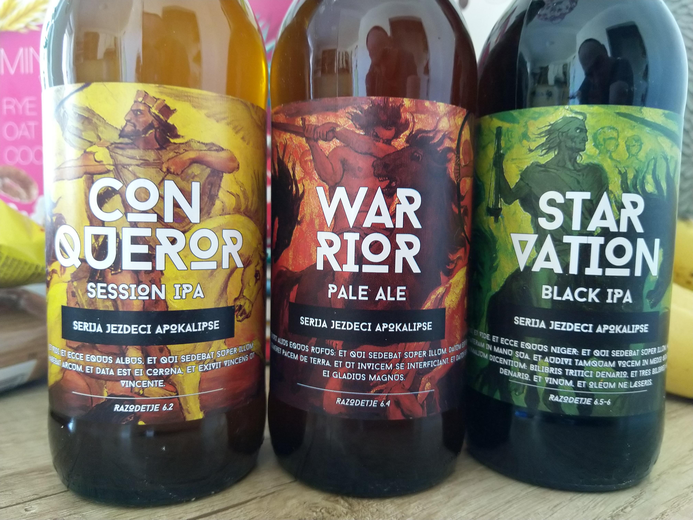

Dan, kdaj se boš lotil pisanja distopičnega romana? Tole je res tvoja
(naša) realnost, ampak obljubim, če ga napišeš, da te bom z veseljem
spet povabila za gosta Še prej pa z užitkom preberem tvoje zapise!

V Mercatorju na Vojkovi so prodajalke top, tudi v koronatajmu so ostale
človeške.

> Saj tudi tu so človeške -- kolikor je seveda možno v danih
> okoliščinah, tj. z novonameščenim pleksi steklom pred blagajno in
> masko ves čas na obrazu. Pa z mislijo, kdo ga ima, virus namreč. Meni
> bi se utrgalo. Zato: vsa čast, da sploh delajo. Vsi smo malo malo manj
> človeški v času korone, to je bil mesidž. Ali pa smo človeški na
> drugačen način.

**\
**

## 6. dan karantene: Golo sonce nad jeklenimi votlinami

»Policija, policija!« je zavpila žena. Kje, zakaj? Stekel sem v kuhinjo
in pogledal skoz okno, ravno tako tudi otroka, ki sta prišla hitro
preverit, kaj se dogaja, in se nagnetla ob okenski polici. Ob rešetkasti
ograji šolskega igrišča je bilo parkirano policijsko vozilo, iz njega pa
sta izstopila uniformiranca in se približala vrtečim kovinskim vratom
ter nekaj zavpila fantoma, ki sta metala žogo na koš. Večji in -- vsaj
na pogled -- starejši od njiju se je ustavil sredi meta. Žogo je prijel
pod roko ter pogumno zakoračil proti policistoma, mlajši pa mu je bolj
plašno sledil. Eden od policistov jima je nekaj zabrusil in nakazal z
roko v daljavo, proti drugi strani igrišča. Gesto sem razumel kot:
»Pojdita domov in tam ostanita. Zdaj ni čas za igro!« Fanta sta
sklonjenih glav zapustila igrišče in se vrnila v osamo.

Še prejšnji teden je bilo druženje del normalnosti, danes ne več. Kako
se bo to v družbi poznalo na dolgi rok? Bomo spremenili privajene načine
druženja in se videvali manj v živo in več po spletu? Se bomo ob
srečanjih še objemali, rokovali in poljubljali?

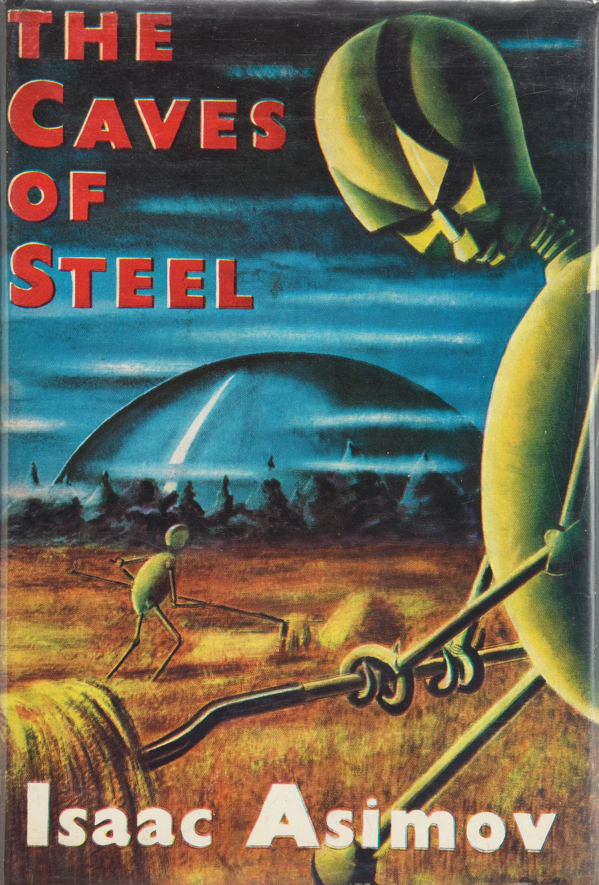

Ob takšnem samospraševanju mi vedno znova pride na pamet
znanstvenofantastična trilogija Isaaca Asimova, ki se začne z delom
*Jeklene votline*, nadaljuje z *Golim soncem* in sklene z *Roboti
jutranje zore*. V *Jeklenih votlinah* spoznamo protagonista Eliaha
Baleya, ki nekaj tisočletij v prihodnosti živi na Zemlji, kjer se gnete
že osem milijard ljudi -- to je bilo za Asimova v petdesetih letih
prejšnjega stoletja, ko je pisal to serijo romanov, verjetno
nepredstavljiva številka, a že danes nas je na planetu skoraj toliko. V
romanu ljudje živijo v jeklenih votlinah, varno skriti pod orjaško
kupolo, ki se pne nad mestom. Na prosto se zaradi kolektivne in
privzgojene agorafobije, torej strahu pred odprtim prostorom, drznejo
podati le redki.

V nadaljevanju z naslovom *Golo sonce* se dogajanje prestavi na planet
Solarija, kjer je družbeno življenje še nenavadnejše: ljudi je tam le
nekaj deset tisoč, za vsakega od njih pa skrbi množica robotov.
Prebivalci in prebivalke se srečujejo in pogovarjajo skoraj izključno na
daljavo, in sicer po napravah, ki jim pomagajo ustvariti prepričljive
holograme. Še spolnost imajo za nečisto in jo »izvajajo« izključno za
nadaljevanje vrste.

Asimov je bil pred več kot šestimi desetletji -- to je v času črno-belih
televizijskih aparatov -- neverjetno vizionarski s svojim zamišljanjem
prihodnosti, ki pa se je začela uresničevati bistveno prej, kakor bi
verjetno mogel pričakovati. Sočasno sta se pravzaprav uresničila oba
scenarija: tisti iz *Jeklenih votlin* in oni iz *Golega sonca*. Bolj kot
kdaj koli prej v zgodovini smo nagneteni in povezani in hkrati pogosto
bolj osamljeni in odmaknjeni, kakor smo bili kadar koli. V času covid-19
sta obe težnji še očitneje trčili druga ob drugo. Biti skupaj ali biti
vsak zase? Za nekaj časa je drugi scenarij očitno boljši in nujen, da
vrsta preživi.

Ko je policija odpeljala, je zunaj zavladala tišina. Od daleč se je
slišalo ptičje petje in sonce je sijalo na prazno igrišče. Na čuden
način je bilo nenavadno lepo.

V mladih letih sem požiral te knjige

> Meni so za zmeraj ostale v glavi. Asimov -- totalen car, neverjeten
> vizionar.
>
> Dan Podjed, pa Druga vlada \... Me veseli, da ste tudi mlajši še brali
> Asimova. A zdaj je bolj čas za P. K. Dicka ali vsaj dvodelni roman o
> njem, Philip K. Dick Is Dead, Alas.
>
> Druga vlada -- zakon! Briljantno razmišljanje o svetu, ki ga živimo,
> tj. analiza velikih podatkov (big data). Zdaj sem sicer padel v
> postapokaliptične trilerje, podobne Cormackovi Cesti. Se takoj bolje
> počutim

## 7. dan karantene: Sveža zemlja

Tole bo zelo kratek zapis, ker sem -- iskreno povedano -- preutrujen za
pisanje. Na vrt sem popoldne nasul velik kup sveže zemlje, jo poravnal
in potem nekaj časa občudoval narcise, ki so se začele razcvetati.

Mislim, da je fotografija sama po sebi dovolj povedna in da je odveč
besedičenje, kako bo iz sedanje »pognojene« situacije zraslo nekaj
novega. Kdo bi vedel!

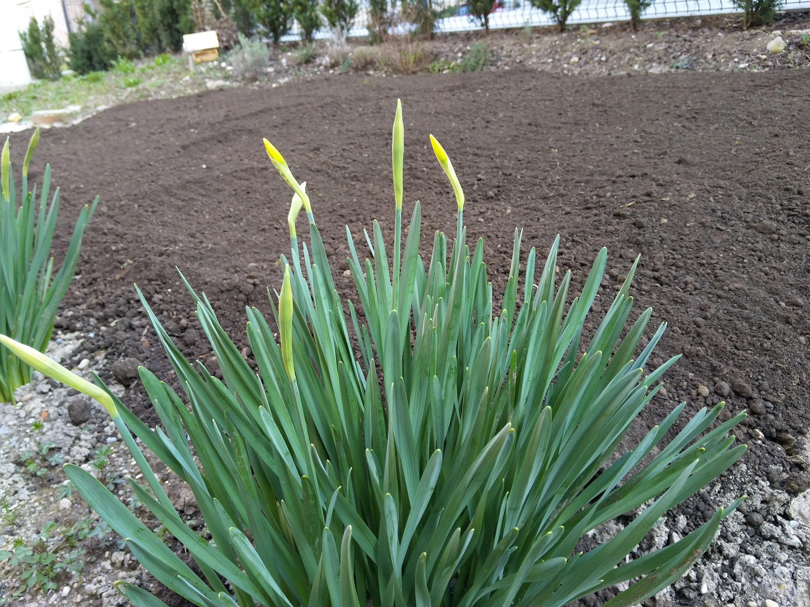

## 8. dan karantene: Dolgčas in inovativnost

Zmanjkalo nam je čistih krožnikov in kock za pomivalni stroj in smo se
morali znajti, kakor je razvidno na fotografiji ... Eh, saj ne! Dejansko
smo se za kosilo družinsko lotili priprave bučne juhe, ki smo jo
postregli v »izvirni embalaži«. Zanimivo je, kako smo nenadoma dobili
čas za polurno dolbenje buč in počasno sekljanje ter kuhljanje. No, in
tudi sicer smo postali zelo inovativni. Rezljamo, lepimo, presajamo,
igramo namizne igre, prelistavamo albume, čistimo pozabljene mape v
računalniku ... in pišemo zapise, kakršen je tale. Če smo še prejšnji
teden nekoliko bahavo v javnosti stokali, da je časa premalo, ga je
nenadoma preveč. Čudo vseh čudes: tu in tam nam je celo dolgčas.

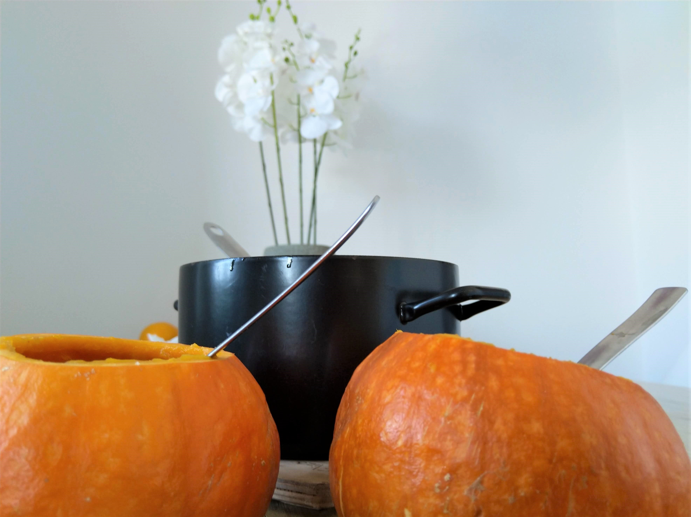

Dolgčas je danes skoraj srhljiva beseda. Bežno pa se spomnim, da ni bilo
vedno tako. Na misel mi pride, kako sem pred desetletji med šolskimi
počitnicami dejansko cenil tiste dolgočasne dneve, ko se je čas vlekel v
nedogled. Fenomenalne volje sem bil, ko je na morju deževalo, tako da
nismo mogli na plažo. Potem sem lahko ves dan bral stare Politikine
*Zabavnike*, ki sem jih našel na polici, in se spotoma naučil cirilice,
saj na otoku, kamor smo hodili na morje, slovenskih izdaj Politikinih
časopisov in revij niso prodajali -- dobilo se je le »izvirne«
tiskovine. Če nisem imel ničesar za branje, tudi ni bila težava. Odlično
je bilo početi nič, gledati v zrak in premišljati. Dolgčasa sem se tako
navadil, da me je bilo prav groza tiste dni, ko smo šli na plažo ali
celodnevni izlet, saj sem vedel, da bo dragoceni počitniški dan švignil
mimo, kot da ga nikoli ni bilo, če se bom preveč zabaval in kratkočasil.

Nimam pojma, kdaj sem pozabil ceniti dolgčas, ampak verjetno se je to
zgodilo enkrat v procesu odraščanja, ko se mi je začelo vse bolj muditi.
Ne vem sicer, kam.

V času pandemije se nisem ustavil le jaz in moja družina, temveč je --
tako se mi vsaj zdi -- zastal ves svet. Očitno je nastopil čas, da se
med dolgočasenjem spet zamislimo in pridemo do novih zamisli. Nedvomno
jih bomo potrebovali -- če ne za kaj drugega, pa zato, da premislimo,
kaj bo jutri na krožniku. Če se spotoma domislimo, kakšen bi bil
najboljši recept za družbo prihodnosti, še toliko bolje.

Ostanite zdravi!

## 9. dan karantene: S toaletnim papirjem proti covid-19

»Nimam dobre razlage za to,« je odvrnil filozof Slavoj Žižek, ko ga je
novinarka Nataša Štefe v intervjuju za Val 202 vprašala, zakaj se ljudje
v času virusne pandemije pulijo za toaletni papir. Hej, pa prav v tem
delu sicer izvrstnega pogovora je dobil Žižek iztočnico za dopolnitev
zamisli iz knjige *Kuga fantazem*, v kateri je s psihoanalitičnega
vidika med drugim pojasnil, kakšna je »ideološka« razlika med stranišči
v različnih kulturnih okoljih, in razložil, kakšen odnos imajo ljudje do
izločkov. Stranišče s »poličko« oziroma »tradicionalno nemško
stranišče,« kot mu pravi Žižek, naj bi bilo namenjeno pregledu izločkov,
ki jih lahko po iztrebljanju povohamo in si jih natančno ogledamo, da bi
zaznali morebitne bolezenske znake; »francosko stranišče«, ki se je v
Sloveniji po občutku še najbolj uveljavilo, je zasnovano tako, da
izločke čim prej odplaknemo iz vidnega polja; »anglosaško stranišče« pa
predstavlja sintezo »nemškega« in »francoskega«, saj iztrebki padejo v
vodo in jih lahko sicer vidimo, ne moremo pa jih natančno analizirati.
Žižek bi na tej točki priložil samo še toaletni papir in zgodba bi bila
popolna.

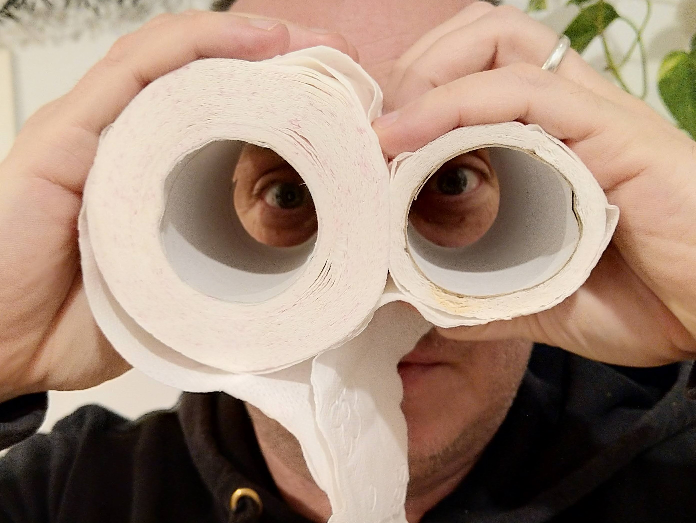

Ampak res, zakaj smo postali obsedeni s toaletnim papirjem? Hitro
razlago lahko podamo na podlagi znamenitega dela antropologinje Mary
Douglas *Čisto in nevarno*, ki je v času koronavirusa spet postalo
izjemno aktualno. Kot pravi avtorica, izvajajo ljudje po svetu različne
očiščevalne obrede, s katerimi ves čas postavljajo v življenju red. In
kaj je nakup toaletnega papirja drugega kot prva stopnja obreda, s
katerim očistimo telo in odstranimo nevarne nečistoče? Če v boju proti
nevidni grožnji ne zaleže nič drugega, si lahko vsaj temeljito in
dosledno obrišemo zadnjo plat -- in smo potem nekoliko mirnejši. (O tem
sva pred dnevi po Skypu kramljala z antropologom Samwelom Mosesom
Ntapanta, ki mi je poslal odlično kratko analizo o obsesiji s toaletnim
papirjem.)

Ob današnjem obisku trgovine sem, priznam, tudi sam podlegel množični
psihozi in v voziček vrgel dva paketa toaletnega papirja, in sicer
Palominega, ker v kriznih časih podpiram domačo industrijo, potem pa
nakupil še čistila, razkužila, robčke in pralni prašek ter pograbil
zadnjo škatlo z gumijastimi rokavicami, ki so bile začuda še na polici.
Skoraj polovico vozička sem napolnil z očiščevalnimi pripomočki in se
takoj počutil čistejši -- morda tudi zaradi vonja mehčalcev in praškov,
ki sem ga na oddelku s čistili zavohal celo čez zaščitno masko. Še
nikoli prej me ta vonj ni tako prevzel.

Ko sem voziček pririnil na prosto, sem pred trgovino uzrl znanko in jo z
varne razdalje pozdravil, ona pa me je čudno pogledala, saj me zaradi
maske na obrazu ni spoznala. Končno se ji je posvetilo, kdo sem.
Zasmejala se je, ko je zagledala veličastno založen voziček, in rekla:
»Ohoho, ti si pa tole vzel resno!« »Ja,« sem zamomljal in se počutil
nekoliko neprijetno. Zdelo se mi je, da me je razkrinkala, zato sem ji,
napol v šali, skušal razložiti: »Saj veš, tale papir je danes veliko
vreden.« Zahahljala se je in prikimala, jaz pa sem ji nakazal, da moram
naprej, ker je -- kot bi morala oba vedeti -- druženje v živo stvar
preteklosti. »Se vidiva junija na kavi!« sem ji še zavpil od daleč in
prepoten rinil voziček proti avtomobilu. Potem pa sem se spomnil:
»Prekleto, kvas sem pozabil kupiti!«

Glej, včeraj je izšel Doom Eternal. Nimam problemov s karanteno

> Jaz sem s takšnimi karantenami nehal pri Civilization II. Igral 15-20
> ur dnevno, neprekinjeno. Osvojil svet, večkrat, a postal asocialen.
> Ampak vseeno: a je Doom fajn?!

Dan, tvoje fotke so noro dobre! Moral bi jih poslati na kakšne natečaje.
Čisto zares!

## 10. dan karantene: Telesne tehnike med pandemijo

Ljudje, skoraj 45 let že imam, pa sem se šele danes naučil, kako si
pravilno umijemo roke! Sara, ki celo v karanteni ostaja moja žena, je
namreč pripravila kratek izobraževalni tečaj za našo družino in nam
odpredavala o kratki zgodovini pranja rok, začenši z dr. Ignazom
Semmelweisom, ki je porodničarje silil, naj si pred porodom operejo
roke, in končavši z zgovornim posnetkom na YouTubu o tem, kakšna je
pravilna tehnika pranja rok. Na posnetku smo videli roki v belih
gumijastih rokavicah, ki imata najprej kapljico črne barve samo na
dlaneh, nakar se dolgo drgneta druga ob drugo, se vzajemno ovijata okoli
palcev in si nazadnje pobarvata še zapestji. Šele po približno minuti
sta bili roki povsem črni, s čimer so avtorji posnetka nazorno
prikazali, kako dolgo traja, da si jih temeljito umijemo z milom.

Po predavanju sem teoretična spoznanja, ki so bila med ogledom posnetka
precej zabavna, v kopalnici preskusil še v praksi. Prepletal sem
namiljene prste, jih motal okoli palcev in zapestij ter si drgnil dlani,
zraven pa kot mantro ponavljal najboljši del besedila pesmi »Higijena«
(za jezikovne puriste: naslov je dejansko zapisan z dodatno črko J), ki
so jo izvajali Strelnikoff in Marko Brecelj: »Hojladrija, svinjarija,
diareja, gonoreja ...« Po minuti pranja rok in sočasnega zaklinjanja in
preklinjanja sem bil povsem izmučen, med brisanjem v brisačo pa me je
začelo dejansko skrbeti, ali bo to mukotrpno in duhamorno opravilo sploh
kdaj lahko postalo telesna tehnika, ki jo lahko izvajam nezavedno in
samodejno, ne da bi ob tem preveč trpel.

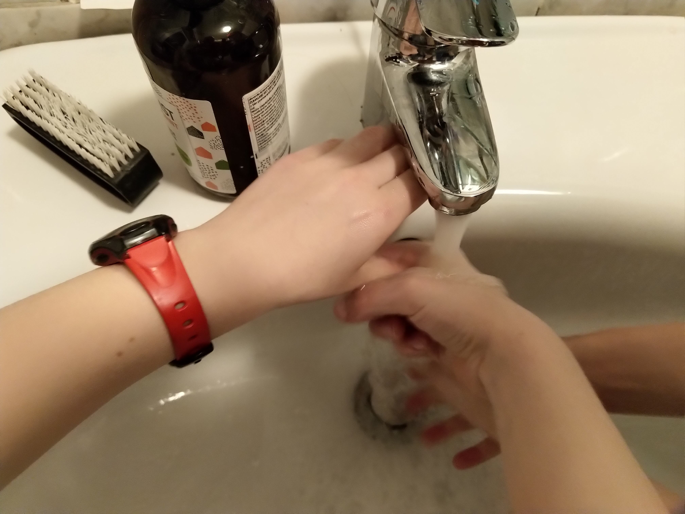

Odličen esej o telesnih tehnikah, ki je pri nas izšel v knjigi z
naslovom *Esej o daru in drugi spisi*, je pred skoraj stoletjem napisal
antropolog in sociolog Marcel Mauss. V njem je opisal, kako se od
zgodnje mladosti od staršev, učiteljev in vrstnikov učimo, kako neko
dejanje opravimo pravilno, dokler ga ne začnemo izvajati samodejno in
nezavedno. Predstavil je nekaj zanimivih in zabavnih primerov iz lastne
mladosti. Učili so ga, na primer, naj pri prsnem plavanju oponaša
parnik, in sicer tako, da ob vsakem zavesljaju z usti zajame vodo in jo
potem puhne visoko v zrak. Dodal je, da se te navade še na stara leta ni
mogel znebiti. Šolski učitelj telovadbe pa ga je naučil, kako se
»pravilno« teče, in sicer s pestmi visoko ob prsih -- takšen slog je v
Franciji očitno prevladoval v drugi polovici 19. stoletja. Šele mnogo
pozneje je Mauss spoznal, da je bila tehnika zelo nepraktična.

Med karanteno bomo poleg umivanja rok, prilagojenega novim časom, ko je
higiena dejansko vitalnega pomena, očitno razvili mnoge telesne tehnike,
ki jih doslej nismo poznali: odpiranje vrat s komolcem, potiskanje
nakupovalnega vozička z dvema prstoma, sezuvanje čevljev brez dotikanja
... Nove tehnike se v času pandemije oblikujejo tudi pri bežnih in
redkih medsebojnih stikih »v živo«. Objeme, poljube in rokovanje tako že
nadomešča vulkanski pozdrav iz nadaljevanke *Zvezdne steze*, ki ga je na
vesoljski ladji Enterprise prakticiral znanstveni oficir Spock. Od daleč
in z resnim izrazom na obrazu vse več ljudi dvigne desnico (razmaknjena
sredinec in prstanec mnogi sicer opustijo) in se pozdravijo z nečim
podobno kratkim, kakor je znameniti: »Živi dolgo in uspevaj!«

Bo pandemija res spremenila ukalupljene navade in prakse? Kakšne bodo
telesne tehnike v dvajsetih letih 21. stoletja, ki jih bodo raziskovali
antropologi v bodočnosti? In kakšen bonton bomo ustvarili po novem? Kdo
bi vedel. Nedvomno pa je sedanji čas izjemno zanimiv, ker lahko
spremljamo nastajanje novih navad, medtem ko postajajo del nas in
družbe. Če ne bi ždeli vsak v svoji čumnati, bi bil to pravi raj za
antropologinje in antropologe!

Kdaj bo nova knjiga, Dan?

Ko pridemo ven

Prihodnje generacije antropologov ti bodo zavidale, ker si imel
priložnost tole doživeti v živo

Dan, prilepi YouTubov link do umivanja, prosim. Drugače pa nas tako
zdresirajo (in tako dresiramo, ja, ujeti v vzorce preteklosti), da
rabimo leta samodiscipline in ozaveščanj, da postanemo (spet) pravi
mi/jaz. Če upamo in si drznemo.

Tako si zdrgnemo dol stare vzorce!

> Pa vzgojiteljice in otroške medicinske sestre to tudi obvladajo. Danes
> mi je mali pokazal, kako traktor pripelje, seno obrača pa pograbi pa
> naloži pa \... Ne moreš verjeti, skoraj do komolcev se je svetil.
> 😁😉😄

Se mi zdi, da so tvoji zapisi iz čumnate skoraj edini zapis, ki me v
poplavi objav spravi v malo boljšo voljo 😆

O, hvala! Namen torej dosežen!

## 11. dan karantene: Ljudem vstop prepovedan

»Smrdokavra je na igrišču!« mi je po telefonu z vznemirjenim glasom
sporočil sosed, sicer poklicni biolog in izurjen ljubiteljski ornitolog.
V hipu smo se spet vsi družinski člani zbrali v kuhinji in si pulili
daljnogled iz rok. Bolj ko smo gledali, manj smo videli. Poiskali smo še
priročnik, ki ga hranim še iz časov »opazovanja opazovalcev« -- pred
leti sem namreč z antropološkega vidika raziskoval, kaj počnejo
opazovalci ptic. V njem smo si ogledali, kakšna je pravzaprav videti
smrdokavra, potem pa smo se odpravili na edini današnji izletek, ki se
je prelevil v »lovsko ekspedicijo«.

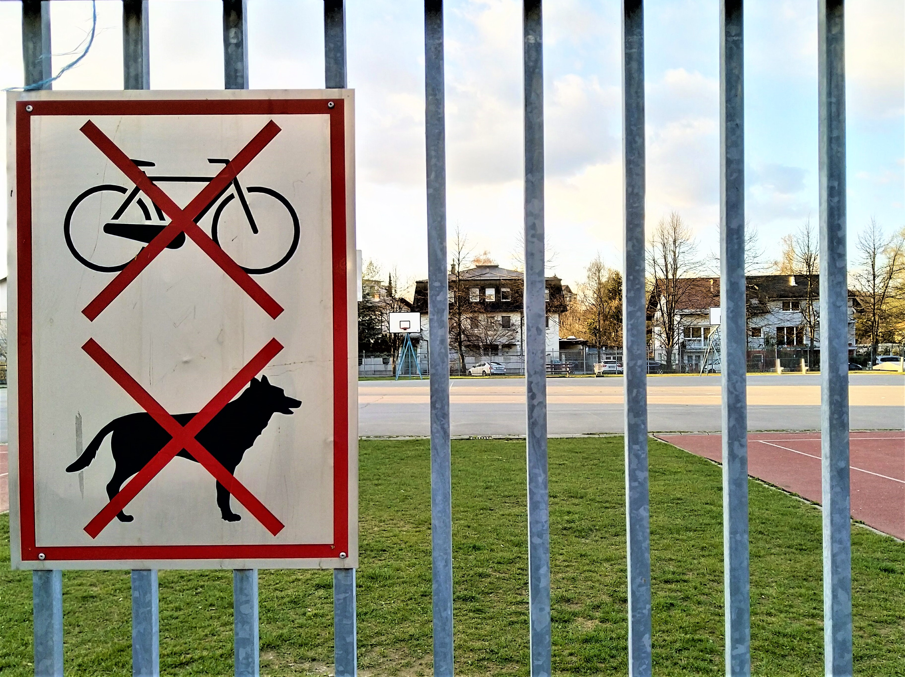

Ko smo stopili iz hiše, smo zagledali tistega soseda, ki se spozna na
ptice, in to z družino. Otroci, ki se sicer pogosto družijo, so si od
daleč pomahali, on in njegova partnerka pa sta nam z razdalje zavpila,
kje najdemo smrdokavro. Odšli smo na drugo stran igrišča, ki je že nekaj
dni zaklenjeno, na vratih pa visi napis, da je zaradi epidemije vstop
prepovedan. Približali smo se rešetkam ograje in s prostim očesom
opazili ptici, ki sta skakljali po travi. »Aha,« sem poznavalsko rekel,
»tale večja je pa smrdokavra!« Daljnogled sem dvignil k očem, da bi si
jo podrobneje ogledal. Zagledal sem čokatega ptiča s črnim perjem in
rumenim kljunom. Kje pa je značilen oranžen čopek? In kje so peruti s
črnimi in belimi progami? Bolj sem gledal, bolj se mi je zdelo, da je
nekaj narobe. »Kos je,« sem nekoliko razočarano zamomljal in hkrati
pomislil, da smo pravkar zamudili enkratno priložnost in da je
smrdokavra že odletela drugam. Tedaj pa je Sara poskočila in pokazala s
prstom nekam proti robu igrišča: »Tam je, vidim jo!« Pogledal sem skoz
daljnogled -- in res! Po pesku v bližini nogometnega gola je skakljala
oranžno-rjavkasta ptica z dolgim zašiljenim kljunom, ki je še nikoli
nisem videl v živo. Nekje za nami je takrat zabevskal pes in mislil sem,
da se bo smrdokavra prestrašila in odletela, a ob laježu ni niti
trznila. S kljunom je mirno kopala po pesku in verjetno iskala žužke in
črve. Vsi po vrsti smo si izmenjali daljnogled in se skoraj voajersko
naslajali ob pogledu na pernato lepotico, ki se je »okopala« v pesku.

V samo petih dneh se je šolsko igrišče pred našo hišo povsem spremenilo.
Otroci se tam več ne igrajo in odrasli ne mečejo žoge na koš. Namesto
ljudi so začela izpraznjeni prostor zavzemati druga živa bitja --
podobno kakor je to poljudno-strokovno opisano v knjigi *Svet brez nas*,
ki jo je napisal Alan Weisman, ali pa z nekoliko več domišljije v
postapokaliptičnih romanih, ki jih v karanteni najraje prebiram. V njih
se osamljene skupine ljudi običajno prebijajo skoz preraščena mesta in
čez razpokane ceste ter prebivajo v napol porušenih stavbah, ki jih je
načel zob časa. Takšni romani se mi zdijo posebej vznemirljivi, ker
opozorijo, kako krhka sta naš obstoj in način življenja. Res je, da smo
zavzeli planet in si podredili druga živa bitja: od celotne biomase
kopenskih sesalcev 36 odstotkov zavzamejo ljudje in 60 odstotkov živali,
ki jih redimo za prehrano (predvsem govedo in prašiči), le štiriodstoten
pa je delež divjih živali. Po drugi strani pa v kritičnih časih
spoznamo, kako smo postali odvisni od infrastrukture, ki smo si jo
zgradili, in omrežij, ki nas povezujejo. Ti dosežki nam sicer
zagotavljajo hitra potovanja in bliskovit prenos informacij, hkrati pa
smo, kot pravi antropolog Thomas Hylland Eriksen, z njimi prispevali k
pregrevanju sveta. O tem, da smo obsedeni z eksponentno rastjo, je
Eriksen pravzaprav opozarjal že pred dvema desetletjema v knjigi
*Tiranija trenutka* (angl. *Tyranny of the Moment*). Danes pa se na
žalost še bolj kot takrat zdi, da je takšna prehitra rast naš edini
kolektivni cilj in način, da napredujemo kot globalna skupnost.

Nam ponuja pandemija covid-19 priložnost, da za hip postanemo in
premislimo o lastni prihodnosti in morebitnih novih poteh? Mogoče.
Vsekakor pa nam postanek omogoča, da si v miru ogledamo kraje in bitja,
ki jih imamo pred nosom, a jih med hitenjem prezremo.

Been thinking about the young people in Big Brother houses these days.
When they emerge, around Easter I think, the world will have changed.
They're in for a surprise.

> They will all be eager to party and socialise -- and there will be no
> one outside, all pubs and clubs will be closed, there will be no
> alcohol available. A new kind of post-apocalyptic nightmare.

## 12. dan karantene: Življenje je igra

Naši otroci so se danes družili s sosedovimi -- na daljavo, seveda.
Povezali smo jih z računalnikom, in sicer s pomočjo Skypa. Najprej sva z
ženo mislila, da bodo zgolj klepetali, a so se hitro domislili nečesa
novega. »Ati, mi lahko daš Catan?« je prišel vprašat najmlajši Marko.
Začudeno sem ga pogledal, a nisem rekel ničesar. Škatlo z namizno igro
sem vzel z omare in mu jo izročil. Ves navdušen je odskakljal v sobo.

»Dan,« mi je Sara čez približno četrt ure vsa presenečena sporočila,
»dejansko še vedno igrajo!« Kaj? Kako? Stopil sem v otroško sobo in
obstrmel od začudenja. Prenosni računalnik so postavili na tla, zaslon s
kamero pa nagnili, da sta igralca na drugi strani zaslona videla igralno
površino. »Kam boš postavil naselje?« je radovedno vprašal Gregor. »Na
tisto petko z gozdom,« se je zaslišal glas iz računalniškega zvočnika.
»In kam boš položil cesti?« »Eno obrni tako ... Ne, v drugo smer ...
Tako, ja!« »No,« je rekel eden od naših, »zdaj pa sem jaz na vrsti!«

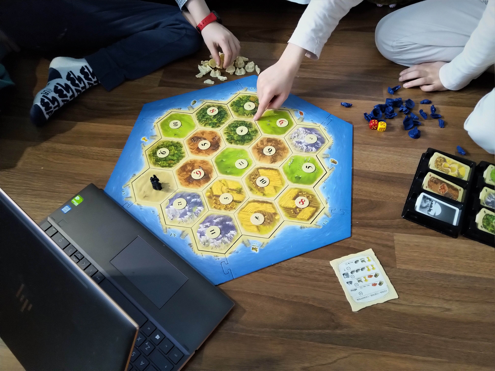

Po načelu, da ne draži leva, ko spi, sem jih seveda pustil pri miru in
si mislil, da jih bo volja do igranja gotovo kmalu minila. Pa jih ni.
Odigrali so celo partijo, ki traja skoraj eno uro, in se pri tem večino
časa zabavali in smejali in včasih tudi glasno jezili, kakor se za igro
spodobi.

Zanimivo, kako znajo otroci tudi v nadležnem času, v katerem smo se
znašli, poiskati čas in prostor za igro. Ustvarijo si virtualne
prostore, ki niso nujno izrisani na zaslonu, temveč ostanejo pogosto kar
v glavi. Prav poigritev vsakdanjega življenja je verjetno tudi najboljši
način, da si naredimo bedne okoliščine znosnejše in med njimi ohranimo
zdravo pamet. Podobno načelo je odlično predstavljeno v filmu *Življenje
je lepo*, kjer glavni junak, ki ga je upodobil igralec Roberto Benigni,
poigri življenje v taborišču in navkljub grozotam uspe prepričati sina,
da je vse skupaj le igra, v kateri bo zmagovalec tisti, ki bo prvi zbral
tisoč točk in za nagrado prejel tank.

Poigritev vsakdanjih dejavnosti -- celo najbanalnejših -- priporoča tudi
Jane McGonigal, ki se je igram posvetila v doktorski disertaciji in o
tej temi pisala v knjigah *Resničnost je pokvarjena* (angl. *Reality Is
Broken*) in *NadBoljši* (angl. *SuperBetter*). Osrednje sporočilo njenih
knjig je, da lahko najbolj zoprne razmere napravimo znosnejše z igrami
in domišljijo. Avtorici se je, na primer, z igrami posrečilo prebroditi
težak pretres možganov, ki jo je prikoval na posteljo. Vsak korak je
spremenila v izziv, za najmanjši napredek si je pripisala nagrado, in to
kar namišljeno, tu in tam pa je na pomoč poklicala še superjunake, ki si
jih je ustvarila v glavi.

Še bolje je, če se igranja iste igre loti več ljudi hkrati -- tako kot
so se otroci lotili Catana. Čeprav so tekmovali in se jezili drug na
drugega, so med igranjem dejansko ustvarili nov način intersubjektivnega
sodelovanja, v katerem so se prepletli dejanski in navidezni, digitalni
in analogni svetovi. Prav ustvarjanje novih oblik sodelovanja pa je
skrivnost, na katero pogosto pozabimo, in to zato, ker družbeni svet
razumemo kot tekmo, namesto da bi ga sprejeli kot igro. »Vajeni smo
razmišljati o tekmah, kot je to pri nogometu ali šahu,« je v eni
najboljših knjig 20. stoletja *Evolucija sodelovanja* (angl. *The
Evolution of Cooperation*) pojasnil politolog Robert Axelrod. V
resničnem svetu pa, kot piše v tej knjigi, redko eden zmaga in drugi
izgubi. »V mnogih okoliščinah je sodelovanje za obe strani boljše od
nesodelovanja. Ključ do uspeha zato ni v preseganju drugih, temveč v
sodelovanju z njimi,« je pojasnil Axelrod.

Zato si za hip zamislimo, da igramo največjo sodelovalno igro z naslovom
*Pandemija*. (Mimogrede, takšna namizna igra dejansko obstaja!)
Zmagovalci smo lahko vsi, posebej če se držimo pravil, ki jih postavimo
skupaj. Če pa igro spremenimo v tekmo za prevlado, potem bomo -- o tem
skoraj ni dvoma -- po partiji vsi poraženci.

Torej: kdo prvi meče kocko?

Poigritev je fina beseda in koristna dejavnost 😏

> Poigritev smo si izmislili v nekem projektu, ker nam je šlo na živce,
> da prevajamo »gamification« kot »igrifikacija«. Poigritev je tudi meni
> všeč.
>
> Se strinjam, čeprav ima poigritev tak hudomušen prizvok. Gamification
> je v praksi vse kaj drugega kot to.

To nagrajevanje in pohvale jaz uporabljam pri mami, ki slabo požira \...
Kot pri majhnem otroku sem vsakič vesela, ko pogoltne \... Bravo, mami,
bravooooo! In ko bere naglas otroške slikanice in prebere bolj dolgo
besedo, isto pohvala. Življenje je res krog. Je pa zanimivo, da ko so
bili moji otroci majhni in so spoznavali ta »komunikacijska orodja«,
tista čisto prva, se je moj oče aktivno vključil v debate in se učil
njihovega slanga \... Pa se je kdaj slišal totalen smeh iz sobe, ker je
ata Lojze tako »spustil«. Uporaba besed v generaciji je lahko različna
in iz tega razloga tudi zabavna 🙂

> Fajn slišati, kar praviš! O nagradicah priporočam sicer še knjigo
> *Tiny Habits,* ki jo je napisal BJ Fogg. Res zanimiva.

**\
**

## 13. dan karantene: Ves svet je oder

Jutri imam načrtovana dva sestanka na daljavo, zato si moram nujno
urediti pričesko in zlikati srajco. Hlače imam lahko tudi zmečkane, saj
me ne bo nihče gledal pod pasom. Ker bom za likanje in friziranje
porabil ves večer (pa še poglavje postapokaliptičnega romana bi rad
prebral do konca), tokrat namesto svežega zapisa v *Antropologiji med
štirimi stenami* objavljam nekoliko prirejen odlomek iz knjige *Videni*,
ki se mi zdi tematsko primeren za karantenski čas. V enem od poglavij z
naslovom »Jaz, sebe, selfi« sem namreč pisal o tem, kako radi se
ogledujemo v zaslonih svojih telefonov, ko delamo selfije.

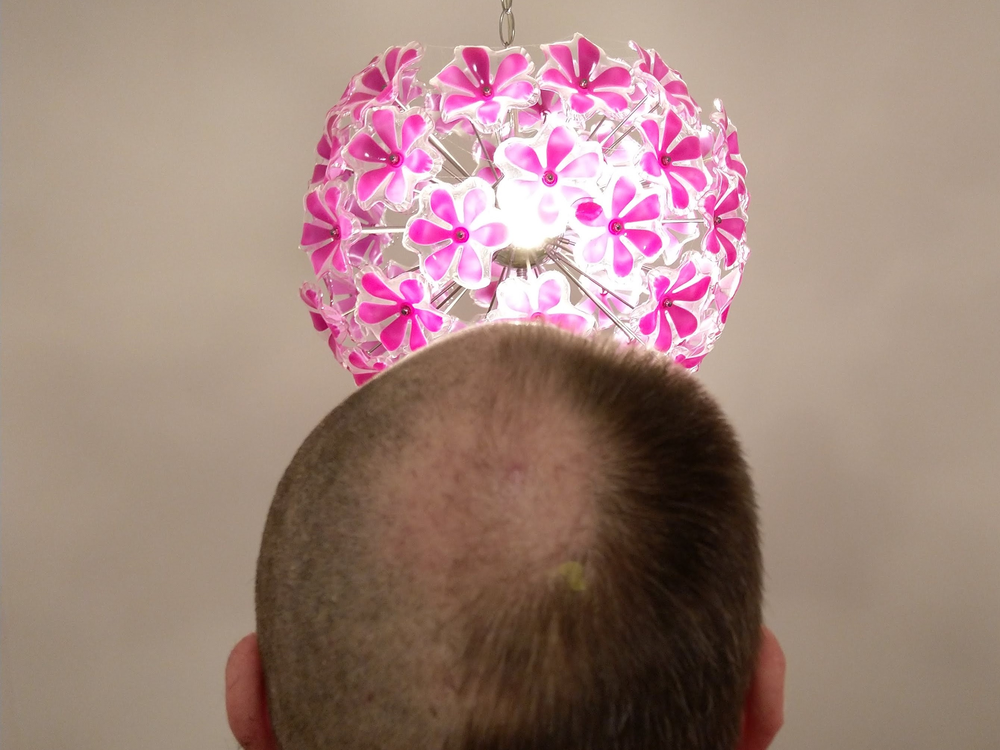

Izkušnje z lastnimi selfiji, ki sem jih lani in letos med predstavitvami
knjige na odrih skupaj napravil skoraj toliko kot Kim Kardashian West na
lep sončen dan, so me spomnile na prva konferenčna srečanja na daljavo.
Leta 2005, ko sem si v računalnik prvič namestil Skype in ga preskusil,
je bila izkušnja zelo okorna, in to predvsem zaradi počasnega prenosa
podatkov po modemu s klicnim dostopom do spleta. Takšna povezava je
komaj zadoščala za škrtajoč in zatikajoč prenos zvoka, nikakor pa ne za
prenos videa v živo. Nekaj let pozneje, ko smo v gospodinjstvih in na
delovnih mestih dobili hitrejše povezave, je bilo že povsem drugače. Ko
sem se pridružil pogovoru, sem sogovornike jasno slišal in tudi videl.
Nove projektne sodelavce iz tujine sem med sestankom natančno opazoval
in na zaslonu spremljal, s kakšnimi grimasami reagirajo na moje besede.
Oprezal sem, kakšno opremo imajo v pisarnah, in skušal ugotoviti, ali ne
delajo morda kar doma. Gledal sem, ali imajo mizo razmetano ali
pospravljeno, ali pijejo kavo ali čaj in ali si zapisujejo vsebino
pogovora v računalnik ali v zapisnico.

Bolj kot obrazi in pisarne projektnih sodelavcev me je prevzelo nekaj
drugega: lastna podoba, ki sem jo videl v navideznem okencu ob robu
zaslona. Namesto da bi gledal naravnost proti kameri prenosnika in dajal
videz, da sogovornike pozorno gledam v oči (kar je seveda zgolj utvara),
mi je pogled uhajal drugam. Med pogovorom sem se ves čas oziral poševno
navzdol, torej proti lastni podobici, in po malem obračal glavo, da bi
se drugim -- in seveda tudi sebi -- pokazal v najlepši podobi. Kdaj bom
videti najbolj resen, urejen in zbran? Se mi še vedno vidi podbradek, če
privzdignem glavo? In, kdaj sem postal tako plešast?

Takšno očaranost z lastno podobo v knjigi *Spletna kamera* (angl.
*Webcam*) opisujeta antropologa Daniel Miller in Jolynna Sinanan, ki sta
v različnih kulturnih okoljih preučevala uporabo Skypa in podobnih
tehnologij za sinhrono komuniciranje. Ko začnejo ljudje uporabljati
tehnologijo za videoklice, so sprva manj pozorni na osebo, s katero
govorijo, in bolj na lastno podobo, ugotavljata avtorja in pojasnjujeta,
da je navzočnost podobe govorca na zaslonu pomemben in morda celo
prelomen družbeni pojav. Prvič v zgodovini nam tehnologija omogoča, da
se v živo gledamo med vsakdanjim pogovorom, poleg tega pa dopušča, da
spremljamo, kako nas v vsakem trenutku vidijo drugi. Zaradi te
izhodiščne »narcistične« izkušnje se ljudje tudi temeljiteje pripravijo
za naslednje pogovore, in to bolj fizično kot mentalno. Nadenejo si
boljša oblačila, uredijo si pričeske, ženske pa se pogosto naličijo.

Tudi sam sledim temu načelu in pred službenimi sestanki po Skypu navadno
oblečem zlikano srajco in se obrijem, tudi takrat, ko delam doma. Še
vedno pa navadno obdržim spodnji del trenirke ali kratke hlače, pri
čemer posebej pazim, da med pogovorom ne vstanem in se sogovornikom ne
razkrijem v celoti. Z izgovorom, da imam slabo internetno povezavo,
včasih sploh ne vključim kamere, posebej kadar sem neobrit in prelen, da
bi se preoblekel ali celo vstal iz postelje. Potem imam pogosto slab
občutek, saj bi drugi lahko mislili, da jim kaj prikrivam. In če
razmišljajo tako, imajo v bistvu prav. Dejansko skrivam svojo zasebnost,
ko se po Skypu pokažem v javnosti, in pri tem skrbim, da sodelavci iz
tujine ne bi opazili, da se z njimi dejansko pogovarja zaležan, napol
oblečen in rahlo zanemarjen član projektne skupine. Prikriti želim tudi,
kako razmetano kuhinjo imamo in koliko navlake se nam je nabralo v
shrambi ter kako našarjen kuhinjski pult imam, saj se poleg govorca po
Skypu vidi tudi ozadje, torej stanovanje ali pisarna.

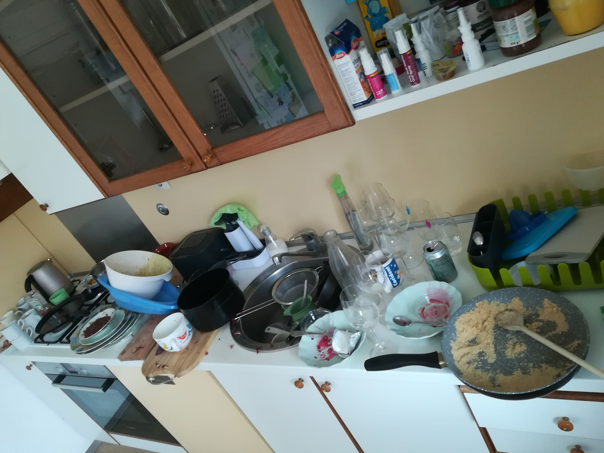

Vsak videokonferenčni pogovor je torej tudi javni nastop, predstava za
javnost, pred katero si nadenem »masko«, preden stopim na »oder«, če
uporabim še izrazje, ki ga je pred več kot pol stoletja v knjigi
*Predstavljanje sebe v vsakdanjem življenju* vpeljal kanadski sociolog
in socialni psiholog Erving Goffman. V tej prelomni knjigi je razkril
dramaturgijo vsakdanjega življenja, in to v najbanalnejših okoliščinah,
od obiska plaže do pogovora z natakarjem. Vsakič se predstavimo v vlogi,
ki se jo naučimo igrati med neskončno vajo, ki ji pravimo življenje.

»Ves svet je oder, in vsi možje in žene zgolj igralci,« pa je davno pred
Goffmanom razložil William Shakespeare -- in imel je seveda prav.
Sloviti dramatik pa si verjetno ni mislil, da bodo štiri stoletja po
njegovi smrti ljudje nosili v žepu ali torbici komunikacijsko napravo, s
katero bodo med službo, na avtobusu ali pred turistično znamenitostjo na
hitro posneli avtoportret, ki mu po novem pravimo selfi, in potem svojo
masko in trenutno vlogo v vsakdanjem življenju postavili na ogled
širnemu občinstvu. (Mimogrede, Shakespeare bi bil gotovo presenečen
tudi, če bi lahko videl, kako priljubljene so maske v letu 2020 ...)

\*\*\*

Tako! Srajca je zlikana, pričeska urejena, hlače pa popackane. Zdaj pa
na oder!

Vrhunski zapis 🙂**\
**

## 14. dan karantene: Mlečni zombiji

Sinoči nam je zmanjkalo mleka. Da bi se izognil trgovskemu središču, sem
sklenil, da bom stopil do bližnjega mlekomata -- tudi zato, da se
prezračim in sprehodim, preden se povsem znoči. Preden sem se odpravil
ven, sem si nadel hlače, trenerko in bundo ter si na glavo poveznil
slušalke ter čeznje potegnil še kapuco. Tako sem se skušal vidno in
zvočno izolirati od okolice in preprečiti, da bi me na cesti kdorkoli
spoznal in začel prijateljski klepet. Zdaj ni čas za prijateljevanje.
Položaj je resen.

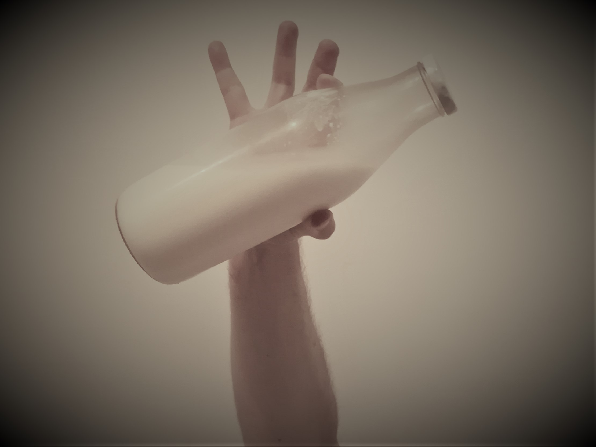

Preden sem zapustil dom, sem se pogledal v ogledalo. Groza! V temni
bundi in hlačah ter s kapuco na glavi sem bil videti kot kriminalec.
»No, pa saj ne bom nikogar srečal,« sem si mislil in odžvenketal po
stopnicah. Steklenici v vrečki sta namreč trkali druga ob drugo, da je
zvenelo, kakor da prihajajo kurenti.

Preden sem stopil iz hiše, sem na telefonu vključil zvočno knjigo, ki jo
trenutno poslušam: *Svetovna vojna Z* (angl. *World War Z*). Res je,
lotil sem se branja -- no, poslušanja -- še enega postapokaliptičnega
romana, ki opisuje virusno pandemijo. Ta viroza je bistveno nadležnejša
od covida-19, saj se okuženi preobrazijo v žive mrtvece, ki skoraj
iztrebijo človeštvo. In kje se začne pandemija? Na Kitajskem, seveda,
potem pa se razširi po vsem svetu. Roman je izjemno zanimiv z
antropološkega vidika, saj je napisan kot zbirka intervjujev z ljudmi,
ki so preživeli pandemijo in t. i. zombijsko vojno, z njimi pa se
pogovarja agent povojne komisije Združenih narodov, ki skuša
analizirati, kdaj in kako je okužba ušla spod nadzora. Zgodbo spremljamo
z večglasjem, ki ga v zvočni knjigi fenomenalno uprizorijo Alan Alda,
Mark Hamill, John Turturro in drugi znani igralci ter tudi avtor knjige
Max Brooks, ki se postavi v vlogo raziskovalca in skuša dojeti, kaj od
tega, kar pripovedujejo sogovorniki, je res in kaj ni.

Med sogovorniki je zlobni zaslužkar Breckinridge »Breck« Scott, ki v
času boja proti pandemiji obogati z lažnim cepivom phalanx, ki naj bi
ljudi zaščitilo pred »afriško steklino«, kot ljudje pravijo bolezni, še
preden postane jasno, kakšne so njene posledice in od kod je sploh
prišla. In zakaj so ljudje kupili phalanx? Zaradi strahu, pravi Breck.
»Strah je najdragocenejša dobrina na svetu,« pojasni Brooksu in doda, da
so ljudje zaradi strahu pred staranjem, strahu pred osamljenostjo,
strahu pred revščino, strahu pred neuspehom in zaradi drugih strahov
pripravljeni kupiti vse, kar jim ponudiš. »Strah je najbolj temeljno
čustvo, kar jih imamo. Strah je prvinski. Strah se prodaja,« pribije
izprijeni bogataš.

Kaj bomo pripravljeni kupiti, da bi preprečili okužbo s covid-19? Kako
nas bo strah preoblikoval? In kdo bodo zaslužkarji nove pandemije, ki
nas je spremenila v zapečkarje namesto v zombije? O tem sem razmišljal
med poslušanjem zgodbe in v mraku opazil postavo, ki se je iz daljave
pomikala proti meni. Skoraj prepričan sem bil, da je moški. Začel sem se
umikati na eno stran pločnika, da bi se mu izognil. Tudi on se je začel
pomikati, in to na isto stran pločnika. Umaknil sem se na drugo stran.
On tudi. Postal sem živčen, saj me je skrbelo, da bi lahko -- če bi šlo
tako naprej -- trčila in se dotaknila drug drugega. V teh dneh to seveda
ni priporočljivo. Ko sva bila le še tri, morda štiri metre narazen, sem
ga pogledal in zaznal strah tudi v njegovih očeh. Oba sva za hip
zastala. Zdelo se mi je, da želi nekaj povedati, zato sem dvakrat
potrkal po slušalkah -- tako jih namreč izključim s senzorjem dotika, ki
je vgrajen vanje. Prestrašeni možakar je še bolj izbuljil oči. Očitno je
mislil, da mu s trkanjem po sencah skušam sporočiti, da je zmešan. Z
mešanico presenečenja in odpora pri obratu se mi je izmaknil v širokem
loku in s pospešenim korakom odšel naprej.

Ko sem prižvenketal do mlekomata, me je oblival hladen pot. Strah,
strah, strah ... S sabo sem imel dva evra, tako da sem lahko natočil
samo dva litra mleka. Če bi imel več drobiža, bi verjetno nabavil še
dve, tri steklenice za rezervo, da mi ne bo treba že jutri spet
zapustiti varnega brloga.

Še dobro, da si imel kapuco, če bi jo spustil in bi mimoidoči zagledal
tvojo zabrito glavo, bi šele cviknil.

WC papir in mleko -- zaradi tega dvojega ljudje so ljudje kljub temu, da
so pod vplivom vcepljenega strahu, malodane pripravljeni tvegati svojo
prisebnost. Prepričana sem, da bodo avtorji v prihodnosti, ko bodo
navajali izsledke antropoloških raziskav, zelo cenili ta prispevek

> Super prispevek k nestrahu 😉
>
> Tokrat sem bolj parodično napisal -- v upanju, da bo učinek spodbuden,
> tako kot pri zombijskih filmih in knjigah. Mene ti dejansko poživijo.
> No, upam, da ne bo po prebranem koga res strah iti po mleko. Velika
> večina jih po obisku mlekomata bojda preživi, posebej če ga prekuhajo,
> da ne fašejo še bruceloze 🙂
>
> In tako sem razumela. Literatura, nekaj je poznam, ampak me še ni
> strah in ostajam zdrava.

Misiliš, da bo to ostalo tudi potem, ko bo kovikrize konec?

A zombiji? Seveda bodo 🙂

> Zares pa: nimam pojma. Mislim, da ja. Vsaj nekaj let se še ne bomo
> tako brezskrbno objemali in poljubljali in rokovali, kot smo se v
> predkarantenskem obdobju. »Strah je gospod,« je rekel naš stari ata.

Jaz pa sem včeraj podobno začutila prvič in na novo povezavo »mleko in
strah«. V trgovini nisem bila že 14 dni, sicer pa mleko jemljem na
kmetiji v sosednji vasi, kar sem do včeraj čutila kot »safety zone«.
Dokler nisem dobila zvečer odgovora na svojo prošnjo za tri litre mleka,
da ga je za nas zmanjkalo. Naj poskusim naslednji dan. Isto
presenečenje, kot da bi srečala zombija. Mleko me je vrglo iz varne
zone. Drugače sem pa izbrala za branje v tem času realno apokaliptično
pisanje: Astrid Lindgren, Vojni dnevniki 1938--1945. Zanimive paralele.

Kaj si prekršil samoizolacijo?

Vse za 2 litra mleka 🙂

## 15. dan karantene: Tuširanje steklenic

Navadno tuširam sebe, pred leti sem tuširal otroke, danes pa sem prvič v
življenju stuširal steklenice.

Dopoldne je namreč po pošti prispel paket, ki sva ga z ženo pričakovala
že nekaj časa. Poštar je pozvonil samo enkrat in pošiljko odložil kar
pred vrati ter naglo odpeljal. Odvečna birokracija -- preverjanje
pošiljke, podpisovanje in prevzemanje listkov -- je očitno stvar
preteklosti. In še vsi smo ves čas doma, tako da nihče več ne kliče, ali
lahko čez pol ure dostavi paket.

Sledilo je svečano odpiranje sredi hodnika. Sara si je nadela gumijaste
rokavice in mi zavpila, naj prinesem nož. Vzel sem ga iz predala, stopil
na hodnik in spretno prerezal lepilni trak, ne da bi se dotaknil škatle.
V njej jih je bilo pet -- steklenic namreč. Eno po eno sva vlekla iz
kartonaste škatle in pri vsaki rekla: »Ohoho!« Najprej sva potegnila na
svetlo steklenici vina: sivi pinot in zelen. Pobrskala sva malo globlje
in na dan privlekla pivi, ki po obliki spominjata na razvpito corono.
Čisto na koncu se je prikazala še primadona: steklenica džina domače
izdelave.

V dobrem starem svetu bi steklenice romale v hladilnik, v krasnem novem
svetu pa sva jih odnesla v kopalnico, jih položila v kabino za tuširanje
in jih pošteno namilila, pri čemer sva dosledno sledila lekciji o
umivanju rok, ki smo jo poslušali pred nekaj dnevi. Sara je potem odšla
v kuhinjo, sam pa sem še minuto ali dve steklenice ljubkujoče čehljal,
da bi jim zdrgnil morebitno umazanijo okoli vratu in jih potem z mlačno
vodo stuširal, da se jim etikete ne bi odlupile. Nazadnje sem jih še
nežno otrl z brisačo ter za hipec pomislil, da bi jih lahko še namazal z
losjonom za telo, a se mi je zdelo, da bi bila to kaplja čez rob.
Namesto tega sem jih zavil v krpo in jih previdno odnesel v kuhinjo ter
jih odložil na pult, da se povsem posušijo.

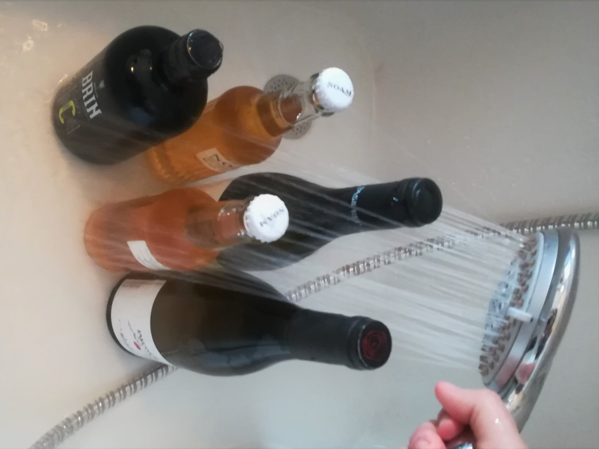

Alkoholnim pijačam se že dolgo nisem tako celostno posvetil in jim
namenil toliko pozornosti. Morda sem še največ v tej smeri postoril pred
skoraj desetletjema, ko sem pripravljal diplomsko nalogo z naslovom *Moč
nevidnega duha* (ta je namigoval na izvor besede alkohol: »al-kuhl« v
arabščini in »spiritus« v latinščini namreč predstavlja duha) in
podnaslovom *Alkohol kot totalno družbeno dejstvo*. V tem delu sem
sledil zamislim antropologa in sociologa Marcela Maussa, ki je v svojem
temeljnem delu *Esej o daru* (fr. *Essai sur le don*), izdanem leta
1925, uvedel pojem »totalno družbeno dejstvo«. S tem izrazom je skušal
opisati pojave v družbenem življenju, v katerih se prepletajo
religiozne, pravne, moralne, politične in ekonomske institucije. Mauss
se je osredinil na preučevanje Polinezije, Melanezije in na ameriški
severozahod, kjer je opisoval obrede, kot sta kula in potlač, ter
pojasnil, na kakšen način ti pojavi povezujejo tamkajšnje prebivalce.
Mene pa je zanimalo, ali bi lahko uživanje alkoholnih pijač označili za
slovensko totalno družbeno dejstvo.

Ugotovil sem, da uživanje alkoholnih pijač dejansko ustvarja mrežo
ritualov, ki zaznamujejo pomembnejše in tudi vsakdanje dogodke v
življenju, in deluje podobno kot kula in potlač, torej po načelu t. i.
ekonomije daru. Takšna obredna menjava pride do izraza v skupini, ki se
sreča v gostilni ali podobnem prostoru za druženje. Med osebami, ki se
srečajo, namreč velja nenapisan dogovor, da si udeleženci v pivski
seansi izmenično plačujejo pijačo oziroma poravnajo zapitek -- podobno
kot pri obredni menjavi zapestnic in ogrlic v obredu kula, ki so mu
sledili na Trobriandskih otokih. Plačevanje zapitkov, ki se mu pri nas
reče »čáščenje«, se tu in tam sprevrže v tekmovanje, kdo bo plačal več
in kdo bo večkrat dal za rundo -- podobno kot pri drugem obredu, namreč
potlaču.

Takšno razmišljanje o alkoholnih pijačah bi bilo treba v sedanjem
položaju pošteno prevetriti. Kako naj si izmenjujemo alkoholne darove in
trkamo s kozarci, če pa se ne smemo družiti? Najdružabnejši med nami že
imajo odgovor. Moj prijatelj iz otroških let z medvedjim vzdevkom je, na
primer, takoj po razglasitvi karantene odprl virtualno krčmo, namenjeno
večernemu druženju ob kozarcu vina ali piva, ki si ga natočimo vsak na
svoji strani zaslona. Ker človeška iznajdljivost nima meja, se bodo v
naslednjih tednih ali morda celo mesecih, ko bomo ždeli v karanteni,
verjetno razpasle takšne spletne krčme in točilnice, čaščenje in
plačevanje v rundah pa bosta dobili novo obliko -- morda z neposrednim
nakazilom mikro-donacij na račune članic in članov virtualnega omizja.
Čez leto, dve morda sledi druženje s čelado ali naočniki za navidezno
resničnost, za novo leto 2045 pa bomo po napovedih Raya Kurzweila,
slovitega futurista in direktorja inženirskega razvoja v Googlu, kozarce
dvignili v zrak v matrici, kamor bomo vsi naloženi -- podobno kot v
filmu *Matrica*. Karantena takrat verjetno ne bo več potrebna.

Do splošnega prenosa v matrico imamo očitno še nekaj časa. Že zdaj pa si
lahko nalijemo nekaj vina iz sveže oprane steklenice in nazdravimo
tistim na drugi strani. Na zdravje!

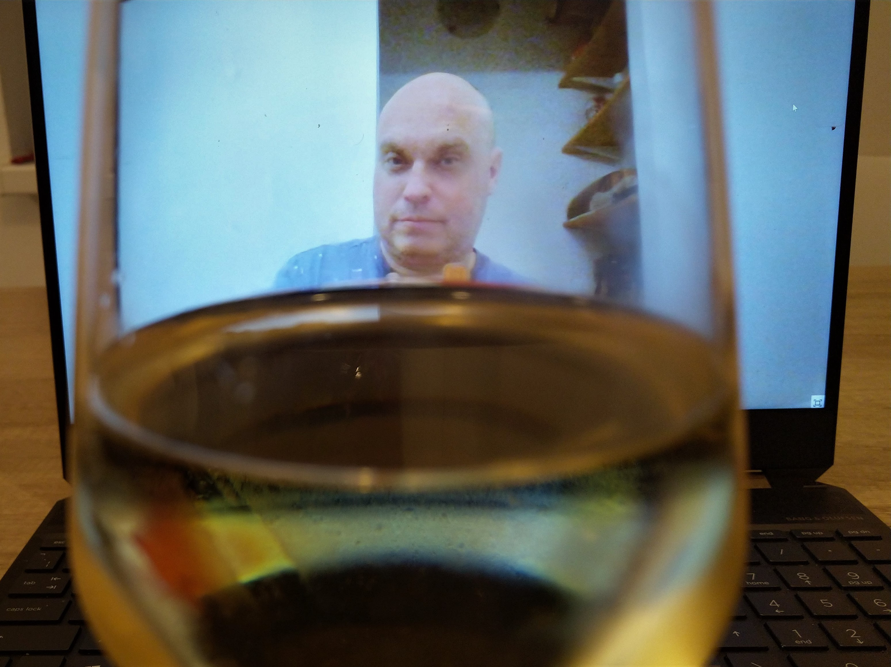

Čevlje pustila zunaj?

Zunaj je čedalje več čevljev.

Vse je genialno, gospod VIDENI, osebno pa mislim, da že malo pretiravamo
z vso to virusologijo. Pojdi na sonce in sprejemaj njegovo pozitivno
energijo.

> Vsak dan gremo na sonce in svež zrak, razen danes, ko ni ravno svež.
> Če pretiravamo, bo pa pokazal čas \...
>
> Hotel sem reči samo to, da je v vseh medijih preveč novic o tem virusu
> in kako se temu izogniti. Preveč je raznoraznih kvazi-svetovalcev.
> Ukrepi naše vlade so zaenkrat na mestu, treba se je držati navodil.
> Dokler ne bo zdravila za covid-19, preventivni ukrepi, ki so zaenkrat
> edina možna pot, da preprečimo širjenje, niso nikakršno pretiravanje,
> upam \...
>
> Vse je res, kar praviš. Ostajamo doma, to je ta hip najboljši recept.
> Na mlekomat in v trgovino pač moram, ampak pazim 🙂

Kje pa naročata tele dobrote? 😅

## 16. dan karantene: Nadzor v kroksicah

Tole bo zelo kratek zapis, ker imam čez pol ure sobotno druženje po
Skypu -- ob kozarcu koktajla, ki se mu reče tom collins. Kljub stiski s
časom pa moram vsaj omeniti današnji konflikt med notranjci in zunanjci.

In kaj se je zgodilo? Skoz kuhinjsko okno, ki je postalo moje -- no --
glavno okno v svet, sem dopoldne opazil, da na zaprtem in zaklenjenem
šolskem igrišču trije mladeniči brezskrbno igrajo košarko. Njihova
brezbrižnost v času pandemije me je precej pogrela, nisem pa vedel, kaj
naj storim. Liberalni jaz mi je govoril, naj jih pač pustim igrati, saj
menda še vedno živimo v svobodni državi, v kateri lahko ljudje mečejo
žogo na koš, če želijo. Konservativni jaz mi je sočasno prišepetaval, da
moram pomagati postaviti red in poskrbeti za varnost, zato naj nemudoma
pokličem policijo. Telefon sem že držal v roki in vtipkal 113, ikonice
za klicanje pa nisem mogel pritisniti. V precepu sem bil še minuto, dve,
potem pa sem se odločil za tretjo pot: ljudski upor.

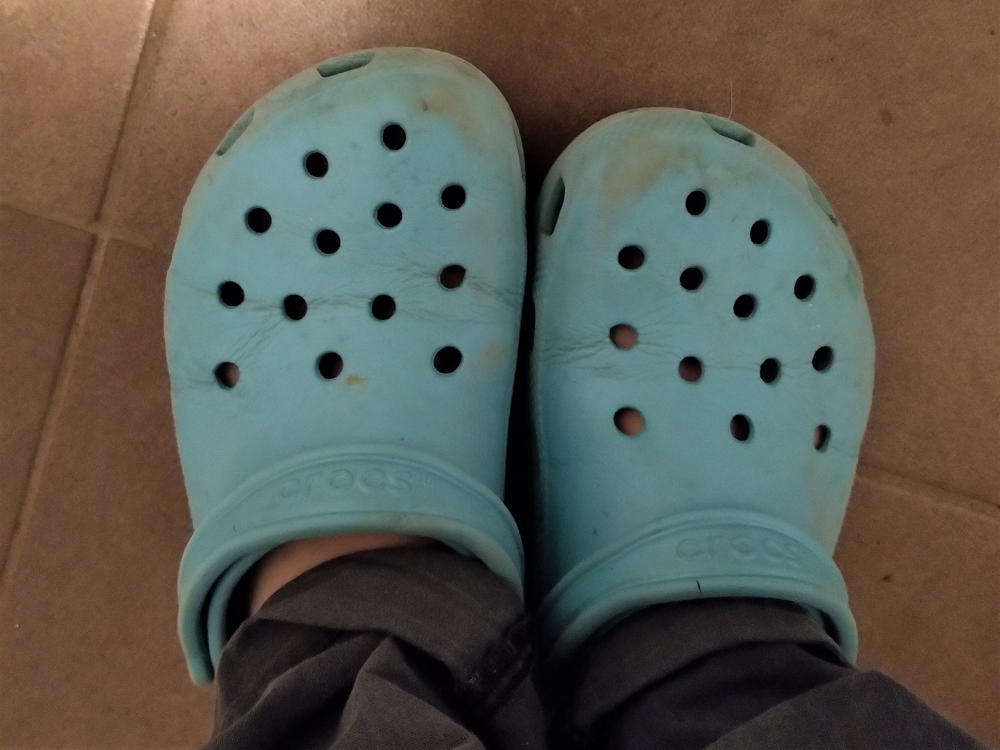

Na hitro sem se oblekel tako, da bi se sosedov pes ustrašil, če bi me
opazil, in si obul svetlomodre kroksice, da sem bil videti še bolj
neprepričljiv med svojim edinim javnim nastopom zunaj varnega doma na ta
dan. A bes v meni je očitno zalegel več kot smešna oprava. »Hej,
fantje!« sem zavpil skozi rešetkasto ograjo, »prosim, da takoj zapustite
igrišče!« Dva, ki sta metala na en koš, sta brez besed pobrala žogo in
splezala čez ograjo ter odšla, tretji pa je še naprej igral in
preigraval proti samemu sebi. »Prosim, da tudi ti zapustiš igrišče!« sem
mu zavpil. Od daleč je nekaj zagodrnjal nazaj in potem pobral žogo ter
splezal čez ograjo. Ob tem sem ga kar nekoliko občudoval, saj je res
spretno preskočil kovinsko oviro. Nekaj časa sem gledal, ali se bo res
napotil domov -- ali pa bo morda zavil na drugo igrišče.

In kaj je pravzaprav nauk te zgodbe? Najprej to, da zaradi svojega
dejanja nisem občutil posebnega zadovoljstva, ki me sicer preveva, ko
odženem nadležneže, ki pustijo vozilo na našem parkirnem mestu. Fantje
so pač samo igrali košarko na lep sončen dan. (Odmislimo onesnaženost
zraka z delci PM10, ki jih je te dni prineslo iz Sahare -- to je že
druga zgodba.) Morda je nauk še to, da bomo morali v času pandemije
ustvariti nove načine sodelovanja in sobivanja in se spomniti njihovih
oblik, ki obstajajo že dolgo in so najučinkovitejše. Poleg nadzora, pri
katerem nas oblastniki gledajo »od zgoraj«, in samonadzora, pri katerem
se spremljamo in nadzorujemo sami, obstaja namreč še tretja oblika:
»medzor« oziroma lateralni nadzor. In prav ta je lahko najučinkovitejši,
ko uveljavljamo navade, prakse, vrednote in norme v skupnosti.

Aja, mimogrede, ko sta tista prva dva fanta odhajala mimo mene, me je
bilo nekoliko strah, da me bo kateri od njiju udaril. No, bila sta
povsem prijazna in sta mirno in tiho odšla. Jaz pa sem se lahko odšel
domov petelinit, kako sem v kroksicah odgnal zlikovce, ki se rekreirajo
na lep sončen dan.

In tako si v kroksicah rešil svet.

Tom Collins? To je praktično edini alkohol ki ga pijem od lani v
poenostavljeni verziji, brez dodanega sirupa Sicer pa tudi mene pogreje,
ko vidim, kako pri nas nekateri še vedno uporabljajo streetworkout
poligon, ki je postavljen ob igrišče, ki je sicer zaprto. Po eni strani
jim zavidam brezskrbnost, po drugi strani pa imam zelo moteč občutek, da
prispevajo k temu, da se naša izolacija podaljšuje. In večkrat
razmišljam o tem, kako ljudje reagiramo na sedanje stanje tudi na tak
način, da smo drug drugemu najstrožji nadzor. In tukaj ne gre samo za
panoptik, dejansko opazujemo drug drugega in damo vedeti, da so drugi
opaženi v svojem vedenju in dejanjih in je zdaj tak nadzor popolnoma
legitimen v imenu preventive pred koronavirusom. In včasih me je prav
groza tega, kam lahko vodi tovrstno razmišljanje, če se pandemija ne bo
umirila v doglednem času. V glavi se mi z mojo bujno domišljijo vrtijo
čisto nori scenariji

Tebi se pa resno dogaja v tej karanteni!

Iz petnih žil vlečem te »dogodke«.

Zdaj veš, da ko/če ne boš več antropolog, z lahkoto postaneš občinski
redar 😆😉

Če bom lahko imel kroksice.

Prvič sem lajkala post s kroksi

> Zanimivo, kako v krizi vsi spustimo standarde V kroksicah sicer ne bi
> nesel ven niti smeti, po novem pa v njih šerifujem po Viču.
>
> Moramo narediti karantensko ne-modno revijo, jaz obračam dve scufani
> trenirki že tri tedne \... Je pa res, da tudi šampona manj porabimo
>
> Kakor kdo. Jaz ga več, ker sem bolj lasat.

Medzor. Fina beseda. Jo prakticiramo pri vzpostavljanju vrednot

Ne morem lajkati, najgrša zadeva ever.

Če bi verjel, da si tole res naredil, pa ti ne, bi ti napisal, da si
postal stara tečnoba gnjavatorska.

> Pa sem naredil točno to, vključno s kroksicami. Kaj bi bilo po tvojem
> prav?
>
> Na Švedskem so odprte gostilne in šole, v Srbiji pa imajo policijsko
> uro. Tole zgoraj pa je naravna reakcija. Pustil bi jih pri miru. To je
> po mojem prav.
>
> Ja, ampak pri nas potem izolacija velja za ene, za druge pa ne. Na
> Švedskem so pravila enaka za vse.
>
> Pravila so vedno enaka za vse. Tudi v Tretjem rajhu so bila.
>
> Potem bi si moral obuti usnjene škornje namesto kroksic. In verjetno
> jim ne bi rekel: »Fantje, prosim, da zapustite igrišče!« Tudi oni bi
> lahko rekli, da ne gredo, in igrali naprej.

**\
**

## 17. dan karantene: Osem nasvetov za ohranitev zdrave pameti v družini

Čeprav nisem najboljši naslov za delitev nasvetov, kakršne objavljajo
*Cosmopolitan*, *Jana*, *Lady* in podobne revije, bom vseeno skušal
strniti nekaj misli, ki so se oblikovale med dvotedenskim bivanjem v
karanteni z ženo in otroki.

Preden začnem modrovati, naj poudarim, da smo v primerjavi z marsikom
drugim v Sloveniji in tujini v tem nadležnem položaju privilegirani, saj
imamo na voljo približno 80 m^2^ bivalne površine, precej založeno
shrambo, podporo delodajalcev pri delu na daljavo in se za nameček celo
dobro razumemo. Kljub temu se spoprijemamo z najrazličnejšimi problemi,
ki jih sproti in po svoje rešujemo. In kaj se je doslej pokazalo?

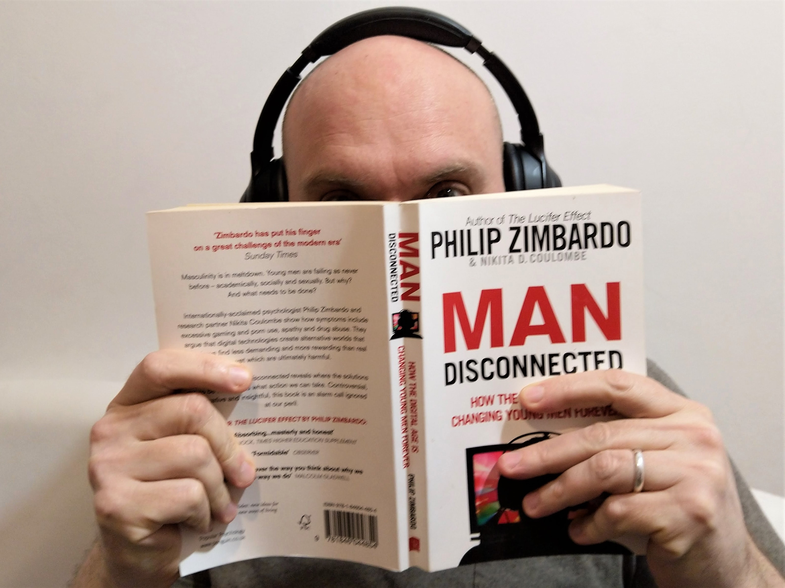

Prvič, tudi najbolj družaben človek potrebuje prostor zase. Zaklepanje
staršev na stranišču je tako postalo obvezno, obisk tega svetega
prostora pa je trenutek za kontemplacijo in poglobitev vase. Ker pa
težko delam na stranišču, čeprav me je že zamikalo, si skušam zatočišče
za pol urice poiskati še kje drugje, kjer ni otrok. Zanimivo, precej
pogosto je to v otroški sobi.

Drugič, za odklop so izjemno učinkovite slušalke, po katerih poslušam
zvočne knjige -- pretežno o zombijih in drugih postapokaliptičnih
prikaznih. Zgodba me pogosto tako pritegne, da povsem pozabim na
okolico. Poleg tega si na slušalkah vključim opcijo izničenja zvoka,
tako da sem vsaj za nekaj časa izoliran od družine. Temu bi lahko rekli
zvočni dopust.

Tretjič, z ženo v času karantene spiva v ločenih sobah -- pa ne zato,
ker bi se bala okužbe, temveč zato, da se čim bolje naspiva. Ona je
namreč šibkega spanca, jaz pa v spanju menda godrnjam, tu in tam po
nepreverjenih govoricah smrčim ter občasno celo vpijem (verjetno zaradi
prepogostega poslušanja postapokaliptičnih zgodb), kar jo vsakič zbudi.
Naspana starša sta v našem primeru ključ do uspeha, ločeno spanje pa pri
tem pomaga.

Četrtič, pri ohranitvi dobrega razpoloženja koristi gibanje. Ker se
skušamo čim več držati v stanovanju, se znajdemo po svoje. Otroci
bezljajo po kavčih in skačejo po posteljah, žena divje telovadi in
dviguje uteži, sam pa delam sklece vsakič, ko v kuhinji vključim grelnik
za vodo -- in to je precej pogosto. Kava je namreč edino, čemur se celo
v postapokaliptičnem svetu ne bi mogel odpovedati. In če prepletem eno
rutino, namreč pripravo kave, s sklecami, se bolje počutim, že ko
zaslišim brbotanje vode.

Petič, po prebrani knjigi *Navadice* (angl. *Tiny Habits*), ki jo je
napisal B. J. Fogg, si skušam v glavo vcepiti tudi druge drobne rutine,
ki jih brez težav izvedem in prispevajo k boljšemu počutju. »Danes bo
dober dan!« si, recimo, rečem zjutraj, ko vstanem in se pretegnem, sebe
in druge pa skušam sproti pohvaliti in nagraditi za malenkosti, na
primer za počiščeno kuhinjo ali opravljeno nalogo. Ja, saj vem, da gredo
takšne motivacijske vaje marsikomu na živce -- pravzaprav pogosto tudi
meni. A v tej čudni situaciji dejansko delujejo in pomagajo pri
ohranjanju pozitivnega razpoloženja.

Šestič, sebi in otrokom skušam odmerjati čas z digitalnimi napravami,
kar mi pogosto ne uspeva najbolje. Medtem ko otroci gledajo risanko
*Wall-E* (in to je pravkar), imam urico časa, ko lahko postorim kaj
smiselnega, recimo napišem tale prispevek. Vseeno pa se mi zdi izjemno
pomembno, da med izolacijo zaslon ne postane naše edino okno v svet.

Sedmič, družabni mediji so se v kriznem času izkazali kot smiselno
orodje za medsebojno podpiranje, bodrenje in spodbujanje ter tudi kot
kanal za izlivanje vsega, kar se v osami nabere v ljudeh -- dobrega in
slabega. Če sem v predkarantenski dobi zagovarjal odklop, se mi zdi zdaj
smiseln tudi priklop, ki si ga še vedno lahko vnaprej odmerim s
pripomočki, kakršna sta Siempo in Cold Turkey.

Osmič, pisanje tega dnevnika oziroma bloga je zame odlična terapija. Ko
pišem, povsem pozabim na svet in okolico, zato se potem, ko pritisnem
zadnjo piko, počutim podobno sveže in prenovljeno kot po telovadbi.
Poleg tega se mi zdi pomembno, da delček svoje zasebnosti redno delim z
drugimi. Zaradi tega se kljub fizičnemu odklopu še vedno počutim kot
»dividuum«, torej del skupnosti, in ne le kot »individuum«, ki je
obtičal v svoji opečnato-betonski votlini.

*Sami skupaj* (angl. *Alone Together*) je naslov knjige, ki jo je
napisala sociologinja in psihologinja Sherry Turkle. V njej je opisala,
kako postajamo zaradi informacijskih in komunikacijskih tehnologij --
predvsem zaradi družabnih omrežij -- vse bolj osamljeni in oddaljeni
drug od drugega. Naslov te knjige mi pride zadnje čase pogosto na misel,
a v nekoliko drugačnem kontekstu. Občutek imam, da smo zaradi sedanje
osame dejansko bolj povezani, kakor smo bili, saj imamo skupen problem
in se zavestno spoprijemamo s tragedijo skupnega (ali vsaj skupno
tragedijo) -- morda se nam to prvič dogaja na globalni ravni. Na
nenavaden način mi tudi občutek, da smo v tej zoprni situaciji skupaj,
pomaga pri ohranitvi zdrave pameti. Zdi se mi namreč, da smo se kot
svetovna družba končno skupaj nekam premaknili, čeprav dejansko ne smemo
zapustiti doma.

Ooo, Zimbardo \... In? Jaz zdaj pooočasi Luciferčka na obroke

Ta je bolj za foto šuting -- zaradi naslova in sličice. Sicer zanimiva
knjiga.

Aha, me zanima, ali si jo pojedel ali počasi grizljaš.

Luciferka -- zanimiva kombinacija z Zimbardom.

Huh, dandanes poslušam, da ljudje nimajo doma kaj početi. To so ponavadi
ljudje, ki imajo dve levi roki in niti enega hobija. Tudi kot otrok
nisem divjal po stanovanju temveč se zakopal v raznorazne zadeve. Kaj
češ, sem bolj asocialen in nimam rad ljudi, ker človek je prav tečno
bitje, kadar nima kaj početi in je brez domišljije

Zaradi te situacije smo vsi po malem mizantropi, eni celo mizantropologi

Hehe, jzt imam to v genih

Jaz sem se pa prevzgojil

Jaz te spremljam kot nadaljevanko \... Priznam, da me nobena serija še
ni pritegnila kot tvoj blog Sem ravno (slučajno) prebrala mladinski
roman Geneza (2075, na otok so se izolirali, ker je po svetu vladala
kuga, kdor je prišel samo blizu, so ga sestrelili), in mi je fajn, da
odpiraš vprašanja preko prakse (ko npr. napizdiš mladce), a bi jaz tudi
ali ne, ali je prav, koliko smo odprti in koliko smo zapadli v paranojo,
koliko je potrebno biti kritičen in tako delovati Je pa dovolj možnosti,
da se imamo kljub vsemu dobro \... čeprav

> O, sem ponosen v konkurenci hudih serij, ki jih te dni gledamo Geneza
> -- naslednje na spisku! Hecno je zvečer, ko ne vem, o čem bi pisal,
> ker se mi zgodi 10x manj kot sicer. Ampak po mojem je prav ta
> monotonija na neki način zanimiva. In stalne dileme, ja, kaj je prav
> in kaj ni. Ali biti paranoičen ali strpen -- in ali si lahko oboje
> hkrati.

## 18. dan karantene: Kužne novice

Komu verjeti? Med neustavljivim pohodom koronavirusa po svetu si to
vprašanje postavim večkrat na dan. Novice zadnja dva tedna spremljam
obsedeno, skoraj histerično, in nenehno klikam na povezavo do spletne
strani univerze Johns Hopkins, ki redno posodablja podatke o številu
obolelih, mrtvih in ozdravljenih.

Na tej strani primerjam, kakšni so trendi naraščanja števila obolelih po
državah, in skušam razumeti logiko bolj ali manj eksponentne rasti
krivulj. Kdaj in kako so ga, recimo, polomili v ZDA, Italiji in Španiji,
da je število obolelih tako skokovito naraslo? Zakaj je Kitajcem uspelo
uspešno zmanjšati število okuženih in zajeziti širjenje bolezni? In kaj
se dogaja v Rusiji, kjer je okužb glede na število prebivalcev še vedno
razmeroma malo? Ali te države o obolelih in mrtvih poročajo po resnici
ali nam skušajo dejstva prikriti?

Še bolj me zanima, komu verjeti pri nas. Kateri medijski hiši naj
zaupam, ko pa ene poročajo o množicah ljudi v priljubljenih turističnih
krajih v času karantene, medtem ko druge zanikajo te novice in pokažejo
prazne ulice in trge.

Ne vem niti, komu od ljudi, ki jim sledim na omrežjih, naj verjamem. Naj
zaupam tistemu, ki že leta alarmistično teži, da se bliža konec sveta,
ali komu drugemu, ki od prve okužbe s koronavirusom v Sloveniji po
omrežju miri, da bo vse v redu, saj je tole, kar nas je doletelo,
bistveno blažje od običajne gripe?

In komu od prijateljev in znancev, ki jih poznam tudi v živo in ne samo
po spletu, naj verjamem? Naj zaupam tistim, ki mi pošiljajo šaljive meme
in zatrjujejo, da je smeh pol zdravja? (Ti za nameček pripomnijo, naj ne
zganjam panike in naj raje zjutraj, opoldne in zvečer zvrnem kozarček
žganja, ker se je treba v tem času »razkuževati od zunaj in od znotraj,
seksati pa od zadaj«, kot je dejal poslanec Zmago Jelinčič.) Ali naj
raje verjamem onim, ki mi -- verjetno v dobri veri -- pošiljajo ominozne
napovedi, kakšna bo Slovenija čez dva tedna, ter priložijo fotografije
ljudi v skafandrih in s plinskimi maskami, ki v sosednji Italiji hodijo
po nakupih?

In, naposled, kako naj verjamem drugim, če ne verjamem niti sebi? Ko
zjutraj preberem novice, sem prepričan, da so vladni ukrepi pretirani in
da nas skuša država vpreči v totalitarni jarem. Popoldne se že zalotim,
kako razmišljam, da se je Kitajski in Singapurju prav z drastičnimi
prijemi posrečilo preprečiti najhujše. Zvečer pa se znova vrnem h grafom
na spletni strani univerze Johns Hopkins in jih gledam ter klikam na
rdeče pike, ki me spominjajo na ošpice, ter skušam sam dojeti logiko
pandemije in širjenja lažnih novic. (Mimogrede, kot antropologu mi je
dokaj jasno, da resnica ni zgolj ena in da ima lahko vsak svojo, ki se
sčasoma tudi spremeni. Kljub temu pa zdaj pričakujem en in edini
pravilen odgovor, ki bi me razsvetlil.)

»Prva žrtev vojne je resnica,« je med prvo svetovno vojno dejal ameriški
senator Hiram Warren Johnson. Resnico, ki je temelj vsakega uspešnega
razmerja -- pa naj bo medosebno ali meddržavno --, smo pred strelski zid
postavili tudi v kužnih časih. Žrtev bolezni bo še veliko, a občutek
imam, da bi lahko bila glavna žrtev v tem času dejansko prav resnica, ki
je eden od temeljev demokracije. Ta pa je zdaj bolj ogrožena kot
človeštvo.

Tudi jaz rdeče pike neprijetno povezujem z ošpicami 😀

Tukaj se lahko izogneš ošpicam: Worldometers.

Hvala! Samo še krivulje ostanejo -- precej bolje!

Pravijo, da je statistika ena velika laž, sestavljena iz majhnih resnic

We feel you.

Ja, res je en tak cocktail mešanih občutkov. Jasno je, da JJ orgazmira v
dani situaciji, še bolj je jasno, da je potrebna hitra in učinkovita
reakcija vseh v družbi. Glede na psihologijo množice je nujno potrebno
umirjanje splošne atmosfere, vsekakor pa spet ne ležerno (ne)upoštevanje
pravil. Jaz ( preveč?) optimistično mislim, da je goden trenutek za
privzgojo neke splošne samoodgovornosti. Do svojega zdravja, na primer,
in odnosa do skupnosti. Stanje duha, ki ga furaš, tudi ko te nihče ne
gleda. (Seveda ob tem pomislim na Videne 😁) Ohh, samo da bo že konec
tega ...

This, my friend, has been the exact conversation for days now. And even
this morning I look at the graphs of the reported infected in China
against their timeline -- considering that was new and they did not know
this was coming, unlike the rest of us around the world -- the reported
numbers make no sense. I am more confused and yet stay more optimistic
than most people around me. My fear has always been, and continues to be
human behavior -- people do unpredictable and terrible things when
desperation takes over. And it seems like in my geographical region many
are getting there after years of economic downturns.

V tem navalu »izrednega stanja« v naših glavah smo predvsem izgubili
zmožnost kritičnega presojanja in diskusije. To pa ne more prinesti
dobrih izidov. Že samo na asimetrijo izida bi lahko kdo opozoril. Za
stanje epidemije odgovarja oblast, za stanje ekonomije v tej družbeni
psihozi pa ne (je samo nujna stranska škoda) -- optimum modela odločanja
je v maksimalnih ukrepih.

Upam, da skozi to krizo pridemo tudi s kakimi spoznanji, kaj je
optimalen pogled na situacijo. Ker pogledov ne manjka.

Točno to se jaz že nekaj časa (let) sprašujem. Zdaj še toliko bolj. In
dolgo časa sem za ultimativno in zadnjo resnico imel znanost. Pa me je
na koncu tudi ta prepričala, da je cesar lahko oblečen, čeprav je gol.
(Pa pustimo aksiome v matematiki.) Ko ti znanost ponudi dva povsem
nasprotna odgovora, oba podprta z dokazi po znanstvenih metodah, takrat
začneš biti resnično v dvomih. Ostane samo še lasten občutek, pa še ta
nas večkrat prevara, ker nas vse bolj vodi razum in vse manj instinkt.
Ostane nam samo še to, kar vidim in občutim, to je resnica. Moja lastna.
In narava seveda, ta je vedno brez fake news.

Bravo! Sem čakala na en tak zapis! Več ne veš, komu verjeti, ali je res
to vse potrebno, pa taka panika \... Delim!

Haha, sem se našla v tvojih skupinah 😎

Samo brez panike in nekaj poštene samodiscipline ter družbene
odgovornosti. Država naj pa poskrbi za bolnišnice in socialne ter ostale
ustanove.

Sori tstar, sam ti si s tem granpa imidžom direkt ogrožena skupina,
umetno.

A potem misliš, da najprej odpeljejo tiste s klobukom?

Samo bič ti še manjka.

Še zdravniki nimajo celotne slike, obenem se trudijo delovati, kot da
poznajo vse odgovore.

**\
**

## 19. dan karantene: Ljubezen v času karantene

Verjetno je do vas že prispel tisti posnetek, ko moškega vprašajo, ali
bi si izbral -- možnost A -- življenje v karanteni z ženo in otroki ali
... »B,« izstreli kot iz topa, še preden sliši drugo možnost, »izbral bi
si B.« Njegove žene žal nihče nič ne vpraša -- ali pa vsaj do mene
takšen vic še ni prispel. Mislim pa si, da bi odgovorila podobno. V teh
dneh sem prejel še druge podobne meme, ki krožijo po omrežjih, in
kažejo, da ženske v teh zapletenih razmerah razmišljajo podobno. Na enem
od memov starejša ženska plete zanko za vislice, zraven pa piše, da je
sedmi dan možu spletla šal.

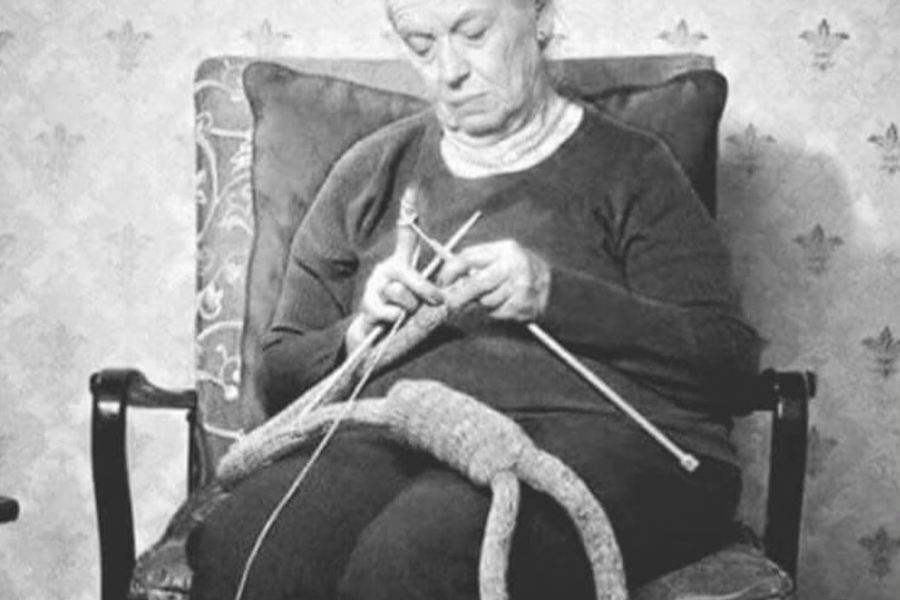

Psihoterapevtka Esther Perel v nekoliko plehki knjigi *Eros v
ujetništvu* (angl. *Mating in Captivity*) parom sicer priporoča, naj si
v zvezi omogočijo veliko svobode in se čez dan, če je le mogoče, vsaj za
nekaj ur ne vidijo. Še bolje je, če eden od partnerjev občasno za nekaj
časa odpotuje in se potem vrne domov. Tako naj bi se med partnerjema na
dolgi rok ohranjala medsebojna privlačnost, strast pa bi vedno znova
vzplamtela.

Kaj pa za ljubezensko razmerje pomeni izolacija v družinskem krogu, ko
smo večino časa skupaj, in to med štirimi stenami? Za par je to nedvomno
preskušnja, zlasti če sta osebi zaposlena starša. Potem morata nenehno
menjavati vloge in biti nekaj ur starša, zatem učitelja, nato delavca,
vmes pa se urita še v kuharskih spretnostih in skušata počistiti kaos,
ki nastaja v stanovanju. (No, vsaj pri nas je tako, verjamem, da se
mnogi bolje znajdejo in imajo doma več reda.)

Sedanja situacija me nekoliko spominja na dopust, kamor se odpravimo
polni zagona in z vizijo, kako bomo uživali in prebrali vse romane, ki
jih nismo med letom, dokončali znanstveni članek ali dva in poleg tega
obudili ljubezensko življenje. In kaj se dejansko zgodi? Proti koncu
dopusta sta starša izmučena od dnevne priprave hrane in nakupovanja ter
vedno bolj razočarana, ker knjige še vedno stojijo na istem mestu kot ob
prihodu, članek se še vedno ni spisal, ljubezensko življenje pa je
zastalo.

Kaj torej storiti z ljubeznijo v času karantene? Osebno mi najbolj
pomaga misel, da nama z ženo ta hip gotovo ni najhuje. Zamišljam si
lahko namreč vse mogoče situacije, zabavne in grozljive, ki so bistveno
bednejše od naše. Predstavljam si, da je po svetu ogromno ljudi, ki so
obtičali v štiriindvajseturnem ujetništvu s človekom, ki jim gre
neskončno na živce. Gotovo jih je vmes tudi veliko, ki so v stiski, ker
že devetnajsti dan ne morejo videti ljubimca ali ljubice. Marsikdo, ki
si še ni ustvaril skupnega gospodinjstva, je zaradi novih vladnih
odlokov ločen od svoje ljubezni, ki je morda pravkar vzplamtela in bo v
mesecu, dveh brez fizičnega stika zamrla. Variant na temo je ogromno,
rešitev zadreg pa verjetno tudi, saj ljubezen, kot pravijo, nima meja,
sovraštvo do bližnjega pa verjetno tudi ne.

Če ne drugega, se inovativnost kaže pri ustvarjanju memov. Eden, recimo,
prikazuje ženo, ki si pere lase nad umivalnikom in z zaprtimi očmi
naroči možu: »Vinko, daj mi fen!« On pa ji v roke potisne pištolo. Na
drugem je skupina ljudi, zamaskiranih od glave do pete, ki odnašajo
nekoga na nosilih, zraven pa piše, da za 500 evrov pridejo tudi po vas
na dom in vas za dva tedna odpeljejo k ljubimcu ali ljubici in potem
dostavijo nazaj.

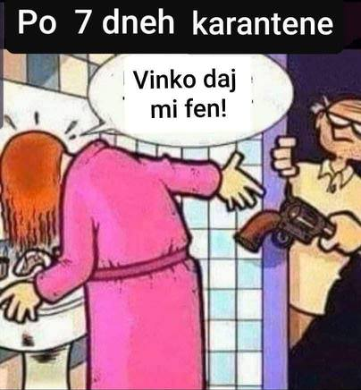

Ustvarjanje in obsesivno razširjanje takšnih memov lahko razumemo kot
skrite želje ljudi, ki so v stiski in si želijo trenutka odklopa. In
ravno splet je postal priljubljeno zatočišče za odmik, med katerim lahko
partnerja pridobita nekaj distance, da se zvečer spet zaljubljeno
pogledata. Druga možnost so osamljeni sprehodi na samem -- kjer in
dokler je to še mogoče. Če ne pomaga niti to, vam ne preostane drugega,
kot da stisnete zobe in si s partnerjem ali partnerico že šestnajstič
ogledate katero od romantičnih komedij s Hughom Grantom in Georgom
Clooneyjem. Lahko se tudi skupaj nasmejita ob komediji *Svižčev dan*, ki
je tematsko nadvse primerna za ponavljajoče dni v karanteni, ali pa si
ogledata odličen prikaz odtujenosti v filmu *Izgubljeno s prevodom*.

Če sledimo nasvetom Esther Perel, je v sedanjih okoliščinah tudi
smiselno biti pragmatičen in zmenke načrtovati ter si jih zapisati v
tedenski koledar. Marsikomu to zveni preveč tehnicistično, vendar tudi v
normalnih okoliščinah načrtujemo večerjo s prijatelji ter nakupimo vse
sestavine, počistimo stanovanje in prižgemo sveče. Glede na to, da
tovrstni zmenki s prijatelji te dni odpadejo (razen seveda po Skypu ali
Zoomu), je karantena izvrstna priložnost, da ob romantični večerji in
kozarcu vina, ki so vam ga dostavili na dom, znova spoznate tistega ali
tisto, ki je z vami že leta. Kdo ve, morda boste presenečeni, kako
krasna oseba je to. (Ja, tudi ta vic je po spletu krožil že v prvem
tednu karantene ...)

Mene je danes spravila v smeh tista verižna, ko se dekleta naga
sprehodijo do svojih moških sostanovalcev, ki zavzeto igrajo igrice, in
so njihovo reakcijo snemale \... Smešna stvar na polno \...

Tega pa ne poznam!

Odlično! Delim!

> In hvala za dopoldanski dialog po FB, ki je bil spodbuda za tale
> prispevek!
>
> Malenkost! O posledicah pa niste nič spregovorili \... Ločitve \...
> Nataliteta \...
>
> Uf, to je tema za cel mesec objav

Dopust, ja 😁 Moja najstnika bi rekla: rilejtam 🙂 Odličen zapis. Morda
pa res kak zmenek v prenatrpan urnik stlačim 😁

Piši: sobota, 9. maj, 21:50-22:20

Za skupinski seks si je treba pa sinhronizirati urnike \...

Krasni nasveti, bom poskusil nekaj od tega.

## 20. dan karantene: Minutka

»Minutko ti dam,« je rekla novinarka in odložila telefon. Minutko?! In v
tem času naj strnjeno odgovorim na vprašanje, komu naj verjamemo v času
pandemije? Pred dvema dnevoma sem o tem na dolgo in široko razpredal ter
napisal, kako nimam pojma, komu naj zaupamo, zdaj pa naj to mnenje
strnem v šestdesetsekundni recital? Krasno!

Še bolj kot to, kaj bom povedal, me je zaskrbelo, kakšen sem videti.
Pogladil sem se po strnišču, ki mi je zraslo po licih in bradi, in
pomislil, da se bo treba dlačevja znebiti. Pred približno tednom dni sem
se namreč nehal briti tudi pred sestanki in druženji po Skypu in
predavanji po Zoomu, saj sem ugotovil, da se prek kamere mojega
prenosnika sploh ne vidi, ali sem gladko obrit ali ne. Po britju sem si
moral zlikati še hlače in srajco ter obrisati prah s čevljev, ki jih
nisem obul že nekaj dni. Med kratkimi sprehodi po »ozunju« namreč nosim
le še kroksice.

Oblekel sem si zlikano srajco in hlače. Ups, kaj pa je to? Gumba nisem
mogel zapeti, dokler nisem globoko zajel sape, kakor da se grem
potapljat. Očitno zadnjih nekaj tednov, odkar smo v samoizolaciji, ne
jemo samo bolje kot običajno, temveč tudi več.

Medtem ko sem si zategoval pas, je že zazvonil telefon. »Smo že tle-e!«
je s prepoznavnim ljubljanskim naglasom in podaljšanim zadnjim
samoglasnikom, ki me vedno spravi v dobro voljo, rekla novinarka, s
katero se poznava že vrsto let. Odpravil sem se pred garažo, kjer je bil
parkiran televizijski avto, in zagledal dva tehnika in novinarko.
Običajno se objameva, ko se zagledava, tu in tam celo poljubiva na lica.
(S tehnikoma nikoli.) Tokrat sva se le kislo nasmehnila drug drugemu, in
še to z varnostne razdalje. Tehnika sta tačas že pripravila kamero.
Oddahnil sem si, ko sem ugotovil, da mi nihče od njiju ne namerava
zatakniti mikrofona na ovratnik srajce in vdeti oddajnika v notranji žep
suknjiča ali ga pripeti za pas. Zaradi varnosti so namreč imeli s sabo
drugačen mikrofon kot navadno. Ta je bil videti, kakor da bi perzijsko
mačko nekdo nabodel na sulico in mi jo pomolil pod nos.

Novinarka si je v tistem hipu, ko so vključili kamero in mikrofon,
nadela profesionalen videz -- masko, če hočete -- in me nekaj vprašala z
resnim glasom, nižjim skoraj za oktavo. Ljubljanščina je izpuhtela. V
takih položajih pred kamero imam vedno ta problem, da zgolj napol
poslušam, kaj me sprašujejo, ker se skušam zbrati, da bom modro misel
oddrdral v minutki. Pred kamero sem zrecitiral besedilo, ki sem ga vadil
že med britjem, ter pogledal novinarko, ali jo zanima še kaj. Za hipec
je imela spet običajen izraz na obrazu in je zamišljeno rekla z
ljubljanskim naglasom: »Ja, ne vem, mogoče sva pa še kaj pozabila?«
Potem se je v hipu spet zresnila in me še nekaj vprašala. Kaj natančno,
ne vem. Tudi sam sem si nadel masko in ji resno odgovoril -- brez
celjskega naglasa. Kaj pravzaprav, se ne spomnim več.

Potem sva se pred kamero še nekaj časa pogovarjala, saj v prispevke v
poročilih pogosto vključijo še posnetek sproščenega klepeta med
novinarko in sogovornikom. A kako naj bova normalna in sproščena, če pa
morava stati več kot dva metra narazen? Po načelih proksemike, ki jih je
v šestdesetih letih prejšnjega stoletja predstavil antropolog Edward T.
Hall, sva stala že skoraj v javnem prostoru, ne pa v osebnem prostoru,
kot sva bila navajena klepetati doslej -- po Hallu bi namreč lahko stala
največ 1,2 metra narazen, če bi želela imeti bolj oseben klepet, zaradi
varnostnih predpisov pa sva bila dva metra in pol vsaksebi.

»Nič,« sem ji rekel, »zdaj pa moram nazaj gor, k otrokom.« Novinarka mi
je pomahala v pozdrav in rekla, da se še vidimo. »Pa dobro zmontiraj,«
sem ji rekel v slovo ter dvignil roko v pozdrav še tehnikoma ter mački
na sulici.

In kaj je nastalo iz obljubljene minutke? 30 sekund, seveda. In če vas
še vedno zanima, komu naj zaupamo v tem času: strokovnjakom, seveda.
Tako v televizijskih poročilih zagotavlja dr. Dan Podjed, antropolog.

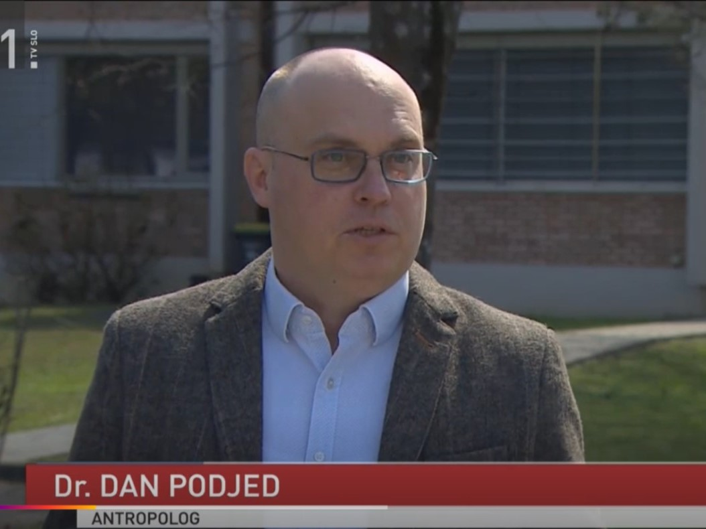

Dobro, da sem zamudil tv prispevek. Bi bil čisti dolgčas v primerjavi s
tem branjem. 😁

Odlično pisno ubesedeno. Izjava pa \... Je ne morem odpreti. A če so te
prepolovili, niti ni pomembno. Očitno si bil za mašilo. Da nekaj pač
imamo \...

> Upam, da nisem bil samo za mašilo -- razen po postavi 🙂 Pa saj sama
> kot novinarka dobro veš, kaj pomeni »minutka« in kako je v medijih čas
> in prostor odmerjen. Meni ta tiranija »minutke« v bistvu pomaga, da
> zberem misli.

Dabest dnevni zapis! Nismo samo zmedene žrtve koronapolike, tudi
koronažurnalizem vodijo (bivši) prekarni reporterji.

> Tudi sam sem bil nekoč med prekarnimi reporterji, zato vem, kaj je
> minutka. In zato cenim novinarsko delo, posebej v tem času. Mislim še,
> da prispevki RTV Slovenija v krizi (ne le tej, vsaki) odstopajo od
> povprečja, in to v pozitivni smeri.

Si me s perzijsko mačko spravil že navsezgodaj v jok

Ozadja mi amaterji ne opazimo. Zakaj si pa brez maske, Dan?

Ker jo hranim za nakupe.

Ampak srajca je pa res lepo zlikana. A si jo ti zlikal?

Seveda!

A je še kdo najprej prebral »s tehnikoma tudi«?

Pa napudran tudi nisi 😂

Hahaha, mačka na sulici! Ga pa pihneš! Ti pa maske nisi imel? Se ne bi
rabil brit! Za brit awards!

V bistvu me najbolj zanima ali si se res znebil celjskega naglasa

> Pred kamero se trudim govoriti zborno, doma pa se trudim govoriti po
> celjsko. Ves čas se trudim
>
> Meni od nekdaj vlečeš na velenjsko špraho.
>
> Ker je bil foter Gorenjec, nastane taka kombinacija.
>
> Jaz sem ponosen nate, ker se nisi navlekel ljubljanščine **🙂**
>
> Še huje je: celo družino sem navlekel na celjščino 🙂
>
> To stari, to! **🙂**
>
> Haha, jaz tudi. Oba sinova štejeta po celjsko.
>
> Od 12 naprej, domnevam
>
> Točno tako 😂💪
>
> Če ne rečeta ednajst, to ni prava celjščina 😂
>
> To je samo tam na Klanjšekovi 😂

Če se lotim samega vprašanja v prispevku: problem je dejansko
identificirati te »strokovnjake«, zato odgovor sploh ni trivialen in je
žal precej zamotan.

Kriza dezinformacij je še posebno dobro pokazala, da tudi med
strokovnjaki -- se pravi, osebami, veščimi neke stroke -- obstajajo
velike razlike, tako v kvaliteti dela kot etiki ravnanja. Niti slučajno
ni dovolj, da nekomu pred imenom stoji »dr.« in je kar naenkrat
kredibilna oseba. Primer: pred tedni se je nek egotriperski doktor
mikrobiologije na Facebooku metal ven s pametovanjem, kako koronavirus
ni dosti nevarnejši od gripe, kako na NIJZ nimajo pojma, da je dovolj,
če si umivamo roke. Njegova objava je bila široko deljena po slovenski
FB sceni. Ko smo se nekateri pod objavo oglasili s kritikami, da kot
mikrobiolog iz naravovarstvenega dela stroke in ne epidemiologije ter
brez dostopa do kritičnih podatkov ne more in ne sme nastopati s
takšnimi objavami, se je na nas usul hudournik gnojnice, češ da »on je
doktor, kaj si pa mislimo, da sploh ugovarjamo, on bo že vedel«. No, ko
je drek zadel ventilator tudi v Sloveniji in je nastopila karantena, je
dotični osebek jadrno pobrisal svoje objave in se potuhnil. Tako da,
štorija je žal bolj zapletena. Bi jo bilo fajn razplesti naprej, ampak
moram spat

> Se strinjam. Dr. pred imenom morda pomeni, da je nekdo strokovnjak za
> neko področje, pa še to ne nujno, nikakor pa ne, da je mojster za vse,
> čeprav so mnogi z nazivom tega mnenja. In to je bilo tudi sporočilo
> tega prispevka, namreč da poslušajmo tiste, ki se spoznajo na reči. Če
> me zanima 5G, vprašam elektroinženirja, če me zanima koronavirus, se
> pozanimam pri zdravnikih in epidemiologih, če me zanima, zakaj ljudje
> tako blaznijo po spletu in manično nakupujejo toaletni papir, vprašam
> strokovnjake za ljudi, npr. antropologe, psihologe, kulturologe,
> sociologe \... Tako dobimo jasnejšo sliko. Vse pa je bolje od guglanja
> in širjenja kvazi-informacij od kvazi-poznavalcev. Ta kult amaterizma
> je v tem času napravil ogromno škode. Žal ti psevdo-strokovnjaki ne
> bodo verjetno nikoli odgovarjali.
>
> V prvem postu okrog tega nisem bil dovolj jasen, ampak jaz bi šel še
> dlje: ne gre zgolj za to, da je treba v iskanju odgovorov najti
> strokovnjake iz prave stroke, temveč, da je tudi med strokovnjaki iz
> iste stroke lahko ogromna razlika v kvaliteti dela. Tudi med fiziki in
> elektrotehniki obstaja folk, ki meša drek okrog 5G, in v medicini
> obstajajo zdravniki, ki ribarijo v kalnem glede cepiv. To so tisti
> odpadniki, ki jih je sicer generalno gledano peščica, a vseeno so, in
> potem lahko njihove študije podivjano citirajo teoretiki zarot. Hkrati
> je znanost v zadnjih nekaj desetletjih dokončno prešla iz romantično
> razumljenega iskanja resnice o naravi v hladno masovno industrijo.
> Kako javnosti vcepiti sigurnost v znanost ob hkratnem zavedanju, da so
> znanstveniki zmotljivi in da sistem znanosti ni popoln ter ima lastne
> problem, zna biti ogromen izziv. Edini odgovor, ki ga trenutno vidim,
> je v izobraževanju, ki pa bi moralo za dosego takšnega cilja doseči
> čisto nove ravni. Mi bi morali že v srednjih šolah razlagati, kaj je
> peer review in kakšne so razlike med teorijami in hipotezami, v
> resnici pa danes prevladujočemu delu odraslih ljudi ni niti najmanj
> jasno, kako to deluje, zaradi česar je tudi pri tolmačenju sporočil
> toliko zmot in negotovosti. Zato bo naloga komunikatorjev znanosti in
> medijev iz leta v leto samo še težja -- ker bodo morali na svoja pleča
> prenesti velik del sortiranja informacij po veljavnosti in vrednosti.
> Tako da -- ko/če bomo premagali kult amaterizma, ki ga omenjaš, se bo
> boj šele prav začel, ker se bo treba lotiti tudi boja za moč znotraj
> znanosti same.

**\
**

## 21. dan karantene: Svet čez pet let

Kje se vidite čez pet let? Pred dvema mesecema smo imeli vsaj en odgovor
na to vprašanje, ki ga pogosto postavijo med zaposlitvenim intervjujem.
S pandemijo covid-19 so se nam načrti postavili na glavo, odgovore pa si
moramo izmisliti na novo. Kaj pa naš svet? Kakšen bo čez pet let, torej
leta 2025 oziroma leta 5 p. kor., torej po koroni? Tokrat ponujam svoje
tri predloge, vi pa lahko izmed teh izberete tisto, ki se vam zdi
najverjetnejša, ali pa si izmislite še četrto, peto in šesto možnost.

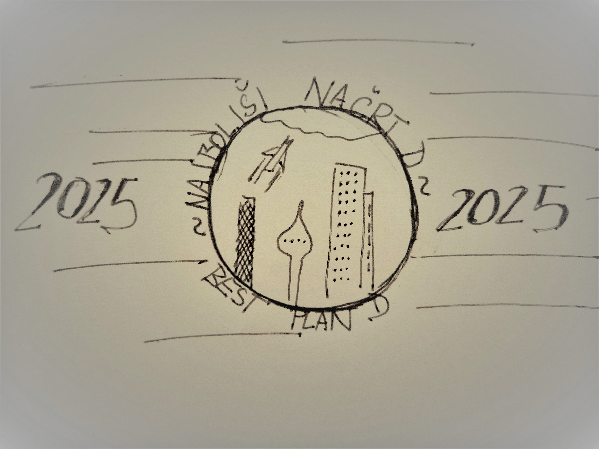

**Možnost A -- Druga vlada planetarne države:** Pri tej viziji se vračam
k Isaacu Asimovu, ki sem ga v teh zapisih omenjal pred dnevi. V seriji
znanstveno-fantastičnih del z naslovom *Fundacija* (v slovenskem jeziku
je najbolj znan del te serije z naslovom *Druga vlada galaktične
države*) je osrednji lik Hari Seldon, začetnik vede, ki ji pravijo
psihozgodovina, namenjena pa je uporabi matematike pri napovedovanju
vedenja celotne interplanetarne družbe in njenega upravljanja. Leta 2025
so ljudje podobno vajeni načrtovanja prihodnosti s pomočjo analize
velikih podatkov. Upravljanje podatkov je prevzela centralna mednarodna
institucija -- Planetarna država. Oblikovala se je leta 2022, ko so na
Zemlji uspeli zajeziti pandemijo covid-19 s cepivom, ki so ga razvili
kitajski strokovnjaki in njegovo »recepturo« prosto ponudili za uporabo.
Vseh 195 držav sveta je takrat sklenilo pakt o izmenjavi podatkov o
prebivalcih, ki jih pridobijo prek telefonov, računalnikov in drugih
naprav. Da bi zagotovili preglednost cepljenja, uvedejo sistem
centraliziranega nadzora ljudi, ki pa se izkaže kot izjemno uspešen za
načrtovanje družbenih procesov in urejanja mednarodnih problemov, od
zmanjševanja toplogrednih plinov do ustavitve rasti človeške populacije.
Leta 2025 se lotijo prvega skupnega mega-projekta človeštva: stalne
naselitve Marsa, kamor bodo v naslednji petletki poslali prvih 20 tisoč
prebivalcev.

**Možnost B -- Razsuta sestavljanka:** Pandemija covid-19 je bistveno
prispevala, da so se po svetu spet utrdile meje med državami, ki so se v
20. stoletju postopno zabrisovale. Evropske unije tako leta 2025 ni več,
razpadla je dve leti prej. Prva padla domina je bila Velika Britanija,
in to že pred pandemijo, tej pa so sledile odcepitve številnih drugih
držav, ki so želele zaščititi svoje gospodarstvo pred krizo, ki je
nastopila že konec leta 2020 in je najbolj prizadela države, ki niso
dovolj zgodaj sprejele ukrepov za preprečevanje širjenja bolezni. Nič
bolje ni v drugih deli sveta. ZDA, na primer, so razpadle leta 2022, ko
je tedanji predsednik nameraval uvesti monarhijo. Tudi večina drugih
držav zaostaja ali celo nazaduje v primerjavi z letom 2020, in to tako
tehnološko kot družbeno. Edino Kitajska ostaja svetilnik, h kateremu se
vsi obračajo in se po njem zgledujejo.

**Možnost C -- Kolektivno tolčenje plavega:** Konec leta 2020, ko je
bilo konec pandemije, so bili delodajalci prepričani, da se bodo
zaposleni vrnili na svoja delovna mesta. V prvem mesecu se jih je vrnilo
le približno 20 odstotkov, pa še od teh so mnogi poniknili. Ljudje so se
namreč tako navadili dela od doma, da se jim je pot na delo in z dela
začela zdeti povsem nesmiselna. Absentizem se ne popravi vse do leta
2023, ko je na delovnih mestih šele 54 odstotkov zaposlenih, drugi pa še
vedno iščejo najrazličnejše poti, da se izognejo prihajanju na delovno
mesto. Najnenavadneje pa je, da se gospodarska rast sočasno okrepi,
izpusti toplogrednih plinov pa na svetovni ravni drastično padejo, in to
ne samo zato, ker se ljudje ne vozijo na delo, temveč tudi zato, ker ne
hodijo več na počitnice v eksotične kraje. Raje ostajajo doma, okopavajo
vrtičke in skrbijo za živali, ki jih začnejo gojiti tudi v mestih: koze,
ovce, perutnino ...

Kam nas torej nese čas? Proti A, B ali C? Ali morda proti D?

Dam glas za C.

> Jaz tudi. Pa btw, v tem svetu bi bilo nekaj čudakov, ki vseeno
> potujemo -- ampak ni problema, ker bo takrat že povsod dovolj
> polnilnih postaj za električne motorje

Želim si C, bojim se, da bo B.

Zanimivo, da je v dveh scenarijih Kitajska pozitivec. Ravno prej nekje
prebral »šalo«, kako so dobili 3. svetovno vojno brez izstreljene rakete
😉 Zna pa biti scenarij D, ki bo še najbližje stanju pred epidemijo
(tega si večina brezkompromisno želi) -- edino jeze bo še več \...

> Ja, ne vem, zakaj se je Kitajska v teh mojih blodnjah tako dobro
> odrezala. In ja, tale šala o 3. sv. vojni ni kar tako. Mislim sicer,
> da sem še pod vplivom Kai-Fu Leeja, ki je v knjigi AI Superpowers
> označil Kitajsko za absolutno zmagovalko v tekmi z ZDA. Itak pa je
> najbolj verjeten tvoj scenarij D, ampak se splača malo fantazirati.
> Morda dobimo kakšno dobro idejo. Zdaj je čas 😉
>
> V modernih časih se kolonizira s kravato, ne orožjem. Je bistveno
> lažje. Definitivno pa si nihče normalen ne želi scenarija D, ker so ga
> že vsi naveličani, razen psihopatov in strahopetcev, ki takšnim lezejo
> v rit in se jim po domače reče šef.

jaz sem kar žrebala in je padel C 😂😂😂

Mislim, da se bo večina oprijela starih naučenih vzorcev. Varianta C je
malce utopično socialistična, čeprav pa se fajn sliši. Bo pa verjetno
kovi-kriza res imela daljnosežne posledice. Ena, o kateri razmišljam, je
uvedba UTD. To vprašanje se bo verjetno sprožilo na osnovi mega-paketov
finančne pomoči, ki so se kar naenkrat skoraj čudežno pojavili, čeprav
so vse vlade v časih pred krizo jamrale, da denarja ni, ko se je
govorilo o socialnih in drugih pomočeh ogroženim.

Vsaj nekateri deli v B so verjetno neizogibni, ampak ne vse. »A« je
verzija utopije ki se lahko zgodi samo če bo »planetarna država« umetni
razum, in tudi v tem primeru so precejšne možnosti za manj ugoden izid
za človeštvo na splošno. »C« je predvsem odvisen od stolpca »B« (če se
bodo meje res izrazno poglobile \...).

Če povzamem: A x B + C = D.

> Optimist v meni bi rad tudi videl da se bodo podatki po 3--6 mesecih
> socialnega distanciranja pokazali na merah globalnih emisij CO2 in
> potencialno pokazali človeštvu direkcijo, ki mogoče lahko še prepreči
> (ali vsaj omili) naslednjo eksponentno krivuljo, ki prihaja \...
>
> Tole si zelo dobro povedal. Ne smemo se osredotočiti samo na pandemijo
> kot zlo, temveč moramo gledati širše -- celo na prednosti covid-19 za
> svet in človeštvo. Kot sem že nekajkrat omenil, zdaj prvič
> vzpostavljamo planetarno sodelovanje.

## 22. dan karantene: Maček brez meja

Naš maček, ki mu pravimo Mucek, je globoko v sebi še vedno potepuh. K
nam je prišel pred desetimi leti in ostal. V prejšnjem stanovanju smo mu
puščali odprto okno, da je lahko kadar koli odšel na potep, ko smo se
preselili, pa smo mu naredili loputo na vratih, da lahko zapusti
stanovanje. »Tonk, tonk,« zaropotajo vratca, ko se maček vrne in navadno
še zamijavka, da je lačen. Našega mačka pandemija covid-19 niti najmanj
ne zanima. Ravno nasprotno, zdi se mi še bolj zadovoljen, ker lahko
zunaj brezskrbno hodi, saj ni nikjer nobenega avtomobila, in preverja,
ali so njegovi tekmeci -- teh ima po bojnih ranah sodeč precej --
slučajno vdrli na njegov teritorij.

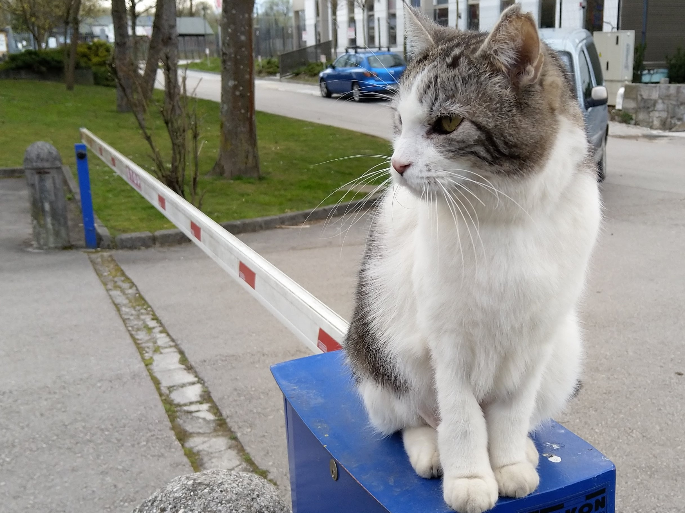

Naš maček se, če je treba, tudi izseli iz stanovanja. Pred leti, ko smo
dobili -- no, ne ravno dobili, prej pridelali -- še enega otroka in
sočasno prenavljali stanovanje, je Mucek sklenil: »Zdaj pa je tega
dovolj!« Oddrvel je skoz vrata in ni ga bilo več na spregled. Čakali smo
ga teden, dva in polepili sosesko z njegovimi fotografijami, Mucka pa od
nikoder. »Kje pa je Mucek?« so spraševali otroci. »Odšel je v Bosno,«
sva jim razložila ...

No, ob tej razlagi je potrebno razkriti nekaj ozadja. Nekdanji sosed je
imel simpatičnega in nekoliko nevzgojenega psa, ki mu je bilo ime Majki.
Spuščen je tekal po mestu in tu in tam koga oblajal, zvečer pa se je
vedno vrnil domov. Nekega dne sem proti večeru šel mimo njihove hiše.
Sosed je bil zunaj s svojimi otroki. »Kje pa je Majki?« sem ga vprašal.
»Šel je v Bosno,« mi je odgovoril z resnim izrazom na obrazu. »V Bosno?«
sem ga začudeno pogledal. »Ja,« je potrdil in z glavo zmignil proti
otrokom, »Majki je šel v Bosno.« »Aha,« sem pokimal in dojel sporočilo.

Skratka, tudi Mucek je odšel v Bosno -- in mislili smo, da ga ne bo
nikoli več nazaj. Po desetih mesecih od njegovega odhoda sva z ženo
stala pred hišo in v temi zagledala znano pojavo. »Mijav!« in prišel je
k nama. »Mucek je živ!« sva bila navdušena, on pa je švignil mimo naju v
stanovanje, kakor da se ne bi nič zgodilo. Iz Bosne se je vrnil lepo
porejen, a vseeno izjemno lačen. Celo tako je bil sestradan, da je začel
jesti kos kruha, ki je ostal na mizi. Postregla sva mu še z biološko
pridelano mleto teletino, ki sva jo hranila za otroka. Takrat je očitno
sklenil, da bo še nekaj časa ostal.

In zakaj omenjam to zgodbo v teh »avtoetnografskih« zapisih iz
samoosamitve? Zato, ker je Mucek zdaj edini med nami, ki ima prost
izhod. Ko se vrne, nam redno poroča o vtisih s terena in sitnari za
hrano. Za vse nas pa je sobivanje z Muckom pomembno še zaradi
navezanosti na živa bitja, ki ji filozof in psiholog Erich Fromm ter
biolog Edward O. Wilson pravita biofilija. V času, ko imamo manj stikov
z ljudmi, opažam, da se v družbi živali in rastlin počutimo bolje. Morda
nas prav zato še vedno navdušuje smrdokavra na osamljenem igrišču (glej
11. dan karantene) in verjetno zato žena tako rada prekopava vrt. Zato
se tudi vedno znova razveselim Mucka, ko priropota skoz vratca, in si
oddahnem, da ni spet spokal culice in odšel v Bosno.

Živali so dobre za misliti, je dejal antropolog Claude Lévi-Strauss. V
času pandemije pa so živali pomembne še zato, ker ob njih za trenutek
pozabimo na tisto, kar imamo sicer ves čas v glavi.

Ma opet rilejtam 😁 K nam se občasno priklati mačka, ki je zelo zgovorna
in me je prečitala, da rada poklepetam, pa je za žlico hrane zgovorna še
bolj. V bistvu živi v naši ožji soseski, malo pri enem, malo pri drugem.
V koronacajtu so se njeni obiski pomnožili, za kar sem ji hvaležna, saj
me antistresira, pa četudi teh nekaj minut klepeta za žlico hrane. Druga
ljuba žvalca te dni pa je svakova borderkolika, ki je čisto mahnjena na
teniške žogice, ki jih ji moramo dvonožni metati ali brcati, da jih ona
lovi. Desno nogo sem že prilično ojačala, zdaj moram še levo 😁 Postala
bom Ronaldinja, ona pa je že sedaj boljša od vsakega vratarja 😀☺️ Kaj
vse človek ne počne. And I like it. 😁

Khm 😅 bioRxiv: »We found that SARS-CoV-2 replicates poorly in dogs,
pigs, chickens, and ducks, but efficiently in ferrets and cats.«

Zato ga pošljemo po nakupih z masko.

Tvoji zapisi so postali moje redno večerno branje \... Uživammmm, pa
četudi z drugačnim mačkom 😉

Vsakič znova z največjim veseljem prebiram te korona-dnevniške zapise in
se hkrati vedno znova zraven nasmejim. Ja, priznam, tokrat malce zavidam
tej mačji svobodi, s culico ali brez 😅👍🔝

Poleg tega, da je tale vaš Mucek cel car in da so tvoji zapiski prav
zabavni ter poučni, sem prvič slišala za termin BIOFILIjA in že googlam
👍🤣 Pa spet vem nekaj več!

## 23. dan karantene: 23 dni samote

»Koliko časa smo že v samoosamitvi?« sem vprašal svoje tri otroke. »Pet
tednov,« je izstrelil najmlajši. »Ja, pet tednov,« je ponovil srednji in
pokimal. »Triindvajset dni,« je resignirano dodal najstarejši in mi
pojasnil, da ves čas vestno zapisuje dneve. Vprašal sem še ženo, ki
najprej ni hotela odgovoriti, saj je ravno pripravljala malico za
otroke, potem pa je izstrelila: »Triinsedemdeset dni!« Zraven se je še
zahahljala in me pogledala s čudnim sijajem v očeh. V roki je držala
nož, s katerim je lupila jabolka. Pri njej nisem poizvedoval naprej,
Mucka pa sem preskočil, ker vem, da je zaposlen s pomembnejšimi
vprašanji. Nazadnje sem izprašal še sebe: »Dan, koliko dni si v
karanteni?« Odgovor ni bil preprost.

Bolj ko sem razmišljal, bolj se mi je odgovor zdel podoben oceni nizkih
temperatur, ko piha močan veter: dejansko je 23 stopinj pod ničlo, zdi
pa se nam, da je minus 50. Podobno je s karantenskimi dnevi: občutek za
čas je čudno iztirjen. Danes, na primer, je sobota -- to vem, ker sem
preveril na koledarju. Kljub temu naše dejavnosti niso bistveno drugačne
kot ob torkih ali četrtkih. Če hočemo ujeti delovne in šolske
zadolžitve, jih nekaj prenesemo na konec tedna, ob delovnih dnevih pa se
prosti in delovni čas podobno pomešata.

Med karanteno pri meni še vedno velja znana formula osmih ur dela, osmih
ur spanca in osmih ur prostega časa in rekreacije, ki jo je na začetku
19. stoletja zasnoval družbeni reformist in socialist Robert Owen. V tem
času spim več in, zanimivo, bolje kot običajno, in to dejansko osem ur v
enem kosu. Bolj zamešana sta druga dva dela dneva, namreč delo in prosti
čas. To dvoje se je povsem prepletlo. Težko bi sploh določil, kaj je
prosti čas in kaj ni. Ali sodita kuhanje in strežba sinovom, ki jedo kot
kobilice, v kategorijo dela ali prostega časa? Kam sodijo nakupi in
večurno razkuževanje hrane, ki jo prinesemo domov? In kam sodi pisanje
teh zapiskov? Je to zgolj prostočasna dejavnost ali morda tudi
raziskovanje?

Prav danes me je po telefonu poklicala novinarka in me spraševala za
mnenje o poučevanju v tem čudnem času. Razložil sem ji, da z veseljem
odgovorim na vprašanja, naj pa mi ne zameri, ker bom vmes pospravljal
kuhinjo. Povsem jasno ji je bilo, o čem govorim: večopravilnost je v teh
dneh očitno nova normalnost. In morda sva zato imela celo boljši
pogovor, kakor bi ga v starih časih, torej pred karanteno. Med
odgovarjanjem sem namreč divje ropotal s posodo in ji s primeri iz
domače prakse skušal razložiti, da smo starši v teh dneh izjemno
obremenjeni zaradi žongliranja z opravili, ravno tako pa so obremenjeni
tudi učitelji. Občutek imam, da mi je ob vsem hrupu, ki sem ga zganjal,
verjela na besedo.

In ja, dejansko mi čas te dni mineva podobno kot med dopustom v
apartmaju, pa ne zato, ker bi imel premalo dela, temveč prav nasprotno:
ker si ga po neumnem naložim preveč. Tudi takrat, ko se odpravljamo z
družino na morje, načrtujem, da bom v prostem času prebral več knjig,
napisal vsaj en članek, otroke naučil prepoznati morske živali in
rastline ter bil ljubeč partner. Vse te visokoleteče zamisli in obljube
samemu sebi nekako skopnijo med nenehnimi nakupi, pripravo hrane,
čiščenjem ter drugimi nujnimi opravili. Za knjige in pisanje ter vse
drugo, kar sem nameraval še storiti, časa preprosto ni toliko, kolikor
bi si ga želel.

Res pa je, da sem potem, ko je konec dopusta, vesel kot tisti racman iz
nekega kratkega stripa, ko razširjenih rok zavpije »Pozdravljena,
služba!«, ko se vrne v pisarno s podaljšanega vikenda. Računam, da bom
podobno vesel, ko se bom po triinsedemdesetih dneh izolacije (ta čas je
v celoti izmišljen!) vrnil na delovno mesto, kjer bo stara formula,
torej »8+8+8«, veljala vsaj približno.

Pa bo res? Ali pa bo čas v pokoronski dobi morda tekel drugače?

Dan, še eno vprašanje za starše (če ga nisi dobil že od novinarke): prvi
dan službe -- bomo vsi pijani ali prvič/končno trezni? 😜

Pijani od svobode in trezni od kupa, ki nas bo čakal na mizi.

Dan, pa si se zamislil ob ženinem odgovoru? O kakih 73 dneh ona to
govori??? Ccccc ...

Sem se zamislil, seveda!

Če imaš dovolj denarja in nisi zadolžen in daš odpoved v službi, je
praktično enak občutek. Ne veš več, kateri dan je oz. ti je vseeno.

> Saj veš, da ni vse v denarju In upam, da nas je ta situacija tudi kaj
> na to temo naučila
>
> Sem zadolžen, posledično ves čas plujem tik nad gladino. Ne morem dati
> odpovedi in si tega niti ne želim, ker me veseli to, kar počnem. In v
> bistvu se nimam kaj pritoževati. Nekateri zdajle res tonejo in
> odštevajo dneve in točno vedo, kateri dan je, in se sprašujejo, kaj se
> bo zgodilo na plačilni dan. Teh ni malo, si mislim.
>
> Fanta, govorim iz lastnih izkušenj. In dal sem samo primerjavo, kako
> je, ko nimaš nobene skrbi. Ja, ni vse v denarju, to jaz zelo dobro
> vem. Brez njega pač ne moreš, če »retorično«, želiš pisati po FB.
>
> Itak vem, da pišeš iz lastnih izkušenj. Enako jaz. Pravim samo, da
> nismo vsi v istem čolnu, kot nekateri pravijo. Enim se zdaj potaplja,
> drugi si ga nadgrajujejo z novim motorjem. Pritisk časa: ta pa je
> manjši, če nisi zadolžen. Blagor tistim!
>
> Zato pa je skrajni čas, da se človeštvo znebi tega pritiska. Monetarni
> sistem mora izginiti iz »obličja zemlje«.
>
> Se strinjam. Ali pa je treba poskrbeti vsaj za UTD.
>
> Jaz sem osebno tako daleč prišel, da rečem šefu gladko NE, ko vidim,
> da gre za nekorektne zadeve.

## 24. dan karantene: Narastek

Z urejanjem pričeske nimam posebnih težav. Ko začnem v zgornji del glave
spominjati na severnokorejskega predsednika Kim Jong Una, prosim ženo,
naj me ostriže. »Bzzz, bzzz,« zabrni strojček in delo je končano v
desetih minutah. Ta postopek zlahka izvedeva tudi med karanteno.

Moji otroci tačas postajajo podobni članom skupine Beatles, in to v
njihovi pozni fazi. Frizerja prav nič ne pogrešajo in tudi žena ga ne,
saj pravi, da si lahko končno v miru pusti dolge lase in bolj ali manj
neopaženo preide nadležno vmesno fazo med daljšo in krajšo pričesko.

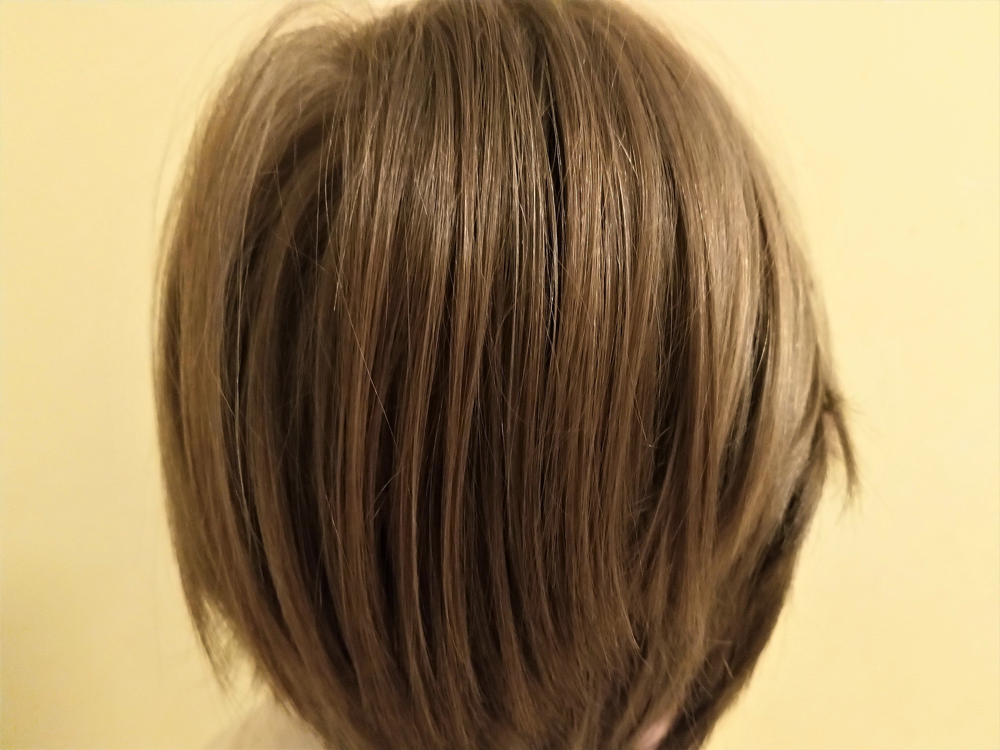

Morda še najbolj pogrešajo urejanje pričeske moja mama in druge gospe,
ki so vajene rednih obiskov pri frizerju, in to ne samo zaradi barvanja
las in striženja, temveč tudi zaradi pogovora. Eden takih frizerjev, ki
ga gospe rade obiskujejo, dela blizu nas. K njemu hodi žena in tja
včasih peljeva tudi otroke. Ta frizer je »mudel«, kot bi rekli nekateri
domačini v mestu, kjer živimo. Ko hodi po salonu v natikačih in
nogavicah, včasih zgrabi časopis, ga zvije in tuli skozenj, kot bi rukal
jelen. Gospe, ki prihajajo v salon, ga imajo rade tako zaradi spretnih
rok kot tudi zaradi sproščenih debat. Z njimi med striženjem namreč
klepeta o vsem mogočem: od kuhanja do spolnosti. Gospe se ob tem
hihitajo, on pa glasno razpreda svoje misli pred občinstvom, torej
ljudmi, ki še čakajo na striženje. Le tu in tam za nekaj minut prekine
delo in preneha zabavati ljudstvo, ko mu zmanjka »l\'inspiration«, kot
sam temu pravi.

In zakaj je v teh dneh pomembno imeti urejeno in pobarvano pričesko brez
narastka? Med drugim zato, da lahko nakupite tisto, kar potrebujete. Po
omrežjih je te dni zakrožil pripetljaj neke gospe, ki je varnostnik ni
hotel spustiti v trgovino, saj bi po njegovem morala priti v terminu za
upokojence. Rekel ji je nekaj podobnega kot: »Tod mimo ne pojdeš!« Ko mu
je zabrusila, da zgolj po njenem videzu ne more presoditi, ali je
upokojenka ali ni, in za nameček poslala državo v tri krasne, je
varnostnik poklical policijo, ta pa jo je nato oglobila. Njena pripoved
o zapletu pred trgovino je dolga, ampak za tole pisanje je bistveno,
kako je varnostnik ugotovil, da je gospa prišla v napačnem terminu in da
je stara več kot 65 let. No, kako? Po gubah in sivih laseh, pravi
avtorica zapisa.

Nauk zgodbe: zaradi lasnega narastka lahko v teh dneh ostanete brez
riževega narastka, ki ste ga nameravali pripraviti za večerjo. Čudni
časi.

Pa prav rižev narastek si moral omeniti? 😉

A ga pečeš?

Jem. 😉 Če ga imam.

A, daj? Torej imaš pričesko na mestu!

Sem prebrala opis dogodka, ja \... Sem tudi jaz začela dobivati sive
lase!

Jaz pa sem si jih začel puliti.

To je naslednji korak, če ne bodo že sami prej izpadli!

Pa ajde, narastek še gre, pač kupiš nek cenen L\'Oreal al pa kej \...
Samo špice, to je pa problem, meni nemoteno rastejo in se cepijo že od
začetka potovanja (januarja), in sem računala na frizerja v Sydneyu (u
Cjelu pol pa sploh), zdej zarad korone bom morala pa menda sama z mačeto
nad njih

Jutri bo rižev narastek zadišal v moji kuhinji. Mož se že veseli 😁

Brez narastka nam živeti ni! Pri nas ga bomo tudi spekli.

Zvečer smo ga pomlatili.

Že nekaj dni iščem žrtev, ki me bo čez dva ali tri tedne pobarvala.
Frizerko bom naprosila za nasvet, katero barvo naj kupim, Asjo bom
naprosila, da jo kupi in odpošlje, ker z narastkom pa mi tudi v
izolaciji živeti ni

Že nekaj časa se nisem tako sproščeno nasmejala kot ob tem zapisu, kako
prej samoumevno postane pomembno in zaželeno. Kdo bi si pred korono
mislil, da je frizer tako pomemben.

## 25. dan karantene: Junakova pot v trgovino

»Bom šla jaz v trgovino,« je iz spalnice zavpila žena. »Ni treba,« sem
ji odvrnil, »bom šel kar jaz.« Samega sebe sem presenetil, od kod ta
nenaden napad solidarnosti in zaščitništva? Običajno me niti najmanj ne
mika, da bi šel v trgovino, in to opravilo z veseljem prepustim drugemu.
Doma to nadoknadim pri drugih gospodinjskih opravilih, kot so
pospravljanje posode, likanje in kuhanje -- vse to počnem precej rad,
posebej kadar ob tem poslušam zvočne knjige. Bolj monotono je opravilo,
raje ga opravljam.

Še pred mesecem sem se tudi v trgovino odpravil s slušalkami, saj sem
skoraj na pamet vedel, kaj potrebujemo. Pa danes? Seveda ne. Namesto
slušalk sem si že v avtomobilu nadel masko in rokavice in pogumno
zakoračil v džunglo ljudi in virusov in hrane, ki se ji reče trgovina.
Spretno sem švigal med policami, metal izdelke v voziček in se izogibal
morebitnim stikom z drugimi kupci. Čez približno pol ure sem se prebil
do blagajne, vešče zmetal hrano in druge izdelke na tekoči trak in iz
žepa potegnil kartico. Ves čas sem bil popolnoma zbran, le takrat, ko
sem moral plačati, sem postal nekoliko zmeden. »Kaj? Spet toliko?« mi je
zvonilo po glavi.

Domov sem se vrnil z osmimi vrečami, ki sem jih odložil na hodniku. »Ti
pomagam oprati in razkužiti?« me je vprašala žena. »Ni treba!« sem
odvrnil. Stvari sem znosil v banjo in jih pobrizgal z razkužilom, spral
z vodo in osušil s krpo. Vmes sem razmišljal, kako neumno se vedem in v
kaj se spreminjam med samoizolacijo: v patriarha, ki ravna po načelu
»žena naj bo doma, čaka naj na moža«, sam pa medtem stopam po junaški
poti, kakor jo je opisal Joseph Campbell, poznavalec primerjalne
mitologije in avtor znamenitega dela *Junak tisočerih obrazov*: zapustim
čist in varen dom, odidem v neznano, se spopadem z nevidno pošastjo --
virusom -- in se kot zmagovalec in junak vrnem domov, kjer me na pragu
pričakajo žena in otroci ter mi mahajo v pozdrav. (No, vsaj v
domišljiji.)

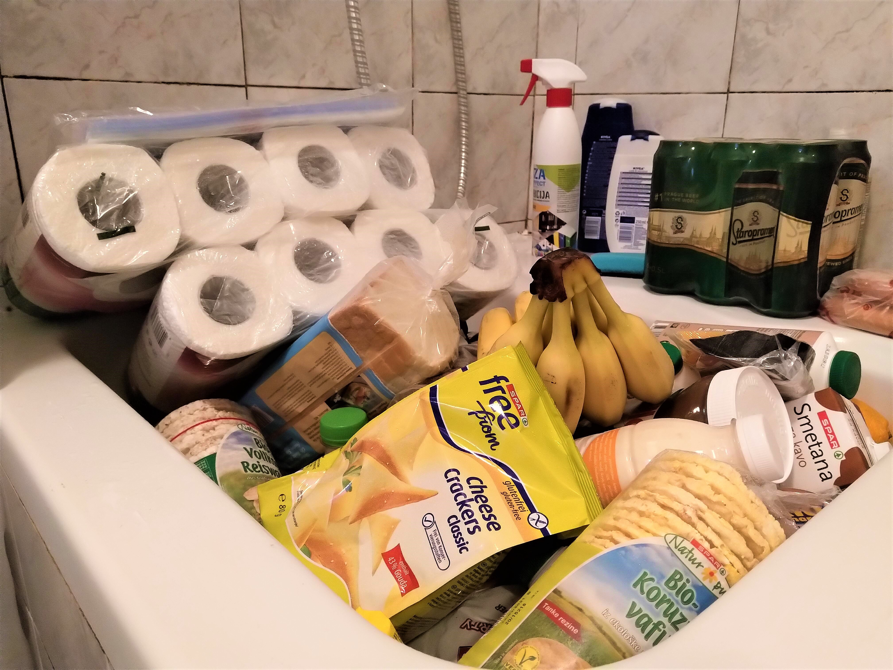

Sociologinja Yolande Strengers iz Laboratorija za nastajajoče
tehnologije, ki deluje na avstralski univerzi Monash, je ravno danes na
portalu ABC News objavila zanimivo mnenje o tem, da se zaradi karantene
in dela na domu spet ustvarja ločnica med moškimi in ženskami. V
prispevku pojasni, da se morajo ženske pogosto odpovedati svojim
delovnim zadolžitvam in skrbeti za gospodinjstvo in otroke, medtem ko
možje opravljajo bolje plačana dela.

In kaj lahko v tem »liminalnem času« storimo za enakost spolov? Kako
lahko prispevamo, da ne bomo med osamo slavili moška junaštva in častili
njihove nakupovalske podvige ter pokroviteljsko trepljali žensk za
njihove dosežke v kuhinji? Odgovor je zelo preprost: redno in pravično
menjavanje vlog in nalog.

Zanimivo postaja tole -- tudi pri nas doma sem bila jaz tista, ki je
hodila v trgovino, od 13. 3. naprej pa vedno mož. (Res je sicer, da je v
tem času šel le trikrat 😉)

> Jaz tudi samo trikrat, skupno pa zapravil čez 600 evrov. Doma imamo
> strašne požeruhe. 🙂

Po začetnem branju sem se oddahnil, da nisem edini \... na koncu pa se
zgroženo zdrznil, da postajam eden od \... 😉😁 Ali je samoopazovanje
hkrati tudi opazovanje drugih? Kadar seveda živimo v družbi z enakimi
vrednotami in načinom življenja. 😉

Zdaj pa firtoh gor in za štedilnik!

Dan, samoizolacija ne pomeni biti v hišnem zaporu. Izkoristita lepo
vreme in sonce za izboljšanje in aktiviranje imunskega sistema, ker smo
le-tega ljudje razvili v več tisočletni ko-evoluciji in sodelovanju z
imunskim sistemom gozda, narave. Zapiranje med štiri stene ga krepko
načenja. Ne moreš si misliti, koliko ljudi me kliče, da rabijo nekaj
proti depri, za spanec. In ko jim rečem »kaj pa sonce, kakšen potoček
\...«, nastane tišina na drugi strani in čutim, da bi marsikdo takrat
hotel zaključiti ta pogovor s čudakom. Večkrat jim celo predlagam, da
preskočijo informativne oddaje, ki so večinoma prežvečene
dezinformacije. Rajši se sprehodite skozi gozd, pogovorite se s
partnerjem, objemite drevo, povohajte zemljo in rastlino. Strahu ne bo
več in lažje boste zaspali. PS: Umakni pivo in mlečne izdelke iz
nakupovalne košarice in popek se bo malce približal hrbtenici

> Pa saj nismo notri ves čas. Se mi zmeša. Vsak dan smo vsaj eno uro
> zunaj. Ko grem po nakupih, grem pač na veliko.
>
> Ena ura je malo več kot nič. V teh pogojih bi samo popoldan moral biti
> vsaj dve uri.
>
> Saj pravim, vsaj eno. Držimo se tvojega priporočila in izvajamo
> fototerapijo na soncu.
>
> In tudi stanovanje »zadiha«, ko vas ni
>
> Sicer bi bila jaz z največjim veseljem zunaj šest ur dnevno, ampak:
> dva starša, ki delata od doma »full time«, dva otroka, ki imata šolske
> obveznosti in potrebujeta asistenco, tretji, ki mora bit ta čas nekako
> zaposlen, nekaj manj računalnikov kot oseb, ki jih potrebujejo za
> opravljanje teh nalog, 4-5 obrokov dnevno, kar vključuje pripravo in
> pospravljanje, itd. itd. itd.
>
> Da. Razumem. Moji so že veliki in v samoizolaciji v svojih
> stanovanjih. Good luck 😍

Ampak tuširanje vsega, kar nabaviš, je pa malo ekstremno po mojem \...

> Držimo se samo nasvetov strokovnjakov: odvijemo, kar je zavito,
> očistimo, kar se da.
>
> Saj vem, meni se zdi ekstremno, tumač \...
>
> Mene spominja na Pascalovo stavo. Se splača verjeti v boga ali ne?
>
> Hju, morala pogooglat \... Ne vem, kljub vsemu je ok biti razmeroma
> sproščen, »stroki« z dnevnimi umotvori niti slučajno več ne zaupam.
>
> Pa saj sem razmeroma sproščen, malo se celo za(je)bavam. Upam, da je
> iz zapisov to še razvidno. Če bom šel čez mejo normalnega, javite!
>
> Moja teorija glede tega: če bi bila sama doma, skoraj zagotovo ne bi
> čistila embalaže. Si pač umiješ roke, ko hendlaš reči in preden hrano
> nosiš v usta. Tole je bolj preventivni ukrep, ker niti približno
> nimamo nadzora nad mulci in potovanjem njihovih prstov od vrečk do
> nosa in ust 😅

Midva pa zdaj tekmujeva komu bo pripadla čast, da gre malo v svet --
trgovino. Včeraj sva si končno priznala, da so nakupi postali ena
najbolj vznemirljivih stvari.

> Nov adrenalinski šport, ko se sprašuješ: bom fasal al ne bom fasal ta
> virus v trgovini? Res je ...
>
> Living on the edge!

Skret papir hoarderji!

To so brisačke, papirja imamo do junija

Tud pir si ves pobrau

Hrana je na fotki samo na vrhu, spodaj samo pivo.

Ja, Dan, meni se tudi zdi tuširanje vsega malce pretirano

Ob vsem ostalem, kar se dogaja, mi je to še najmanj v napoto.

> Saj ne kritiziram In se strinjam. Vsak si mora neke specifične rituale
> za čas prehoda izmisliti Še vedno uživam ob branju. Res moraš združiti
> zapise v knjigo.
>
> Mogoče pa res. Me prav zanima, kako se bo tole bralo čez 50 let. Po
> mojem se nam bodo zanamci čudili in smejali in ne bodo mogli verjeti,
> da so ljudje v začetku 21. stol. dejansko trpali hrano v banjo.
>
> Dan, ne pretiravaj s tuširanjem 😉
>
> Sebe sem nehal.
>
> Mogoče boste pa ti in tvoja družina čez toliko in toliko let edini, ki
> boste lahko take reči pripovedovali, ker odgovorno očistite izdelke?
>
> Dan, a si ti ziher, da si navodila za tuširanje dobro prebral in nisi
> kaj pomešal? 😀🙈 Sicer te pa sošolci očitno redno beremo 👌

Bizarno Dan, bizarno -- tole z umivanjem špecerije Sem se pa začel
spraševati, kakšne vse patološke naplavine bodo ostale po tej epizodi

> Freud se vrti v grobu, ker ne more napisati nadaljevanja O
> psihopatologiji vsakdanjega življenja.
>
> Kar pomeni, da so ti vrata na široko odprta. Keep on
>
> Samo še psihoanalizo dam čez, pa bo. Ali pa psihoterapijo 🙂
>
> Tu se malo kaže tudi akademska zavzetost.
>
> Whatever makes you comfortable

Meni je rekla prijateljica, da eni ljudje kruh dezinficirajo, pošpricajo
in ga dajo v zmrzovalnik \... Ljubi bog, kam smo prišli \...

> No, mi ga še ne dezinficiramo in zmrzujemo 🙂 Sem ga pa enkrat dal v
> pečico na 100 stopinj za 15 min, po nasvetu zdravnika, ki to počne.
> Sicer pa imajo ljudje doma očitno cel kup kvasa in moke, tako da ga
> lahko pečejo po mili volji.

Res \... Pa saj vsi razumemo, da človek malo ubeži domu!!!

Ko potegneš črto -- virus se prenaša predvsem aerosolno. Da ga dobiš
preko špecerije, je prekleto malo verjetno. Prej ga boš od nekoga, ki je
kihnil pod masko zraven tebe.

No, glede emancipiranih odnosov in pravične menjave vlog: kdo pomaga
otrokom pri delu za šolo, kuha in pripravlja vmesne obroke, pomiva
posodo, pospravlja posodo, pere obleke, obeša perilo, sesa, vzdržuje
minimalni red in čistočo v stanovanju, striže otrokom nohte, jim umiva
lase, miri spore med sorojenci itd. itd. Seveda, če so otroci majhni.
Predpostavljamo, da naj bi starejši otroci bili že samostojni in vsaj
pomili posodo za sabo za vsemi svojimi malicami, ker šele sedaj vidimo,
koliko pojejo 😎 Se pa strinjam, da ne vem, kakšen smisel ima nalagati
si še dodatne naloge s tuširanjem embalaže.

> Seveda se trudimo, da pri opravilih pomagajo tudi otroci in predvsem
> pospravljajo za sabo. Po nakupih jih sicer ne pošiljamo, sem pa videl
> tudi ljudi, ki še vedno nakupujejo v družinskem krogu. To se mi zdi ta
> hip res nepotrebno.

Prebiranje teh tvojih zapisov polepša dan To je postal eden od mojih
ritualov v ladijski karanteni. Hvala ti!

Na ladji? Resno?

> Ja, čisto resno. Smo bili na poti okoli sveta z ladjo, uživali od
> januarja. Ampak zadnjih mesec dni smo ves čas na ladji. Pa ni slabo,
> ampak malo manj zabavno kot prej Verjetno pa še vedno dosti bolje, kot
> če bi bili zaprti doma \... Čeprav smo »zaprti« na ladji, je gibanje
> in druženje dokaj svobodno.

Banane si tudi razkužil?

> Olupil sem jih. Dam pa vse v banjo, kar prinesem domov. Potem odvijem
> karton in ga vržem stran. Kar je v plastiki oz. steklu, stuširam.

Warning: This post contains product placement

Powered by Facebook.

Koliko časa je treba za sušenje? Ali sta uporabila fen?

> Ne, fena ne uporabljava, ker varčujeva z energijo Samo spereva tisto,
> kar je v plastični ali stekleni embalaži, in obriševa s suho krpo.
> Skupno zdaj traja postopek približno pol ure, sicer bi zlaganje takšne
> količine hrane v shrambo in hladilnik trajalo 10--15 minut.

A si plačilno kartico kaj razkužil, ko si prišel domov? Oziroma si vzel
rokavico dol v trgovini, preden si iz žepa potegnil kartici?

Brezstična je, potem jo pa v trgovini malo poškropim.

Priden si!!

Če pa ni spreja, pač pljunem in poribam z majico.

Prej rukni en šnops \...

Če nas ne ubije virus, nas ubije količina kemikalij, ki jih te dni
uporabljamo!

Kot so rekli v Alan Fordu: »Preživjet ćemo, pa makar crkli.«

Zelo se strinjam z ugotovitvijo, da trenutna situacija ne vpliva
blagodejno na enakost spolov. Deloma zaradi razlike v plačah, ki pri nas
niso tako velike kot drugod po Evropi, deloma zaradi panog, v katerih
delujemo. Četudi je par prej bil enakopraven, smo ženske pogosto v
storitvenih dejavnostih, ki so zdaj onemogočene (razen zdravstva in
šolstva), medtem ko proizvodnja, gradnja ipd. še dihajo. Da ne omenjamo
manjše prisotnosti žensk na vodilnih položajih, kar nas zdaj tudi
pogosto porine v vlogo gospodinje, učiteljice in domačega policaja.

Upam da vse zaliješ z varikino

Dokler ni vse belo, sploh ne dam v hladilnik. 🙂

**\
**

## 26. dan karantene: Vrhunske navade v usranem času

Danes mi je zmanjkalo navdiha za pisanje, zato prepuščam prostor drugim.
V komentarju napišite, katera je najbolj čudna ali najboljša navada, ki
ste jo v času karantene vzgojili ali opazili pri sebi in drugih.

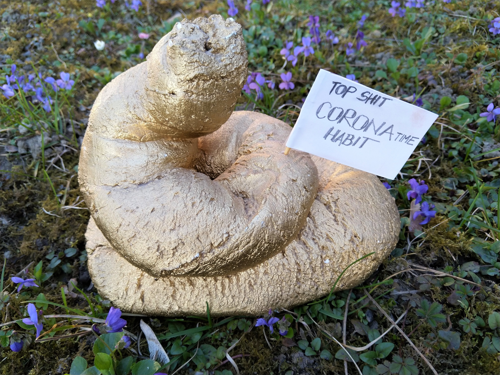

Sicer sva z mojo drago to začela malo prej početi, ampak sedaj pa pride
še bolj do izraza, in sicer, da pred spanjem vsak pove tri pozitivne
stvari iz tega dneva. Tako se odpre debata o preživetem dnevu in
pozitivno naravnana. Druga pa je ne gledanje televizije, kar sicer traja
že 4 leta, ampak smo s pojavom epidemije pogledali dnevnik, ki se nam je
zopet zagabil po parih dneh.

Dve top shit navadi! Tale prva mi je sploh všeč v teh mračnjaških dneh.

Ta navada ni niti nova niti (zelo) čudna, se mi pa zdi dobra: vsak dan,
ko lahko, se po končanem delu (čeprav nisem nikoli prepričana, kdaj to
res je) usedem na kolo, prepotim med približno 15-minutnim vzponom na
bližnji hrib, nato pa se iz tamkajšnjih množic ljudi, ki se jim že na
navaden dan izogibam, zlijem z gozdom in ptičjim petjem. Ko prispem do
jase, ki je vsaj za zdaj uspela ostati nekoliko skrita pred gručami, si
včasih odprem pivo, včasih pa spijem domačo kombučo. Nato nekaj minut le
poslušam zvoke in vonjam vonjave gozda ter srkam pijačo tistega dne,
nato pa iz torbe privlečem še bralnik e-knjig in preberem včasih nekaj
strani, včasih celo kako poglavje. Vmes pogledujem na telefon in občasno
kako fotografijo svojega popoldanskega paradiža delim s sledilci na
Instagramu. Takole nekako.

> Mene že ta opis s fotko pomirja Temu se reče idila. Javi, če kaj
> zanimivega prebereš!
>
> Trenutno nimam prave osredotočenosti za načenjati kaj novega, zato že
> tretjič ali četrtič prebiram Capitalist Realism. Težko se domislim
> česa bolj primernega času in razmeram.
>
> Super -- pa še neka špehurina ni, kot vidim. Dodajam na seznam!
>
> Ni, ni, prebereš na dušek, če se obveznosti, delo, otroci, mačke,
> planeti in vse drugo prav postavi

Pri nas pa ena nova navada, da si že zjutraj v pojstli dava z možem
zaobljubo, da se potrudiva cel dan se ne razjeziti nase in kregati, tudi
če bova spet cel dan skupaj Če je to že tri dni zaporedoma, se lahko
šteje kot navada, a ne?

> Itak, tri dni zapored je navada, zakaj pa ne? Ta mi je tudi všeč. Pa
> vama uspe držati obljubo? Na druge se sam večinoma ne jezim -- to bi
> še zdržal. Ampak da se ne bi na sebe \... Uf!
>
> Ja, točno, zaenkrat nama uspeva, ker ni tako težko. Ta drug izziv, ki
> ga omenjaš, to je pa drugo 🙂 S tem imam tudi težave!
>
> Hobijev vam manjka, hobijev.
>
> 😀 Tega mi pa res ni strah. Imam ze obkvačkane pol hiše \...
>
> Jaz za hobi kvačkam karantenske prigode. Upam, da šteje
>
> Karkoli. Če človek nima kaj za početi, potem mu gredo čudne stvari po
> glavi
>
> Ja, recimo pisati začne

Hm \.... Popijem precej manj kave

Zakaj?!

> V resnici ne vem. Verjetno pitje kave v službi predstavlja trenutke
> pavze -- med malico in tista dva požirka ob računalniku \... Tiste
> sekunde, ko premisliš, pomisliš ali samo odmakneš pogled od ekrana.
> Doma za to skrbijo otroci \...
>
> Jaz spijem kave trikrat več Kot rečeno, je to edina reč, ki se je ne
> bi želel odpovedati ob kakršni koli kataklizmi.

Naša nova družinska navada je natančno planiranje seznama za trgovino --
samo enkrat na teden in res kar rabimo. Moja nova slaba navada pa je, da
zjutraj dolgo spim in se vržem v življenje zelo pozno. Mogoče pa je to
dobra navada 😂

Nakupovalni seznami: enako pri nas! Pot po Intersparu znam na pamet.

> Oboje sta lepi navadi. Največji geniji so spali najdlje, Trump pa spi
> le 3--4 ure na noč. Zato zjutraj besno tvita.
>
> Haha, zjutraj besno samo poskušam odložiti moment, ko je treba vstati
> \... Pa še eno novo navado imam: doma pijem kavo -- prej je nisem
> nikoli -- kava je bila samo za v službi zjutraj in espresso v kavarni,
> zdaj pa jo veselo nalivam tudi doma!
>
> Bravo, sva že dva! Spijem toliko kave kot kak Šved, le da močnejše.

Najboljša: da si vzamem kanček časa zase, za stvari, ki jih obožujem
delati. Druga najboljša: da oba otroka učim novih stvari -- tamala se je
naučila rolati, tamali se je naučil voziti skiro. Tamala mi skoraj vsak
dan skuha kavico pa vsak drugi puding (za katerega se zdila z očijem, da
lahko še njegovega pojé).

> »Tamala mi skoraj vsak dan skuha kavico« ... Kakšna ideja!! jutri
> začnemo z novimi navadicami
>
> 5 je stara - zaenkrat to še z veseljem naredi Zaenkrat.
>
> Kateri priporočaš naj mi odslej kuha kavico: 13-, 8- ali 6-letnik?
>
> 6, definitivno! druga dva verjetno ne bosta hotela ...
>
> Že jutri bo 6-letnik povišan v vodjo kavne strežbe.
>
> Mogoče pri 6-letniku ne boš niti rabil zraven stati zaradi skrbi, da
> mu ne pade cela posoda sladkorja na tla ali pa da se ne opeče (?!), pa
> te bo sveža kava že iz sanj zbudila \...
>
> Sladkorja ne uporabljam, vodo zavremo v grelcu. Poenostavljena turška
> -- tako so nam pokazali sosedi iz Bosne. Nič tistega počasnega
> vzhajanja in trikratnega odstavljanja v džezvi. Samo skodelica, čez
> voda in -- bum -- kava je tu.
>
> Pa daj mu malo zakompliciraj, no! Če ne, bo imel preenostavno službo
>
> Saj mu bom naročil, naj mi postreže z mlačnim mlekom -- pa čisto malo
> penice. Tako slišim naročati ljudi po lokalih.

Ha, ha, ha, Dan \... A veš, da sem pravkar pisala dalje eno neskončno
pesem in se mi je sestavil tale del:\
Človek na povodcu sprehaja domačo žival.\
Domača žival počepne in se napne.\
Ko se ravno premakneta dalje, starejša človeška\
samica jezno zakliče za njima, čigav je ta kakec?!\
Vinska mušica se iz človekovega očesa ozre nazaj\
in ob kupčku pomisli: »Ni od muh!«\
Človek se poserje na pasje govno.\
Tako nastane le še večje sranje med njim in samico.\
Med čakanjem na policista mimo prinese antropologa,\
ki o tem napiše esej.\
Policaj se en drek spozna na humanistiko in vsem trem\
napiše le kratek listek s številko.\
Antropolog doma z veliko radovednostjo vtipkava številko\
v Cobiss, a ne dobi nobenih uporabnih zadetkov.\
Slednjič se naveliča tega posranega sistema in\
gre sam v knjižnico.

> Hahaha, lepa! Zadnje štiri vrstice so povzetek življenja. Zlato =
> gnoj, gnoj = zlato. Itd. v neskončnost.

Jaz sem pa pristala na izziv 25 sklec 25 dni, pa sklec drugače ne delam
niti jih nimam želje delati

Moja top navada karantene: manj internetov in brezumnega scrollanja
(videoklici izvzeti 🙂).

Bravo! Jaz medtem ravno nasprotno 🙂

> Jaaaa, jst ne moooorem! Od preveč informacij bi mi glava eksplodirala.
> Pa še moje delo od doma zgleda tko, da cel dan govorim po
> telefonu/zoomu. Zdej sem pošteno dojela, da se od pon-pet od 9h do 5h
> non stop pogovarjam! In ob 5h mam že čez glavo dost ekranov 😅

Čudna navada: skoraj obsesivno poslušanje dnevnih novic preko podcastov
(3x dnevno). Dobra navada ali morda bolje učinek: ponovno navezovanje
stikov s številnimi ljudmi, s katerimi sem v bistvu že izgubil kontakt.
Navada pri drugih (in delno tudi pri sebi): tek in/ali kolesarjenje;
izgleda, kot da se vsi pripravljajo na maraton.

Tudi midva sva začela ful športat, zvečer se pa najedava in napijava.

Ej isto \... #praznaboca 😅

Moja nova potencirana navada je ugotavljanje zgodovine, lastništva ter
originalna in subverzivna funkcija predmetov, ki sobivajo z menoj.
Čokolino, wc papir, vaza, stol, časopis, vrata, kava, lastništvo
narativov fotografij, itd. itd. itd. Druga je pa mapiranje najljubših
filmov mojih prijateljev in gledanje le-teh v tem kontekstu. Aja, pa še
ena stara nova navada: za v »službo« v soba-pisarni oblečem hlače (ne
več trenerke) in obujem čevlje. Tako ločujem službo od prostega časa. Kr
smešno.

Ta zadnja mi je zelo všeč!

Nova korona navada je, da vsak dan ob 10:00 dekleti začneta z delom za
šolo. In pa da vsak dan kuham (no, to je bolj mus posledica tega, da je
pač treba neki čez dan v pisker dat). Slaba navada je postala pa
povečana doza cukra in kave. Pa slaba navada je tudi, da spet kupujem
več zapakiranih izdelkov in s tem pridelamo ful embalaže. Pa že tako
dobro mi je šlo pred korono. 😕 Mea culpa! ☹️

Mene tudi zanima, koliko več plastike se bo nabralo zaradi korone!

## 27. dan karantene: Pavza

»In kaj je bilo potem?« je vprašal Oskar svojega dedka, starega ribiča,
ki je sedel na stolu in šival ribiško mrežo. Dedek ga je pogledal, se
nasmehnil, dolgo molčal in potem začel pripovedovati zgodbo ... Mali
Oskar sem bil jaz, dedek pa je bil dejansko moj oče. Leta 1984, torej
pred več kot tremi desetletji in pol, sva bila skupaj na odru celjskega
gledališča, vsak v svoji vlogi, in nastopila v predstavi *Oskar in
morska deklica*. To je bil moj prvi in zadnji profesionalni nastop na
odrskih deskah, oče pa je odigral še ogromno vlog, dokler ni leta 2012
za vedno sestopil z odra.

Gledališče mi je že od malih nog izjemno ljubo, a ne samo zaradi
odrskega dogajanja. Pri srcu mi je še zaradi dveh stvari, ki jih pogosto
ne opazimo: zakulisja in odmorov. Ko sem imel devet let, se mi je
zakulisno dogajanje zdelo vsaj tako zanimivo kot tisto, kar se je godilo
na odru. V tako imenovani »obrekovalnici«, kot pravijo skupnemu
prostoru, kjer se družijo gledališki ustvarjalci, so se igralci, ki so
še pred nekaj minutami stali na odru, spremenili v običajne, resnične
ljudi in »igrali« predstavo, ki ji pravimo življenje. Poleg tega so mi
bile všeč tudi pavze, namreč odmori med dejanji, ko občinstvo zdrvi v
preddverje in klepeta in opravlja druge in hvali predstavo. Všeč mi je
bil celo prazen avditorij, ki je bil med odmorom videti bistveno bolj
urejen. Tišina se mi je zdela celo pomembnejša od hrupa, ki je prihajal
iz preddverja.

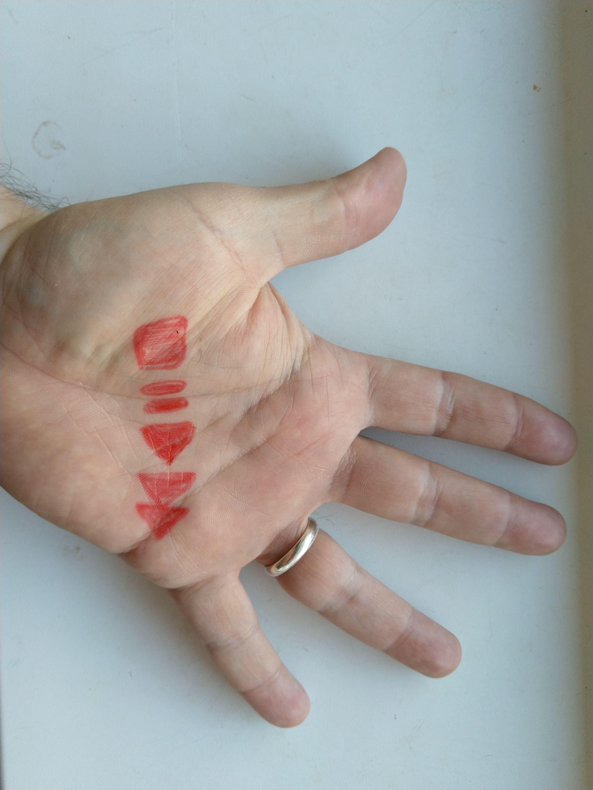

Šestintrideset let pozneje sem spet bolj povezan z gledališčem, in sicer
v mednarodnem projektu z naslovom *Ustvarjaj za povezave -\> Ustvarjaj
za vpliv*, v katerem ugotavljamo, kako umetniške dejavnosti vplivajo na
ljudi in spodbujajo družbene spremembe. V tem projektu imam znova
možnost pogledati na oder in spoznati ljudi v zakulisju, kar me kot
antropologa še posebej privlači. Najbolj pa mi je všeč, da si lahko
ogledam tudi zelo neobičajne predstave. Ena takšnih, ki mi bo za vedno
ostala v spominu, je lani gostovala na festivalu Mladi levi, ki vsako
leto poteka v Ljubljani. Naslov predstave je *V številnih rokah* (angl.
*In Many Hands*), njeno bistvo pa je, da si občinstvo, ki je dejansko
del predstave, podaja iz rok v roke različne stvari -- od najbolj
vsakdanjih do precej ogabnih. Ljudje si vsako stvar lahko natančno
ogledajo in otipajo, morda celo povohajo, preden jo podajo naprej.
Situacija postane še zanimivejša, ko v dvorani ugasnejo luči. Potem
slišiš samo še šuštenje nekega predmeta, ki se ti bliža, ko si ga
sosedje podajajo, in z grozo čakaš, kaj te bo doletelo. »Ne, ne! Bljak!
O, fuj!« se je poleg smeha in krikov slišalo z različnih koncev, ko smo
si v popolni temi podajali stvari. Tudi sam sem se zaradi občutkov,
podobnih tistim, ki jih doživljamo ob gledanju grozljivke, začel
nekajkrat smejati ko ubrisan.

Ko je bilo predstave konec, sem se objokan od smeha in prestrašen od
groze v preddverju srečal z ženo in koordinatoricama omenjenega
projekta, ki so bile med občinstvom. »Tole je bilo pa nekaj najbolj
zabavnega!« sem jim navdušen dejal. Začudeno so me pogledale, ena od
njih pa je rekla: »Ja, smo opazile! No, meni se tole ni zdelo niti
najmanj smešno.« Presenečeno sem jo pogledal: »Res?« Šele mnogo pozneje
mi je razložila, da se ji je zdela predstava predvsem ganljiva,
pretresljiva in meditativna. Isti dogodek sva očitno doživela vsak po
svoje -- in to je tudi bistvo gledališča.

Prav nič smešno pa ni dejstvo, da bomo v takšnih intersubjektivnih
gledaliških izkušnjah v bližnji prihodnosti morda težko sodelovali. Kdo
si bo hotel podajati stvari iz rok v roke, če pa se ne smemo dotakniti
drug drugega? In kdo bo sedel v gledališču in sproščeno spremljal
predstavo, medtem ko se bo nekdo blizu njega useknil v robec? Kakšna bo
izkušnja gledališča v prihodnje, ni jasno niti ustvarjalcem niti
obiskovalcem kulturnih ustanov, od sodelavcev v omenjenem projektu pa že
slišim, da se vse več uprizoritev seli na splet. Številne institucije so
med pandemijo in samoizolacijo omogočile ogled posnetkov predstav, ki si
jih ogledamo na računalniškem zaslonu -- podobno kot film.

Pa je izkušnja gledališča na zaslonu enaka kot v živo? Seveda ne. Če si
ogledamo posnetek, ga lahko prevrtimo naprej in preskočimo dolge pavze,
med katerimi se zgodi bore malo. Te pavze pa so dejansko izjemno
pomembne, in to ne samo v gledaliških predstavah, temveč tudi v
vsakdanjem življenju, kakor ga zapisujemo antropologi. Dolg premor med
pogovorom s sogovornico je lahko povednejši od ure besedičenja; solza v
očeh ali nasmešek v tišini povesta več kot tisoč besed.

Zato menim, da moramo med to dolgo pavzo, v kateri smo se znašli med
pandemijo, iznajti nove načine komuniciranja, ustvarjanja in
raziskovanja, ki bodo ohranili tišino in premore -- pa četudi so ti
včasih mučni in dolgočasni. Prav povezovanje smisla in nesmisla,
dolgčasa in zabave, hitrih in počasnih trenutkov je namreč bistvo
predstave, ki ji pravimo življenje. Namesto da pritisnemo na tipko za
hitro prevrtavanje, se splača občasno pritisniti na pavzo in življenje v
celoti izkusiti.

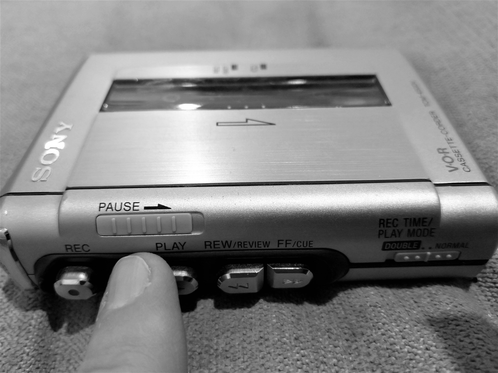

Spet odličen zapis. Sam še pomislim na vse trenutke pričakovanja pred
predstavami oz. pri meni so to (bili) ponavadi koncerti. Se spomnim,
kako si enkrat v srednji šoli pri spisu to opisal s primerom medvedka
Puja, ko si je želel med in bil kar malo razočaran, ko ga je res dobil.
😁 No, zdaj smo sicer pod vtisom karantene in ukrepov in stvari
izgledajo bolj črne, kot so v resnici. Sem pa radoveden, v katero smer
bomo šli.

> Tega o Puju se pa ne spomnim več 🙂 Se pa še vedno strinjam, da je
> pričakovanje pogosto boljše od tistega, kar dobiš. Zato, evo, ostanimo
> še nekaj časa v izolaciji, mogoče je boljše od tistega, kar čakamo
> \...

Zaenkrat si lahko podajamo samo viruse.

Gledališke predstave na ekranu mi ne potegnejo. Niti slučajno. Ni isto!
Pravzaprav ni niti približno podobno (sem gledala eno v trenirki, pa eno
v pižami, heh), ravno zaradi vsega tega vzdušja, akustike, pričakovanja,
odvisno od karte/sedeža, kdo bo sedel poleg tebe \... in \... ravno to,
da moraš zdržat tudi »pavzo« (v predstavi in med predstavo) \... v
pričakovanju, kaj bo sledilo. Se strinjam, pavze morajo biti. Sicer si
jo pa moramo vzeti. Strinjam se sicer tudi s »forward« po pavzi, nikakor
pa ne s »fast forward« -- v tem ni nobene elegance

Bravo za tale, zame tokrat posebej odličen zapis, malce teatrske
nostalgije s pridihom pričakovanj tistega drugega teatra, ki mu pravimo
življenje. 👍

Ta zapis pa je zadetek žebljice na glavico Ne vem, če sem ti omenila,
ampak v Trzinu vodim dramsko šolo, ki združuje mlade igralce iz Trzina
pa tudi iz bližnjih in daljnih krajev že sedem let. Ko se je to
koronasranje začelo, sem bila poleg zaskrbljenosti za družino in
najranljivejših najbolj žalostna predvsem zaradi mojih gledaliških
otrok. Pa sem jih povezala po Zoomu in Skypu in za to navdušila še mojo
sodelavko in imamo hudo dobre spletne urice enkrat tedensko z vsako
skupino. Potem pa do naslednje ure dobijo neko nalogico, dovolj zabavno,
da se jim ne zdi dodatno breme, in nadaljujemo naše spletno druženje. Z
eno skupino se pravzaprav na njihovo iniciativo pripravljamo na spletno
predstavo, samo ugotoviti moram, kako bi to tehnično izvedli In kljub
temu, da pogrešam oseben stik z njimi, je tudi ta izkušnja nekaj
posebnega in gledališče ni izgubilo svojega blagodejnega učinka ne zame
ne zanje! In ti trenutki gledališčenja so zlata vredni, še posebej v teh
časih

Si rekla, ja! Še dobro, da se lahko še vedno družite -- sranju navkljub.

Hihi, se ne pustimo

Velikokrat se spomnim na tvojega očeta Mirota, enega izmed slavne garde
mojih učiteljev, vzornikov in kolegov na začetku moje odrske poti!
Velik, žlahten igralec in krasen človek! ❤️

## 28. dan karantene: Potovanje

Na potovanjih vse bolj trpim. Dolgočasi me potovanje z letalom, utruja
me pakiranje kovčkov, ne da se mi prevoziti več kot sto kilometrov z
avtomobilom, zoprno mi je likati srajce, preden se odpravim na službeno
pot, neumno se mi zdi zapravljati čas na konferenci v tujini, ko bi se
lahko občinstvu oglasil po Skypu ali Zoomu, in to morda kar med sedenjem
na odeji, ki bi jo pogrnil pod drevesom. Kljub temu, da sem se potovanj
precej naveličal, me je danes prijelo, da bi nekam odpotoval -- sam, z
ženo ali z vso družino. Nekam pač. Če ne drugam, pa v sosednjo občino.

Svobodo potovanja želijo na ta sončen dan očitno okusiti tudi drugi.
Prijatelj mi je pred nekaj minutami po WhatsAppu poslal fotografijo
šotora, ki so si ga postavili v atriju svojega pritličnega stanovanja,
da bi okusili nekaj užitkov kampiranja v naravi. »Tole je vaše
prvomajsko potovanje,« je bil komentar moje žene na takšno ustvarjanje
svobode in počitniških užitkov.

Čeprav si želimo potovati, si verjetno težko zamislimo, kakšna bo videti
pot v tujino čez pol leta ali leto. Si bomo upali gnesti se po
letališčih, dihati skupen zrak v letalu in se tlačiti v avtobuse ali
vagone metroja? Bomo po pandemiji več potovali s kolesi in hodili? Se
bomo odpovedali avtomobilom in namesto tega uporabljali javna prevozna
sredstva, v katerih bodo posebni prekati za potnike?

Občutek imam, da smo v tem zanimivem času znašli na razpotju v zvezi s
potovanji in mobilnostjo -- in očitno moramo sprejeti nove odločitve za
prihodnost. Z ženo sva se, denimo, pred pol leta odločila, da se bomo
znebili avtomobila, ko ga bomo končno poplačali. Pred tednoma sva se že
pogovarjala, da v teh kužnih časih morda niso več najboljše razmere za
uporabo sistema za deljenje vozil. No, danes pa sva spet resno
razglabljala o možnosti, da lahko več kolesarimo in se dokončno znebimo
avtomobila, s katerim smo v zadnjem mesecu prevozili manj kot sto
kilometrov.

Kaj se je v kratkem času spremenilo? Delo na domu ni več fantazija,
temveč za mnoge realna opcija. Večerno druženje po omrežjih je postalo
prijetna praksa. Nakupovalni izleti v trgovska središča so, upam, tudi
za našo družino stvar preteklosti. Domnevam, da bom v bodoče bistveno
manjkrat pakiral kovčke in likal srajce pred odhodom na konferenco v
tujini, saj bo ta verjetno potekala po spletu.

Bom v krasnem svetu nove mobilnosti, kot si ga prestavljam, kar koli
pogrešal? Hmmm ... Mogoče le hipec svobode in vznemirljive drugačnosti,
ki odtehta vse potovalne muke in ju lahko užiješ le na tujem.

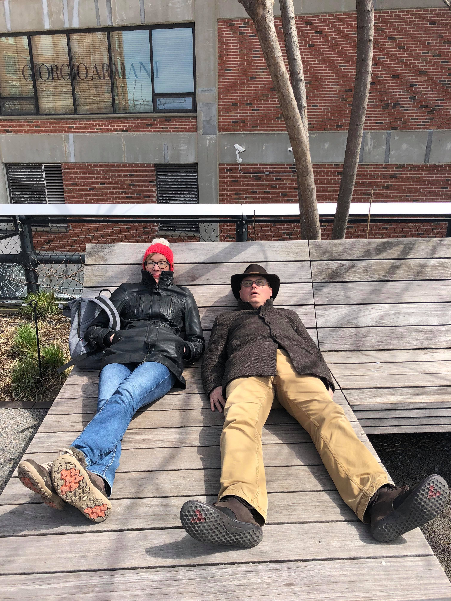

Večerno druženje po spletu je fajn, a ne more nadomestiti druženja v
živo za nas iz predkoronskega obdobja. Old school, pač.

> Tako kot ne more potovanje »s prstom po zemljevidu«, kot smo včasih
> rekli, nadomestiti prave poti.

I was planning to visit you guys pretty soon, maybe this summer. Now
I\'m thinking next year. I'm not walking, but we'll see about
rollerblades 👍😄💛

Would be great to have you here! If you come on rollerblades, even
better!

Pozabi na hormone, za stiskanje na klopcah, kaj klopcah, ležalnikih bo
še dovolj časa! #jelkotegleda (Komentar se nanaša na fotografijo.)

Kot bi se vračali v otroštvo, ko smo imeli okrog blokov dekice za
šotorcke in sanjali o morju. Zdaj ne sanjam več o Portugalski, ampak o
izletu na Kum 😉

Yeah, but that sliver of freedom and exciting otherness that outweighs
the travel torment and can only be enjoyed abroad is pretty damn cool!

Men je prav fajn. Mir, tišina, skor nobenih avtov, nbenga folka. Tko je
kot je bilo v 80-ih. Na šiht še lep čas ne bom šel, men je prav fajn. Če
ne bi bil virus tako morilski, bi si ga večkrat želel. Drgač pa, Dan,
nameni tvojih potovanj verjetno niso zato, da bi se naužil drugih kultur
in pokrajin. Ko boš enkrat začel tako potovati, boš prišel na »žmah« in
se ne boš več ustavil.

Jaz sem optimistična \... Julija gremo na Rodos.

Katerega julija?

5\. julija

Sem mislil, katerega leta

Letos! Mi gremo tak al drugač!

Mi tudi razmišljamo, da bi za 1. maj prestavili prikolico s parkirišča
na trato \...

## 29. dan karantene: Čas za umirjen premislek o odpadkih

»Pa tako dobro nam je šlo!« je po omrežju pripomnila prijateljica, s
katero sva si dopisovala o čudnih navadah med pandemijo covid-19.
Razložila mi je, da je v medčasju, v katerem smo se znašli, spet začela
kupovati več hrane v embalaži. Odgovoril sem ji, da ni edina. Tudi sam
sem se zalotil, da spet kupujem bolj nerazsodno in namenim več
pozornosti izdelkom, ki so na pogled varni pred virusi, kot pa tistim,
ki so prijaznejši do okolja.

Vse to postane še očitneje, ko pritovorim domov ogromne vreče -- v naši
petčlanski družini namreč zdaj nakupujemo le enkrat tedensko, da se
izognemo prepogostim stikom z ljudmi -- in predevam izdelke v kopalno
kad ter jih začnem odvijati, če je mogoče, ali pa jih oplaknem z vodo in
obrišem. Tak nasvet za preprečevanje okužbe sva z ženo namreč prebrala v
nekem dokaj kredibilnem viru na spletu in se ga drživa od začetka
samoosamitve. Kaj je v teh dneh pretirano in kaj ne, o tem raje sploh ne
razmišljava več.

»Pa to ni res!« večkrat rečem naglas, ko v kopalnici odvijam izdelek za
izdelkom in odlagam odpadno embalažo na stran. Iz kartonskega ovitka,
velikega približno 15 x 7 x 5 centimetrov, potegnem vrečko iz celofana,
v kateri je plastičen podstavek s šestimi piškoti, ki bi jih lahko ovili
v dvakrat manjšo embalažo. Takih presenečenj je med nakupljenimi izdelki
ogromno, kup odpadkov sčasoma postaja večji, »olupljena« hrana pa kopni.
Ko zavržem vreči plastike, celofana in kartona, se vedno znova vprašam,
koga imajo živilska industrija in trgovske verige za norca.

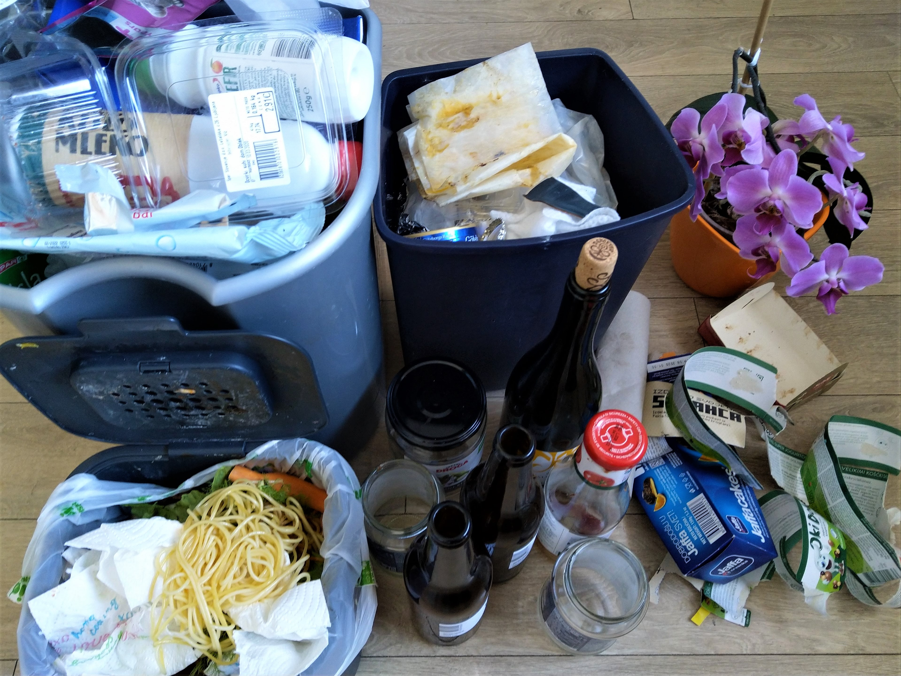

Ni pa vse črno. Pandemija, ki je usekala kot strela z jasnega, ima
ogromno grozljivih posledic, prinaša pa tudi marsikaj dobrega. Med
drugim nam kriza ponuja boljši vpogled v naše vsakdanje navade in
prakse, ki se jih zaradi rutiniranosti niti ne zavedamo več. Ker smo
nenadoma začeli kupovati drugače -- kupujemo, na primer, več izdelkov
naenkrat --, smo postali pozornejši na tisto, kar je bilo prej manj
opazno. Ker preživimo več časa doma, tudi vidimo kup odpadkov, ki se
nabira v gospodinjstvu. In ker doma pripravljamo hrano, natančneje
spremljamo, koliko je konča v smeteh.

Strokovnjaki za mobilnost, s katerimi sem se pogovarjal, so v tem
pandemičnem času izjemno optimistični. Po njihovem pomeni kriza možnost
za prehod k vzdržnejšim oblikam mobilnosti. Tako delavci kot delodajalci
so v zadnjih tednih namreč ugotovili, da je mogoče učinkovito delati
tudi od doma, s čimer se lahko bistveno zmanjša število vozil na cestah
in prihrani ljudem ogromno časa, ki ga sicer izgubijo med potjo na
delovno mesto in vrnitvijo domov. Lastnikov avtomobilov bo tudi zato v
prihodnosti morda manj, več pa si jih bo vozila delilo in se vozilo z
javnimi prevoznimi sredstvi -- predvsem pa bo na cesti več kolesarjev in
pešcev.

Kaj pa se bo spremenilo v zvezi z odpadki? V gospodinjstvih bo
kratkoročno, torej v času pandemije, odpadkov verjetno več, med drugim
tudi zaradi dostave hrane in izdelkov na dom. Spletni nakupi so med
samoizolacijo namreč postali izjemno priljubljeni, kar je pomagalo, da
se je Pošta Slovenije dvignila kot feniks iz pepela, še pred mesecem pa
je stavila na prodajo nesmiselnih artiklov v svojih poslovalnicah -- od
čokoladic v obliki banane do kičastih okraskov. Njihova vozila se pred
večstanovanjsko hišo, kjer stanujemo, ustavijo večkrat dnevno in
odložijo pakete ter zdrvijo naprej, z vsakim izdelkom pa prispe dodatna
škatla ali vrečka. In tu je že nova priložnost, povezana z odpadki. Z
uporabo povratne embalaže bi lahko ljudem olajšali nadležno odvijanje,
mečkanje in odmetavanje škatel ter seveda razbremenili planet.

Priložnosti za premislek je še veliko. Bistveno pa je, da po koncu
ukrepov za preprečevanje okužbe ne zdrvimo nerazsodno naprej -- ali pa
nazaj. Namesto tega lahko v miru premislimo, kaj sploh potrebujemo in
kako lahko tiste, ki živijo od porabništva in ga spodbujajo, prepričamo,
da želimo po novem nakupovati in živeti drugače.

Pri nas smo pa po moje zmanjšali embalažo zadnje čase. V trgovino sploh
ne hodim (razen za očeta ali pa po kakšno pregreho, kot je čaj earl
grey, ki seveda ni v vrečkah), kupujem direkt pri kmetih, tako da je moj
avto poln povratnih zabojčkov. Kar nam kmetje pripeljejo na dom, je v
kartonasti, papirnati ali stekleni embalaži, vrečkah za recikliranje in
sem ter tja kakšni plastiki. Raje poišči na FB, kako do lokalne hrane.
Boš presenečen, kakšne dobrote zamujaš Pa še embalaže se boš v veliki
meri znebil.

> Imamo Zeleni zabojček! Ta ima povratno embalažo -- in odlično
> zelenjavo. Se trudimo tudi sicer poiskati take prodajalce, kjer lahko
> kupimo lokalne reči.
>
> A RIfuzl poznaš? Tam je pa itak vse brez plastike. Še WC papir, ki ga
> noben drug noče prodajati na tak način, čeprav ga delajo v Palomi.
>
> Sama sem glede nabave živil sicer najbolj zvesta Nakupujmo skupaj, že
> od prej, se pa trudim v teh časih preizkusiti še druge možnosti.
> Dobrih razlogov za kopičenje plastike res ni več. Vem pa, da je pri
> nakupovanju za družino vseeno malo drugače.
>
> Se strinjam, da ni pametnega razloga za kopičenje plastike, samo
> opisati sem želel, kako so se stvari tudi tistim, ki se trudijo, malo
> postavile na glavo v tem času. No, za nekatere stvari pa itak upam da
> ostanejo obrnjene na glavo In ja, imaš prav: če bi z ženo kupovala
> samo zase, bi bilo verjetno drugače, imamo pa še tri požeruhe, da
> Mucka niti ne omenjam.
>
> Ja to je pa tudi pri nas največji problem, Pasje konzerve Požeruhov pa
> nimamo
>
> Dan, seveda, razumem, nisem želela moralizirati, tudi meni se je
> marsikatera reč vseeno postavila malo na glavo. Žal tudi brezembalažni
> avtomati JP VOKA SNAGA še ne delujejo ravno brezhibno, čeprav sem se
> jih zelo razveselila. Mački pa res vse še ekstra obrnejo na glavo, moj
> me sili v nakupe hrane v plastiki, in to celo mesa, ki ga sicer v
> gospodinjstvu ne bi bilo!
>
> Čisto res, Dan! Ko zložim vse iz škatel, vrečk, pladenjčkov \...
> (drugače vsega sploh ne morem stlačiti v zamrzovalnik ali omaro), od
> vseh polnih cekarjev, ostane veliko manj, kot je zgledalo v trgovini.
> Jaz se tudi trudim z domačimi izdelki (meso, jajčka, zelenjava z vrta
> moje mami \...) in celo z divjimi rastlinami (koprive, regrat, čemaž
> \...), ampak, glej, zdej k smo doma in vsak dan kuham kosilo, vidim,
> koliko pojemo in koliko embalaže se kljub vsemu nabere \... 😣 Hodimo
> pa zato v najbližjo trgovino in nikamor z avtom. Tankala nisem že
> skoraj dva meseca, ne vem, če znam še avto peljati. 😉😎
>
> Jaz grem vsak dan z Viča s kolesom v Rifuzl in nazaj, tako daleč pa
> res ni Sploh v tem času

Izkazalo se bo tudi, da so komot v nedeljo zaprte vse trgovine.

Še sobota bi bila komot \...

Recimo sobota popoldne, po 13. uri. To pa res komot.

> Prav imaš. Če bomo v trajni nevarnosti obolelosti, bomo tako in tako
> enkrat na teden opravili velik nakup -- ponedeljek 1/4 priimkov, torek
> druga četrtina priimkov, sreda je koronin dan -- dela prost dan,
> četrtek tretja četrtina in petek četrta (kdor mora in more delati od
> doma). Vsi delamo za 80 odstotkov. Imam pa še en »polovični« plan --
> polovični delovni čas -- pol leta dela ena polovica populacije, druge
> pol leta druga \... 😉
>
> Prisegam na normalo slej ko prej. Vidim, da se iz mojega prejšnjega
> posta ni dalo razbrati cinizma in insinuacije na neke druge čase. Tudi
> jaz v resnici upam vsaj na povrnitev prejšnjega stanja ali pa še kaj
> boljšega \... 👍😀

Pri nas pa zdaj, ko je problem z nakupovanjem hrane, pojemo tudi
plastiko, tako da nimamo več odpadkov.

> Mi pa pojemo samo iverne police v špajzi. Z bučnim oljem so dobre,
> sicer malo suhe.
>
> Škoda polic, rajši se smučk lotite, teh zdaj ne boste rabili. Sicer se
> pa da vse začiniti z nekaj peska in trave iz okolice. Pa na smrdokavro
> ne pozabi -- z malo klinčki bo prav slastna.

## 30. dan karantene: Aleluja

Z avtomobilom sem se pripeljal pred sedež vlade in poklical telefonsko
številko osebe, s katero sva bila dogovorjena za prevzem. »Policist me
gleda,« sem mu rekel, »zato bom napravil še en krog.« »Prav,« mi je
odgovoril raskav moški glas, »čez minuto bom ob cesti.«

Odpeljal sem, zavil trikrat levo in znova prispel na dogovorjeno mesto.
Ustavil sem ob cesti in prižgal vse štiri smerokaze. Gledal sem naokoli,
kje je neznanec, s katerim sem govoril po telefonu. V vzvratnem ogledalu
nisem videl nikogar. Cesta je bila povsem prazna, na pločniku ni bilo
žive duše.

S sovoznikovega sedeža sem pobral telefon in hotel znova poklicati, ko
je potrkalo po steklu. Zdrznil sem se in zagledal moškega srednjih let
in mišičaste postave, vlekel je za ročico in skušal odpreti vrata, a jih
ni mogel, saj so bila zaklenjena. Pritisnil sem na tipko za odklepanje
in mu omogočil dostop. Na široko je odprl vrata na sovoznikovi strani in
na sedež položil papirnato vrečko. »Tule je,« je dejal in mi pomežiknil.
»Najlepša hvala,« sem z nasmeškom odvrnil in dodal, da greva naslednjič
na pivo. »Nujno!« je rekel in dvignil palec. Nisem vedel, ali to pomeni,
da bova spila eno pivo ali da je vse v redu. Kljub temu sem mu pokazal
isti znak z roko in odpeljal.

Skušal sem zbrano voziti, a misli so mi ves čas uhajale k vrečki. Vedel
sem, da je roba prispela od daleč in da je prečkala občinske meje.
Privlačila me je, zavedal pa sem se, da mi lahko škodi.

Pripeljal sem pred hišo, vrečko vzel iz avta in jo nesel na hodnik ter
jo odložil pred vhodnimi vrati. Pokukal sem vanjo in v hipu mi je
postalo jasno, da me čaka težaško delo. Odšel sem v kuhinjo in vzel nož
ter se vrnil na hodnik. Iz papirnate vrečke sem potegnil manjšo
plastično vrečko, ki je bila prelepljena z lepilnim trakom. Nestrpno sem
ga skušal strgati s prsti, a ni šlo, zato sem vzel nož in -- sek! --
prerezal trak. V vrečki je bilo pet zavitkov, vsak je bil zavit v
celofan, in še paket sumljive podolgovate oblike, ki je bil zavit v
aluminijasto folijo.

Vseh šest paketov sem nesel v kuhinjo in jih razporedil po pultu.
Čudovit prizor! Sklonil sem se bližje in povonjal. Mmmmm! Po telefonu
sem poslal sporočilo mami: »Najlepša hvala za velikonočno presenečenje!«
Že čez nekaj minut mi je odpisala, naj nam dobrote teknejo, in
pripisala: »Aleluja!«

Tri dni pozneje so paketi precej načeti. Zavedam se, da mi škodijo, a se
jim ne morem upreti. Posledice so vidne. Danes, na primer, mi je počil
pas. Kaj bo šele jutri?

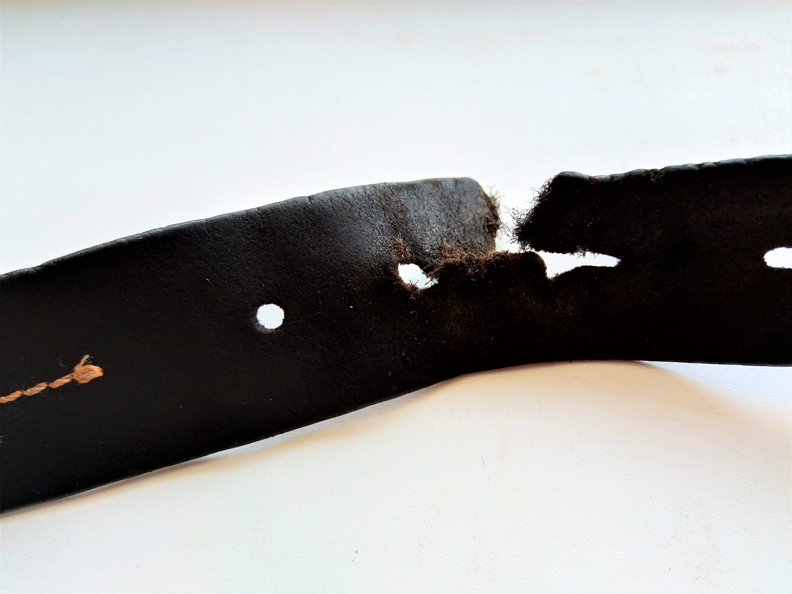

Mama in vlada. Nevarno. 😉

Teh prigod se bo pa kmalu nabralo za eno luštno knjigco

Mama je ena sama. Pozdravček mami. Vsem pa lepe praznike.

Pa naj še kdo reče, da mame niso vsemogočne 🙂

Čista kriminalka! 😂👌

Haha, se bere kot kriminalka. Sem mislil, da si Pablo the 2nd postal

Bravo, mama! Vam vsem in njej želim lepe praznike.

## 31. dan karantene: Kava in knjige

Kava in knjige sta edina »privilegija«, brez katerih ne bi zdržal v
karanteni. Kave nam je ravno danes zmanjkalo in smo jo potem šli iskat k
ženini mami in očetu, ki na srečo živita v isti občini, zato kontrabant
tokrat ni bil potreben. V času, ko so knjižnice zaprte, imam po mobilni
aplikaciji zagotovljen tudi reden dotok zvočnih knjig, ki jih poslušam
med gospodinjskimi opravili. Skratka, v osami se ne morem posebej
pritoževati.

Ker si zadnja štiri leta ob vsaki prebrani -- ali preposlušani -- knjigi
zapišem nekaj vtisov, sem sklenil, da pregledam zapiske in pripravim
izbor knjig, ki najbolj »teknejo« v karantenskem času. Izpustil sem
poljudno-znanstvena dela, ki jih imam sicer najpogosteje na meniju, in
raje izbral romane, biografije in zgodovinske knjige. Mnoge med njimi so
skrajno morbidne, izbral pa sem jih namenoma. Najprej zato, ker se po
branju počutim bolj optimistično, ko se zazrem v lasten vsakdanjik,
poleg tega pa še zato, ker se ob njih zamislim, kako hitro v kritičnih
situacijah, kakršna je sedanja, zatavamo v temo -- kot posamezniki in
tudi kot globalna skupnost.

**1. Barbara Demick, *Ničesar ne zavidamo: Vsakdanje življenje v Severni
Koreji*** (angl. *Nothing to Envy: Ordinary Lives in North Korea*). To
knjigo bi moral prebrati vsak, ki zjutraj vstane, poje zajtrk, sede v
avto in se odpelje v službo (ali pa v teh dneh dela od doma), zvečer pa
tarna, kako je svet krut. Opis polpretekle situacije v Severni Koreji je
morda celo grozljivejši od knjig o nacizmu. Tisti nori čas je imel vsaj
konec, medtem ko ni videti konca grozi v tej »demokratični« državi, ki
obstaja že sedem desetletij.

**2. Moby, *Porcelan*** in ***Potem je vse razpadlo*** (angl.
*Porcelain* & *Then It Fell Apart*). Fenomenalna dvodelna biografija
glasbenika, ki sem ga poznal po glasbi, knjigi pa ga predstavljata kot
večplastnega človeka: vegana, zagovornika pravic živali, ozdravljenega
alkoholika ... V knjigi *Porcelain* predstavi svoje desetletje vzpona,
in sicer od leta 1989 do 1999, v *Then It All Fell Apart* pa opiše
mladost in pozna leta. Odličen zapis Melvillovega sorodnika (da, prav po
romanu Moby Dick, ki ga je napisal njegov pra-pra-prastric, je dobil
ime), ki v melanholičnem slogu razkriva svoj vsakdanjik. Ob branju
postane jasno, kako se v življenju slavnih prepletata blišč in beda.

**3. Anna Funder, *Zloglasni Stasi: Dokumenti in izpovedi obeh strani***
(angl. *Stasiland: Stories from Behind the Berlin Wall*). Knjiga me je
pretresla še bolj kot *Nothing to Envy*, in sicer zaradi kulturne in
geografske bližine Vzhodne Nemčije, ki je skušala biti -- tako se zdi --
bolj papeška od papeža, namreč od Sovjetske zveze. Vzhodnonemški prijemi
za nadziranje in brzdanje državljanov so bili posebej grozljivi, ker so
bili utemeljeni na birokratskih odločitvah, te pa so lahko okrutnejše od
grobe sile. Mrtev mož, ki si ga je družina lahko ogledala od daleč, za
steklom, da ne bi videli poškodb na truplu ... Ločitev pod prisilo ...
Onemogočenje staršem, da bi videla otroka, ki je »obtičal« v
zahodnoberlinski bolnišnici ... Groza, groza, groza.

**4. Isa Mazzei, *Kamernica*** (angl. *Camgirl*). Surova pripoved o
mladi ženski, ki se začne slačiti pred kamero in pri tem vse bolj uživa.
Od nedolžnega razkazovanja med klepetom preide k surovejšemu ravnanju,
na primer k bičanju, šeškanju in davljenju, in doživlja največ
zadovoljstva ob pogledih z druge strani kamere. Največja dragocenost te
knjige je, da odstre pogled v zakulisje pornografske industrije, ki vse
bolj temelji na prodajanju zasebnosti in intime običajnih ljudi.

**5. Max Brooks, *Svetovna vojna Z: Ustna zgodovina vojne proti
zombijem*** (angl. *World War Z: An Oral History of the Zombie War*). Ta
postapokaliptični roman bi moral postati temeljni priročnik za
antropološko delo, saj izvrstno opiše načelo, da je pri raziskovanju
pogosto bolje manj spraševati in več poslušati. Zgodba, ki jo predstavi
Brooks, je spletena iz večglasne pripovedi ljudi, ki s sinhrone in
diahrone perspektive razložijo, kako so doživeli svetovno vojno proti
zombijem. Če že ne knjiga leta, pa vsaj knjiga karantenskega časa!

**6. Yann Martel, *Pijevo življenje*** (angl. *Life of Pi*). Zgodba o
»samoosamitvi« na rešilnem čolnu v tigrovi družbi je napisana
fantastično -- in to v obeh pomenih besede. Stvarno in izmišljeno,
resnično in navidezno se pomešajo v nenavadno, a okusno godljo. Konec
zadene v živo. Na zadnjih straneh namreč ugotovimo, da je včasih bolje
ostati v izmišljiji kakor razkriti resnico.

Tako! Čas je za kavo! Takšno seveda, ki je vizualno primerna za omrežja.

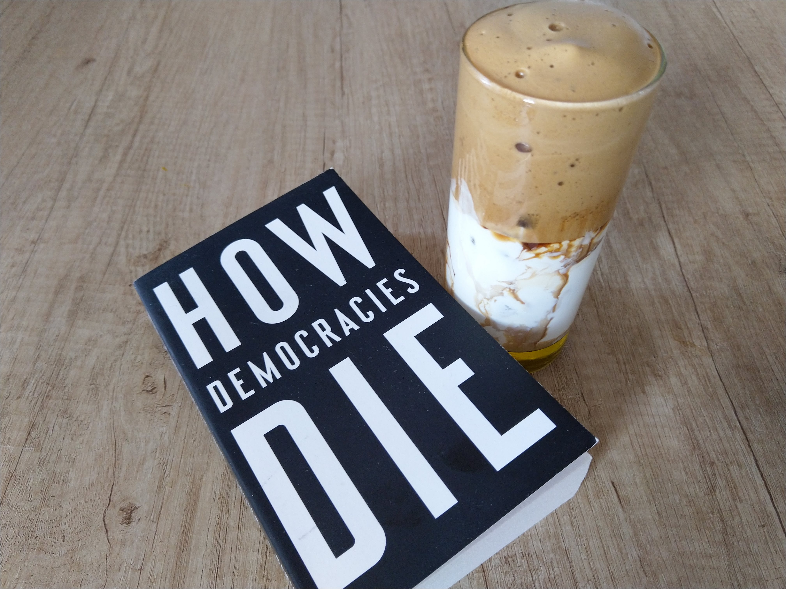

A zraven imaš pa dolgona kavo? 😉 🙂 😋

> Seveda. Zaradi prijateljev na Instagramu Pa zato, ker smo dobili
> instant kavo, ki jo potrebuješ za ta napitek. S turško si je ne
> predstavljam -- bi se moral verjetno preglodati čez zgornjo plast.
>
> Ja, meni je prijateljica povedala, da je ta kava zdaj hit, in sem si
> šla kupit instant kavo. Meni je samo malo presladko, ker pijem grenko
> kavo.

Naredi si coretto

Si dal nekaj idej, hvala. Sama čisto brez, pa mi manjka branje.

Daj še ti kako. Meni tudi zmanjkuje!

> Si že bral Liščka? Donna Tart. Sem sicer kar nekaj čtiva načela,
> navdušilo me je bolj malo. Mogoče Kompas, M. Enard.
>
> Čudno obdobje, tudi v bralnem smislu

Jaz takšnih knjig ne morem brati. Mi vzamejo vso voljo do življenja.

> Vse pa niso zamorjene. Zadnja je prava poezija optimizma. Bom morda
> napravil še izbor nemorbidnih knjig za karantenske čase 🙂
>
> Ja, zadnja je res izjema. Zato sem jo pa tudi prebrala

Zanimiva informacija iz prve roke: v Italiji bodo počasi začeli odpirati
ustanove. Med prvimi bodo knjižnice, kar zelo pozdravljam. V Sloveniji
bomo tudi začeli odpirati ustanove, med prvimi bodo tudi avtomehanične
delavnice. O knjižnicah ne duha ne sluha. Dovolj zanimivo za
komentiranje s tvoje strani? 🙃😉🤗

> Avto nam stoji že en mesec, servisa ne potrebuje. Otroci pa nujno
> potrebujejo novo zalogo knjig. Naše prioritete so jasne, državne so
> očitno drugačne.

MKL ima za nekatere skupine ljudi dostavo knjig tudi domov 🙂 Pa založba
Sanje ima razprodajo knjig po hecnih cenah. Tvoja kava izgleda prav
hedonistično! Ko ti bo zmanjkalo idej za objavo, napiši kaj o njej 🙂

## 32. dan karantene: Smeh je pol zdravja

»Spusti me noter, kreten!« je nekdo vpil pri vhodu veleblagovnice. Za
hip sem zastal med odlaganjem hrane na tekoči trak in pogledal
prodajalko, ki je bila pod zaščitno masko prepotena in zadihana od
nenehnega prestavljanja artiklov. »Tale se je pa razjezil,« sem ji
rekel. »Ja, vsak teden pride,« mi je pojasnila. »Verjetno zato, da nam
ni dolgčas.« Spogledala sva se skoz zaščitno pleksi steklo ob blagajni,
ki so ga namestili pred nekaj tedni, in prasnila v smeh. Njena pripomba
niti ni bila posebej smešna, ampak očitno sva oba potrebovala trenutek
smeha, ki je prerezal napetost. Ljudje z maskami, ki so stali za nama,
so naju od daleč gledali in bili vidno presenečeni.

Smeh in komedijo tudi sicer izjemno cenim. Verjetno sta mi blizu tudi
zaradi očeta, ki je bil kot igralec najboljši v komičnih vlogah. O
njegovi službi se nisva dosti pogovarjala, mi je pa vseeno razložil, da
je komedija zahtevnejša od tragedije. »Vsak je lahko na odru tragičen,«
mi je nekoč zaupal, »redki pa znajo ljudi spraviti v smeh.« Komičnost je
bila zanj po eni strani vrlina, po drugi pa obrt, ki se je lahko
priučimo.

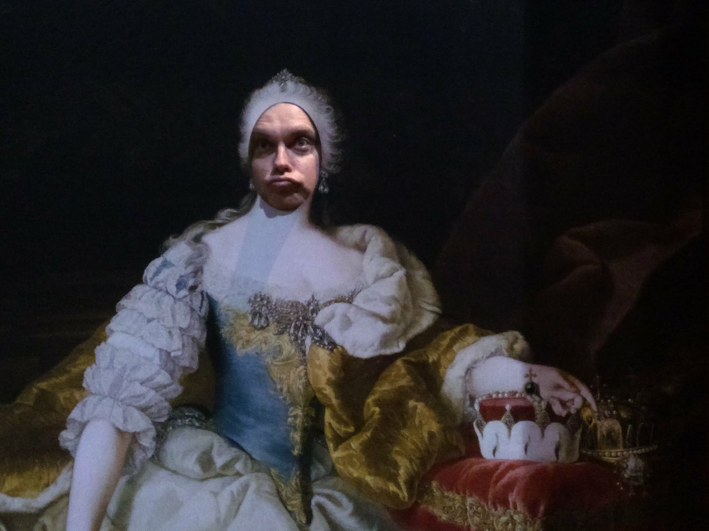

Pri smehu je zanimivo, da privre na plan v najnenavadnejših okoliščinah
-- ponavadi takrat, ko bi morali ostati resni. Takšno situacijo je pred
kratkim opisal igralec Val Kilmer, ki je preboleval raka na grlu.
Pripovedoval je, kako se je nekega dne zbudil pri prijateljici, pevki
Cher. Videti je bilo kakor v prizoru iz filma *Boter*, je povedal, saj
je bila postelja vsa krvava od njegovega bruhanja. Poklical je
gostiteljico, da ga je peljala v bolnišnico. Medtem ko so ju sprejeli,
si je Cher ogledovala čednega bolničarja, kar je Val opazil in ji
namignil z obrvmi: »Opa, opa!« Oba sta se začela režati kot pečena
mačka, in to kljub temu, da je bil igralec videti kot kaskader iz filma
*Stekli psi* (angl. *Reservoir Dogs*), torej krvav od nog do glave. Smeh
sta v tistem groznem trenutku preprosto potrebovala.

Podobno sva z ženo komaj zadrževala smeh med poročnim obredom, ko naju
je zdolgočaseni matičar med praskanjem po kolenu z osladnim glasom
spraševal, ali vzameva drug drugega za moža in ženo. Ko smo s pričo
stopili iz poročne dvorane, smo vsi skupaj prasnili v krohot. Še danes
ne vem točno, zakaj in čemu smo se takrat smejali, ampak v svečanem
trenutku, ko bi morali biti resni, se je položaj vsem zdel neznansko
smešen.

Podobno mi gre zadnje čase pogosto na smeh, ko spremljam predstavnike
oblasti, ki z mrkimi izrazi na obrazu opozarjajo, da so razmere resne.
Seveda so resne. Mislim, da se tega zavedamo prav vsi, a ravno zaradi
tega se je treba tudi smejati in zabavati in prebiti mrakobnost, podobno
kakor je to storila novozelandska predsednica vlade, ki je na tiskovni
konferenci povedala, da vlada velikonočne zajčke in zobne vile šteje med
nujno potrebne socialne delavce, ki pa imajo lahko v teh dneh nekaj
težav z dostavo daril. Priznam, ob tej uradni izjavi so se mi med smehom
orosile oči.

Kot je Umberto Eco namignil v romanu *Ime rože*, bi lahko bil drugi del
Aristotelove *Poetike*, ki se je nekje izgubil, posvečen ravno komediji.
Morda je prav ta manjkajoči del spisa, ki opisuje oblike in bistvo
književnosti, pomemben za današnji čas, ko smo pričevalci globalne
tragedije. Podlage za smeh je -- tragediji navkljub -- med ljudmi
veliko, na kar nakazujejo memi in šale, ki krožijo po spletu bolj kot
kadar koli prej. Tragedijo si očitno prizadevamo uravnotežiti s
komedijo, nadležno situacijo pa se trudimo omiliti s smehom, ki je --
saj vemo -- pol zdravja.

Pri tejle fotki se je težko osredotočiti na besedilo

Najhuje je v trenutkih, ko je treba biti resen, pa te neustavljivo vleče
smejati se. Teh trenutkov je bilo v mojem življenju kar nekaj \... V
službi, v šoli in celo tu in tam na pogrebih.

Ja, res. Najbolj hecno je, ko so ljudje ceremonialno resni.

## 33. dan karantene: Dr. Google

»Kreh, kreh!« sem navsezgodaj suho zakašljal. Sranje! Očitno sem ga
vendarle staknil, in to vsem ukrepom navkljub -- od vestnega pranja in
razkuževanja rok do nošenja maske v trgovini in doslednega izogibanja
stikom. Bi se splačalo k zdravniku? Eh, bom raje še malo počakal ...
Zdaj ni čas za to.

Obiskov pri zdravniku sem sicer vajen od malega. V prvem razredu osnovne
šole sem namreč dobil škrlatinko, ki je zdravniki niso pravočasno
odkrili in zdravili. Posledica je bil miokarditis, kot se strokovno reče
vnetju srčne mišice. Najprej sem moral biti nekaj mesecev doma, v
karanteni, šolal pa sem se -- tako kot moji otroci danes -- kar na domu.
Da ne bi znova zbolel, sem začel takrat dobivati antibiotike. Po letu
dni dnevnega goltanja tablet so mi zdravniki življenje nekoliko
poenostavili. V zdravstveni dom sem šel zgolj enkrat mesečno in prejel
injekcijo *extencilina*, kot se je reklo pripravku, ki so mi ga
vbrizgali v zadnjo plat. Injekcij sem bil tako navajen, da po nekaj
letih nisem več niti trznil, ko so me zbodli z iglo.

Po sedemnajstih letih pikanja sem končno prenehal dobivati injekcije.
Takrat so se mi začele dogajati čudne reči. Če sem bil prej več kot
desetletje in pol pretežno zdrav, je kar naenkrat šlo vse narobe. Na
koži sem dobil lišaje, boleti me je začela glava, vrtelo se mi je, peklo
me je grlo ... Glavni razlog je domnevno bil, da sem si moral po
dolgoletni penicilinski zaščiti pridobiti imunsko ravnovesje. Poleg tega
je šlo verjetno tudi za psihološki učinek: brez redne doze penicilina
sem se počutil precej nebogljen in nezaščiten. Morda sem tudi zato
večkrat mesečno prišel k zdravnici in ji predstavil svojo novo bolezen,
ki sem jo odkril z brskanjem po različnih virih. Že takrat mi je bil v
pomoč dr. Google, ki je sicer šele dobro nastal, a je znal odlično
prepoznati bolezenske znake in postaviti diagnozo. Nekega dne sem tako
ugotovil, da me je doletelo najstrašnejše, zato sem se nemudoma naročil
na pregled.

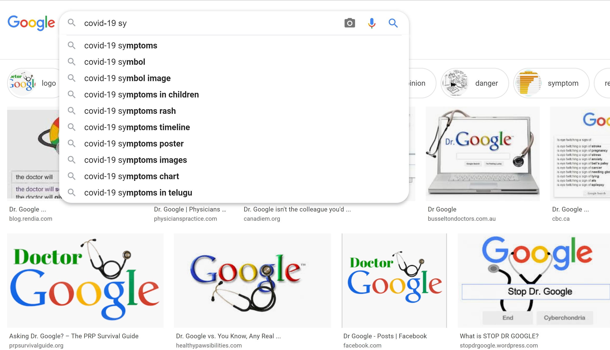

»Kaj bo tokrat dobrega?« se je nasmejala zdravnica, ko me je spet
zagledala med vrati. Poleg nje je tiho sedela mlada pripravnica s
kemičnim svinčnikom v roki in zapisnico pred sabo. Sedel sem na stol,
glasno zavzdihnil, sklonil glavo in skrušeno dejal: »Primarna biliarna
ciroza.« Skoraj dva tedna je trajalo, da sem si diagnosticiral to
avtoimuno obolenje, ki se kaže s simptomi, kot so utrujenost in
srbečica, spoznamo pa jo tudi po rumenkastih znamenjih ob očeh.
Zdravnica in pripravnica sta se spogledali, potem pa sta me obe naenkrat
resno pogledali. »In kako ste to ugotovili?« me je vprašala zdravnica.
»Brez problema!« sem ji rekel, zdrdral simptome, ki sem se jih naučil na
pamet, kot kronski dokaz pa sem s kazalcem pokazal na znamenje, ki ga
imam še danes ob očesu. »Aha,« je pokimala zdravnica, pripravnica pa je
tiho nekaj zapisala.

Nekaj let zapored sem si diagnosticiral še kup drugih nenavadnih in
redkih bolezni ter večkrat obiskal zdravstveni dom. Pred približno
desetletjem in pol pa sem povsem prenehal hoditi tja. Očitno se mi je
imunski sistem znova okrepil, kolesca v glavi pa so mi tudi stekla brez
preskokov. Zdravje sem postavil na stranski tir in zato očitno postal
zdrav -- vse do danes.

Potem pa iznenada pride tale čas, ko se -- tako se mi včasih zdi --
pogovarjamo samo še o bolezni in zdravju. Že zjutraj, recimo, najprej
preverim, koliko je obolelih doma in po svetu, ter preberem novice o
tem, kdo od slavnih je čez noč umrl. Prebiram tudi nesmiselne nasvete,
kako se ubraniti koronavirusa, denimo z grgranjem tople vode in pitjem
sveže iztisnjenega limoninega soka na tešče. Potem po omrežjih naletim
na preprost preskus, ki naj bi ga priporočala Univerza Stanford in s
katerim zlahka ugotovite, ali ste oboleli za covid-19: globoko vdihnete
in zadržite sapo za deset sekund. Če medtem ne zakašljate, ste zdravi,
sicer ... (Mimogrede, ta test je popolna izmišljija, omenjena univerza
pa nima nobene zveze z njim.)

Poleg lastnega stanja moram zdaj spremljati še družinske člane in budno
opazovati, ali kateri od otrok pokašljuje in ali mu teče iz nosa kar
tako ... ali pa je morda kaj hujšega. Ko žena kihne ali zakašlja, napol
v šali nemudoma rečem: »Aha!« In še celo naš Mucek se mi zdi občasno
sumljiv, posebej odkar sem prebral, da se lahko s koronavirusom okužijo
tudi mačke.

Pandemija je pri meni očitno na površje izbezala tisto, kar sem pri sebi
potlačil in mi je sicer dobro znano: skrb za zdravje. Na srečo sem se
svoje hipohondrične težnje naučil precej dobro prepoznati in jih vsakič
znova potlačiti. Večji problem pa je, da zagotovo nisem edini, ki je v
teh dneh obremenjen s preučevanjem simptomov in opazovanjem sebe in
drugih.

In kaj lahko storimo? V normalnem času bi verjetno šli k zdravniku po
nasvet, a danes to ni najpreprosteje. Žena je, na primer, ravno danes
klicala zdravstveni dom več kot šestdesetkrat, in to neuspešno, potem pa
se je odpravila tja in dobila recept za antibiotike kar brez pregleda.
Kaj pa nam še preostane, ko potrebujemo nasvet bolj od zdravil? Dr.
Google, seveda. Ta ima ordinacijo odprto noč in dan.

Izmišljeni test, ki ga omenjaš kot stanfordskega, je meni prišel pod
tipke sicer tudi kot test neke singapurske in kitajske univerze. Sicer
pa sem ravno prej pri Mucu opazila rahlo vneto oko in se močno
zadržujem, da ne grem brskat za simptomi koronavirusa pri mačkah \...

\...predstavil svojo novo bolezen

V bistvu smo alergični \... in se tako odzivamo 😉

Ti pa si pacient

Pacient -- trpeči človek, tako da ja.

Vsi smo sedaj takšni, vsaki kašelj, vsako kihanje je kar naenkrat že kar
simptom za korono ...

Zdrži! Jaz si kar propolis špricnem v grlo, če zakašljam -- zihr je
zihr! 😅😁

## 34. dan karantene: Sprosti se

Prvič po dolgem času sem se na sprehodu -- če lahko tako imenujem izlet
do mlekomata -- počutil povsem sproščeno. Sonce je sijalo skoz krošnje
dreves, ulice so bile prazne, tako da mi ni bilo treba odskakovati od
sprehajalcev, popoldanski hlad pa mi je zbistril misli.

Redki posamezniki, ki sem jih uzrl med potjo, so se mi zdeli veseli in
brezskrbni. Neka ženica, na primer, se je sklanjala skoz okno stanovanja
v prvem nadstropju, žvečila kos kruha in se ozirala naokoli. Blizu
mlekomata sem videl ženski, ki sta stali precej daleč narazen, ena od
njiju pa je imela masko na obrazu. Sproščeno sta kramljali, kakor da bi
vse bilo v najlepšem redu. Kot bi bil, recimo, običajen in prijeten
postapokaliptični dan.

Sprostili so se tudi vozniki, ki jih je bilo na cesti bistveno več kot
pred tednom, zazdelo pa se mi je celo, da vozijo bolj sproščeno, manj
previdno. Ko sem čakal pred semaforjem, je mimo pridrvel motorist, ki je
v trenutku zanosa divje pospešil, da je zaropotalo in se pokadilo za
njim. Zdel se mi je radosten in sproščen. Dolgo sem gledal za njim, ko
je izginjal med bencinskimi hlapi.

Po slušalkah, ki sem jih imel na glavi, sem med sprehodom poslušal radio
in premišljal, da so se sprostili celo mediji in začeli poročati še o
drugih temah, ne le o pandemiji. Radijski voditelj, s katerim sva pred
skoraj dvema tednoma resno razglabljala, kako smo v tem čudnem obdobju
postali bolj zategnjeni in kako se izogibamo stikom, je tokrat zvenel
čisto drugače, bolj sproščeno. Ne le da je zbijal šale. Zbil je celo
steklenico, ki se je zakotrljala po radijskem studiu. Niti to ga ni
zmedlo. Še naprej je lahkotno zabaval ljudstvo.

Med poročili sem potem slišal, kako so se danes sprostili naši
oblastniki, vključno s predsednikom republike in obrambnim ministrom, in
na skupinskem »sprehodu« ob slovenski južni meji, ki jo nameravajo
dodatno obdati z zaporami, kramljali brez zaščitnih mask na obrazu. Že
prej sem po spletu videl fotografijo, na kateri jih je, takole čez
palec, v skupini hodilo približno petnajst, kar ni ravno v skladu z
vladnimi odloki, ampak -- hej! -- med sprehodom ob reki in med drevjem
smo lahko manj zadržani, če nas le ne napade krokodil. Aja, pa saj teh v
Sloveniji ni! Še sreča. Torej se lahko povsem sprostimo.

Kako se lahko sprostimo tudi med pandemijo, je vrhovni poveljnik vojske
in predsednik republike pokazal že pred tedni, ko je »čilal« na soncu in
si kopičil vitamin D, včeraj pa je stopil še korak naprej in za
sprostitev pripravil še podoknico ob velenjskem domu starejših občanov.
Z milozvočnim petjem po megafonu je na balkone privabil približno
trideset ljudi, med katerimi številni niso imeli maske. Stali so tesno
drug ob drugem, se zibali in ubrano prepevali pesem Dan ljubezni, ki jo
je predsednik v objavi na svojem profilu na Instagramu razglasil za
»himno boja proti koronavirusu«.

Ko sem se vrnil s sprehoda, so bili tudi doma vsi sproščeni. Žena je
telovadila in zraven glasno prepevala, otroka sta snemala neke filmčke
in se smejala kot ubrisana, maček pa je »čilal« na stolu v kuhinji.

Od vse te sproščenosti se mi je po glavi začel vrteti refren znanega
hita iz osemdesetih let: »Relax, don\'t do it when you want to go to it
...« Prvič v življenju sem začel premišljati o besedilu te pesmi, ki smo
se jo med poskakovanjem nekoč drli po klubih, in dojel bistvo: če želiš
nekaj storiti, se sprosti in tega ne stori. Res, času primerno! Morda bo
v to smer naravnan naslednji uradni odlok: sprosti se, če ne jih boš
dobil s pendrekom po zadnjici v slogu videospota skupine Frankie Goes to
Hollywood.

No, torej? Smo že kaj sproščeni?!

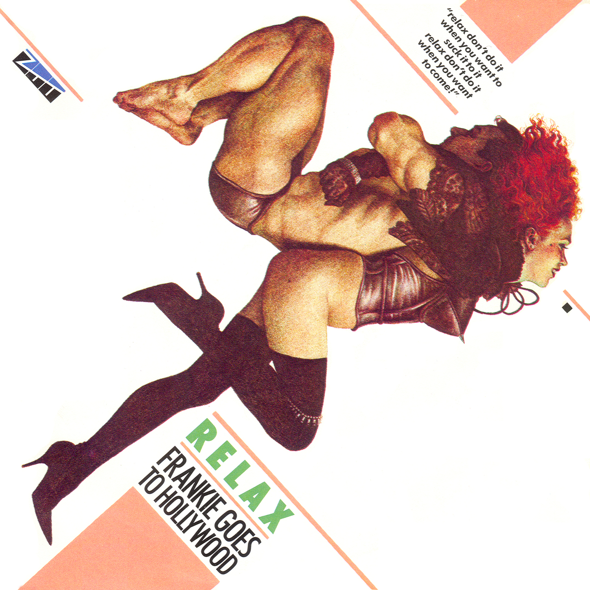

Zanimivo. Jaz se grem po spletu naključij opazovanje z udeležbo v
proizvodnji. In sem ravno danes razmišljala, kako se čuti nesproščenost.
Nazaj smo drugi dan po enomesečni karantenski pavzi. Z maskami, ki jim
pravijo nagobčniki, z rokavicami itak in še očala imamo. Samo čakam, da
bo kdo ugotovil, da smo tako bolj produktivni, ker bolj molčimo med
delom (itak je težko razumeti koga, ki kaj reče z masko) in da bodo delo
z maskami podaljšali tudi v čase, ko bomo nekoč prekuženi \... Bi se
dalo res pisati marsikaj \... Plus, ker ni javnega prevoza, moramo priti
na delo s svojim prevozom, ampak po dve osebi v avtu, niti slučajno več
\... Imeti moramo, jasno, maske, ampak logike pa ni, če lahko dva, zakaj
potem ne tudi recimo trije \...

Deklina zgodba se piše.

> Zakaj samo dva v avtu? Kje je to določeno? In ker ni javnega prevoza,
> ali vam bodo sedaj za prevoz dali kilometrino, polno seveda? Čisto
> tako me zanima, kako se ti problemi rešujejo v praksi.
>
> Ja, dobili bomo plačan prevoz, koliko točno, ne vem. Da pa lahko
> delodajalec določi kako priti, s koliko ljudmi v avtu, pa tudi mene
> čudi \...
>
> Po mojem lahko kvečjemu priporoča. Srečno!
>
> Po mojem tudi, ampak ljudje ubogajo \...

Haha, Dan, kje si ti ta komad našel. Tole je fakt o besedilu te pesmi:
The song is essentially a guide to delaying ejaculation. To throw
censors off the scent, when Relax first came out, the band claimed
publicly that it was written about "motivation." Later, they confessed
it was actually about "shagging." Pa kakšno mrho ima na odru

Meni je pa čudna nesproščenost frizur naše vladajoče elite. Vsi so lepo
postriženi in urejeni. Za boga kako jim to uspeva? Jaz sem že cel
zaraščen.

> Morda imajo frizerje vsi v krogu družine? (Gliha skup štriha ali povej
> mi, s kom se družiš, in povem ti, kdo si.)

## 35. dan karantene: 7 x 8 = ?

Ko sem bil mlajši, mi je šla na živce, danes jo pogrešam. Vsak dan jo
gledam skoz okno in čakam, kdaj bo spet dostopna. Šola namreč.

S sinom sva jo danes obiskala, saj sva posnela kratek film z naslovom
Moja pot v šolo. No, pravzaprav bi morala posneti njegov govorni nastop,
na katerem bi pojasnil, kako gre v šolo. Ker stanujemo zraven šole, pa
se je odločil, da bo govor povedal kar med potjo. »Moj dan se takrat, ko
ni karantene, začne takole ...« je začel razlago na hodniku naše hiše.
Nato je zdrvel po stopnicah, stopil skoz vhodna vrata, stekel nekaj
metrov, in že sva bila pri zadnjih šolskih vratih. Skoznja ga učitelji
ne spustijo, je povedal, če pa bi ga, bi bila njegova pot v šolo
polovico krajša.

Pot sva nadaljevala ob šolski ograji. Stopal sem po pločniku, on pa po
ozkem pasu trave, po katerem gre -- no, je šel -- navadno v šolo. Še
enkrat sva zavila in se znašla pred zaprtimi vrati šolskega poslopja.
Pogledal me je in stresel z glavo, saj so mu dolgi lasje silili v oči.
»Ko pridem v šolo, zavihtim torbo z ramen in si obujem copate,« je
povedal z resnim izrazom na obrazu, pogledal v kamero telefona, ki sem
ga držal, in dodal: »No, to je konec!« Ustavil sem snemanje, obrnila sva
se in odšla v prostore, kjer dejansko poteka šolanje. Domov.

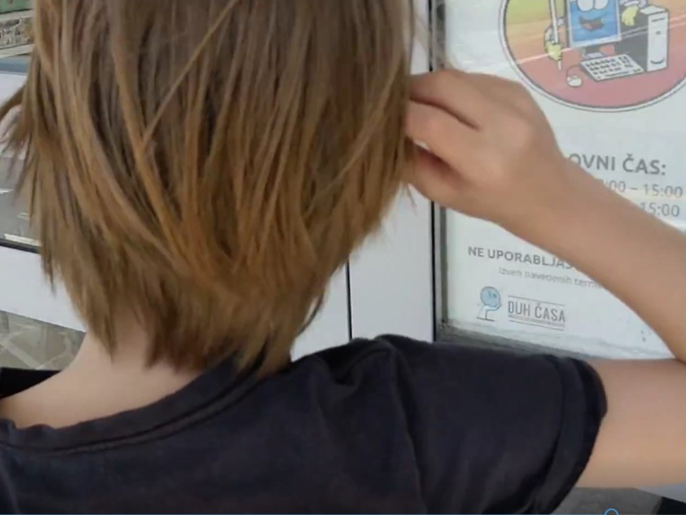

Na domu otroke šolamo pet tednov, zdi pa se mi, da je minilo bistveno
več časa. Ponovili smo poštevanko, ugotavljali, kaj je dediščina,
prepevali pesmi v dvo- in tričetrtinskem taktu ter se zraven tolkli po
kolenih in butali z nogo v tla ... Kadar pri učenju pomagam jaz, začnem
občasno butati z nogo v tla tudi kar tako, posebej takrat, ko vem, da bo
treba ta dan napisati krajše besedilo za službo (daljših ta hip ne
zmorem niti začeti) in se nenadoma spomnim še, da sem začel pripravljati
kavo. Potem stečem v kuhinjo, pripravim malico in jo odnesem v otroško
sobo ter med razdeljevanjem krožnikov sprašujem otroke, koliko je sedem
krat osem. To vprašanje se mi je vedno zdelo pomembno. Tistim, ki
poznajo odgovor, so bila -- tako sem mislil -- odprta vrata v svetlo
bodočnost.

Za učenje na domu ne potrebujemo table in krede, potrebujemo pa tehnične
pripomočke. Na srečo imamo doma kar tri prenosnike in en namizni
računalnik, pa še dragoceni tiskalnik s skenerjem, s katerega smo po
dolgih letih spihali prah in zdaj obratuje s polno paro. Toliko
računalnikov je ravno dovolj, da lahko z ženo oba delava, najmlajši
otrok, ki je še v vrtcu, spremlja mladinski program na enem od
prenosnikov, najstarejši sin dela naloge na svojem računalniku, za
srednjega pa ... Ja, zanj bi potrebovali še en računalnik!

Vsa gradiva, ki nam jih pošljejo iz šole, skušamo natisniti in
razvrstiti v mape, da se snov ne pomeša. Ob prebiranju učne snovi, ki jo
prejmemo po elektronski pošti, dobim občutek, da se učiteljice in
učitelji izjemno trudijo, ko pripravljajo to gradivo. Še več: ob
pregledovanju napotkov se mi včasih zdi, da morajo tudi oni redno
poročati, kaj vse so naredili čez teden, in morda celo voditi posebno
karantensko evidenco, in to ne le zase, temveč za vsakega učenca: kako
napreduje, katere naloge je opravil, kako je pripravil govorni nastop
... Podobne sezname, ki jim pravimo časovnice, moramo namreč tedensko
oddajati tudi raziskovalci in s tem potrditi, da nismo ves dan ležali na
kavču -- četudi dejansko smo. (V pojasnilo: med pisanjem večine besedil,
vključno s tem zapisom, sem zleknjen na kavču. Če sedim za mizo in
pišem, me začne hitro boleti hrbet in sem bistveno manj produktiven. Da,
med karanteno sem se očitno dokončno prelevil v »foteljskega
antropologa«, kakor so označili raziskovalce iz 19. stoletja, ki so
ždeli doma in zbirali pričevanja od popotnikov.)

Ko pri učenju pomagam jaz, si natisnjene delovne liste na začetku pouka
razvrstim v vrstnem redu, ki se mi zdi najbolj smiseln. Po spoznavanju
okolja preskočim na matematiko in sprašujem poštevanko števila sedem ter
že pogledujem k angleščini, zraven pa občasno pomislim: »Pa zakaj jih ne
pustijo teh nekaj tednov pri miru?« Potem malce butam z nogo ob tla v
dvočetrtinskem taktu in se spomnim na matematično nalogo, ki jo je treba
narediti prek računalnika. Odbezljam v dnevno sobo, pograbim prenosnik
in ga nesem na mizo v otroški sobi. Skušam se prijaviti v spletno
učilnico ... Kako se že vstopi vanjo? Spet sem pozabil geslo! Zdrvim v
spalnico, vprašam ženo in odhitim nazaj v otroško sobo. Vmes se spomnim,
da sem začel kuhati kavo, zato stečem v kuhinjo in spotoma pripravim še
malico ... In takrat ugotovim, da je dejansko čas za kosilo.

Če je kdo ob branju pomislil, da vse gospodinjsko delo in pomoč pri
učenju izvedem sam, moram vtis nemudoma popraviti: to seveda ne drži.
Štafeto si z ženo redno podajava. Ko jaz kot zmešan tolčem po
tipkovnici, medtem ko sem zleknjen na kavču, ona bezlja po stanovanju,
kuha in poučuje ter buta z nogo v tla. (Ali pa morda poučuje telesno
vzgojo, kaj pa vem.) In tako dan za dnem.

Pa nam je hudo? Niti ne. Na neki čuden način smo se sprijaznili s
položajem. Pravzaprav mi je šolanje na domu celo tako priraslo k srcu,
da včasih brez pravega načrta izvedem dodatni pouk o naključni temi. Na
urniku je takrat vse mogoče: od nastanka črnih lukenj in zasnove
jedrskega reaktorja do topologije družbenih omrežij in antropološke
metodologije. Priznam, večinoma čista improvizacija. Med temi predavanji
butam z nogo v tla kvečjemu takrat, ko občinstvo ne posluša dovolj
pozorno in se valja po kavču.

\*\*\*

Kar izvajamo med karanteno, je morda največji socialni eksperiment na
področju šolstva. Nekatere dejavnosti, ki jih počnemo, se bodo verjetno
izkazale za izjemno dobre, druge za katastrofalne. In kaj, če se pokaže,
da bodo otroci od šolanja na domu ogromno odnesli?

Nič, to možnost raje že zdaj odmislimo. Kmalu bo spet čas za pot v šolo.
Hip, hip -- hura!!!

Upam, da bo izšla korona knjižnica Navdušena sem! Trije pobi? Je kar
veliko ravsanja, domnevam Pri nas sta dve dekleti in en fant, pa je on
zadosti za vse tri 😁

> »Zgodovina je sestavljena iz dolgih obdobij dolgčasa in kratkih
> obdobij terorja,« je napisal nekdo. No, tako nekako je pri nas. 55
> minut vse super, potem pa: bum! In potem moram vpiti: »Ej, ej, ej!
> Halo!«

7x8 je bil moj najstrašnejši račun pri učenju poštevanke. Z matematiko
sicer nisem imel težav, ampak koliko je 7x8 pa si iz nekega meni
neznanega razloga nikakor nisem mogel zapomnit. Če sem že slučajno
uganil, pa me je potem dotolkel naslednji: 8x7 \... 😁😎

Odgovor je 42. Na vse.

> Ta račun po mojih izkušnjah dela težavo skoraj vsem, ali pa drugače --
> če ti pri poštevanki do deset kaj dela težave, ti bo ta\... 😉😀👍

Vedno znova ob prebiranju tvojih zapisov ugotavljam, da sem zgrešila
poklic. Če si antropolog, imaš celostno sliko. Bolj kot si odprt za
opazovanje, bolj je vse jasno. In še \... Kaj če se izkaže, da so otroci
od šolanja doma odnesli več? Med nama -- veliko njih bo odnesli več. 💁
Že razmišljam, da bi bila učiteljica na daljavo 👼

Neeee! Rabimo učitelje na bližino

> Mislim \... Jaz bi, da moji otroci hodijo v šolo fizično, ampak tržna
> niša pa to \... Učitelji jih ne odkrijemo pogosto 😁
>
> Lahko te dam na skype za tri ure z njimi in boš videla vraga. Čeprav
> \... Mogoče bi se pa obneslo 🙂
>
> Jaz uporabljam zoom. Ko potrebujem tišino, da kaj povem, razložim, jim
> rečem, da naj se dajo na mute 😂
>
> Saj jaz imam tudi zoom za študente, ampak toliko govorim, da itak ne
> pridejo do besede. Bi pa bilo super imeti funkcijo mute tudi v
> vsakdanji komunikaciji. če še malo počakam, jo bom imel na slušnem
> aparatu

## 36. dan karantene: Konec vojne

»Vojna! Razumeš? Vojna!!!« Tako sem v četrtek, 27. junija 1991,
dramatično začel svoj zadnji dnevniški zapis, v katerem sem opisal, kako
sem se zbudil med preletom reaktivnih letal, in dodal, da je to »v
bistvu prva vojna v mojem življenju, ki jo neposredno doživljam«. Vtise
in spomine sem pred tem zapisoval vsak dan, in sicer od 23. oktobra
1987. Zakaj sem nehal pisati prav na dan, ko se je začela vojna, niti ne
vem, zdi pa se mi, da je življenje onkraj štirih sten, in to v času, ko
je nastajala nova država, postalo tako mikavno, zanimivo in
vznemirljivo, da mi je preprosto zmanjkalo časa za pisanje.

Danes iz podobnega razloga končujem pisanje teh zapiskov iz karantene:
zunanji svet se znova odpira, nenavadnost karantene pa je spuhtela. Na
peti dan od razglasitve ukrepov, ko sem začel pisati te zapiske, sem se
neznansko čudil zamaskiranim ljudem, ki so se sprehajali po trgovini,
danes pa je nasprotno: zamaskiranci so nova normalnost. »Veste,« mi je
pred tremi dnevi dejal prijazni prodajalec v bližnji trgovinici, »pred
dvema mesecema bi se podelal v hlače, če bi nekdo prišel v trgovino z
masko, zdaj pa se podelam, če pride brez nje.« Navade, ki so se nam
zdele skrajno čudne, smo ponotranjili. Kar je bilo pred petimi tedni
nezaslišano, se nenadoma zdi nujno -- od pozdravljanja na daljavo do
izogibanja lastnim sorodnikom in prijateljem.

In katere spremembe sem med karanteno opazil pri sebi? Pa poglejmo!

Prvič, kroksice so edino obuvalo, ki si ga še nadenem, in to na boso
nogo. Nogavic namreč ne nosim že od marca.

Drugič, vid se mi je čudežno popravil in spregledal sem kot Esmeralda iz
telenovele. Očal si nisem nadel že dva, tri tedne, saj brez njih vidim
dovolj dobro -- ali pa sem se nekako privadil, da je svet meglen in
resničnost zabrisana.

Tretjič, čudežna povrnitev vida je povezana z dejstvom, da sem v času
karantene za volan sedel petkrat ali šestkrat in skupaj prevozil manj
kot sto kilometrov. Očala sem prej potreboval predvsem na daljših
razdaljah, te pa so seveda preteklost.

Četrtič, avta sicer ne vozim več, si ga pa lastim. Po sedmih letih sem
namreč odplačal lizing in postal ponosni lastnik vozila, ki ne stoji
pred hišo 95 odstotkov, temveč 99,9 odstotkov časa. Lizinška hiša, ki je
tačas končala v likvidaciji, mi je ravno danes poslala posebno plaketo,
na kateri z velikimi zlatimi črkami (brez šale!) piše, da sem poravnal
vse obveznosti.

Petič, v trgovino hodim največ enkrat tedensko. Ko doma poglodamo
dobesedno vse, kar smo strpali v hladilnik in shrambo, in pustimo le
gole police iz vezane plošče, saj so presuhe, da bi jih zaužili, se
junaško podam na pot (glej 25. dan karantene). Pred nakupom se vedno
oborožim s strateško načrtovanim nakupovalnim listkom, doma izdelano
masko in gumijastimi rokavicami.

Šestič, več kot mesec dni se nisem z nikomer rokoval -- z izjemo članov
lastnega gospodinjstva. Otrokom še vedno stisnem roko, ko opravijo
domače naloge in pospravijo sobo, z ženo pa si tu in tam dava »petko«,
ko se nama posreči pospraviti kuhinjo ali zložiti sveže oprano blago na
police.

Sedmič, kavč se je oblikoval po moji podobi -- ali pa sem se jaz po
njegovi. Postala sva kot nekakšen kiborg: pol človek, pol kavč. Ne vem
še, ali bi se tudi poklicno preimenoval v »kavčopologa«.

Osmič, ker so mi lasje zrasli skoraj do ušes, sem si jih začel česati
čez plešo na vrhu glave. (Če ste za trenutek pomislili, da je to res,
potem vam v času infodemije in lažnih novic ni pomoči.)

Devetič, postapokaliptični romani so se mi dokončno zagabili. Po vsej
črnini in grozi so me začeli bolj privlačiti kriminalni romani z
romantičnimi vložki in filozofske razprave o bistvu in smislu življenja.

Desetič, politika se mi še vedno upira. Nič novega.

Takšne so torej spremembe po šestintridesetih dneh karantene. Ne znam si
zamišljati, kakšen bom čez mesec, dva, ko se spet vidimo. Bom imel lase
do ramen? Se bom v kroksicah odpravil tudi v službo? Se bom s
sodelavkami še upal objeti ali rokovati? Bom moral znova opravljati
vozniški izpit in kupiti nova očala?

Zanima me tudi, kakšna bo družba, ki nastaja za štirimi stenami. Koliko
bo ločitev in družinskih tragedij? Koliko srčno-žilnih in jetrnih
obolenj, ki bodo posledica nažiranja in opijanja v osami, bomo
evidentirali? Kakšne psihične posledice bo osamitev pustila na ženicah
in možakarjih, ki so bili vajeni, da so jih otroci redno obiskovali?
Kakšne bodo zdravstvene posledice pri tistih, ki so med krizo raje
počakali doma, kakor da bi se odpravili k zdravniku?

V dnevniškem zapisu iz leta 1991 sem med drugim napisal, da me je strah
tako za rojake kot tudi za tiste vojake, ki »ne vedo, zakaj se
pravzaprav borijo«. Danes imam podoben občutek, le da nas zdaj skušajo
prepričati, da smo vsi vojaki, ki se borimo proti nevidni grožnji. Ob
tem je jasno, da bodo v »vojni« spet eni zmagovalci, drugi poraženci,
nastradali pa bodo navadni ljudje.

Namesto da razumemo pandemijo predvsem kot vojno in krizo, jo je bolje
razumeti kot normalen pojav, ki je za nekaj časa prekinil navidezno
ravnotežje v svetu in družbi. In ravno med takšnimi prekinitvami, ki so
nujne, se zgodijo najzanimivejše in najpomembnejše reči. Takšne, ki jih
je vredno pogledati od blizu in jih zapisati.

KONEC PRVE SEZONE

Hvala za zapise in nasvidenje v naslednji »vojni«

Zelo bom pogrešala te zapise.

Bojim se, da si prehitro vrgel pero v kot, saj ena lastovka še ne
prinese pomladi. Baje pa je to bila generalka, jeseni bo pa šlo zares.
Srečno, dragi Dan!

Saj piše: konec prve sezone

Aja, jutri se začne druga sezona!? Super!!

Se ti zdi, da se pišem Netflix?

> Ojoj, kako ogledalo si mi nastavil, sram me je. Zdaj razumem, kaj
> pomeni, ko se stranke razvadijo in bi te izsesale. Ja, nič, Netflix se
> tudi plača, obogatel boš. Pa boš lahko plačal učiteljico, kuharico in
> gospodinjsko pomočnico, ti pa boš cele dneve pisal in raziskoval pa se
> z družino zabaval.

Zapisi so seveda fantastični. Pripombo imam samo na krokse \... Menda
imajo luknje samo zato, da lahko dostojanstvo ven izpuhti. Bil sem
strašno ponosen na domislico dokler ni moja draga izjavila, da je z
birkenštoktkami enako. No, tu pogorim tudi sam

Jaz sem pred mesecem in pol imel enako mnenje.

Ta šaljivost na udobnost je prelepa

Hvala, Dan, pogrešala jih bom. Zelo. Na to, da jih ne bo več, sem
reagirala bolj čustveno kot takrat, ko so nas zaprli v občino. 🙏

Hvala! Sicer smo zaprti, a naša srca ostajajo odprta

Pesmo, a veš, da kar se tiče moje sociale, ni nič spremenjena. Ne vidim
ne manj ne več folka kot pred epidemijo. Mi je prav lušno. To pomeni
kaj?

> Se ti vidi, da že dolgo nisi bil med ljudmi, ker uporabljaš »pesmo« na
> začetku stavka
>
> Kaj to se ne uporablja več?
>
> Leta 1987 so to ukinili z uradnim odlokom
>
> Wot? Google praktično sploh ne pozna izraza
>
> Ne, to je bilo nazadnje omenjeno na zadnji strani zgodovinskega
> učbenika.

Pol človek, pol kavč, ta zmaga! Sem se že bala, da je samo pri nas tako.
Lep je ta občutek, da človek ni sam na kavču 😉

Prve sezone, ja! Pa saj se bomo navadili teh nevidnih sovragov. Srečno,
Dan! Upam, da izide tudi knjižica teh tvojih zapisov, v nedeljo pa itak,
da poslušamo Drevenška! Rokujem se s tabo z virtualno rokavico. Hawk!

Dan, neskončno sem uživala v tvojih zapisih. FB si spremenil v knjigo 😉
Na zdravje na novo poglavje. 👍

Se veselim druge sezone 😎☀️

Namesto objemov in rokovanj se lahko prepustimo nazdravljanju, bil bi
namreč čas.

Ja, ja. Enkrat prideš z zapiski na objave na Radiu Slovenia, pol pa
»fetrik-lušn« \... Kaj naj pa zdaj beremo, a? Mogoče poročila?!?
☺️😂🤣🙄😁

Hahaha \... Tako se režim, ko berem, da se kar pomlajujem. Ko bo konec
karantene, plis nadaljuj, ker smo postali odvisni od tvojih kolumen

## Spremna beseda, Vesna Milek

### Nastanek novega človeka

Začenjam kar z z avtorjevim stavkom, ki sem ga že večkrat citirala, to
je, da se bo svet začel deliti na tistega pred izbruhom koronavirusa in
onega po njem. Da se je z globalno epidemijo začelo novo štetje. Že
dolgo v zgodovini nismo bili priče, da bi neki pojav postal tako
globalen in sprožil tako radikalne družbene spremembe kot pandemija
koronavirusne bolezni. Kdo od nas si je še pred pol leta predstavljal,
da se bomo med knjižnimi policami v knjigarni srečevali z maskami na
obrazu in si momljali nekakšne pozdrave, da bomo pomerjali sončna očala
pri optiku z masko na obrazu in spraševali kolegico, kako nam
pristojajo.

Čeprav se nam je maja 2020, ko so se znova odprle knjigarne in frizerski
saloni, zdelo, da smo jo na tem koščku sveta dobro odnesli, nam
prihodnji scenarij ni znan. Vemo samo, da se posledice že kažejo tako v
gospodarstvu kot v naši psihi in da se bodo v vseh razsežnostih
pokazale, ko bo ta knjiga morda že prodajna uspešnica.

Čeprav so se vmes pojavili tudi pomisleki o literaturi, ki nastaja med
karanteno, češ, da so vse karantenske izkušnje bolj ali manj podobne in
zato nezanimive, tega ne verjamem. Niso. Tako kakor nismo vsi v istem
čolnu, kot se je nerodno izrazila Madonna, medtem ko se je namakala v
banji z rožnimi listi. Naše izkušnje so bile korenito različne, a vsi
smo bili uglašeni na skupni imenovalec -- strah. Ki je bil v
nekogaršnjem interesu. Vedno je.

In poleg tega teh izkušenj nihče ne bo in ne more zapisati na enak
način.

Slog antropologa Dana Podjeda je nenavaden, cerebralen, duhovit,
eruditski; med analizo družbenih dogodkov vstopa v območje
osebnoizpovednega, ker, kot pravi, koga naj bi kot profesionalni voajer
raziskoval v času karantene, če ne samega sebe in svojih bližnjih. Tako
je med karanteno sam kot preučevalec družbenih fenomenov postal nekakšen
»vplivnež«, ki bi ga bilo treba raziskati. Njegov blog, ki se je zdaj
povezal v knjigo, je dejansko znanstveni, intelektualni resničnostni
šov, brez kamere, ki se »bere kot napeta nadaljevanka«, kot je zapisala
ena njegovih rednih bralk na blogu. Dan Podjed se je tako dal na
razpolago, kot žrtveno jagnje znanosti, njegova zasebnost, najbolj
iskana dobrina v tem digitalnem svetu, je v imenu antropološke analize
na voljo vsem.

V času karantene so bili njegovi eseji, blogi, dnevniški zapiski, ki jih
je objavljal na različnih družbenih omrežjih, za mnoge nekakšna
potrditev, da nismo nori. Z njimi smo se identificirali, bili so
kažipot, kam lahko pogledamo za informacije. Stene njegovega doma so
postale steklene, njegove izkušnje smo primerjali s svojimi, tu in tam
me je prešinila misel: »Aha, tako je bilo tudi z mano!« To velikokrat
počne dobra literatura.

Dejansko Podjed samega sebe analizira na tako duhovit, brezkompromisen
način, da so njegovi zapisi vredni mojstra kratkih zgodb, izraelskega
pisatelja Etgarja Kereta, ki slovi po absurdnih in surrealnih zasukih.
Ob tem so bile bizarnosti, ki jih opisuje Podjed, dejansko dva meseca
naša realnost. Najprej prvi pohod v trgovino: patriarh družine, ki se
žrtvuje v dobro drugih članov in oborožen z masko in rokavicami prodira
po veleblagovnici, gojišču virusov, in se izogiba stikom in pogledom
drugih »zombijev«, ki se pod maskami počutijo podobno prestrašeni in
zmedeni. Pa tesnoba prvih tednov in obsedeno spremljanje novic,
slalomiranje med nasprotujočim si poročanjem različnih medijev, nihanja
števila smrtnih žrtev po svetu, »švedski model«, analiza evidentiranja
vzrokov smrti, nasprotujoče si informacije strokovnjakov in oštevanje
neposlušnih državljanov uradnega govornika vlade, grožnja italijanskih
registracij na meji, nato ljubljanskih registracij v slovenskem
primorju, pa tuširanje steklenic vina, ustvarjanje zalog toaletnega
papirja \... Ne bom šla v podrobnosti analize, saj navsezadnje zdaj
berete to knjigo. A moram povedati, da sem se na glas smejala ob opisu
nekaterih dogodkov, na primer snemanja njegove izjave za nacionalno
televizijo. Predigra razkuževanja, čudni pogledi pri stiskanju rok
televizijske ekipe, gumb na sveže zlikani srajci, ki se ne da več zapeti
(ugotovitev mnogih v karanteni), in mikrofon, ki je zaradi varnosti
videti, kakor da bi »perzijsko mačko nekdo nabodel na sulico in jo
pomolil pod nos«. Ali pa opis hamletovske dileme, ko so ga že po nekaj
dneh karantene vznemirili fantje, ki so brezkrbno igrali košarko na
igrišču pod blokom; podžgan od skrbi za javno zdravje, malo pa tudi iz
čisto človeškega vzgiba, namreč zavidanja užitka, si obul kroksice in
jih nagnal z igrišča.

\*\*\*

Zdaj, ko smo v nenehnem pričakovanju drugega vala, se zdi, da so ljudje
veliko bolj sumničavi. Na plan so prišle resne duševne in socialne
stiske, nasilje v družinah, čakalne vrste v zdravstvu se daljšajo,
odpuščanja se množijo, vse bolj se vsiljuje občutek, da se nekdo tam
zgoraj igra z nami. Vse bolj dvomimo o informacijah, iščemo nove
razlage, kaj se dogaja, in to največkrat iščemo prav po spletu. Po
spletu organiziramo revolucije, vstaje, podpisujemo peticije in ne
razmišljamo o tem, da je splet v lasti tistih, ki živijo od prodaje
naših zasebnih podatkov. Ali, kot mi je natančneje rekel Podjed v
intervjuju za Sobotno prilogo: platforme, po katerih skrivaj kujemo
zarote, so dejansko zasebni prostor, ki si ga lastijo podjetja, kot so
Google, Facebook in Amazon -- ali pa Alibaba in Tencent za »velikim
požarnim zidom« na Kitajskem. Ljudje, ki so ustvarili ta podjetja, si
namreč lastijo največji arhiv vseh časov. Do podatkov, ki jih zberejo,
pa imajo dostop tudi vladne institucije, kot sta razkrila žvižgača
Edward Snowden in Christopher Wylie. Zato je dejansko bolj kakor kdaj
prej aktualnejša Orwellova misel iz romana *1984*: »Kdor nadzoruje
preteklost, nadzoruje prihodnost. Kdor nadzoruje sedanjost, nadzoruje
preteklost.«

Med karanteno smo se znašli tam, kjer nas je nekdo želel imeti. Vsak v
svoji celici, iz katere nismo smeli, nadzorovani s pametnimi napravami,
s pomočjo katerih so nas opazovali in poslušali nadzorniki in se
odločali, ali smo pridni.

Tak totalni nadzor bi pomenil konec demokracij, mi je pojasnil v
omenjenem intervjuju. Ali, kakor sam zapiše na osemnajsti dan karantene:
»Žrtev bolezni bo še veliko, a občutek imam, da bi lahko bila glavna
žrtev v tem času prav resnica, ki je eden od temeljev demokracije**.**«

Tega besedila sem se, kot je morda razvidno iz že zapisanega, lotila s
strahospoštovanjem, analizirala sem vsak avtorjev zapis v blogu, in ko
sem mu poslala svojo mojstrovino, mi je rekel: »Čisto kul je tole,
Vesna, ampak malo si vse skupaj zakomplicirala, malo preresno si se
lotila teh mojih zapisov. Res nočem klasičnega predgovora. Piši raje o
tem, kako si ti doživela karanteno.«

Prosim?

»Ja, začni s svojo zgodbo iz karantene, sploh me ne omenjaj.«

Prav antropolog, ki je v svoji prejšnji knjigi *Videni* tako
inteligentno razgalil kulturo opazovanja in razkazovanja, voajerizma in
ekshibcionizma, me zdaj vabi v to isto past.

Priznam, če se ne bi ponovno sprehodila skoz to knjigo, bi določene
karantenske izkušnje pospravila v temačen kot svoje psihe. Kdo ve, kdaj
bi spet prišle na površje. Tako pa so se hkrati z njegovimi duhovitimi
in analitičnimi zapisi vrnile kot bumerang.

Nisem tuširala steklenic, nisem razkuževala vsega, kar sem prinesla iz
trgovine, nisem podila fantov z igrišča, nisem urejala vrta, ker ga
nimam, niti nisem pospravljala knjižnih polic ali prenavljala
stanovanja, ker za to ni bilo časa. Nisem odgovarjala na zoom, malo iz
snobizma, ker bi bile v ozadju »spet tiste knjižne police«, a žal so vse
proste stene v mojem stanovanju obložene z njimi. In spet se je
pokazalo, kot je opozoril avtor te knjige, da Shakespearjeva znamenita
misel -- »svet je oder« -- drži bolj kot kdaj koli prej v zgodovini, le
da je danes svet zgolj virtualni oder, vsak iz svoje sobe pošilja
signale v svet. In tako smo se med karanteno vrteli na vrtljivih odrih
... Tu, moram priznati, je bil moj edini upor, nisem se šla videoklicev,
z intervjuvanci sem govorila po telefonu, tudi z avtorjem te knjige, v
zdrsani trenirki, s skuštranimi lasmi, medtem, ko mi je moj najstnik,
naveličan mojega in svojega »dela od doma«, metal v glavo rojstnodnevne
balone.

A bila je tesnoba ... in potem spet dvom ... in žgoče debate po
telefonih ... in potem televizijski dnevnik, ki me je spet preplavil s
tesnobo. Med gledanjem poročil, grozečih napovedi, podob s krstami, ki
se skladiščijo v severnoitalijanskih cerkvah, sva oba z otrokom dobivala
vse mogoče znake virusa, kašljala sva, težko dihala.

Ko sva se čez nekaj tednov, tako kot mnogi, ob večerih raje preselila na
Netflix, sem se zalotila, da se zdrznem ob nepremišljenih pozdravih,
objemih ali celo poljubih akterjev v televizijski seriji. Spoznanje,
kako hitro se človeški um vda novi realnosti, ni bilo ravno laskavo.

Sprehodila sem se tudi na Rožnik in okrog tega sprehoda se je potem
vrtel ves dan. Tam so se začele dogajati čarobne stvari -- na primer to,
da ti na gozdni poti prečka pot srnjak. Zdi se skoraj nadrealistično, ko
se ustavi sredi poti in se zastrmi vate in se gledata, ti in žival,
morda traja celo minuto, morda več, samo ti in gozdno bitje, ki se te ne
boji, za hip se zdi, da čutiš njegovo dihanje, in si zaželiš, da bi ta
mali čudež trajal in trajal.

Bile so veverice, ki so prihajale bližje in bližje, in zvok detlov ob
debla, in siničke in taščice, pa hrošči rogači, metulji drugačnih barv,
ki so bili tam najbrž od zmeraj, a smo se jih zares začeli zavedati šele
zdaj. Narava je oživela. Bil je ukraden piknik na vrtu, dve družini,
glasba iz zvočnikov, smeh, gledanje v oči, vse pod nadzorom, razdalja in
razkužila in maske, a še nikoli niso kozarci z vinom ob trku tako lepo
zazveneli, in otroci niso bili še nikoli videti tako srečni, ko so se
prvič po dveh mesecih podili za žogo. Nekaj sto metrov stran sta čez
barje preskakovali čredi srnjadi, z belimi repki, kot počasen posnetek v
oddaji na televizijskem programu National Geographic.

Bili so samotni sprehodi po prazni Ljubljani, ki bodo ostali v
kolektivnem spominu kot podoba, ki je še nikoli nismo videli, a smo jo
prepoznali v podzavesti, kot drobci uskladiščenih podob iz
znanstvenofantastičnih filmov.

Bilo je tudi nenavadno občutenje ljubezni, ki je prihajalo v valovih,
sočutje do ljudi v domovih za starejše, skrb za domače v drugi občini,
skrb za prijatelje, samozaposlene v kulturi, klici prijateljev v
Španijo, Italijo, Francijo \... Kot da smo vsi ujeti na isti imenovalec,
sočutje, občutek povezanosti. Enkrat takrat sem poslušala pogovor s
Slavojem Žižkom na Valu 202, ko je presenetljivo rekel, da se moramo
»nekaj naučiti iz trenutka iz Nove zaveze Svetega pisma, ko Marija
Magdalena vidi vstalega Jezusa Kristusa nekaj dni po smrti, se ga skuša
dotakniti in potem ji v latinščini Jezus odgovori *\'Noli me tangere\'*,
ne dotakni se me.« Paradoks se je zaostril. V tistem času si ljubezen do
drugega pokazal tako, da se ga nisi dotaknil. Nedotik je bil izraz čiste
ljubezni, sočutja, altruizma. Tako smo živeli.

Zdaj se ljudje delijo na tri vrste: na tiste, ki se pozdravljajo od
daleč, previdno in z nelagodjem, na tiste, ki med smehom kleno nastavijo
komolec, in tiste, ki si med srečanjem padejo v objem, kot bi se začeli
zavedati, da objem nikoli več ne bo tako samoumeven, zato si ga moramo
vzeti z vso strastjo. Kavarne ob Ljubljanici so polne, ljudje sedijo v
popoldanskem soncu, se smehljajo, pijejo ledeno limonado in kavo, vse je
videti enako, a v knjigarnah in lekarnah in trgovinah in taksijih in
frizerskih salonih nosimo maske in vdihavamo lastni CO~2~ in tu in tam
švigne skoz glavo, kako čudno je to. To je torej naša nova normalnost.
Nikoli več ne bo čisto tako, kakor je bilo. Morda ne bomo več tako
prestrašeni, pa čeprav prihajajo nove in nove grožnje, žarišča so enkrat
v enem mestu, drugič v drugem, nevarnost je povsod okrog nas, pravijo.
Nekateri se uklanjajo, drugi se upirajo. Če na spletu kdo podvomi o
dejanski smrtnosonosti in razsežnosti virusa, ga ne čaka več spletni
linč. Vse več ljudi je prepričanih, da se nekdo ali nekaj igra z nami.
Vstopili smo v distopijo Margaret Atwood *Deklina zgodba*, kjer ženske v
totalitarnem sistemu, zreducirane na stroje za rojevanje, nosijo
nagobčnike, ali v Huxleyev *Krasni novi svet*, kjer so ljudje razdeljeni
po kastah, uspavani z občutkom umetne droge sreče, ki ji sam v romanu
pravi soma, mi pa vsakič znova, ko zadrsamo po zaslonih telefonov vemo,
da ima zdaj drugo ime. Nič čudnega, da so se ti romani prav v tem času
ponovno povzpeli na lestvice najbolj prodajanih.

Ob branju *Antropologije med štirimi stenami* znova premišljam o besedah
italijanskega filozofa Giorgia Agambena, ki je sredi vrhunca pandemije
opozoril, da je zelo verjetno, da bomo po tem izrednem stanju
nadaljevali eksperimente, ki jih vladam prej ni uspelo uresničiti:
zapiranje univerz in šol z nadomestkom predavanj na daljavo, prepovedi
vsakršnega zbiranja in govora zaradi političnih ali kulturnih razlogov,
zahteva, da si med seboj izmenjujemo zgolj digitalna sporočila, pri
čemer bodo stroji nadomestili vsak stik med človeškimi bitji -- vsako
okužbo. A hkrati trdi tudi, da si v imenu zdravja in varnosti ne moremo
dovoliti odvzeti pravice do svobodnega gibanja, izražanja, druženja,
umetnosti, kulture. In navsezadnje, tudi zaradi te knjige se začneš
spraševati, ali je vredno? Pomisliti moramo tudi na prihodnost novih
generacij. Jih bomo pred vedno novimi grožnjami z mutiranimi virusi v
prihodnje prepustili tehnologiji in jih vzgojili v orodja *Krasnega
novega sveta,* da bodo z dodatkom droge sreče, uspavani in ubogljivi,
usmerjeni samo v zadovoljevanje hipnih užitkov, ki jih dirigirajo
korporacije? Jih bomo vzgojili v ubogljive *Matrice*spletnega nadzora
ali jim lahko damo vsaj možnost, da se bodo na podlagi izkušenj s
sovrstniki učili iz lastnih in naših napak in bodo zato lahko ustvarjali
drugačno prihodnost?

Nismo neranljivi. Nikoli nismo bili. Treba bo poiskati nove načine, kako
kljub virusom, ki najbrž še vedno prihajajo, vedno so, zgraditi svet, v
katerem želimo živeti.

V kaj se spreminjamo? To je bilo osrednje vprašanje, ki si ga postavlja
Dan Podjed in z njim vsi mi, ko beremo to knjigo. Očitno ustvarjamo
novega človeka, mi je rekel po telefonu, ko me je klical, da bi mi
prijazno povedal, da sem prekoračila rok za oddajo tega zapisa. Res,
ustvarjamo novega človeka, novo telo. Kot so si to zamišljali
konstruktivisti in kot je to zapisal Srečko Kosovel. Razstavili smo
človeka in ga na novo sestavljamo. Nastaja novi človek -- z masko na
obrazu.

## O avtorju

Antropolog dr. Dan Podjed je raziskovalec v Inštitutu za slovensko
narodopisje Znanstvenoraziskovalnega centra SAZU in
Inovacijsko-razvojnem inštitutu Univerze v Ljubljani ter docent na
Filozofski fakulteti Univerze v Ljubljani. Zase pravi, da je
»profesionalni voajer«, saj po službeni dolžnosti opazuje ljudi in skuša
razumeti njihove navade. Ljudi in družbo in ima sicer rad, pri srcu pa
sta mu tudi narava in tišina. Včasih se pokaže po spletnih omrežjih in v
medijih, še pogosteje pa se skrije med štiri stene. Tam se zlekne na
kavč in v miru bere in piše.

***ZADNJA STRAN PLATNICE***

Kaj se zgodi, če antropolog obtiči med štirimi stenami? Koga naj
raziskuje v osami? Knjiga predstavi zagate »profesionalnega voajerja«,
ki je med pandemijo začel opazovati sebe in svoje bližnje ter zapise
objavljati po spletu. Tako je nastal nenavaden dialog med opazovalcem,
ki se je prelevil v razkazovalca, in družbo, ki je spremljala in
komentirala njegove čudne navade: od razkuževanja nakupljene hrane in
tuširanja steklenic do zalezovanja ptic, ki so se naselile na opustelem
igrišču. Je čuden on -- ali smo čudni mi?

Zdaj se ljudje delijo na tri vrste: na tiste, ki se pozdravljajo od
daleč, previdno in z nelagodjem, na tiste, ki med smehom kleno nastavijo
komolec, in tiste, ki si med srečanjem padejo v objem, kot bi se začeli
zavedati, da objem nikoli več ne bo tako samoumeven, zato si ga moramo
vzeti z vso strastjo.

Vesna Milek, iz spremne besede
