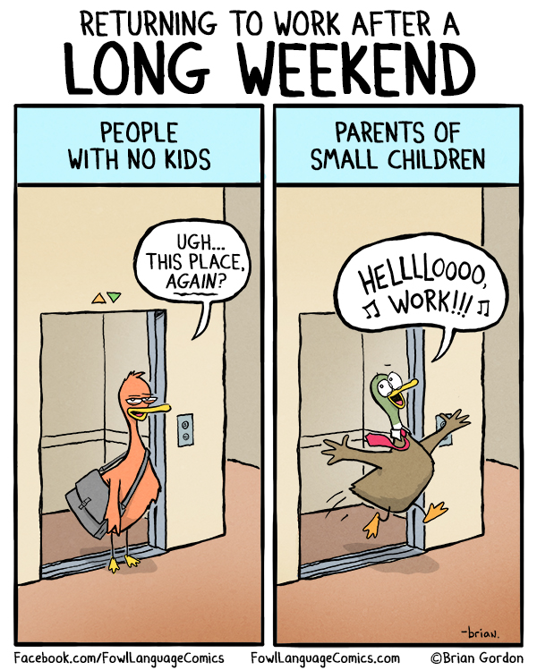

+++
title = "Antropologija med 코tirimi stenami"
summary = ""
weight = 1
date = "2019-05-12"
+++

Spoznavanje dru쬭e in sebe med pandemijo

Zalo쬭a ZRC

Ljubljana, 2020

## Antropologija med 코tirimi stenami: Spoznavanje dru쬭e in sebe med pandemijo

Avtor: Dan Podjed

Urednika: Ingrid Slavec Gradi코nik in Jurij Fikfak

Spremna beseda: Vesna Milek

Jezikovni pregled: Ingrid Slavec Gradi코nik

Oblikovanje: Samira Kentri캖

Prelom: Brane Vidmar

Zalo쬹ik: Zalo쬭a ZRC

Zanj: Ale코 Poga캜nik

Izdajatelj: ZRC SAZU, In코titut za slovensko narodopisje

Zanj: Ingrid Slavec Gradi코nik

Naklada: 500 izvodov

Ljubljana 2020; prva izdaja, prvi natis

Na strani (slika 2) je ponatisnjena naslovnica knjige *The Caves of
Steel* (Isaac Asimov, Boardman, 1954), na strani (slika 23) s soglasjem
avtorja strip iz serije Fowl Language, na strani (slika 36) pa
naslovnica plo코캜e *Relax* skupine Frankie Goes to Hollywood. Sliki na
straneh (sliki 18, 19) sta pridobljeni po Facebooku, slika na strani
(slika 20) pa je iz posnetka, ki so ga predvajali na Televiziji
Slovenija. Druge fotografije in slike so iz avtorjevega osebnega arhiva.

CIP

춸 2020, ZRC SAZU, In코titut za slovensko narodopisje. Vse pravice
pridr쬬ne. Noben del te knjige ne sme biti reproduciran, shranjen ali
prepisan v kateri koli obliki oz. na kateri koli na캜in, bodisi
elektronsko, mehansko, s fotokopiranjem, snemanjem ali kako druga캜e,
brez predhodnega pisnega dovoljenja lastnikov avtorskih pravic.

## Zahvale

Ta knjiga je nastala v dialogu med antropologom, ki sem v spletnih
zapisih opisoval svoj vsakdanjik med pandemijo covid-19, in bralci, ki
so pisanje sproti komentirali. Da bi ohranili pristnost besedila, smo se
z urednikoma odlo캜ili le za najnujnej코e jezikovne posege. V mojih
dnevni코kih zapisih je popravljen kaka nerodnost, nastala ob dnevni
naglici pisanja, v komentarjih bralcev, ki na dru쬭enih omre쬵ih pi코ejo
spro코캜eno, pa samo opaznej코e tipkarske in pravopisne napake, npr.
manjkajo캜a lo캜ila. Kljub temu, da so avtorice in avtorji spletnih
komentarjev v besedilu anonimni, se vsakemu od njih zahvaljujem za
podane misli. Zaradi njihovih prispevkov to ni moja, temve캜 na코a knjiga.

Najlep코a hvala urednikoma Ingrid Slavec Gradi코nik in Juriju Fikfaku, ki
sta zapise napravila bolj berljive. Zahvaljujem se 코e Ale코u Poga캜niku,
vodji in glavnemu uredniku Zalo쬭e ZRC, ki je poskrbel, da je knjiga
iz코la, in Agati Toma쬴캜, promotorki raziskovalnih vsebin
Znanstvenoraziskovalnega centra SAZU, ki je pomagala 코iriti glas o njej.

Na koncu iskrena hvala mojim najdra쬵im, ki so zdr쬬li z mano med
코tirimi stenami: Petru, Gregorju in Marku Podjedu in Sari Arko.

캛eprav je besedilo zapisano v poljudnem slogu, vklju캜uje nekatere
znanstvene izsledke programa in projekta, ki ju iz dr쬬vnega prora캜una
sofinancira Javna agencija za raziskovalno dejavnost Republike
Slovenije: *Etnolo코ke in folkloristi캜ne raziskave kulturnih prostorov in
praks* (P6--0088) in *Nevidno 쬴vljenje odpadkov: Razvoj etnografsko
utemeljene re코itve za upravljanje z odpadki v gospodinjstvih*
(L6--9364). Knjiga predstavi tudi rezultate mednarodnega projekta
*Ustvarjaj za povezave \> Ustvarjaj za vpliv*, ki ga v programu
Ustvarjalna Evropa financira Evropska unija.

## Predgovor: Zastoj

Ponedeljkovo jutro, petnajsti dan po preklicu epidemije. Ura je pol
devetih. Debele de쬹e kaplje udarjajo ob vetrobransko steklo, brisalca
pa odrivata vodo sem in tja ter se v enakomernem gibanju nenadoma povsem
zlijeta z ritmom skladbe iz radia: 췉캛as bo zacelil svet, 캜as bo
pomlaj코al ta planet. In ko naju ne bo, ostalo bo ro쬹ato nebo ...춺

췉Si v redu?춺 vpra코am 코estletnega sina, ki sedi za mano na svojem
varnostnem sede쬿. Ne odgovori mi. Pogledam v vzvratno ogledalo in
preverim, ali ni morda zaspal. 만 je buden. Skoz stransko steklo
zami코ljeno gleda kolono avtomobilov, ki se ob nama po캜asi pomika proti
drugemu delu mesta. 췉Obti캜ala sva v prometu,춺 mu re캜em in pojasnim, da
se temu pravi zastoj, on pa pokima in modro pripomni: 췉Ati, v캜asih pa ni
bilo toliko zastojev.춺

Res, 코e pred slabim mesecem sva zjutraj 코vignila skoz mesto. Ceste so
bile prazne, avtomobili so 캜akali na parkiri코캜ih, avtobusi so po캜ivali,
ljudje niso hiteli v slu쬭o, 코ole so bile zaprte, vrtci tudi. Prometnih
zastojev takrat res ni bilo, zdelo pa se je, kakor da je ves svet
zastal. Ustavil ga je drobni virus, ki se je raz코iril po svetu in 캜ez
no캜 postal glavni sovra쬹ik 캜love코tva in hkrati najve캜ji zvezdnik --
zavzel je ve캜 medijskega prostora od vseh vplivne쬰v in vplivnic skupaj,
v코tev코i Kim Kardashian in Challeta Salleta.

Virus SARS-Cov-2 je vplivne쬰m od코캜ipnil prostor in nam odrl 캜as,
hkrati pa je ponudil prilo쬹ost, da se ustavimo in premislimo, kaj
pravzaprav potrebujemo in 캜esa si 쬰limo. So jutranji zastoji in
vsakdanje dirke na delo res ideal, h kateremu naj si prizadevamo v
prihodnosti? Ali si lahko izmislimo nove na캜ine premikanja in
produkcije, ki bodo bolj ukrojeni po meri ljudi in drugih bitij, s
katerimi sobivamo na tem planetu?

Glede na to, kako hitro in brezbri쬹o smo po karanteni planili nazaj v
쬴vljenje, v varno zavetje leta 2019, vse bolj dvomim, da se nam bo
posre캜ilo ob virusnem pretresu bistveno spremeniti dru쬭o. Res pa je, da
je intersubjektivna izku코nja s karanteno, ki smo jo do쬴vljali skupaj in
hkrati vsak po svoje, vsakogar med nami nekoliko spremenila -- in nas
morda vsaj malo premaknila kot globalno skupnost.

Da bi med pandemijo popisal spreminjanje dru쬭e in sebe, sem se lotil
zapisovanja, ki je za캜elo nastajati organsko in nena캜rtno. Prvi zapis je
nastal po tem, ko sem obiskal bli쬹je nakupovalno sredi코캜e in ugotovil,
da ni ni캜 ve캜 tako, kakor je bilo, 캜e parafraziram nekdanjega
slovenskega predsednika. Ljudje so med nakupovanjem nosili za코캜itne
maske, premikali so se druga캜e kakor pred razglasitvijo epidemije in
kupovali ogromne koli캜ine toaletnega papirja -- ali pa se mi je tako
vsaj zdelo. Kot antropolog, ki se mora po nenavadnost in druga캜nost
navadno odpraviti kam dale캜, po mo쬹osti v tujino, sem za캜util neznosno
쬰ljo, da popi코em, kaj se dogaja okoli mene. 캛udnost je bila nenadoma
tu, pred nosom.

Opis lastne nakupovalne izku코nje sem 쬰 zve캜er objavil po omre쬵ih
Facebook, Twitter, Instagram in LinkedIn, in sicer tako v slovenskem kot
tudi angle코kem jeziku, saj sem sku코al tudi tistim, s katerimi sem
povezan v tujini, prenesti informacije o tem, kaj se med pandemijo godi
췉za devetimi gorami in devetimi vodami춺. Zatem sem pisal vsak dan, in to
ve캜 kot mesec dni, ter zapise sproti prevajal. Iz enkratnega dogodka je
popisovanje stanja postalo najprej obred, pozneje pa skoraj 쬰 slu쬭a.
Ob zapisih se je namre캜 za캜elo ogla코ati vse ve캜 ljudi. Nekateri so
pisanje hvalili, drugi pa so ugotavljali, da postajam v izolaciji
nekoliko blazen. V코e캜 so jim bile strategije za pre쬴vetje v doma캜em
ujetni코tvu in nasveti, kaj brati med karanteno, razburilo pa jih je, da
sem obut v kroksice ozmerjal fante, ki so igrali ko코arko na zaklenjenem
코olskem igri코캜u. Mnogim se zdelo nekoliko noro tudi, da sva z 쬰no
toliko 캜asa in truda namenila pranju hrane, ki sva jo prinesla iz
trgovine, drugi pa so mi pisali, da tudi sami po캜nejo enako ...

Spletni dnevnik se je postopoma spreminjal v dialog med mano in dru쬭o,
ki je sicer nisem videl, je pa bila ves 캜as nekje blizu, na drugi strani
zaslona. Med 코tirimi stenami tako nisem obti캜al le z dru쬴no, temve캜 je
na코e do쬴vljanje krize spremljalo veliko ljudi, med katerimi mnogih
sploh nisem poznal. Nekateri od njih so mi celo svetovali, o 캜em naj
pi코em, in negodovali, 캜e sem kak코no temo obravnaval na na캜in, ki je bil
po njihovem mnenju zgre코en.

Zaradi ob캜instva, ki je vsak dan pri캜akovalo novo zgodbo, sem
zapisovanje vse bolj 캜util kot obveznost, hkrati pa sem se iz
posameznika za캜el spreminjati v medij. 콯e zjutraj sem 쬰no za캜el
nadlegovati z vpra코anjem, o 캜em naj tokrat pi코em, na sprehodih po
췉ozunju춺 pa sem nenehno oprezal, kje bi lahko posnel dobro fotografijo,
ki bi jo zve캜er prilo쬴l zapisu. Pisati sem obi캜ajno za캜el zve캜er, ko so
코li otroci spat, in potem potreboval uro, dve za slovenski zapis, potem
vsaj 코e uro za prevod v angle코캜ino in zatem 코e pribli쬹o uro za
obdelovanje fotografij in 코irjenje zapisa po omre쬵ih. Delo pa se potem
sploh ni kon캜alo. Po vsaki objavi so za캜eli de쬰vati komentarji, na
katere je bilo treba sproti odgovarjati in braniti lastno pozicijo.

Tako mi je iz rok vse bolj polzel 캜as, ki sem ga med karanteno nameraval
porabiti zase. Ko je dr쬬va oznanila, da bomo v naslednjih tednih
pre쬴veli ve캜ino 캜asa med 코tirimi stenami, sem si namre캜 pomel roke in
si skrivaj rekel: 췉Odli캜no!춺 Mislil sem, da bom imel kon캜no ve캜 캜asa za
branje in sprehode v naravo, in se veselil, da bomo z dru쬴no odigrali
namizne igre, ki so se leta pra코ile na omari. Navdu코en sem bil nad
mislijo, da bova z 쬰no pogosteje kuhala zdrave jedi, pripravljene iz
zelenjave, ki bo zrasla na doma캜em vrtu, in sanjaril o romanti캜nih
ve캜erih, ki si jih bova privo코캜ila v osami. In kaj se je dejansko
zgodilo? Obti캜al sem pred zaslonom in pisal predvsem o tistem, kar se mi
je pletlo v glavi. In tako dan za dnem. Ko se mi je dokon캜no uprlo zreti
v lasten popek, sem se odlo캜il kon캜ati z zapisi in pritisnil zadnjo
piko. Ob캜instvo ni bilo posebej navdu코eno, da je 췉prve sezone춺 konec,
razo캜aran nad sabo pa sem bil tudi sam. Zdelo se mi je, kot da sem
lastno medijsko hi코o poslal v ste캜aj.

Pribli쬹o mesec zatem, ko sem na 36. dan karantene kon캜al s
karantenskimi zapisi in ugonobil medij, ki sem ga poimenoval
*Antropologija med 코tirimi stenami*, sem se zazrl nazaj in ugotovil, da
je bil zastoj pravzaprav kar koristen. Med njim je namre캜 nastala ta
knjiga, ki je dejansko nisem spisal sam, temve캜 smo jo ustvarili s
tistimi, ki so moje pisanje brali in komentirali po omre쬵ih. Dnevni코ki
zapisi, ki sem jih 코iril po spletu, so namre캜 celoviti in pestri prav
zato, ker jih dopolnjujejo mnenja ljudi, s katerimi smo se zna코li v
nenavadnem zastoju, med katerim smo bili sicer sami, a hkrati skupaj --
podobno kakor na cesti, ko ti캜imo vsak za svojim volanom, ujeti v
izoliranih celicah na 코tirih kolesih. Medtem ko nekateri po radiu
poslu코amo skladbo o 캜asu in zraven mrmramo refren, so drugi priklju캜eni
na druga캜ne frekvence. Na vse pa ta캜as pada isti de. In vsi stojimo in
캜akamo, da se spet pri쬲e zelena lu캜 na semaforju. In potem speljemo in
se ustavimo in speljemo ...

S sinom sva se po polurni vo쬹ji kon캜no pripeljala na drugi del mesta.
De je medtem nekoliko pojenjal, kaplje pa so risale kroge v ogromni
mlaki, sredi katere sva parkirala. 췉Previdno stopi na plo캜nik, da si ne
zmo캜i코 캜evljev!춺 sem mu zabi캜al, medtem ko sem pridr쬬l vrata, da je
lahko stopil iz vozila. Tedaj me je pre코inilo: pozabil sem vzeti
nahrbtnik s 코kornji! V glavi sem so캜no zaklel in sina prijel za roko ter
ga previdno vodil med lu쬬mi, da bi ostal suhih nog.

Ko sva pri코la do ta코캜e in tasta, sem jima najprej pojasnil, da se bom
takoj vrnil in prinesel 코e opremo za de, ki je ostala doma. 췉Ni treba,춺
sta pomirjujo캜e rekla, 췉saj ne bomo hodili ven.춺 Meni pa je bilo jasno,
da bo treba 코e enkrat na pot. Ni bilo dovolj, da sem zastoj do쬴vel
enkrat -- vajo bo treba ponoviti in znanje utrditi. Tako prepevajo tudi
Dan D na koncu pesmi, ki je prej igrala po radiu: 췉캛as bo rekel stop,
캜as je za 코e en krog, 캜as je za 코e en krog ...춺

## 5. dan karantene: Jezdeci apokalipse

췉Hej, kaj pa po캜ne코?춺 je blagajni캜arka z za코캜itno masko na obrazu
zavpila mladeni캜u, ki je v eni roki dr쬬l pivo, z drugo pa si je v usta
basal sendvi캜. Da sta imela zatem burno debato, sem od dale캜 zgolj
slutil in sklepal po gestah, a o캜itno je bilo, da je gospa besna na
neodgovorne쬬, ki si je drznil z golo roko tipkati po avtomatski
blagajni, in to kar med jedjo. Kljub o캜itni jezi pa se mu ni preve캜
pribli쬬la, da bi ga ozmerjala od blizu, temve캜 je sledila novemu
napotku, naj bodo ljudje meter in pol narazen, ko so v trgovini -- tako
so opozarjale tudi table ob blagajni.

Nakupovanje je bilo nasploh povsem druga캜no kakor prej코nji teden. Vse se
mi je zdelo nekako normalno, hkrati pa sem ob캜util tisto 캜udno
nedoma캜nost, ki ji je Freud rekel *das Unheimliche* -- tak ob캜utek
dobimo, ko gledamo na mrli코ki postelji sorodnikovo truplo, ki je po eni
strani doma캜e, hkrati pa 코e tuje in nenavadno. Tudi trgovina je bila
tak코na kot vedno in police so bile polne, le nakupovalci smo se vedli
nekam nenavadno. Skoraj polovica nas je nosila rokavice in na obrazu
masko, premikali pa smo se kot molekule plina: sku코ali smo biti 캜im bolj
vsaksebi. 만 pogledali se nismo, kaj 코ele da bi se ogovorili. Tudi po
opravljenem nakupu mi blagajni캜arka, ki sem jo izza maske spoznal po
o캜eh, ni niti odzdravila niti pokimala. 췉Samo pojdi 쬰,춺 si je mogo캜e
mislila, ko je nepremi캜no strmela vame, in opazovala, kako si vle캜em z
dlani rokavico, da bi na telefonu odprl aplikacijo, v kateri imam
nalo쬰ne kartice zvestobe. 만le pred blagajno sem namre캜 ugotovil, da ne
morem odkleniti telefona, 캜e nosim gumijaste rokavice, zato sem si eno
nekoliko z odporom snel in pritisnil na senzor za prstne odtise.

Ko sem pri코el domov, sem se najprej slekel do golega, obla캜ila vrgel v
pranje in se stu코iral z vro캜o vodo. Sku코al sem odplakniti morebitne
viruse, ki bi se lahko bili prebili do ko쬰. Vsi deli telesa, s katerimi
sem se v trgovini dotaknil 캜esar koli, so se mi zdeli onesna쬰ni,
ne캜isti. Nekoliko bolje sem se za캜el po캜utiti, ko sem se zdrgnil z
brisa캜o in pomislil, da si bom ob kosilu privo코캜il pivo, ki sem ga med
nakupovanjem izbral zaradi polo쬬ja, v kateri smo se zna코li. Imenuje se
po jezdecih apokalipse.

Dan, kdaj se bo코 lotil pisanja distopi캜nega romana? Tole je res tvoja
(na코a) realnost, ampak obljubim, 캜e ga napi코e코, da te bom z veseljem
spet povabila za gosta 만 prej pa z u쬴tkom preberem tvoje zapise!

V Mercatorju na Vojkovi so prodajalke top, tudi v koronatajmu so ostale
캜love코ke.

> Saj tudi tu so 캜love코ke -- kolikor je seveda mo쬹o v danih
> okoli코캜inah, tj. z novoname코캜enim pleksi steklom pred blagajno in
> masko ves 캜as na obrazu. Pa z mislijo, kdo ga ima, virus namre캜. Meni
> bi se utrgalo. Zato: vsa 캜ast, da sploh delajo. Vsi smo malo malo manj
> 캜love코ki v 캜asu korone, to je bil mesid. Ali pa smo 캜love코ki na
> druga캜en na캜in.

**\
**

## 6. dan karantene: Golo sonce nad jeklenimi votlinami

췉Policija, policija!춺 je zavpila 쬰na. Kje, zakaj? Stekel sem v kuhinjo
in pogledal skoz okno, ravno tako tudi otroka, ki sta pri코la hitro
preverit, kaj se dogaja, in se nagnetla ob okenski polici. Ob re코etkasti
ograji 코olskega igri코캜a je bilo parkirano policijsko vozilo, iz njega pa
sta izstopila uniformiranca in se pribli쬬la vrte캜im kovinskim vratom
ter nekaj zavpila fantoma, ki sta metala 쬺go na ko코. Ve캜ji in -- vsaj
na pogled -- starej코i od njiju se je ustavil sredi meta. 콯ogo je prijel
pod roko ter pogumno zakora캜il proti policistoma, mlaj코i pa mu je bolj
pla코no sledil. Eden od policistov jima je nekaj zabrusil in nakazal z
roko v daljavo, proti drugi strani igri코캜a. Gesto sem razumel kot:
췉Pojdita domov in tam ostanita. Zdaj ni 캜as za igro!춺 Fanta sta
sklonjenih glav zapustila igri코캜e in se vrnila v osamo.

만 prej코nji teden je bilo dru쬰nje del normalnosti, danes ne ve캜. Kako
se bo to v dru쬭i poznalo na dolgi rok? Bomo spremenili privajene na캜ine
dru쬰nja in se videvali manj v 쬴vo in ve캜 po spletu? Se bomo ob
sre캜anjih 코e objemali, rokovali in poljubljali?

Ob tak코nem samospra코evanju mi vedno znova pride na pamet
znanstvenofantasti캜na trilogija Isaaca Asimova, ki se za캜ne z delom
*Jeklene votline*, nadaljuje z *Golim soncem* in sklene z *Roboti
jutranje zore*. V *Jeklenih votlinah* spoznamo protagonista Eliaha
Baleya, ki nekaj tiso캜letij v prihodnosti 쬴vi na Zemlji, kjer se gnete
쬰 osem milijard ljudi -- to je bilo za Asimova v petdesetih letih
prej코njega stoletja, ko je pisal to serijo romanov, verjetno
nepredstavljiva 코tevilka, a 쬰 danes nas je na planetu skoraj toliko. V
romanu ljudje 쬴vijo v jeklenih votlinah, varno skriti pod orja코ko
kupolo, ki se pne nad mestom. Na prosto se zaradi kolektivne in
privzgojene agorafobije, torej strahu pred odprtim prostorom, drznejo
podati le redki.

V nadaljevanju z naslovom *Golo sonce* se dogajanje prestavi na planet
Solarija, kjer je dru쬭eno 쬴vljenje 코e nenavadnej코e: ljudi je tam le
nekaj deset tiso캜, za vsakega od njih pa skrbi mno쬴ca robotov.
Prebivalci in prebivalke se sre캜ujejo in pogovarjajo skoraj izklju캜no na
daljavo, in sicer po napravah, ki jim pomagajo ustvariti prepri캜ljive
holograme. 만 spolnost imajo za ne캜isto in jo 췉izvajajo춺 izklju캜no za
nadaljevanje vrste.

Asimov je bil pred ve캜 kot 코estimi desetletji -- to je v 캜asu 캜rno-belih
televizijskih aparatov -- neverjetno vizionarski s svojim zami코ljanjem
prihodnosti, ki pa se je za캜ela uresni캜evati bistveno prej, kakor bi
verjetno mogel pri캜akovati. So캜asno sta se pravzaprav uresni캜ila oba
scenarija: tisti iz *Jeklenih votlin* in oni iz *Golega sonca*. Bolj kot
kdaj koli prej v zgodovini smo nagneteni in povezani in hkrati pogosto
bolj osamljeni in odmaknjeni, kakor smo bili kadar koli. V 캜asu covid-19
sta obe te쬹ji 코e o캜itneje tr캜ili druga ob drugo. Biti skupaj ali biti
vsak zase? Za nekaj 캜asa je drugi scenarij o캜itno bolj코i in nujen, da
vrsta pre쬴vi.

Ko je policija odpeljala, je zunaj zavladala ti코ina. Od dale캜 se je
sli코alo pti캜je petje in sonce je sijalo na prazno igri코캜e. Na 캜uden
na캜in je bilo nenavadno lepo.

V mladih letih sem po쬴ral te knjige

> Meni so za zmeraj ostale v glavi. Asimov -- totalen car, neverjeten
> vizionar.
>
> Dan Podjed, pa Druga vlada \... Me veseli, da ste tudi mlaj코i 코e brali
> Asimova. A zdaj je bolj 캜as za P. K. Dicka ali vsaj dvodelni roman o
> njem, Philip K. Dick Is Dead, Alas.
>
> Druga vlada -- zakon! Briljantno razmi코ljanje o svetu, ki ga 쬴vimo,
> tj. analiza velikih podatkov (big data). Zdaj sem sicer padel v
> postapokalipti캜ne trilerje, podobne Cormackovi Cesti. Se takoj bolje
> po캜utim

## 7. dan karantene: Sve쬬 zemlja

Tole bo zelo kratek zapis, ker sem -- iskreno povedano -- preutrujen za
pisanje. Na vrt sem popoldne nasul velik kup sve쬰 zemlje, jo poravnal
in potem nekaj 캜asa ob캜udoval narcise, ki so se za캜ele razcvetati.

Mislim, da je fotografija sama po sebi dovolj povedna in da je odve캜
besedi캜enje, kako bo iz sedanje 췉pognojene춺 situacije zraslo nekaj
novega. Kdo bi vedel!

## 8. dan karantene: Dolg캜as in inovativnost

Zmanjkalo nam je 캜istih kro쬹ikov in kock za pomivalni stroj in smo se
morali znajti, kakor je razvidno na fotografiji ... Eh, saj ne! Dejansko
smo se za kosilo dru쬴nsko lotili priprave bu캜ne juhe, ki smo jo
postregli v 췉izvirni embala쬴춺. Zanimivo je, kako smo nenadoma dobili
캜as za polurno dolbenje bu캜 in po캜asno sekljanje ter kuhljanje. No, in
tudi sicer smo postali zelo inovativni. Rezljamo, lepimo, presajamo,
igramo namizne igre, prelistavamo albume, 캜istimo pozabljene mape v
ra캜unalniku ... in pi코emo zapise, kakr코en je tale. 캛e smo 코e prej코nji
teden nekoliko bahavo v javnosti stokali, da je 캜asa premalo, ga je
nenadoma preve캜. 캛udo vseh 캜udes: tu in tam nam je celo dolg캜as.

Dolg캜as je danes skoraj srhljiva beseda. Be쬹o pa se spomnim, da ni bilo
vedno tako. Na misel mi pride, kako sem pred desetletji med 코olskimi
po캜itnicami dejansko cenil tiste dolgo캜asne dneve, ko se je 캜as vlekel v
nedogled. Fenomenalne volje sem bil, ko je na morju de쬰valo, tako da
nismo mogli na pla쬺. Potem sem lahko ves dan bral stare Politikine
*Zabavnike*, ki sem jih na코el na polici, in se spotoma nau캜il cirilice,
saj na otoku, kamor smo hodili na morje, slovenskih izdaj Politikinih
캜asopisov in revij niso prodajali -- dobilo se je le 췉izvirne춺
tiskovine. 캛e nisem imel ni캜esar za branje, tudi ni bila te쬬va. Odli캜no
je bilo po캜eti ni캜, gledati v zrak in premi코ljati. Dolg캜asa sem se tako
navadil, da me je bilo prav groza tiste dni, ko smo 코li na pla쬺 ali
celodnevni izlet, saj sem vedel, da bo dragoceni po캜itni코ki dan 코vignil
mimo, kot da ga nikoli ni bilo, 캜e se bom preve캜 zabaval in kratko캜asil.

Nimam pojma, kdaj sem pozabil ceniti dolg캜as, ampak verjetno se je to
zgodilo enkrat v procesu odra코캜anja, ko se mi je za캜elo vse bolj muditi.
Ne vem sicer, kam.

V 캜asu pandemije se nisem ustavil le jaz in moja dru쬴na, temve캜 je --
tako se mi vsaj zdi -- zastal ves svet. O캜itno je nastopil 캜as, da se
med dolgo캜asenjem spet zamislimo in pridemo do novih zamisli. Nedvomno
jih bomo potrebovali -- 캜e ne za kaj drugega, pa zato, da premislimo,
kaj bo jutri na kro쬹iku. 캛e se spotoma domislimo, kak코en bi bil
najbolj코i recept za dru쬭o prihodnosti, 코e toliko bolje.

Ostanite zdravi!

## 9. dan karantene: S toaletnim papirjem proti covid-19

췉Nimam dobre razlage za to,춺 je odvrnil filozof Slavoj 콯i쬰k, ko ga je
novinarka Nata코a 맚efe v intervjuju za Val 202 vpra코ala, zakaj se ljudje
v 캜asu virusne pandemije pulijo za toaletni papir. Hej, pa prav v tem
delu sicer izvrstnega pogovora je dobil 콯i쬰k izto캜nico za dopolnitev
zamisli iz knjige *Kuga fantazem*, v kateri je s psihoanaliti캜nega
vidika med drugim pojasnil, kak코na je 췉ideolo코ka춺 razlika med strani코캜i
v razli캜nih kulturnih okoljih, in razlo쬴l, kak코en odnos imajo ljudje do
izlo캜kov. Strani코캜e s 췉poli캜ko춺 oziroma 췉tradicionalno nem코ko
strani코캜e,춺 kot mu pravi 콯i쬰k, naj bi bilo namenjeno pregledu izlo캜kov,
ki jih lahko po iztrebljanju povohamo in si jih natan캜no ogledamo, da bi
zaznali morebitne bolezenske znake; 췉francosko strani코캜e춺, ki se je v
Sloveniji po ob캜utku 코e najbolj uveljavilo, je zasnovano tako, da
izlo캜ke 캜im prej odplaknemo iz vidnega polja; 췉anglosa코ko strani코캜e춺 pa
predstavlja sintezo 췉nem코kega춺 in 췉francoskega춺, saj iztrebki padejo v
vodo in jih lahko sicer vidimo, ne moremo pa jih natan캜no analizirati.
콯i쬰k bi na tej to캜ki prilo쬴l samo 코e toaletni papir in zgodba bi bila
popolna.

Ampak res, zakaj smo postali obsedeni s toaletnim papirjem? Hitro
razlago lahko podamo na podlagi znamenitega dela antropologinje Mary
Douglas *캛isto in nevarno*, ki je v 캜asu koronavirusa spet postalo
izjemno aktualno. Kot pravi avtorica, izvajajo ljudje po svetu razli캜ne
o캜i코캜evalne obrede, s katerimi ves 캜as postavljajo v 쬴vljenju red. In
kaj je nakup toaletnega papirja drugega kot prva stopnja obreda, s
katerim o캜istimo telo in odstranimo nevarne ne캜isto캜e? 캛e v boju proti
nevidni gro쬹ji ne zale쬰 ni캜 drugega, si lahko vsaj temeljito in
dosledno obri코emo zadnjo plat -- in smo potem nekoliko mirnej코i. (O tem
sva pred dnevi po Skypu kramljala z antropologom Samwelom Mosesom
Ntapanta, ki mi je poslal odli캜no kratko analizo o obsesiji s toaletnim
papirjem.)

Ob dana코njem obisku trgovine sem, priznam, tudi sam podlegel mno쬴캜ni
psihozi in v vozi캜ek vrgel dva paketa toaletnega papirja, in sicer
Palominega, ker v kriznih 캜asih podpiram doma캜o industrijo, potem pa
nakupil 코e 캜istila, razku쬴la, rob캜ke in pralni pra코ek ter pograbil
zadnjo 코katlo z gumijastimi rokavicami, ki so bile za캜uda 코e na polici.
Skoraj polovico vozi캜ka sem napolnil z o캜i코캜evalnimi pripomo캜ki in se
takoj po캜util 캜istej코i -- morda tudi zaradi vonja meh캜alcev in pra코kov,
ki sem ga na oddelku s 캜istili zavohal celo 캜ez za코캜itno masko. 만
nikoli prej me ta vonj ni tako prevzel.

Ko sem vozi캜ek pririnil na prosto, sem pred trgovino uzrl znanko in jo z
varne razdalje pozdravil, ona pa me je 캜udno pogledala, saj me zaradi
maske na obrazu ni spoznala. Kon캜no se ji je posvetilo, kdo sem.
Zasmejala se je, ko je zagledala veli캜astno zalo쬰n vozi캜ek, in rekla:
췉Ohoho, ti si pa tole vzel resno!춺 췉Ja,춺 sem zamomljal in se po캜util
nekoliko neprijetno. Zdelo se mi je, da me je razkrinkala, zato sem ji,
napol v 코ali, sku코al razlo쬴ti: 췉Saj ve코, tale papir je danes veliko
vreden.춺 Zahahljala se je in prikimala, jaz pa sem ji nakazal, da moram
naprej, ker je -- kot bi morala oba vedeti -- dru쬰nje v 쬴vo stvar
preteklosti. 췉Se vidiva junija na kavi!춺 sem ji 코e zavpil od dale캜 in
prepoten rinil vozi캜ek proti avtomobilu. Potem pa sem se spomnil:
췉Prekleto, kvas sem pozabil kupiti!춺

Glej, v캜eraj je iz코el Doom Eternal. Nimam problemov s karanteno

> Jaz sem s tak코nimi karantenami nehal pri Civilization II. Igral 15-20
> ur dnevno, neprekinjeno. Osvojil svet, ve캜krat, a postal asocialen.
> Ampak vseeno: a je Doom fajn?!

Dan, tvoje fotke so noro dobre! Moral bi jih poslati na kak코ne nate캜aje.
캛isto zares!

## 10. dan karantene: Telesne tehnike med pandemijo

Ljudje, skoraj 45 let 쬰 imam, pa sem se 코ele danes nau캜il, kako si
pravilno umijemo roke! Sara, ki celo v karanteni ostaja moja 쬰na, je
namre캜 pripravila kratek izobra쬰valni te캜aj za na코o dru쬴no in nam
odpredavala o kratki zgodovini pranja rok, za캜en코i z dr. Ignazom
Semmelweisom, ki je porodni캜arje silil, naj si pred porodom operejo
roke, in kon캜av코i z zgovornim posnetkom na YouTubu o tem, kak코na je
pravilna tehnika pranja rok. Na posnetku smo videli roki v belih
gumijastih rokavicah, ki imata najprej kapljico 캜rne barve samo na
dlaneh, nakar se dolgo drgneta druga ob drugo, se vzajemno ovijata okoli
palcev in si nazadnje pobarvata 코e zapestji. 만le po pribli쬹o minuti
sta bili roki povsem 캜rni, s 캜imer so avtorji posnetka nazorno
prikazali, kako dolgo traja, da si jih temeljito umijemo z milom.

Po predavanju sem teoreti캜na spoznanja, ki so bila med ogledom posnetka
precej zabavna, v kopalnici preskusil 코e v praksi. Prepletal sem
namiljene prste, jih motal okoli palcev in zapestij ter si drgnil dlani,
zraven pa kot mantro ponavljal najbolj코i del besedila pesmi 췉Higijena춺
(za jezikovne puriste: naslov je dejansko zapisan z dodatno 캜rko J), ki
so jo izvajali Strelnikoff in Marko Brecelj: 췉Hojladrija, svinjarija,
diareja, gonoreja ...춺 Po minuti pranja rok in so캜asnega zaklinjanja in
preklinjanja sem bil povsem izmu캜en, med brisanjem v brisa캜o pa me je
za캜elo dejansko skrbeti, ali bo to mukotrpno in duhamorno opravilo sploh
kdaj lahko postalo telesna tehnika, ki jo lahko izvajam nezavedno in
samodejno, ne da bi ob tem preve캜 trpel.

Odli캜en esej o telesnih tehnikah, ki je pri nas iz코el v knjigi z
naslovom *Esej o daru in drugi spisi*, je pred skoraj stoletjem napisal
antropolog in sociolog Marcel Mauss. V njem je opisal, kako se od
zgodnje mladosti od star코ev, u캜iteljev in vrstnikov u캜imo, kako neko
dejanje opravimo pravilno, dokler ga ne za캜nemo izvajati samodejno in
nezavedno. Predstavil je nekaj zanimivih in zabavnih primerov iz lastne
mladosti. U캜ili so ga, na primer, naj pri prsnem plavanju opona코a
parnik, in sicer tako, da ob vsakem zavesljaju z usti zajame vodo in jo
potem puhne visoko v zrak. Dodal je, da se te navade 코e na stara leta ni
mogel znebiti. 맖lski u캜itelj telovadbe pa ga je nau캜il, kako se
췉pravilno춺 te캜e, in sicer s pestmi visoko ob prsih -- tak코en slog je v
Franciji o캜itno prevladoval v drugi polovici 19. stoletja. 만le mnogo
pozneje je Mauss spoznal, da je bila tehnika zelo neprakti캜na.

Med karanteno bomo poleg umivanja rok, prilagojenega novim 캜asom, ko je
higiena dejansko vitalnega pomena, o캜itno razvili mnoge telesne tehnike,
ki jih doslej nismo poznali: odpiranje vrat s komolcem, potiskanje
nakupovalnega vozi캜ka z dvema prstoma, sezuvanje 캜evljev brez dotikanja
... Nove tehnike se v 캜asu pandemije oblikujejo tudi pri be쬹ih in
redkih medsebojnih stikih 췉v 쬴vo춺. Objeme, poljube in rokovanje tako 쬰
nadome코캜a vulkanski pozdrav iz nadaljevanke *Zvezdne steze*, ki ga je na
vesoljski ladji Enterprise prakticiral znanstveni oficir Spock. Od dale캜
in z resnim izrazom na obrazu vse ve캜 ljudi dvigne desnico (razmaknjena
sredinec in prstanec mnogi sicer opustijo) in se pozdravijo z ne캜im
podobno kratkim, kakor je znameniti: 췉콯ivi dolgo in uspevaj!춺

Bo pandemija res spremenila ukalupljene navade in prakse? Kak코ne bodo
telesne tehnike v dvajsetih letih 21. stoletja, ki jih bodo raziskovali
antropologi v bodo캜nosti? In kak코en bonton bomo ustvarili po novem? Kdo
bi vedel. Nedvomno pa je sedanji 캜as izjemno zanimiv, ker lahko
spremljamo nastajanje novih navad, medtem ko postajajo del nas in
dru쬭e. 캛e ne bi 쬯eli vsak v svoji 캜umnati, bi bil to pravi raj za
antropologinje in antropologe!

Kdaj bo nova knjiga, Dan?

Ko pridemo ven

Prihodnje generacije antropologov ti bodo zavidale, ker si imel
prilo쬹ost tole do쬴veti v 쬴vo

Dan, prilepi YouTubov link do umivanja, prosim. Druga캜e pa nas tako
zdresirajo (in tako dresiramo, ja, ujeti v vzorce preteklosti), da
rabimo leta samodiscipline in ozave코캜anj, da postanemo (spet) pravi
mi/jaz. 캛e upamo in si drznemo.

Tako si zdrgnemo dol stare vzorce!

> Pa vzgojiteljice in otro코ke medicinske sestre to tudi obvladajo. Danes
> mi je mali pokazal, kako traktor pripelje, seno obra캜a pa pograbi pa
> nalo쬴 pa \... Ne more코 verjeti, skoraj do komolcev se je svetil.
> 游때游땔游땏

Se mi zdi, da so tvoji zapisi iz 캜umnate skoraj edini zapis, ki me v
poplavi objav spravi v malo bolj코o voljo 游땑

O, hvala! Namen torej dose쬰n!

## 11. dan karantene: Ljudem vstop prepovedan

췉Smrdokavra je na igri코캜u!춺 mi je po telefonu z vznemirjenim glasom
sporo캜il sosed, sicer poklicni biolog in izurjen ljubiteljski ornitolog.
V hipu smo se spet vsi dru쬴nski 캜lani zbrali v kuhinji in si pulili
daljnogled iz rok. Bolj ko smo gledali, manj smo videli. Poiskali smo 코e
priro캜nik, ki ga hranim 코e iz 캜asov 췉opazovanja opazovalcev춺 -- pred
leti sem namre캜 z antropolo코kega vidika raziskoval, kaj po캜nejo
opazovalci ptic. V njem smo si ogledali, kak코na je pravzaprav videti
smrdokavra, potem pa smo se odpravili na edini dana코nji izletek, ki se
je prelevil v 췉lovsko ekspedicijo춺.

Ko smo stopili iz hi코e, smo zagledali tistega soseda, ki se spozna na
ptice, in to z dru쬴no. Otroci, ki se sicer pogosto dru쬴jo, so si od
dale캜 pomahali, on in njegova partnerka pa sta nam z razdalje zavpila,
kje najdemo smrdokavro. Od코li smo na drugo stran igri코캜a, ki je 쬰 nekaj
dni zaklenjeno, na vratih pa visi napis, da je zaradi epidemije vstop
prepovedan. Pribli쬬li smo se re코etkam ograje in s prostim o캜esom
opazili ptici, ki sta skakljali po travi. 췉Aha,춺 sem poznavalsko rekel,
췉tale ve캜ja je pa smrdokavra!춺 Daljnogled sem dvignil k o캜em, da bi si
jo podrobneje ogledal. Zagledal sem 캜okatega pti캜a s 캜rnim perjem in
rumenim kljunom. Kje pa je zna캜ilen oran쬰n 캜opek? In kje so peruti s
캜rnimi in belimi progami? Bolj sem gledal, bolj se mi je zdelo, da je
nekaj narobe. 췉Kos je,춺 sem nekoliko razo캜arano zamomljal in hkrati
pomislil, da smo pravkar zamudili enkratno prilo쬹ost in da je
smrdokavra 쬰 odletela drugam. Tedaj pa je Sara posko캜ila in pokazala s
prstom nekam proti robu igri코캜a: 췉Tam je, vidim jo!춺 Pogledal sem skoz
daljnogled -- in res! Po pesku v bli쬴ni nogometnega gola je skakljala
oran쬹o-rjavkasta ptica z dolgim za코iljenim kljunom, ki je 코e nikoli
nisem videl v 쬴vo. Nekje za nami je takrat zabevskal pes in mislil sem,
da se bo smrdokavra prestra코ila in odletela, a ob laje쬿 ni niti
trznila. S kljunom je mirno kopala po pesku in verjetno iskala 쬿쬶e in
캜rve. Vsi po vrsti smo si izmenjali daljnogled in se skoraj voajersko
naslajali ob pogledu na pernato lepotico, ki se je 췉okopala춺 v pesku.

V samo petih dneh se je 코olsko igri코캜e pred na코o hi코o povsem spremenilo.
Otroci se tam ve캜 ne igrajo in odrasli ne me캜ejo 쬺ge na ko코. Namesto
ljudi so za캜ela izpraznjeni prostor zavzemati druga 쬴va bitja --
podobno kakor je to poljudno-strokovno opisano v knjigi *Svet brez nas*,
ki jo je napisal Alan Weisman, ali pa z nekoliko ve캜 domi코ljije v
postapokalipti캜nih romanih, ki jih v karanteni najraje prebiram. V njih
se osamljene skupine ljudi obi캜ajno prebijajo skoz prera코캜ena mesta in
캜ez razpokane ceste ter prebivajo v napol poru코enih stavbah, ki jih je
na캜el zob 캜asa. Tak코ni romani se mi zdijo posebej vznemirljivi, ker
opozorijo, kako krhka sta na코 obstoj in na캜in 쬴vljenja. Res je, da smo
zavzeli planet in si podredili druga 쬴va bitja: od celotne biomase
kopenskih sesalcev 36 odstotkov zavzamejo ljudje in 60 odstotkov 쬴vali,
ki jih redimo za prehrano (predvsem govedo in pra코i캜i), le 코tiriodstoten
pa je dele divjih 쬴vali. Po drugi strani pa v kriti캜nih 캜asih
spoznamo, kako smo postali odvisni od infrastrukture, ki smo si jo
zgradili, in omre쬴j, ki nas povezujejo. Ti dose쬶i nam sicer
zagotavljajo hitra potovanja in bliskovit prenos informacij, hkrati pa
smo, kot pravi antropolog Thomas Hylland Eriksen, z njimi prispevali k
pregrevanju sveta. O tem, da smo obsedeni z eksponentno rastjo, je
Eriksen pravzaprav opozarjal 쬰 pred dvema desetletjema v knjigi
*Tiranija trenutka* (angl. *Tyranny of the Moment*). Danes pa se na
쬬lost 코e bolj kot takrat zdi, da je tak코na prehitra rast na코 edini
kolektivni cilj in na캜in, da napredujemo kot globalna skupnost.

Nam ponuja pandemija covid-19 prilo쬹ost, da za hip postanemo in
premislimo o lastni prihodnosti in morebitnih novih poteh? Mogo캜e.
Vsekakor pa nam postanek omogo캜a, da si v miru ogledamo kraje in bitja,
ki jih imamo pred nosom, a jih med hitenjem prezremo.

Been thinking about the young people in Big Brother houses these days.
When they emerge, around Easter I think, the world will have changed.
They're in for a surprise.

> They will all be eager to party and socialise -- and there will be no
> one outside, all pubs and clubs will be closed, there will be no
> alcohol available. A new kind of post-apocalyptic nightmare.

## 12. dan karantene: 콯ivljenje je igra

Na코i otroci so se danes dru쬴li s sosedovimi -- na daljavo, seveda.
Povezali smo jih z ra캜unalnikom, in sicer s pomo캜jo Skypa. Najprej sva z
쬰no mislila, da bodo zgolj klepetali, a so se hitro domislili ne캜esa
novega. 췉Ati, mi lahko da코 Catan?춺 je pri코el vpra코at najmlaj코i Marko.
Za캜udeno sem ga pogledal, a nisem rekel ni캜esar. 맒atlo z namizno igro
sem vzel z omare in mu jo izro캜il. Ves navdu코en je odskakljal v sobo.

췉Dan,춺 mi je Sara 캜ez pribli쬹o 캜etrt ure vsa presene캜ena sporo캜ila,
췉dejansko 코e vedno igrajo!춺 Kaj? Kako? Stopil sem v otro코ko sobo in
obstrmel od za캜udenja. Prenosni ra캜unalnik so postavili na tla, zaslon s
kamero pa nagnili, da sta igralca na drugi strani zaslona videla igralno
povr코ino. 췉Kam bo코 postavil naselje?춺 je radovedno vpra코al Gregor. 췉Na
tisto petko z gozdom,춺 se je zasli코al glas iz ra캜unalni코kega zvo캜nika.
췉In kam bo코 polo쬴l cesti?춺 췉Eno obrni tako ... Ne, v drugo smer ...
Tako, ja!춺 췉No,춺 je rekel eden od na코ih, 췉zdaj pa sem jaz na vrsti!춺

Po na캜elu, da ne dra쬴 leva, ko spi, sem jih seveda pustil pri miru in
si mislil, da jih bo volja do igranja gotovo kmalu minila. Pa jih ni.
Odigrali so celo partijo, ki traja skoraj eno uro, in se pri tem ve캜ino
캜asa zabavali in smejali in v캜asih tudi glasno jezili, kakor se za igro
spodobi.

Zanimivo, kako znajo otroci tudi v nadle쬹em 캜asu, v katerem smo se
zna코li, poiskati 캜as in prostor za igro. Ustvarijo si virtualne
prostore, ki niso nujno izrisani na zaslonu, temve캜 ostanejo pogosto kar
v glavi. Prav poigritev vsakdanjega 쬴vljenja je verjetno tudi najbolj코i
na캜in, da si naredimo bedne okoli코캜ine znosnej코e in med njimi ohranimo
zdravo pamet. Podobno na캜elo je odli캜no predstavljeno v filmu *콯ivljenje
je lepo*, kjer glavni junak, ki ga je upodobil igralec Roberto Benigni,
poigri 쬴vljenje v tabori코캜u in navkljub grozotam uspe prepri캜ati sina,
da je vse skupaj le igra, v kateri bo zmagovalec tisti, ki bo prvi zbral
tiso캜 to캜k in za nagrado prejel tank.

Poigritev vsakdanjih dejavnosti -- celo najbanalnej코ih -- priporo캜a tudi
Jane McGonigal, ki se je igram posvetila v doktorski disertaciji in o
tej temi pisala v knjigah *Resni캜nost je pokvarjena* (angl. *Reality Is
Broken*) in *NadBolj코i* (angl. *SuperBetter*). Osrednje sporo캜ilo njenih
knjig je, da lahko najbolj zoprne razmere napravimo znosnej코e z igrami
in domi코ljijo. Avtorici se je, na primer, z igrami posre캜ilo prebroditi
te쬬k pretres mo쬲anov, ki jo je prikoval na posteljo. Vsak korak je
spremenila v izziv, za najmanj코i napredek si je pripisala nagrado, in to
kar nami코ljeno, tu in tam pa je na pomo캜 poklicala 코e superjunake, ki si
jih je ustvarila v glavi.

만 bolje je, 캜e se igranja iste igre loti ve캜 ljudi hkrati -- tako kot
so se otroci lotili Catana. 캛eprav so tekmovali in se jezili drug na
drugega, so med igranjem dejansko ustvarili nov na캜in intersubjektivnega
sodelovanja, v katerem so se prepletli dejanski in navidezni, digitalni
in analogni svetovi. Prav ustvarjanje novih oblik sodelovanja pa je
skrivnost, na katero pogosto pozabimo, in to zato, ker dru쬭eni svet
razumemo kot tekmo, namesto da bi ga sprejeli kot igro. 췉Vajeni smo
razmi코ljati o tekmah, kot je to pri nogometu ali 코ahu,춺 je v eni
najbolj코ih knjig 20. stoletja *Evolucija sodelovanja* (angl. *The
Evolution of Cooperation*) pojasnil politolog Robert Axelrod. V
resni캜nem svetu pa, kot pi코e v tej knjigi, redko eden zmaga in drugi
izgubi. 췉V mnogih okoli코캜inah je sodelovanje za obe strani bolj코e od
nesodelovanja. Klju캜 do uspeha zato ni v preseganju drugih, temve캜 v
sodelovanju z njimi,춺 je pojasnil Axelrod.

Zato si za hip zamislimo, da igramo najve캜jo sodelovalno igro z naslovom
*Pandemija*. (Mimogrede, tak코na namizna igra dejansko obstaja!)
Zmagovalci smo lahko vsi, posebej 캜e se dr쬴mo pravil, ki jih postavimo
skupaj. 캛e pa igro spremenimo v tekmo za prevlado, potem bomo -- o tem
skoraj ni dvoma -- po partiji vsi pora쬰nci.

Torej: kdo prvi me캜e kocko?

Poigritev je fina beseda in koristna dejavnost 游땚

> Poigritev smo si izmislili v nekem projektu, ker nam je 코lo na 쬴vce,
> da prevajamo 췉gamification춺 kot 췉igrifikacija춺. Poigritev je tudi meni
> v코e캜.
>
> Se strinjam, 캜eprav ima poigritev tak hudomu코en prizvok. Gamification
> je v praksi vse kaj drugega kot to.

To nagrajevanje in pohvale jaz uporabljam pri mami, ki slabo po쬴ra \...
Kot pri majhnem otroku sem vsaki캜 vesela, ko pogoltne \... Bravo, mami,
bravooooo! In ko bere naglas otro코ke slikanice in prebere bolj dolgo
besedo, isto pohvala. 콯ivljenje je res krog. Je pa zanimivo, da ko so
bili moji otroci majhni in so spoznavali ta 췉komunikacijska orodja춺,
tista 캜isto prva, se je moj o캜e aktivno vklju캜il v debate in se u캜il
njihovega slanga \... Pa se je kdaj sli코al totalen smeh iz sobe, ker je
ata Lojze tako 췉spustil춺. Uporaba besed v generaciji je lahko razli캜na
in iz tega razloga tudi zabavna 游뗵

> Fajn sli코ati, kar pravi코! O nagradicah priporo캜am sicer 코e knjigo
> *Tiny Habits,* ki jo je napisal BJ Fogg. Res zanimiva.

**\
**

## 13. dan karantene: Ves svet je oder

Jutri imam na캜rtovana dva sestanka na daljavo, zato si moram nujno
urediti pri캜esko in zlikati srajco. Hla캜e imam lahko tudi zme캜kane, saj
me ne bo nih캜e gledal pod pasom. Ker bom za likanje in friziranje
porabil ves ve캜er (pa 코e poglavje postapokalipti캜nega romana bi rad
prebral do konca), tokrat namesto sve쬰ga zapisa v *Antropologiji med
코tirimi stenami* objavljam nekoliko prirejen odlomek iz knjige *Videni*,
ki se mi zdi tematsko primeren za karantenski 캜as. V enem od poglavij z
naslovom 췉Jaz, sebe, selfi춺 sem namre캜 pisal o tem, kako radi se
ogledujemo v zaslonih svojih telefonov, ko delamo selfije.

Izku코nje z lastnimi selfiji, ki sem jih lani in letos med predstavitvami
knjige na odrih skupaj napravil skoraj toliko kot Kim Kardashian West na
lep son캜en dan, so me spomnile na prva konferen캜na sre캜anja na daljavo.
Leta 2005, ko sem si v ra캜unalnik prvi캜 namestil Skype in ga preskusil,
je bila izku코nja zelo okorna, in to predvsem zaradi po캜asnega prenosa
podatkov po modemu s klicnim dostopom do spleta. Tak코na povezava je
komaj zado코캜ala za 코krtajo캜 in zatikajo캜 prenos zvoka, nikakor pa ne za
prenos videa v 쬴vo. Nekaj let pozneje, ko smo v gospodinjstvih in na
delovnih mestih dobili hitrej코e povezave, je bilo 쬰 povsem druga캜e. Ko
sem se pridru쬴l pogovoru, sem sogovornike jasno sli코al in tudi videl.
Nove projektne sodelavce iz tujine sem med sestankom natan캜no opazoval
in na zaslonu spremljal, s kak코nimi grimasami reagirajo na moje besede.
Oprezal sem, kak코no opremo imajo v pisarnah, in sku코al ugotoviti, ali ne
delajo morda kar doma. Gledal sem, ali imajo mizo razmetano ali
pospravljeno, ali pijejo kavo ali 캜aj in ali si zapisujejo vsebino
pogovora v ra캜unalnik ali v zapisnico.

Bolj kot obrazi in pisarne projektnih sodelavcev me je prevzelo nekaj
drugega: lastna podoba, ki sem jo videl v navideznem okencu ob robu
zaslona. Namesto da bi gledal naravnost proti kameri prenosnika in dajal
videz, da sogovornike pozorno gledam v o캜i (kar je seveda zgolj utvara),
mi je pogled uhajal drugam. Med pogovorom sem se ves 캜as oziral po코evno
navzdol, torej proti lastni podobici, in po malem obra캜al glavo, da bi
se drugim -- in seveda tudi sebi -- pokazal v najlep코i podobi. Kdaj bom
videti najbolj resen, urejen in zbran? Se mi 코e vedno vidi podbradek, 캜e
privzdignem glavo? In, kdaj sem postal tako ple코ast?

Tak코no o캜aranost z lastno podobo v knjigi *Spletna kamera* (angl.
*Webcam*) opisujeta antropologa Daniel Miller in Jolynna Sinanan, ki sta
v razli캜nih kulturnih okoljih preu캜evala uporabo Skypa in podobnih
tehnologij za sinhrono komuniciranje. Ko za캜nejo ljudje uporabljati
tehnologijo za videoklice, so sprva manj pozorni na osebo, s katero
govorijo, in bolj na lastno podobo, ugotavljata avtorja in pojasnjujeta,
da je navzo캜nost podobe govorca na zaslonu pomemben in morda celo
prelomen dru쬭eni pojav. Prvi캜 v zgodovini nam tehnologija omogo캜a, da
se v 쬴vo gledamo med vsakdanjim pogovorom, poleg tega pa dopu코캜a, da
spremljamo, kako nas v vsakem trenutku vidijo drugi. Zaradi te
izhodi코캜ne 췉narcisti캜ne춺 izku코nje se ljudje tudi temeljiteje pripravijo
za naslednje pogovore, in to bolj fizi캜no kot mentalno. Nadenejo si
bolj코a obla캜ila, uredijo si pri캜eske, 쬰nske pa se pogosto nali캜ijo.

Tudi sam sledim temu na캜elu in pred slu쬭enimi sestanki po Skypu navadno
oble캜em zlikano srajco in se obrijem, tudi takrat, ko delam doma. 만
vedno pa navadno obdr쬴m spodnji del trenirke ali kratke hla캜e, pri
캜emer posebej pazim, da med pogovorom ne vstanem in se sogovornikom ne
razkrijem v celoti. Z izgovorom, da imam slabo internetno povezavo,
v캜asih sploh ne vklju캜im kamere, posebej kadar sem neobrit in prelen, da
bi se preoblekel ali celo vstal iz postelje. Potem imam pogosto slab
ob캜utek, saj bi drugi lahko mislili, da jim kaj prikrivam. In 캜e
razmi코ljajo tako, imajo v bistvu prav. Dejansko skrivam svojo zasebnost,
ko se po Skypu poka쬰m v javnosti, in pri tem skrbim, da sodelavci iz
tujine ne bi opazili, da se z njimi dejansko pogovarja zale쬬n, napol
oble캜en in rahlo zanemarjen 캜lan projektne skupine. Prikriti 쬰lim tudi,
kako razmetano kuhinjo imamo in koliko navlake se nam je nabralo v
shrambi ter kako na코arjen kuhinjski pult imam, saj se poleg govorca po
Skypu vidi tudi ozadje, torej stanovanje ali pisarna.

Vsak videokonferen캜ni pogovor je torej tudi javni nastop, predstava za
javnost, pred katero si nadenem 췉masko춺, preden stopim na 췉oder춺, 캜e
uporabim 코e izrazje, ki ga je pred ve캜 kot pol stoletja v knjigi
*Predstavljanje sebe v vsakdanjem 쬴vljenju* vpeljal kanadski sociolog
in socialni psiholog Erving Goffman. V tej prelomni knjigi je razkril
dramaturgijo vsakdanjega 쬴vljenja, in to v najbanalnej코ih okoli코캜inah,
od obiska pla쬰 do pogovora z natakarjem. Vsaki캜 se predstavimo v vlogi,
ki se jo nau캜imo igrati med neskon캜no vajo, ki ji pravimo 쬴vljenje.

췉Ves svet je oder, in vsi mo쬵e in 쬰ne zgolj igralci,춺 pa je davno pred
Goffmanom razlo쬴l William Shakespeare -- in imel je seveda prav.
Sloviti dramatik pa si verjetno ni mislil, da bodo 코tiri stoletja po
njegovi smrti ljudje nosili v 쬰pu ali torbici komunikacijsko napravo, s
katero bodo med slu쬭o, na avtobusu ali pred turisti캜no znamenitostjo na
hitro posneli avtoportret, ki mu po novem pravimo selfi, in potem svojo
masko in trenutno vlogo v vsakdanjem 쬴vljenju postavili na ogled
코irnemu ob캜instvu. (Mimogrede, Shakespeare bi bil gotovo presene캜en
tudi, 캜e bi lahko videl, kako priljubljene so maske v letu 2020 ...)

\*\*\*

Tako! Srajca je zlikana, pri캜eska urejena, hla캜e pa popackane. Zdaj pa
na oder!

Vrhunski zapis 游뗵**\
**

## 14. dan karantene: Mle캜ni zombiji

Sino캜i nam je zmanjkalo mleka. Da bi se izognil trgovskemu sredi코캜u, sem
sklenil, da bom stopil do bli쬹jega mlekomata -- tudi zato, da se
prezra캜im in sprehodim, preden se povsem zno캜i. Preden sem se odpravil
ven, sem si nadel hla캜e, trenerko in bundo ter si na glavo poveznil
slu코alke ter 캜eznje potegnil 코e kapuco. Tako sem se sku코al vidno in
zvo캜no izolirati od okolice in prepre캜iti, da bi me na cesti kdorkoli
spoznal in za캜el prijateljski klepet. Zdaj ni 캜as za prijateljevanje.
Polo쬬j je resen.

Preden sem zapustil dom, sem se pogledal v ogledalo. Groza! V temni
bundi in hla캜ah ter s kapuco na glavi sem bil videti kot kriminalec.
췉No, pa saj ne bom nikogar sre캜al,춺 sem si mislil in od쭀enketal po
stopnicah. Steklenici v vre캜ki sta namre캜 trkali druga ob drugo, da je
zvenelo, kakor da prihajajo kurenti.

Preden sem stopil iz hi코e, sem na telefonu vklju캜il zvo캜no knjigo, ki jo
trenutno poslu코am: *Svetovna vojna Z* (angl. *World War Z*). Res je,
lotil sem se branja -- no, poslu코anja -- 코e enega postapokalipti캜nega
romana, ki opisuje virusno pandemijo. Ta viroza je bistveno nadle쬹ej코a
od covida-19, saj se oku쬰ni preobrazijo v 쬴ve mrtvece, ki skoraj
iztrebijo 캜love코tvo. In kje se za캜ne pandemija? Na Kitajskem, seveda,
potem pa se raz코iri po vsem svetu. Roman je izjemno zanimiv z
antropolo코kega vidika, saj je napisan kot zbirka intervjujev z ljudmi,
ki so pre쬴veli pandemijo in t. i. zombijsko vojno, z njimi pa se
pogovarja agent povojne komisije Zdru쬰nih narodov, ki sku코a
analizirati, kdaj in kako je oku쬭a u코la spod nadzora. Zgodbo spremljamo
z ve캜glasjem, ki ga v zvo캜ni knjigi fenomenalno uprizorijo Alan Alda,
Mark Hamill, John Turturro in drugi znani igralci ter tudi avtor knjige
Max Brooks, ki se postavi v vlogo raziskovalca in sku코a dojeti, kaj od
tega, kar pripovedujejo sogovorniki, je res in kaj ni.

Med sogovorniki je zlobni zaslu쬶ar Breckinridge 췉Breck춺 Scott, ki v
캜asu boja proti pandemiji obogati z la쬹im cepivom phalanx, ki naj bi
ljudi za코캜itilo pred 췉afri코ko steklino춺, kot ljudje pravijo bolezni, 코e
preden postane jasno, kak코ne so njene posledice in od kod je sploh
pri코la. In zakaj so ljudje kupili phalanx? Zaradi strahu, pravi Breck.
췉Strah je najdragocenej코a dobrina na svetu,춺 pojasni Brooksu in doda, da
so ljudje zaradi strahu pred staranjem, strahu pred osamljenostjo,
strahu pred rev코캜ino, strahu pred neuspehom in zaradi drugih strahov
pripravljeni kupiti vse, kar jim ponudi코. 췉Strah je najbolj temeljno
캜ustvo, kar jih imamo. Strah je prvinski. Strah se prodaja,춺 pribije
izprijeni bogata코.

Kaj bomo pripravljeni kupiti, da bi prepre캜ili oku쬭o s covid-19? Kako
nas bo strah preoblikoval? In kdo bodo zaslu쬶arji nove pandemije, ki
nas je spremenila v zape캜karje namesto v zombije? O tem sem razmi코ljal
med poslu코anjem zgodbe in v mraku opazil postavo, ki se je iz daljave
pomikala proti meni. Skoraj prepri캜an sem bil, da je mo코ki. Za캜el sem se
umikati na eno stran plo캜nika, da bi se mu izognil. Tudi on se je za캜el
pomikati, in to na isto stran plo캜nika. Umaknil sem se na drugo stran.
On tudi. Postal sem 쬴v캜en, saj me je skrbelo, da bi lahko -- 캜e bi 코lo
tako naprej -- tr캜ila in se dotaknila drug drugega. V teh dneh to seveda
ni priporo캜ljivo. Ko sva bila le 코e tri, morda 코tiri metre narazen, sem
ga pogledal in zaznal strah tudi v njegovih o캜eh. Oba sva za hip
zastala. Zdelo se mi je, da 쬰li nekaj povedati, zato sem dvakrat
potrkal po slu코alkah -- tako jih namre캜 izklju캜im s senzorjem dotika, ki
je vgrajen vanje. Prestra코eni mo쬬kar je 코e bolj izbuljil o캜i. O캜itno je
mislil, da mu s trkanjem po sencah sku코am sporo캜iti, da je zme코an. Z
me코anico presene캜enja in odpora pri obratu se mi je izmaknil v 코irokem
loku in s pospe코enim korakom od코el naprej.

Ko sem pri쭀enketal do mlekomata, me je oblival hladen pot. Strah,
strah, strah ... S sabo sem imel dva evra, tako da sem lahko nato캜il
samo dva litra mleka. 캛e bi imel ve캜 drobi쬬, bi verjetno nabavil 코e
dve, tri steklenice za rezervo, da mi ne bo treba 쬰 jutri spet
zapustiti varnega brloga.

만 dobro, da si imel kapuco, 캜e bi jo spustil in bi mimoido캜i zagledal
tvojo zabrito glavo, bi 코ele cviknil.

WC papir in mleko -- zaradi tega dvojega ljudje so ljudje kljub temu, da
so pod vplivom vcepljenega strahu, malodane pripravljeni tvegati svojo
prisebnost. Prepri캜ana sem, da bodo avtorji v prihodnosti, ko bodo
navajali izsledke antropolo코kih raziskav, zelo cenili ta prispevek

> Super prispevek k nestrahu 游땔
>
> Tokrat sem bolj parodi캜no napisal -- v upanju, da bo u캜inek spodbuden,
> tako kot pri zombijskih filmih in knjigah. Mene ti dejansko po쬴vijo.
> No, upam, da ne bo po prebranem koga res strah iti po mleko. Velika
> ve캜ina jih po obisku mlekomata bojda pre쬴vi, posebej 캜e ga prekuhajo,
> da ne fa코ejo 코e bruceloze 游뗵
>
> In tako sem razumela. Literatura, nekaj je poznam, ampak me 코e ni
> strah in ostajam zdrava.

Misili코, da bo to ostalo tudi potem, ko bo kovikrize konec?

A zombiji? Seveda bodo 游뗵

> Zares pa: nimam pojma. Mislim, da ja. Vsaj nekaj let se 코e ne bomo
> tako brezskrbno objemali in poljubljali in rokovali, kot smo se v
> predkarantenskem obdobju. 췉Strah je gospod,춺 je rekel na코 stari ata.

Jaz pa sem v캜eraj podobno za캜utila prvi캜 in na novo povezavo 췉mleko in
strah춺. V trgovini nisem bila 쬰 14 dni, sicer pa mleko jemljem na
kmetiji v sosednji vasi, kar sem do v캜eraj 캜utila kot 췉safety zone춺.
Dokler nisem dobila zve캜er odgovora na svojo pro코njo za tri litre mleka,
da ga je za nas zmanjkalo. Naj poskusim naslednji dan. Isto
presene캜enje, kot da bi sre캜ala zombija. Mleko me je vrglo iz varne
zone. Druga캜e sem pa izbrala za branje v tem 캜asu realno apokalipti캜no
pisanje: Astrid Lindgren, Vojni dnevniki 1938--1945. Zanimive paralele.

Kaj si prekr코il samoizolacijo?

Vse za 2 litra mleka 游뗵

## 15. dan karantene: Tu코iranje steklenic

Navadno tu코iram sebe, pred leti sem tu코iral otroke, danes pa sem prvi캜 v
쬴vljenju stu코iral steklenice.

Dopoldne je namre캜 po po코ti prispel paket, ki sva ga z 쬰no pri캜akovala
쬰 nekaj 캜asa. Po코tar je pozvonil samo enkrat in po코iljko odlo쬴l kar
pred vrati ter naglo odpeljal. Odve캜na birokracija -- preverjanje
po코iljke, podpisovanje in prevzemanje listkov -- je o캜itno stvar
preteklosti. In 코e vsi smo ves 캜as doma, tako da nih캜e ve캜 ne kli캜e, ali
lahko 캜ez pol ure dostavi paket.

Sledilo je sve캜ano odpiranje sredi hodnika. Sara si je nadela gumijaste
rokavice in mi zavpila, naj prinesem no. Vzel sem ga iz predala, stopil
na hodnik in spretno prerezal lepilni trak, ne da bi se dotaknil 코katle.
V njej jih je bilo pet -- steklenic namre캜. Eno po eno sva vlekla iz
kartonaste 코katle in pri vsaki rekla: 췉Ohoho!춺 Najprej sva potegnila na
svetlo steklenici vina: sivi pinot in zelen. Pobrskala sva malo globlje
in na dan privlekla pivi, ki po obliki spominjata na razvpito corono.
캛isto na koncu se je prikazala 코e primadona: steklenica d쬴na doma캜e
izdelave.

V dobrem starem svetu bi steklenice romale v hladilnik, v krasnem novem
svetu pa sva jih odnesla v kopalnico, jih polo쬴la v kabino za tu코iranje
in jih po코teno namilila, pri 캜emer sva dosledno sledila lekciji o
umivanju rok, ki smo jo poslu코ali pred nekaj dnevi. Sara je potem od코la
v kuhinjo, sam pa sem 코e minuto ali dve steklenice ljubkujo캜e 캜ehljal,
da bi jim zdrgnil morebitno umazanijo okoli vratu in jih potem z mla캜no
vodo stu코iral, da se jim etikete ne bi odlupile. Nazadnje sem jih 코e
ne쬹o otrl z brisa캜o ter za hipec pomislil, da bi jih lahko 코e namazal z
losjonom za telo, a se mi je zdelo, da bi bila to kaplja 캜ez rob.
Namesto tega sem jih zavil v krpo in jih previdno odnesel v kuhinjo ter
jih odlo쬴l na pult, da se povsem posu코ijo.

Alkoholnim pija캜am se 쬰 dolgo nisem tako celostno posvetil in jim
namenil toliko pozornosti. Morda sem 코e najve캜 v tej smeri postoril pred
skoraj desetletjema, ko sem pripravljal diplomsko nalogo z naslovom *Mo캜
nevidnega duha* (ta je namigoval na izvor besede alkohol: 췉al-kuhl춺 v
arab코캜ini in 췉spiritus춺 v latin코캜ini namre캜 predstavlja duha) in
podnaslovom *Alkohol kot totalno dru쬭eno dejstvo*. V tem delu sem
sledil zamislim antropologa in sociologa Marcela Maussa, ki je v svojem
temeljnem delu *Esej o daru* (fr. *Essai sur le don*), izdanem leta
1925, uvedel pojem 췉totalno dru쬭eno dejstvo춺. S tem izrazom je sku코al
opisati pojave v dru쬭enem 쬴vljenju, v katerih se prepletajo
religiozne, pravne, moralne, politi캜ne in ekonomske institucije. Mauss
se je osredinil na preu캜evanje Polinezije, Melanezije in na ameri코ki
severozahod, kjer je opisoval obrede, kot sta kula in potla캜, ter
pojasnil, na kak코en na캜in ti pojavi povezujejo tamkaj코nje prebivalce.
Mene pa je zanimalo, ali bi lahko u쬴vanje alkoholnih pija캜 ozna캜ili za
slovensko totalno dru쬭eno dejstvo.

Ugotovil sem, da u쬴vanje alkoholnih pija캜 dejansko ustvarja mre쬺
ritualov, ki zaznamujejo pomembnej코e in tudi vsakdanje dogodke v
쬴vljenju, in deluje podobno kot kula in potla캜, torej po na캜elu t. i.
ekonomije daru. Tak코na obredna menjava pride do izraza v skupini, ki se
sre캜a v gostilni ali podobnem prostoru za dru쬰nje. Med osebami, ki se
sre캜ajo, namre캜 velja nenapisan dogovor, da si udele쬰nci v pivski
seansi izmeni캜no pla캜ujejo pija캜o oziroma poravnajo zapitek -- podobno
kot pri obredni menjavi zapestnic in ogrlic v obredu kula, ki so mu
sledili na Trobriandskih otokih. Pla캜evanje zapitkov, ki se mu pri nas
re캜e 췉캜치코캜enje춺, se tu in tam sprevr쬰 v tekmovanje, kdo bo pla캜al ve캜
in kdo bo ve캜krat dal za rundo -- podobno kot pri drugem obredu, namre캜
potla캜u.

Tak코no razmi코ljanje o alkoholnih pija캜ah bi bilo treba v sedanjem
polo쬬ju po코teno prevetriti. Kako naj si izmenjujemo alkoholne darove in
trkamo s kozarci, 캜e pa se ne smemo dru쬴ti? Najdru쬬bnej코i med nami 쬰
imajo odgovor. Moj prijatelj iz otro코kih let z medvedjim vzdevkom je, na
primer, takoj po razglasitvi karantene odprl virtualno kr캜mo, namenjeno
ve캜ernemu dru쬰nju ob kozarcu vina ali piva, ki si ga nato캜imo vsak na
svoji strani zaslona. Ker 캜love코ka iznajdljivost nima meja, se bodo v
naslednjih tednih ali morda celo mesecih, ko bomo 쬯eli v karanteni,
verjetno razpasle tak코ne spletne kr캜me in to캜ilnice, 캜a코캜enje in
pla캜evanje v rundah pa bosta dobili novo obliko -- morda z neposrednim
nakazilom mikro-donacij na ra캜une 캜lanic in 캜lanov virtualnega omizja.
캛ez leto, dve morda sledi dru쬰nje s 캜elado ali nao캜niki za navidezno
resni캜nost, za novo leto 2045 pa bomo po napovedih Raya Kurzweila,
slovitega futurista in direktorja in쬰nirskega razvoja v Googlu, kozarce
dvignili v zrak v matrici, kamor bomo vsi nalo쬰ni -- podobno kot v
filmu *Matrica*. Karantena takrat verjetno ne bo ve캜 potrebna.

Do splo코nega prenosa v matrico imamo o캜itno 코e nekaj 캜asa. 콯e zdaj pa si
lahko nalijemo nekaj vina iz sve쬰 oprane steklenice in nazdravimo
tistim na drugi strani. Na zdravje!

캛evlje pustila zunaj?

Zunaj je 캜edalje ve캜 캜evljev.

Vse je genialno, gospod VIDENI, osebno pa mislim, da 쬰 malo pretiravamo
z vso to virusologijo. Pojdi na sonce in sprejemaj njegovo pozitivno
energijo.

> Vsak dan gremo na sonce in sve zrak, razen danes, ko ni ravno sve.
> 캛e pretiravamo, bo pa pokazal 캜as \...
>
> Hotel sem re캜i samo to, da je v vseh medijih preve캜 novic o tem virusu
> in kako se temu izogniti. Preve캜 je raznoraznih kvazi-svetovalcev.
> Ukrepi na코e vlade so zaenkrat na mestu, treba se je dr쬬ti navodil.
> Dokler ne bo zdravila za covid-19, preventivni ukrepi, ki so zaenkrat
> edina mo쬹a pot, da prepre캜imo 코irjenje, niso nikakr코no pretiravanje,
> upam \...
>
> Vse je res, kar pravi코. Ostajamo doma, to je ta hip najbolj코i recept.
> Na mlekomat in v trgovino pa캜 moram, ampak pazim 游뗵

Kje pa naro캜ata tele dobrote? 游땐

## 16. dan karantene: Nadzor v kroksicah

Tole bo zelo kratek zapis, ker imam 캜ez pol ure sobotno dru쬰nje po
Skypu -- ob kozarcu koktajla, ki se mu re캜e tom collins. Kljub stiski s
캜asom pa moram vsaj omeniti dana코nji konflikt med notranjci in zunanjci.

In kaj se je zgodilo? Skoz kuhinjsko okno, ki je postalo moje -- no --
glavno okno v svet, sem dopoldne opazil, da na zaprtem in zaklenjenem
코olskem igri코캜u trije mladeni캜i brezskrbno igrajo ko코arko. Njihova
brezbri쬹ost v 캜asu pandemije me je precej pogrela, nisem pa vedel, kaj
naj storim. Liberalni jaz mi je govoril, naj jih pa캜 pustim igrati, saj
menda 코e vedno 쬴vimo v svobodni dr쬬vi, v kateri lahko ljudje me캜ejo
쬺go na ko코, 캜e 쬰lijo. Konservativni jaz mi je so캜asno pri코epetaval, da
moram pomagati postaviti red in poskrbeti za varnost, zato naj nemudoma
pokli캜em policijo. Telefon sem 쬰 dr쬬l v roki in vtipkal 113, ikonice
za klicanje pa nisem mogel pritisniti. V precepu sem bil 코e minuto, dve,
potem pa sem se odlo캜il za tretjo pot: ljudski upor.

Na hitro sem se oblekel tako, da bi se sosedov pes ustra코il, 캜e bi me
opazil, in si obul svetlomodre kroksice, da sem bil videti 코e bolj
neprepri캜ljiv med svojim edinim javnim nastopom zunaj varnega doma na ta
dan. A bes v meni je o캜itno zalegel ve캜 kot sme코na oprava. 췉Hej,
fantje!춺 sem zavpil skozi re코etkasto ograjo, 췉prosim, da takoj zapustite
igri코캜e!춺 Dva, ki sta metala na en ko코, sta brez besed pobrala 쬺go in
splezala 캜ez ograjo ter od코la, tretji pa je 코e naprej igral in
preigraval proti samemu sebi. 췉Prosim, da tudi ti zapusti코 igri코캜e!춺 sem
mu zavpil. Od dale캜 je nekaj zagodrnjal nazaj in potem pobral 쬺go ter
splezal 캜ez ograjo. Ob tem sem ga kar nekoliko ob캜udoval, saj je res
spretno presko캜il kovinsko oviro. Nekaj 캜asa sem gledal, ali se bo res
napotil domov -- ali pa bo morda zavil na drugo igri코캜e.

In kaj je pravzaprav nauk te zgodbe? Najprej to, da zaradi svojega
dejanja nisem ob캜util posebnega zadovoljstva, ki me sicer preveva, ko
od쬰nem nadle쬹e쬰, ki pustijo vozilo na na코em parkirnem mestu. Fantje
so pa캜 samo igrali ko코arko na lep son캜en dan. (Odmislimo onesna쬰nost
zraka z delci PM10, ki jih je te dni prineslo iz Sahare -- to je 쬰
druga zgodba.) Morda je nauk 코e to, da bomo morali v 캜asu pandemije
ustvariti nove na캜ine sodelovanja in sobivanja in se spomniti njihovih
oblik, ki obstajajo 쬰 dolgo in so naju캜inkovitej코e. Poleg nadzora, pri
katerem nas oblastniki gledajo 췉od zgoraj춺, in samonadzora, pri katerem
se spremljamo in nadzorujemo sami, obstaja namre캜 코e tretja oblika:
췉medzor춺 oziroma lateralni nadzor. In prav ta je lahko naju캜inkovitej코i,
ko uveljavljamo navade, prakse, vrednote in norme v skupnosti.

Aja, mimogrede, ko sta tista prva dva fanta odhajala mimo mene, me je
bilo nekoliko strah, da me bo kateri od njiju udaril. No, bila sta
povsem prijazna in sta mirno in tiho od코la. Jaz pa sem se lahko od코el
domov petelinit, kako sem v kroksicah odgnal zlikovce, ki se rekreirajo
na lep son캜en dan.

In tako si v kroksicah re코il svet.

Tom Collins? To je prakti캜no edini alkohol ki ga pijem od lani v
poenostavljeni verziji, brez dodanega sirupa Sicer pa tudi mene pogreje,
ko vidim, kako pri nas nekateri 코e vedno uporabljajo streetworkout
poligon, ki je postavljen ob igri코캜e, ki je sicer zaprto. Po eni strani
jim zavidam brezskrbnost, po drugi strani pa imam zelo mote캜 ob캜utek, da
prispevajo k temu, da se na코a izolacija podalj코uje. In ve캜krat
razmi코ljam o tem, kako ljudje reagiramo na sedanje stanje tudi na tak
na캜in, da smo drug drugemu najstro쬵i nadzor. In tukaj ne gre samo za
panoptik, dejansko opazujemo drug drugega in damo vedeti, da so drugi
opa쬰ni v svojem vedenju in dejanjih in je zdaj tak nadzor popolnoma
legitimen v imenu preventive pred koronavirusom. In v캜asih me je prav
groza tega, kam lahko vodi tovrstno razmi코ljanje, 캜e se pandemija ne bo
umirila v doglednem 캜asu. V glavi se mi z mojo bujno domi코ljijo vrtijo
캜isto nori scenariji

Tebi se pa resno dogaja v tej karanteni!

Iz petnih 쬴l vle캜em te 췉dogodke춺.

Zdaj ve코, da ko/캜e ne bo코 ve캜 antropolog, z lahkoto postane코 ob캜inski
redar 游땑游땔

캛e bom lahko imel kroksice.

Prvi캜 sem lajkala post s kroksi

> Zanimivo, kako v krizi vsi spustimo standarde V kroksicah sicer ne bi
> nesel ven niti smeti, po novem pa v njih 코erifujem po Vi캜u.
>
> Moramo narediti karantensko ne-modno revijo, jaz obra캜am dve scufani
> trenirki 쬰 tri tedne \... Je pa res, da tudi 코ampona manj porabimo
>
> Kakor kdo. Jaz ga ve캜, ker sem bolj lasat.

Medzor. Fina beseda. Jo prakticiramo pri vzpostavljanju vrednot

Ne morem lajkati, najgr코a zadeva ever.

캛e bi verjel, da si tole res naredil, pa ti ne, bi ti napisal, da si
postal stara te캜noba gnjavatorska.

> Pa sem naredil to캜no to, vklju캜no s kroksicami. Kaj bi bilo po tvojem
> prav?
>
> Na 맜edskem so odprte gostilne in 코ole, v Srbiji pa imajo policijsko
> uro. Tole zgoraj pa je naravna reakcija. Pustil bi jih pri miru. To je
> po mojem prav.
>
> Ja, ampak pri nas potem izolacija velja za ene, za druge pa ne. Na
> 맜edskem so pravila enaka za vse.
>
> Pravila so vedno enaka za vse. Tudi v Tretjem rajhu so bila.
>
> Potem bi si moral obuti usnjene 코kornje namesto kroksic. In verjetno
> jim ne bi rekel: 췉Fantje, prosim, da zapustite igri코캜e!춺 Tudi oni bi
> lahko rekli, da ne gredo, in igrali naprej.

**\
**

## 17. dan karantene: Osem nasvetov za ohranitev zdrave pameti v dru쬴ni

캛eprav nisem najbolj코i naslov za delitev nasvetov, kakr코ne objavljajo
*Cosmopolitan*, *Jana*, *Lady* in podobne revije, bom vseeno sku코al
strniti nekaj misli, ki so se oblikovale med dvotedenskim bivanjem v
karanteni z 쬰no in otroki.

Preden za캜nem modrovati, naj poudarim, da smo v primerjavi z marsikom
drugim v Sloveniji in tujini v tem nadle쬹em polo쬬ju privilegirani, saj
imamo na voljo pribli쬹o 80 m^2^ bivalne povr코ine, precej zalo쬰no
shrambo, podporo delodajalcev pri delu na daljavo in se za name캜ek celo
dobro razumemo. Kljub temu se spoprijemamo z najrazli캜nej코imi problemi,
ki jih sproti in po svoje re코ujemo. In kaj se je doslej pokazalo?

Prvi캜, tudi najbolj dru쬬ben 캜lovek potrebuje prostor zase. Zaklepanje
star코ev na strani코캜u je tako postalo obvezno, obisk tega svetega
prostora pa je trenutek za kontemplacijo in poglobitev vase. Ker pa
te쬶o delam na strani코캜u, 캜eprav me je 쬰 zamikalo, si sku코am zato캜i코캜e
za pol urice poiskati 코e kje drugje, kjer ni otrok. Zanimivo, precej
pogosto je to v otro코ki sobi.

Drugi캜, za odklop so izjemno u캜inkovite slu코alke, po katerih poslu코am
zvo캜ne knjige -- prete쬹o o zombijih in drugih postapokalipti캜nih
prikaznih. Zgodba me pogosto tako pritegne, da povsem pozabim na
okolico. Poleg tega si na slu코alkah vklju캜im opcijo izni캜enja zvoka,
tako da sem vsaj za nekaj 캜asa izoliran od dru쬴ne. Temu bi lahko rekli
zvo캜ni dopust.

Tretji캜, z 쬰no v 캜asu karantene spiva v lo캜enih sobah -- pa ne zato,
ker bi se bala oku쬭e, temve캜 zato, da se 캜im bolje naspiva. Ona je
namre캜 코ibkega spanca, jaz pa v spanju menda godrnjam, tu in tam po
nepreverjenih govoricah smr캜im ter ob캜asno celo vpijem (verjetno zaradi
prepogostega poslu코anja postapokalipti캜nih zgodb), kar jo vsaki캜 zbudi.
Naspana star코a sta v na코em primeru klju캜 do uspeha, lo캜eno spanje pa pri
tem pomaga.

캛etrti캜, pri ohranitvi dobrega razpolo쬰nja koristi gibanje. Ker se
sku코amo 캜im ve캜 dr쬬ti v stanovanju, se znajdemo po svoje. Otroci
bezljajo po kav캜ih in ska캜ejo po posteljah, 쬰na divje telovadi in
dviguje ute쬴, sam pa delam sklece vsaki캜, ko v kuhinji vklju캜im grelnik
za vodo -- in to je precej pogosto. Kava je namre캜 edino, 캜emur se celo
v postapokalipti캜nem svetu ne bi mogel odpovedati. In 캜e prepletem eno
rutino, namre캜 pripravo kave, s sklecami, se bolje po캜utim, 쬰 ko
zasli코im brbotanje vode.

Peti캜, po prebrani knjigi *Navadice* (angl. *Tiny Habits*), ki jo je
napisal B. J. Fogg, si sku코am v glavo vcepiti tudi druge drobne rutine,
ki jih brez te쬬v izvedem in prispevajo k bolj코emu po캜utju. 췉Danes bo
dober dan!춺 si, recimo, re캜em zjutraj, ko vstanem in se pretegnem, sebe
in druge pa sku코am sproti pohvaliti in nagraditi za malenkosti, na
primer za po캜i코캜eno kuhinjo ali opravljeno nalogo. Ja, saj vem, da gredo
tak코ne motivacijske vaje marsikomu na 쬴vce -- pravzaprav pogosto tudi
meni. A v tej 캜udni situaciji dejansko delujejo in pomagajo pri
ohranjanju pozitivnega razpolo쬰nja.

만sti캜, sebi in otrokom sku코am odmerjati 캜as z digitalnimi napravami,
kar mi pogosto ne uspeva najbolje. Medtem ko otroci gledajo risanko
*Wall-E* (in to je pravkar), imam urico 캜asa, ko lahko postorim kaj
smiselnega, recimo napi코em tale prispevek. Vseeno pa se mi zdi izjemno
pomembno, da med izolacijo zaslon ne postane na코e edino okno v svet.

Sedmi캜, dru쬬bni mediji so se v kriznem 캜asu izkazali kot smiselno
orodje za medsebojno podpiranje, bodrenje in spodbujanje ter tudi kot
kanal za izlivanje vsega, kar se v osami nabere v ljudeh -- dobrega in
slabega. 캛e sem v predkarantenski dobi zagovarjal odklop, se mi zdi zdaj
smiseln tudi priklop, ki si ga 코e vedno lahko vnaprej odmerim s
pripomo캜ki, kakr코na sta Siempo in Cold Turkey.

Osmi캜, pisanje tega dnevnika oziroma bloga je zame odli캜na terapija. Ko
pi코em, povsem pozabim na svet in okolico, zato se potem, ko pritisnem
zadnjo piko, po캜utim podobno sve쬰 in prenovljeno kot po telovadbi.
Poleg tega se mi zdi pomembno, da del캜ek svoje zasebnosti redno delim z
drugimi. Zaradi tega se kljub fizi캜nemu odklopu 코e vedno po캜utim kot
췉dividuum춺, torej del skupnosti, in ne le kot 췉individuum춺, ki je
obti캜al v svoji ope캜nato-betonski votlini.

*Sami skupaj* (angl. *Alone Together*) je naslov knjige, ki jo je
napisala sociologinja in psihologinja Sherry Turkle. V njej je opisala,
kako postajamo zaradi informacijskih in komunikacijskih tehnologij --
predvsem zaradi dru쬬bnih omre쬴j -- vse bolj osamljeni in oddaljeni
drug od drugega. Naslov te knjige mi pride zadnje 캜ase pogosto na misel,
a v nekoliko druga캜nem kontekstu. Ob캜utek imam, da smo zaradi sedanje
osame dejansko bolj povezani, kakor smo bili, saj imamo skupen problem
in se zavestno spoprijemamo s tragedijo skupnega (ali vsaj skupno
tragedijo) -- morda se nam to prvi캜 dogaja na globalni ravni. Na
nenavaden na캜in mi tudi ob캜utek, da smo v tej zoprni situaciji skupaj,
pomaga pri ohranitvi zdrave pameti. Zdi se mi namre캜, da smo se kot
svetovna dru쬭a kon캜no skupaj nekam premaknili, 캜eprav dejansko ne smemo
zapustiti doma.

Ooo, Zimbardo \... In? Jaz zdaj pooo캜asi Lucifer캜ka na obroke

Ta je bolj za foto 코uting -- zaradi naslova in sli캜ice. Sicer zanimiva
knjiga.

Aha, me zanima, ali si jo pojedel ali po캜asi grizlja코.

Luciferka -- zanimiva kombinacija z Zimbardom.

Huh, dandanes poslu코am, da ljudje nimajo doma kaj po캜eti. To so ponavadi
ljudje, ki imajo dve levi roki in niti enega hobija. Tudi kot otrok
nisem divjal po stanovanju temve캜 se zakopal v raznorazne zadeve. Kaj
캜e코, sem bolj asocialen in nimam rad ljudi, ker 캜lovek je prav te캜no
bitje, kadar nima kaj po캜eti in je brez domi코ljije

Zaradi te situacije smo vsi po malem mizantropi, eni celo mizantropologi

Hehe, jzt imam to v genih

Jaz sem se pa prevzgojil

Jaz te spremljam kot nadaljevanko \... Priznam, da me nobena serija 코e
ni pritegnila kot tvoj blog Sem ravno (slu캜ajno) prebrala mladinski
roman Geneza (2075, na otok so se izolirali, ker je po svetu vladala
kuga, kdor je pri코el samo blizu, so ga sestrelili), in mi je fajn, da
odpira코 vpra코anja preko prakse (ko npr. napizdi코 mladce), a bi jaz tudi
ali ne, ali je prav, koliko smo odprti in koliko smo zapadli v paranojo,
koliko je potrebno biti kriti캜en in tako delovati Je pa dovolj mo쬹osti,
da se imamo kljub vsemu dobro \... 캜eprav

> O, sem ponosen v konkurenci hudih serij, ki jih te dni gledamo Geneza
> -- naslednje na spisku! Hecno je zve캜er, ko ne vem, o 캜em bi pisal,
> ker se mi zgodi 10x manj kot sicer. Ampak po mojem je prav ta
> monotonija na neki na캜in zanimiva. In stalne dileme, ja, kaj je prav
> in kaj ni. Ali biti paranoi캜en ali strpen -- in ali si lahko oboje
> hkrati.

## 18. dan karantene: Ku쬹e novice

Komu verjeti? Med neustavljivim pohodom koronavirusa po svetu si to
vpra코anje postavim ve캜krat na dan. Novice zadnja dva tedna spremljam
obsedeno, skoraj histeri캜no, in nenehno klikam na povezavo do spletne
strani univerze Johns Hopkins, ki redno posodablja podatke o 코tevilu
obolelih, mrtvih in ozdravljenih.

Na tej strani primerjam, kak코ni so trendi nara코캜anja 코tevila obolelih po
dr쬬vah, in sku코am razumeti logiko bolj ali manj eksponentne rasti
krivulj. Kdaj in kako so ga, recimo, polomili v ZDA, Italiji in 맗aniji,
da je 코tevilo obolelih tako skokovito naraslo? Zakaj je Kitajcem uspelo
uspe코no zmanj코ati 코tevilo oku쬰nih in zajeziti 코irjenje bolezni? In kaj
se dogaja v Rusiji, kjer je oku쬭 glede na 코tevilo prebivalcev 코e vedno
razmeroma malo? Ali te dr쬬ve o obolelih in mrtvih poro캜ajo po resnici
ali nam sku코ajo dejstva prikriti?

만 bolj me zanima, komu verjeti pri nas. Kateri medijski hi코i naj
zaupam, ko pa ene poro캜ajo o mno쬴cah ljudi v priljubljenih turisti캜nih
krajih v 캜asu karantene, medtem ko druge zanikajo te novice in poka쬰jo
prazne ulice in trge.

Ne vem niti, komu od ljudi, ki jim sledim na omre쬵ih, naj verjamem. Naj
zaupam tistemu, ki 쬰 leta alarmisti캜no te쬴, da se bli쬬 konec sveta,
ali komu drugemu, ki od prve oku쬭e s koronavirusom v Sloveniji po
omre쬵u miri, da bo vse v redu, saj je tole, kar nas je doletelo,
bistveno bla쬵e od obi캜ajne gripe?

In komu od prijateljev in znancev, ki jih poznam tudi v 쬴vo in ne samo
po spletu, naj verjamem? Naj zaupam tistim, ki mi po코iljajo 코aljive meme
in zatrjujejo, da je smeh pol zdravja? (Ti za name캜ek pripomnijo, naj ne
zganjam panike in naj raje zjutraj, opoldne in zve캜er zvrnem kozar캜ek
쬲anja, ker se je treba v tem 캜asu 췉razku쬰vati od zunaj in od znotraj,
seksati pa od zadaj춺, kot je dejal poslanec Zmago Jelin캜i캜.) Ali naj
raje verjamem onim, ki mi -- verjetno v dobri veri -- po코iljajo ominozne
napovedi, kak코na bo Slovenija 캜ez dva tedna, ter prilo쬴jo fotografije
ljudi v skafandrih in s plinskimi maskami, ki v sosednji Italiji hodijo
po nakupih?

In, naposled, kako naj verjamem drugim, 캜e ne verjamem niti sebi? Ko
zjutraj preberem novice, sem prepri캜an, da so vladni ukrepi pretirani in
da nas sku코a dr쬬va vpre캜i v totalitarni jarem. Popoldne se 쬰 zalotim,
kako razmi코ljam, da se je Kitajski in Singapurju prav z drasti캜nimi
prijemi posre캜ilo prepre캜iti najhuj코e. Zve캜er pa se znova vrnem h grafom
na spletni strani univerze Johns Hopkins in jih gledam ter klikam na
rde캜e pike, ki me spominjajo na o코pice, ter sku코am sam dojeti logiko
pandemije in 코irjenja la쬹ih novic. (Mimogrede, kot antropologu mi je
dokaj jasno, da resnica ni zgolj ena in da ima lahko vsak svojo, ki se
s캜asoma tudi spremeni. Kljub temu pa zdaj pri캜akujem en in edini
pravilen odgovor, ki bi me razsvetlil.)

췉Prva rtev vojne je resnica,춺 je med prvo svetovno vojno dejal ameri코ki
senator Hiram Warren Johnson. Resnico, ki je temelj vsakega uspe코nega
razmerja -- pa naj bo medosebno ali meddr쬬vno --, smo pred strelski zid
postavili tudi v ku쬹ih 캜asih. 콯rtev bolezni bo 코e veliko, a ob캜utek
imam, da bi lahko bila glavna rtev v tem 캜asu dejansko prav resnica, ki
je eden od temeljev demokracije. Ta pa je zdaj bolj ogro쬰na kot
캜love코tvo.

Tudi jaz rde캜e pike neprijetno povezujem z o코picami 游

Tukaj se lahko izogne코 o코picam: Worldometers.

Hvala! Samo 코e krivulje ostanejo -- precej bolje!

Pravijo, da je statistika ena velika la, sestavljena iz majhnih resnic

We feel you.

Ja, res je en tak cocktail me코anih ob캜utkov. Jasno je, da JJ orgazmira v
dani situaciji, 코e bolj je jasno, da je potrebna hitra in u캜inkovita
reakcija vseh v dru쬭i. Glede na psihologijo mno쬴ce je nujno potrebno
umirjanje splo코ne atmosfere, vsekakor pa spet ne le쬰rno (ne)upo코tevanje
pravil. Jaz ( preve캜?) optimisti캜no mislim, da je goden trenutek za
privzgojo neke splo코ne samoodgovornosti. Do svojega zdravja, na primer,
in odnosa do skupnosti. Stanje duha, ki ga fura코, tudi ko te nih캜e ne
gleda. (Seveda ob tem pomislim na Videne 游때) Ohh, samo da bo 쬰 konec
tega ...

This, my friend, has been the exact conversation for days now. And even
this morning I look at the graphs of the reported infected in China
against their timeline -- considering that was new and they did not know
this was coming, unlike the rest of us around the world -- the reported
numbers make no sense. I am more confused and yet stay more optimistic
than most people around me. My fear has always been, and continues to be
human behavior -- people do unpredictable and terrible things when
desperation takes over. And it seems like in my geographical region many
are getting there after years of economic downturns.

V tem navalu 췉izrednega stanja춺 v na코ih glavah smo predvsem izgubili
zmo쬹ost kriti캜nega presojanja in diskusije. To pa ne more prinesti
dobrih izidov. 콯e samo na asimetrijo izida bi lahko kdo opozoril. Za
stanje epidemije odgovarja oblast, za stanje ekonomije v tej dru쬭eni
psihozi pa ne (je samo nujna stranska 코koda) -- optimum modela odlo캜anja
je v maksimalnih ukrepih.

Upam, da skozi to krizo pridemo tudi s kakimi spoznanji, kaj je
optimalen pogled na situacijo. Ker pogledov ne manjka.

To캜no to se jaz 쬰 nekaj 캜asa (let) spra코ujem. Zdaj 코e toliko bolj. In
dolgo 캜asa sem za ultimativno in zadnjo resnico imel znanost. Pa me je
na koncu tudi ta prepri캜ala, da je cesar lahko oble캜en, 캜eprav je gol.
(Pa pustimo aksiome v matematiki.) Ko ti znanost ponudi dva povsem
nasprotna odgovora, oba podprta z dokazi po znanstvenih metodah, takrat
za캜ne코 biti resni캜no v dvomih. Ostane samo 코e lasten ob캜utek, pa 코e ta
nas ve캜krat prevara, ker nas vse bolj vodi razum in vse manj instinkt.
Ostane nam samo 코e to, kar vidim in ob캜utim, to je resnica. Moja lastna.
In narava seveda, ta je vedno brez fake news.

Bravo! Sem 캜akala na en tak zapis! Ve캜 ne ve코, komu verjeti, ali je res
to vse potrebno, pa taka panika \... Delim!

Haha, sem se na코la v tvojih skupinah 游땙

Samo brez panike in nekaj po코tene samodiscipline ter dru쬭ene
odgovornosti. Dr쬬va naj pa poskrbi za bolni코nice in socialne ter ostale
ustanove.

Sori tstar, sam ti si s tem granpa imid쬺m direkt ogro쬰na skupina,
umetno.

A potem misli코, da najprej odpeljejo tiste s klobukom?

Samo bi캜 ti 코e manjka.

만 zdravniki nimajo celotne slike, obenem se trudijo delovati, kot da
poznajo vse odgovore.

**\
**

## 19. dan karantene: Ljubezen v 캜asu karantene

Verjetno je do vas 쬰 prispel tisti posnetek, ko mo코kega vpra코ajo, ali
bi si izbral -- mo쬹ost A -- 쬴vljenje v karanteni z 쬰no in otroki ali
... 췉B,춺 izstreli kot iz topa, 코e preden sli코i drugo mo쬹ost, 췉izbral bi
si B.춺 Njegove 쬰ne 쬬l nih캜e ni캜 ne vpra코a -- ali pa vsaj do mene
tak코en vic 코e ni prispel. Mislim pa si, da bi odgovorila podobno. V teh
dneh sem prejel 코e druge podobne meme, ki kro쬴jo po omre쬵ih, in
ka쬰jo, da 쬰nske v teh zapletenih razmerah razmi코ljajo podobno. Na enem
od memov starej코a 쬰nska plete zanko za vislice, zraven pa pi코e, da je
sedmi dan mo쬿 spletla 코al.

Psihoterapevtka Esther Perel v nekoliko plehki knjigi *Eros v
ujetni코tvu* (angl. *Mating in Captivity*) parom sicer priporo캜a, naj si
v zvezi omogo캜ijo veliko svobode in se 캜ez dan, 캜e je le mogo캜e, vsaj za
nekaj ur ne vidijo. 만 bolje je, 캜e eden od partnerjev ob캜asno za nekaj
캜asa odpotuje in se potem vrne domov. Tako naj bi se med partnerjema na
dolgi rok ohranjala medsebojna privla캜nost, strast pa bi vedno znova
vzplamtela.

Kaj pa za ljubezensko razmerje pomeni izolacija v dru쬴nskem krogu, ko
smo ve캜ino 캜asa skupaj, in to med 코tirimi stenami? Za par je to nedvomno
presku코nja, zlasti 캜e sta osebi zaposlena star코a. Potem morata nenehno
menjavati vloge in biti nekaj ur star코a, zatem u캜itelja, nato delavca,
vmes pa se urita 코e v kuharskih spretnostih in sku코ata po캜istiti kaos,
ki nastaja v stanovanju. (No, vsaj pri nas je tako, verjamem, da se
mnogi bolje znajdejo in imajo doma ve캜 reda.)

Sedanja situacija me nekoliko spominja na dopust, kamor se odpravimo
polni zagona in z vizijo, kako bomo u쬴vali in prebrali vse romane, ki
jih nismo med letom, dokon캜ali znanstveni 캜lanek ali dva in poleg tega
obudili ljubezensko 쬴vljenje. In kaj se dejansko zgodi? Proti koncu
dopusta sta star코a izmu캜ena od dnevne priprave hrane in nakupovanja ter
vedno bolj razo캜arana, ker knjige 코e vedno stojijo na istem mestu kot ob
prihodu, 캜lanek se 코e vedno ni spisal, ljubezensko 쬴vljenje pa je
zastalo.

Kaj torej storiti z ljubeznijo v 캜asu karantene? Osebno mi najbolj
pomaga misel, da nama z 쬰no ta hip gotovo ni najhuje. Zami코ljam si
lahko namre캜 vse mogo캜e situacije, zabavne in grozljive, ki so bistveno
bednej코e od na코e. Predstavljam si, da je po svetu ogromno ljudi, ki so
obti캜ali v 코tiriindvajseturnem ujetni코tvu s 캜lovekom, ki jim gre
neskon캜no na 쬴vce. Gotovo jih je vmes tudi veliko, ki so v stiski, ker
쬰 devetnajsti dan ne morejo videti ljubimca ali ljubice. Marsikdo, ki
si 코e ni ustvaril skupnega gospodinjstva, je zaradi novih vladnih
odlokov lo캜en od svoje ljubezni, ki je morda pravkar vzplamtela in bo v
mesecu, dveh brez fizi캜nega stika zamrla. Variant na temo je ogromno,
re코itev zadreg pa verjetno tudi, saj ljubezen, kot pravijo, nima meja,
sovra코tvo do bli쬹jega pa verjetno tudi ne.

캛e ne drugega, se inovativnost ka쬰 pri ustvarjanju memov. Eden, recimo,
prikazuje 쬰no, ki si pere lase nad umivalnikom in z zaprtimi o캜mi
naro캜i mo쬿: 췉Vinko, daj mi fen!춺 On pa ji v roke potisne pi코tolo. Na
drugem je skupina ljudi, zamaskiranih od glave do pete, ki odna코ajo
nekoga na nosilih, zraven pa pi코e, da za 500 evrov pridejo tudi po vas
na dom in vas za dva tedna odpeljejo k ljubimcu ali ljubici in potem
dostavijo nazaj.

Ustvarjanje in obsesivno raz코irjanje tak코nih memov lahko razumemo kot
skrite 쬰lje ljudi, ki so v stiski in si 쬰lijo trenutka odklopa. In
ravno splet je postal priljubljeno zato캜i코캜e za odmik, med katerim lahko
partnerja pridobita nekaj distance, da se zve캜er spet zaljubljeno
pogledata. Druga mo쬹ost so osamljeni sprehodi na samem -- kjer in
dokler je to 코e mogo캜e. 캛e ne pomaga niti to, vam ne preostane drugega,
kot da stisnete zobe in si s partnerjem ali partnerico 쬰 코estnajsti캜
ogledate katero od romanti캜nih komedij s Hughom Grantom in Georgom
Clooneyjem. Lahko se tudi skupaj nasmejita ob komediji *Svi쮃껸v dan*, ki
je tematsko nadvse primerna za ponavljajo캜e dni v karanteni, ali pa si
ogledata odli캜en prikaz odtujenosti v filmu *Izgubljeno s prevodom*.

캛e sledimo nasvetom Esther Perel, je v sedanjih okoli코캜inah tudi
smiselno biti pragmati캜en in zmenke na캜rtovati ter si jih zapisati v
tedenski koledar. Marsikomu to zveni preve캜 tehnicisti캜no, vendar tudi v
normalnih okoli코캜inah na캜rtujemo ve캜erjo s prijatelji ter nakupimo vse
sestavine, po캜istimo stanovanje in pri쬲emo sve캜e. Glede na to, da
tovrstni zmenki s prijatelji te dni odpadejo (razen seveda po Skypu ali
Zoomu), je karantena izvrstna prilo쬹ost, da ob romanti캜ni ve캜erji in
kozarcu vina, ki so vam ga dostavili na dom, znova spoznate tistega ali
tisto, ki je z vami 쬰 leta. Kdo ve, morda boste presene캜eni, kako
krasna oseba je to. (Ja, tudi ta vic je po spletu kro쬴l 쬰 v prvem
tednu karantene ...)

Mene je danes spravila v smeh tista veri쬹a, ko se dekleta naga
sprehodijo do svojih mo코kih sostanovalcev, ki zavzeto igrajo igrice, in
so njihovo reakcijo snemale \... Sme코na stvar na polno \...

Tega pa ne poznam!

Odli캜no! Delim!

> In hvala za dopoldanski dialog po FB, ki je bil spodbuda za tale
> prispevek!
>
> Malenkost! O posledicah pa niste ni캜 spregovorili \... Lo캜itve \...
> Nataliteta \...
>
> Uf, to je tema za cel mesec objav

Dopust, ja 游때 Moja najstnika bi rekla: rilejtam 游뗵 Odli캜en zapis. Morda
pa res kak zmenek v prenatrpan urnik stla캜im 游때

Pi코i: sobota, 9. maj, 21:50-22:20

Za skupinski seks si je treba pa sinhronizirati urnike \...

Krasni nasveti, bom poskusil nekaj od tega.

## 20. dan karantene: Minutka

췉Minutko ti dam,춺 je rekla novinarka in odlo쬴la telefon. Minutko?! In v
tem 캜asu naj strnjeno odgovorim na vpra코anje, komu naj verjamemo v 캜asu
pandemije? Pred dvema dnevoma sem o tem na dolgo in 코iroko razpredal ter
napisal, kako nimam pojma, komu naj zaupamo, zdaj pa naj to mnenje
strnem v 코estdesetsekundni recital? Krasno!

만 bolj kot to, kaj bom povedal, me je zaskrbelo, kak코en sem videti.
Pogladil sem se po strni코캜u, ki mi je zraslo po licih in bradi, in
pomislil, da se bo treba dla캜evja znebiti. Pred pribli쬹o tednom dni sem
se namre캜 nehal briti tudi pred sestanki in dru쬰nji po Skypu in
predavanji po Zoomu, saj sem ugotovil, da se prek kamere mojega
prenosnika sploh ne vidi, ali sem gladko obrit ali ne. Po britju sem si
moral zlikati 코e hla캜e in srajco ter obrisati prah s 캜evljev, ki jih
nisem obul 쬰 nekaj dni. Med kratkimi sprehodi po 췉ozunju춺 namre캜 nosim
le 코e kroksice.

Oblekel sem si zlikano srajco in hla캜e. Ups, kaj pa je to? Gumba nisem
mogel zapeti, dokler nisem globoko zajel sape, kakor da se grem
potapljat. O캜itno zadnjih nekaj tednov, odkar smo v samoizolaciji, ne
jemo samo bolje kot obi캜ajno, temve캜 tudi ve캜.

Medtem ko sem si zategoval pas, je 쬰 zazvonil telefon. 췉Smo 쬰 tle-e!춺
je s prepoznavnim ljubljanskim naglasom in podalj코anim zadnjim
samoglasnikom, ki me vedno spravi v dobro voljo, rekla novinarka, s
katero se poznava 쬰 vrsto let. Odpravil sem se pred gara쬺, kjer je bil
parkiran televizijski avto, in zagledal dva tehnika in novinarko.
Obi캜ajno se objameva, ko se zagledava, tu in tam celo poljubiva na lica.
(S tehnikoma nikoli.) Tokrat sva se le kislo nasmehnila drug drugemu, in
코e to z varnostne razdalje. Tehnika sta ta캜as 쬰 pripravila kamero.
Oddahnil sem si, ko sem ugotovil, da mi nih캜e od njiju ne namerava
zatakniti mikrofona na ovratnik srajce in vdeti oddajnika v notranji 쬰p
suknji캜a ali ga pripeti za pas. Zaradi varnosti so namre캜 imeli s sabo
druga캜en mikrofon kot navadno. Ta je bil videti, kakor da bi perzijsko
ma캜ko nekdo nabodel na sulico in mi jo pomolil pod nos.

Novinarka si je v tistem hipu, ko so vklju캜ili kamero in mikrofon,
nadela profesionalen videz -- masko, 캜e ho캜ete -- in me nekaj vpra코ala z
resnim glasom, ni쬵im skoraj za oktavo. Ljubljan코캜ina je izpuhtela. V
takih polo쬬jih pred kamero imam vedno ta problem, da zgolj napol
poslu코am, kaj me spra코ujejo, ker se sku코am zbrati, da bom modro misel
oddrdral v minutki. Pred kamero sem zrecitiral besedilo, ki sem ga vadil
쬰 med britjem, ter pogledal novinarko, ali jo zanima 코e kaj. Za hipec
je imela spet obi캜ajen izraz na obrazu in je zami코ljeno rekla z
ljubljanskim naglasom: 췉Ja, ne vem, mogo캜e sva pa 코e kaj pozabila?춺
Potem se je v hipu spet zresnila in me 코e nekaj vpra코ala. Kaj natan캜no,
ne vem. Tudi sam sem si nadel masko in ji resno odgovoril -- brez
celjskega naglasa. Kaj pravzaprav, se ne spomnim ve캜.

Potem sva se pred kamero 코e nekaj 캜asa pogovarjala, saj v prispevke v
poro캜ilih pogosto vklju캜ijo 코e posnetek spro코캜enega klepeta med
novinarko in sogovornikom. A kako naj bova normalna in spro코캜ena, 캜e pa
morava stati ve캜 kot dva metra narazen? Po na캜elih proksemike, ki jih je
v 코estdesetih letih prej코njega stoletja predstavil antropolog Edward T.
Hall, sva stala 쬰 skoraj v javnem prostoru, ne pa v osebnem prostoru,
kot sva bila navajena klepetati doslej -- po Hallu bi namre캜 lahko stala
najve캜 1,2 metra narazen, 캜e bi 쬰lela imeti bolj oseben klepet, zaradi
varnostnih predpisov pa sva bila dva metra in pol vsaksebi.

췉Ni캜,춺 sem ji rekel, 췉zdaj pa moram nazaj gor, k otrokom.춺 Novinarka mi
je pomahala v pozdrav in rekla, da se 코e vidimo. 췉Pa dobro zmontiraj,춺
sem ji rekel v slovo ter dvignil roko v pozdrav 코e tehnikoma ter ma캜ki
na sulici.

In kaj je nastalo iz obljubljene minutke? 30 sekund, seveda. In 캜e vas
코e vedno zanima, komu naj zaupamo v tem 캜asu: strokovnjakom, seveda.
Tako v televizijskih poro캜ilih zagotavlja dr. Dan Podjed, antropolog.

Dobro, da sem zamudil tv prispevek. Bi bil 캜isti dolg캜as v primerjavi s
tem branjem. 游때

Odli캜no pisno ubesedeno. Izjava pa \... Je ne morem odpreti. A 캜e so te
prepolovili, niti ni pomembno. O캜itno si bil za ma코ilo. Da nekaj pa캜
imamo \...

> Upam, da nisem bil samo za ma코ilo -- razen po postavi 游뗵 Pa saj sama
> kot novinarka dobro ve코, kaj pomeni 췉minutka춺 in kako je v medijih 캜as
> in prostor odmerjen. Meni ta tiranija 췉minutke춺 v bistvu pomaga, da
> zberem misli.

Dabest dnevni zapis! Nismo samo zmedene rtve koronapolike, tudi
korona쬿rnalizem vodijo (biv코i) prekarni reporterji.

> Tudi sam sem bil neko캜 med prekarnimi reporterji, zato vem, kaj je
> minutka. In zato cenim novinarsko delo, posebej v tem 캜asu. Mislim 코e,
> da prispevki RTV Slovenija v krizi (ne le tej, vsaki) odstopajo od
> povpre캜ja, in to v pozitivni smeri.

Si me s perzijsko ma캜ko spravil 쬰 navsezgodaj v jok

Ozadja mi amaterji ne opazimo. Zakaj si pa brez maske, Dan?

Ker jo hranim za nakupe.

Ampak srajca je pa res lepo zlikana. A si jo ti zlikal?

Seveda!

A je 코e kdo najprej prebral 췉s tehnikoma tudi춺?

Pa napudran tudi nisi 游땍

Hahaha, ma캜ka na sulici! Ga pa pihne코! Ti pa maske nisi imel? Se ne bi
rabil brit! Za brit awards!

V bistvu me najbolj zanima ali si se res znebil celjskega naglasa

> Pred kamero se trudim govoriti zborno, doma pa se trudim govoriti po
> celjsko. Ves 캜as se trudim
>
> Meni od nekdaj vle캜e코 na velenjsko 코praho.
>
> Ker je bil foter Gorenjec, nastane taka kombinacija.
>
> Jaz sem ponosen nate, ker se nisi navlekel ljubljan코캜ine **游뗵**
>
> 만 huje je: celo dru쬴no sem navlekel na celj코캜ino 游뗵
>
> To stari, to! **游뗵**
>
> Haha, jaz tudi. Oba sinova 코tejeta po celjsko.
>
> Od 12 naprej, domnevam
>
> To캜no tako 游땍游눩
>
> 캛e ne re캜eta ednajst, to ni prava celj코캜ina 游땍
>
> To je samo tam na Klanj코ekovi 游땍

캛e se lotim samega vpra코anja v prispevku: problem je dejansko
identificirati te 췉strokovnjake춺, zato odgovor sploh ni trivialen in je
쬬l precej zamotan.

Kriza dezinformacij je 코e posebno dobro pokazala, da tudi med
strokovnjaki -- se pravi, osebami, ve코캜imi neke stroke -- obstajajo
velike razlike, tako v kvaliteti dela kot etiki ravnanja. Niti slu캜ajno
ni dovolj, da nekomu pred imenom stoji 췉dr.춺 in je kar naenkrat
kredibilna oseba. Primer: pred tedni se je nek egotriperski doktor
mikrobiologije na Facebooku metal ven s pametovanjem, kako koronavirus
ni dosti nevarnej코i od gripe, kako na NIJZ nimajo pojma, da je dovolj,
캜e si umivamo roke. Njegova objava je bila 코iroko deljena po slovenski
FB sceni. Ko smo se nekateri pod objavo oglasili s kritikami, da kot
mikrobiolog iz naravovarstvenega dela stroke in ne epidemiologije ter
brez dostopa do kriti캜nih podatkov ne more in ne sme nastopati s
tak코nimi objavami, se je na nas usul hudournik gnojnice, 캜e코 da 췉on je
doktor, kaj si pa mislimo, da sploh ugovarjamo, on bo 쬰 vedel춺. No, ko
je drek zadel ventilator tudi v Sloveniji in je nastopila karantena, je
doti캜ni osebek jadrno pobrisal svoje objave in se potuhnil. Tako da,
코torija je 쬬l bolj zapletena. Bi jo bilo fajn razplesti naprej, ampak
moram spat

> Se strinjam. Dr. pred imenom morda pomeni, da je nekdo strokovnjak za
> neko podro캜je, pa 코e to ne nujno, nikakor pa ne, da je mojster za vse,
> 캜eprav so mnogi z nazivom tega mnenja. In to je bilo tudi sporo캜ilo
> tega prispevka, namre캜 da poslu코ajmo tiste, ki se spoznajo na re캜i. 캛e
> me zanima 5G, vpra코am elektroin쬰nirja, 캜e me zanima koronavirus, se
> pozanimam pri zdravnikih in epidemiologih, 캜e me zanima, zakaj ljudje
> tako blaznijo po spletu in mani캜no nakupujejo toaletni papir, vpra코am
> strokovnjake za ljudi, npr. antropologe, psihologe, kulturologe,
> sociologe \... Tako dobimo jasnej코o sliko. Vse pa je bolje od guglanja
> in 코irjenja kvazi-informacij od kvazi-poznavalcev. Ta kult amaterizma
> je v tem 캜asu napravil ogromno 코kode. 콯al ti psevdo-strokovnjaki ne
> bodo verjetno nikoli odgovarjali.
>
> V prvem postu okrog tega nisem bil dovolj jasen, ampak jaz bi 코el 코e
> dlje: ne gre zgolj za to, da je treba v iskanju odgovorov najti
> strokovnjake iz prave stroke, temve캜, da je tudi med strokovnjaki iz
> iste stroke lahko ogromna razlika v kvaliteti dela. Tudi med fiziki in
> elektrotehniki obstaja folk, ki me코a drek okrog 5G, in v medicini
> obstajajo zdravniki, ki ribarijo v kalnem glede cepiv. To so tisti
> odpadniki, ki jih je sicer generalno gledano pe코캜ica, a vseeno so, in
> potem lahko njihove 코tudije podivjano citirajo teoretiki zarot. Hkrati
> je znanost v zadnjih nekaj desetletjih dokon캜no pre코la iz romanti캜no
> razumljenega iskanja resnice o naravi v hladno masovno industrijo.
> Kako javnosti vcepiti sigurnost v znanost ob hkratnem zavedanju, da so
> znanstveniki zmotljivi in da sistem znanosti ni popoln ter ima lastne
> problem, zna biti ogromen izziv. Edini odgovor, ki ga trenutno vidim,
> je v izobra쬰vanju, ki pa bi moralo za dosego tak코nega cilja dose캜i
> 캜isto nove ravni. Mi bi morali 쬰 v srednjih 코olah razlagati, kaj je
> peer review in kak코ne so razlike med teorijami in hipotezami, v
> resnici pa danes prevladujo캜emu delu odraslih ljudi ni niti najmanj
> jasno, kako to deluje, zaradi 캜esar je tudi pri tolma캜enju sporo캜il
> toliko zmot in negotovosti. Zato bo naloga komunikatorjev znanosti in
> medijev iz leta v leto samo 코e te쬵a -- ker bodo morali na svoja ple캜a
> prenesti velik del sortiranja informacij po veljavnosti in vrednosti.
> Tako da -- ko/캜e bomo premagali kult amaterizma, ki ga omenja코, se bo
> boj 코ele prav za캜el, ker se bo treba lotiti tudi boja za mo캜 znotraj
> znanosti same.

**\
**

## 21. dan karantene: Svet 캜ez pet let

Kje se vidite 캜ez pet let? Pred dvema mesecema smo imeli vsaj en odgovor
na to vpra코anje, ki ga pogosto postavijo med zaposlitvenim intervjujem.
S pandemijo covid-19 so se nam na캜rti postavili na glavo, odgovore pa si
moramo izmisliti na novo. Kaj pa na코 svet? Kak코en bo 캜ez pet let, torej
leta 2025 oziroma leta 5 p. kor., torej po koroni? Tokrat ponujam svoje
tri predloge, vi pa lahko izmed teh izberete tisto, ki se vam zdi
najverjetnej코a, ali pa si izmislite 코e 캜etrto, peto in 코esto mo쬹ost.

**Mo쬹ost A -- Druga vlada planetarne dr쬬ve:** Pri tej viziji se vra캜am
k Isaacu Asimovu, ki sem ga v teh zapisih omenjal pred dnevi. V seriji
znanstveno-fantasti캜nih del z naslovom *Fundacija* (v slovenskem jeziku
je najbolj znan del te serije z naslovom *Druga vlada galakti캜ne
dr쬬ve*) je osrednji lik Hari Seldon, za캜etnik vede, ki ji pravijo
psihozgodovina, namenjena pa je uporabi matematike pri napovedovanju
vedenja celotne interplanetarne dru쬭e in njenega upravljanja. Leta 2025
so ljudje podobno vajeni na캜rtovanja prihodnosti s pomo캜jo analize
velikih podatkov. Upravljanje podatkov je prevzela centralna mednarodna
institucija -- Planetarna dr쬬va. Oblikovala se je leta 2022, ko so na
Zemlji uspeli zajeziti pandemijo covid-19 s cepivom, ki so ga razvili
kitajski strokovnjaki in njegovo 췉recepturo춺 prosto ponudili za uporabo.
Vseh 195 dr쬬v sveta je takrat sklenilo pakt o izmenjavi podatkov o
prebivalcih, ki jih pridobijo prek telefonov, ra캜unalnikov in drugih
naprav. Da bi zagotovili preglednost cepljenja, uvedejo sistem
centraliziranega nadzora ljudi, ki pa se izka쬰 kot izjemno uspe코en za
na캜rtovanje dru쬭enih procesov in urejanja mednarodnih problemov, od
zmanj코evanja toplogrednih plinov do ustavitve rasti 캜love코ke populacije.
Leta 2025 se lotijo prvega skupnega mega-projekta 캜love코tva: stalne
naselitve Marsa, kamor bodo v naslednji petletki poslali prvih 20 tiso캜
prebivalcev.

**Mo쬹ost B -- Razsuta sestavljanka:** Pandemija covid-19 je bistveno
prispevala, da so se po svetu spet utrdile meje med dr쬬vami, ki so se v
20. stoletju postopno zabrisovale. Evropske unije tako leta 2025 ni ve캜,
razpadla je dve leti prej. Prva padla domina je bila Velika Britanija,
in to 쬰 pred pandemijo, tej pa so sledile odcepitve 코tevilnih drugih
dr쬬v, ki so 쬰lele za코캜ititi svoje gospodarstvo pred krizo, ki je
nastopila 쬰 konec leta 2020 in je najbolj prizadela dr쬬ve, ki niso
dovolj zgodaj sprejele ukrepov za prepre캜evanje 코irjenja bolezni. Ni캜
bolje ni v drugih deli sveta. ZDA, na primer, so razpadle leta 2022, ko
je tedanji predsednik nameraval uvesti monarhijo. Tudi ve캜ina drugih
dr쬬v zaostaja ali celo nazaduje v primerjavi z letom 2020, in to tako
tehnolo코ko kot dru쬭eno. Edino Kitajska ostaja svetilnik, h kateremu se
vsi obra캜ajo in se po njem zgledujejo.

**Mo쬹ost C -- Kolektivno tol캜enje plavega:** Konec leta 2020, ko je
bilo konec pandemije, so bili delodajalci prepri캜ani, da se bodo
zaposleni vrnili na svoja delovna mesta. V prvem mesecu se jih je vrnilo
le pribli쬹o 20 odstotkov, pa 코e od teh so mnogi poniknili. Ljudje so se
namre캜 tako navadili dela od doma, da se jim je pot na delo in z dela
za캜ela zdeti povsem nesmiselna. Absentizem se ne popravi vse do leta
2023, ko je na delovnih mestih 코ele 54 odstotkov zaposlenih, drugi pa 코e
vedno i코캜ejo najrazli캜nej코e poti, da se izognejo prihajanju na delovno
mesto. Najnenavadneje pa je, da se gospodarska rast so캜asno okrepi,
izpusti toplogrednih plinov pa na svetovni ravni drasti캜no padejo, in to
ne samo zato, ker se ljudje ne vozijo na delo, temve캜 tudi zato, ker ne
hodijo ve캜 na po캜itnice v eksoti캜ne kraje. Raje ostajajo doma, okopavajo
vrti캜ke in skrbijo za 쬴vali, ki jih za캜nejo gojiti tudi v mestih: koze,
ovce, perutnino ...

Kam nas torej nese 캜as? Proti A, B ali C? Ali morda proti D?

Dam glas za C.

> Jaz tudi. Pa btw, v tem svetu bi bilo nekaj 캜udakov, ki vseeno
> potujemo -- ampak ni problema, ker bo takrat 쬰 povsod dovolj
> polnilnih postaj za elektri캜ne motorje

콯elim si C, bojim se, da bo B.

Zanimivo, da je v dveh scenarijih Kitajska pozitivec. Ravno prej nekje
prebral 췉코alo춺, kako so dobili 3. svetovno vojno brez izstreljene rakete
游땔 Zna pa biti scenarij D, ki bo 코e najbli쬵e stanju pred epidemijo
(tega si ve캜ina brezkompromisno 쬰li) -- edino jeze bo 코e ve캜 \...

> Ja, ne vem, zakaj se je Kitajska v teh mojih blodnjah tako dobro
> odrezala. In ja, tale 코ala o 3. sv. vojni ni kar tako. Mislim sicer,
> da sem 코e pod vplivom Kai-Fu Leeja, ki je v knjigi AI Superpowers
> ozna캜il Kitajsko za absolutno zmagovalko v tekmi z ZDA. Itak pa je
> najbolj verjeten tvoj scenarij D, ampak se spla캜a malo fantazirati.
> Morda dobimo kak코no dobro idejo. Zdaj je 캜as 游땔
>
> V modernih 캜asih se kolonizira s kravato, ne oro쬵em. Je bistveno
> la쬵e. Definitivno pa si nih캜e normalen ne 쬰li scenarija D, ker so ga
> 쬰 vsi naveli캜ani, razen psihopatov in strahopetcev, ki tak코nim lezejo
> v rit in se jim po doma캜e re캜e 코ef.

jaz sem kar rebala in je padel C 游땍游땍游땍

Mislim, da se bo ve캜ina oprijela starih nau캜enih vzorcev. Varianta C je
malce utopi캜no socialisti캜na, 캜eprav pa se fajn sli코i. Bo pa verjetno
kovi-kriza res imela daljnose쬹e posledice. Ena, o kateri razmi코ljam, je
uvedba UTD. To vpra코anje se bo verjetno spro쬴lo na osnovi mega-paketov
finan캜ne pomo캜i, ki so se kar naenkrat skoraj 캜ude쬹o pojavili, 캜eprav
so vse vlade v 캜asih pred krizo jamrale, da denarja ni, ko se je
govorilo o socialnih in drugih pomo캜eh ogro쬰nim.

Vsaj nekateri deli v B so verjetno neizogibni, ampak ne vse. 췉A춺 je
verzija utopije ki se lahko zgodi samo 캜e bo 췉planetarna dr쬬va춺 umetni
razum, in tudi v tem primeru so precej코ne mo쬹osti za manj ugoden izid
za 캜love코tvo na splo코no. 췉C춺 je predvsem odvisen od stolpca 췉B춺 (캜e se
bodo meje res izrazno poglobile \...).

캛e povzamem: A x B + C = D.

> Optimist v meni bi rad tudi videl da se bodo podatki po 3--6 mesecih
> socialnega distanciranja pokazali na merah globalnih emisij CO2 in
> potencialno pokazali 캜love코tvu direkcijo, ki mogo캜e lahko 코e prepre캜i
> (ali vsaj omili) naslednjo eksponentno krivuljo, ki prihaja \...
>
> Tole si zelo dobro povedal. Ne smemo se osredoto캜iti samo na pandemijo
> kot zlo, temve캜 moramo gledati 코ir코e -- celo na prednosti covid-19 za
> svet in 캜love코tvo. Kot sem 쬰 nekajkrat omenil, zdaj prvi캜
> vzpostavljamo planetarno sodelovanje.

## 22. dan karantene: Ma캜ek brez meja

Na코 ma캜ek, ki mu pravimo Mucek, je globoko v sebi 코e vedno potepuh. K
nam je pri코el pred desetimi leti in ostal. V prej코njem stanovanju smo mu
pu코캜ali odprto okno, da je lahko kadar koli od코el na potep, ko smo se
preselili, pa smo mu naredili loputo na vratih, da lahko zapusti
stanovanje. 췉Tonk, tonk,춺 zaropotajo vratca, ko se ma캜ek vrne in navadno
코e zamijavka, da je la캜en. Na코ega ma캜ka pandemija covid-19 niti najmanj
ne zanima. Ravno nasprotno, zdi se mi 코e bolj zadovoljen, ker lahko
zunaj brezskrbno hodi, saj ni nikjer nobenega avtomobila, in preverja,
ali so njegovi tekmeci -- teh ima po bojnih ranah sode캜 precej --
slu캜ajno vdrli na njegov teritorij.

Na코 ma캜ek se, 캜e je treba, tudi izseli iz stanovanja. Pred leti, ko smo
dobili -- no, ne ravno dobili, prej pridelali -- 코e enega otroka in
so캜asno prenavljali stanovanje, je Mucek sklenil: 췉Zdaj pa je tega
dovolj!춺 Oddrvel je skoz vrata in ni ga bilo ve캜 na spregled. 캛akali smo
ga teden, dva in polepili sosesko z njegovimi fotografijami, Mucka pa od
nikoder. 췉Kje pa je Mucek?춺 so spra코evali otroci. 췉Od코el je v Bosno,춺
sva jim razlo쬴la ...

No, ob tej razlagi je potrebno razkriti nekaj ozadja. Nekdanji sosed je
imel simpati캜nega in nekoliko nevzgojenega psa, ki mu je bilo ime Majki.
Spu코캜en je tekal po mestu in tu in tam koga oblajal, zve캜er pa se je
vedno vrnil domov. Nekega dne sem proti ve캜eru 코el mimo njihove hi코e.
Sosed je bil zunaj s svojimi otroki. 췉Kje pa je Majki?춺 sem ga vpra코al.
췉만l je v Bosno,춺 mi je odgovoril z resnim izrazom na obrazu. 췉V Bosno?춺
sem ga za캜udeno pogledal. 췉Ja,춺 je potrdil in z glavo zmignil proti
otrokom, 췉Majki je 코el v Bosno.춺 췉Aha,춺 sem pokimal in dojel sporo캜ilo.

Skratka, tudi Mucek je od코el v Bosno -- in mislili smo, da ga ne bo
nikoli ve캜 nazaj. Po desetih mesecih od njegovega odhoda sva z 쬰no
stala pred hi코o in v temi zagledala znano pojavo. 췉Mijav!춺 in pri코el je
k nama. 췉Mucek je 쬴v!춺 sva bila navdu코ena, on pa je 코vignil mimo naju v
stanovanje, kakor da se ne bi ni캜 zgodilo. Iz Bosne se je vrnil lepo
porejen, a vseeno izjemno la캜en. Celo tako je bil sestradan, da je za캜el
jesti kos kruha, ki je ostal na mizi. Postregla sva mu 코e z biolo코ko
pridelano mleto teletino, ki sva jo hranila za otroka. Takrat je o캜itno
sklenil, da bo 코e nekaj 캜asa ostal.

In zakaj omenjam to zgodbo v teh 췉avtoetnografskih춺 zapisih iz
samoosamitve? Zato, ker je Mucek zdaj edini med nami, ki ima prost
izhod. Ko se vrne, nam redno poro캜a o vtisih s terena in sitnari za
hrano. Za vse nas pa je sobivanje z Muckom pomembno 코e zaradi
navezanosti na 쬴va bitja, ki ji filozof in psiholog Erich Fromm ter
biolog Edward O. Wilson pravita biofilija. V 캜asu, ko imamo manj stikov
z ljudmi, opa쬬m, da se v dru쬭i 쬴vali in rastlin po캜utimo bolje. Morda
nas prav zato 코e vedno navdu코uje smrdokavra na osamljenem igri코캜u (glej
11. dan karantene) in verjetno zato 쬰na tako rada prekopava vrt. Zato
se tudi vedno znova razveselim Mucka, ko priropota skoz vratca, in si
oddahnem, da ni spet spokal culice in od코el v Bosno.

콯ivali so dobre za misliti, je dejal antropolog Claude L칠vi-Strauss. V
캜asu pandemije pa so 쬴vali pomembne 코e zato, ker ob njih za trenutek
pozabimo na tisto, kar imamo sicer ves 캜as v glavi.

Ma opet rilejtam 游때 K nam se ob캜asno priklati ma캜ka, ki je zelo zgovorna
in me je pre캜itala, da rada poklepetam, pa je za 쬷ico hrane zgovorna 코e
bolj. V bistvu 쬴vi v na코i o쬵i soseski, malo pri enem, malo pri drugem.
V koronacajtu so se njeni obiski pomno쬴li, za kar sem ji hvale쬹a, saj
me antistresira, pa 캜etudi teh nekaj minut klepeta za 쬷ico hrane. Druga
ljuba 쭀alca te dni pa je svakova borderkolika, ki je 캜isto mahnjena na
teni코ke 쬺gice, ki jih ji moramo dvono쬹i metati ali brcati, da jih ona
lovi. Desno nogo sem 쬰 prili캜no oja캜ala, zdaj moram 코e levo 游때 Postala
bom Ronaldinja, ona pa je 쬰 sedaj bolj코a od vsakega vratarja 游驕쥞잺 Kaj
vse 캜lovek ne po캜ne. And I like it. 游때

Khm 游땐 bioRxiv: 췉We found that SARS-CoV-2 replicates poorly in dogs,
pigs, chickens, and ducks, but efficiently in ferrets and cats.춺

Zato ga po코ljemo po nakupih z masko.

Tvoji zapisi so postali moje redno ve캜erno branje \... U쬴vammmm, pa
캜etudi z druga캜nim ma캜kom 游땔

Vsaki캜 znova z najve캜jim veseljem prebiram te korona-dnevni코ke zapise in
se hkrati vedno znova zraven nasmejim. Ja, priznam, tokrat malce zavidam
tej ma캜ji svobodi, s culico ali brez 游땐游녨游댛

Poleg tega, da je tale va코 Mucek cel car in da so tvoji zapiski prav
zabavni ter pou캜ni, sem prvi캜 sli코ala za termin BIOFILIjA in 쬰 googlam
游녨游뱎 Pa spet vem nekaj ve캜!

## 23. dan karantene: 23 dni samote

췉Koliko 캜asa smo 쬰 v samoosamitvi?춺 sem vpra코al svoje tri otroke. 췉Pet
tednov,춺 je izstrelil najmlaj코i. 췉Ja, pet tednov,춺 je ponovil srednji in
pokimal. 췉Triindvajset dni,춺 je resignirano dodal najstarej코i in mi
pojasnil, da ves 캜as vestno zapisuje dneve. Vpra코al sem 코e 쬰no, ki
najprej ni hotela odgovoriti, saj je ravno pripravljala malico za
otroke, potem pa je izstrelila: 췉Triinsedemdeset dni!춺 Zraven se je 코e
zahahljala in me pogledala s 캜udnim sijajem v o캜eh. V roki je dr쬬la
no, s katerim je lupila jabolka. Pri njej nisem poizvedoval naprej,
Mucka pa sem presko캜il, ker vem, da je zaposlen s pomembnej코imi
vpra코anji. Nazadnje sem izpra코al 코e sebe: 췉Dan, koliko dni si v
karanteni?춺 Odgovor ni bil preprost.

Bolj ko sem razmi코ljal, bolj se mi je odgovor zdel podoben oceni nizkih
temperatur, ko piha mo캜an veter: dejansko je 23 stopinj pod ni캜lo, zdi
pa se nam, da je minus 50. Podobno je s karantenskimi dnevi: ob캜utek za
캜as je 캜udno iztirjen. Danes, na primer, je sobota -- to vem, ker sem
preveril na koledarju. Kljub temu na코e dejavnosti niso bistveno druga캜ne
kot ob torkih ali 캜etrtkih. 캛e ho캜emo ujeti delovne in 코olske
zadol쬴tve, jih nekaj prenesemo na konec tedna, ob delovnih dnevih pa se
prosti in delovni 캜as podobno pome코ata.

Med karanteno pri meni 코e vedno velja znana formula osmih ur dela, osmih
ur spanca in osmih ur prostega 캜asa in rekreacije, ki jo je na za캜etku
19. stoletja zasnoval dru쬭eni reformist in socialist Robert Owen. V tem
캜asu spim ve캜 in, zanimivo, bolje kot obi캜ajno, in to dejansko osem ur v
enem kosu. Bolj zame코ana sta druga dva dela dneva, namre캜 delo in prosti
캜as. To dvoje se je povsem prepletlo. Te쬶o bi sploh dolo캜il, kaj je
prosti 캜as in kaj ni. Ali sodita kuhanje in stre쬭a sinovom, ki jedo kot
kobilice, v kategorijo dela ali prostega 캜asa? Kam sodijo nakupi in
ve캜urno razku쬰vanje hrane, ki jo prinesemo domov? In kam sodi pisanje
teh zapiskov? Je to zgolj prosto캜asna dejavnost ali morda tudi
raziskovanje?

Prav danes me je po telefonu poklicala novinarka in me spra코evala za
mnenje o pou캜evanju v tem 캜udnem 캜asu. Razlo쬴l sem ji, da z veseljem
odgovorim na vpra코anja, naj pa mi ne zameri, ker bom vmes pospravljal
kuhinjo. Povsem jasno ji je bilo, o 캜em govorim: ve캜opravilnost je v teh
dneh o캜itno nova normalnost. In morda sva zato imela celo bolj코i
pogovor, kakor bi ga v starih 캜asih, torej pred karanteno. Med
odgovarjanjem sem namre캜 divje ropotal s posodo in ji s primeri iz
doma캜e prakse sku코al razlo쬴ti, da smo star코i v teh dneh izjemno
obremenjeni zaradi 쬺ngliranja z opravili, ravno tako pa so obremenjeni
tudi u캜itelji. Ob캜utek imam, da mi je ob vsem hrupu, ki sem ga zganjal,
verjela na besedo.

In ja, dejansko mi 캜as te dni mineva podobno kot med dopustom v
apartmaju, pa ne zato, ker bi imel premalo dela, temve캜 prav nasprotno:
ker si ga po neumnem nalo쬴m preve캜. Tudi takrat, ko se odpravljamo z
dru쬴no na morje, na캜rtujem, da bom v prostem 캜asu prebral ve캜 knjig,
napisal vsaj en 캜lanek, otroke nau캜il prepoznati morske 쬴vali in
rastline ter bil ljube캜 partner. Vse te visokolete캜e zamisli in obljube
samemu sebi nekako skopnijo med nenehnimi nakupi, pripravo hrane,
캜i코캜enjem ter drugimi nujnimi opravili. Za knjige in pisanje ter vse
drugo, kar sem nameraval 코e storiti, 캜asa preprosto ni toliko, kolikor
bi si ga 쬰lel.

Res pa je, da sem potem, ko je konec dopusta, vesel kot tisti racman iz
nekega kratkega stripa, ko raz코irjenih rok zavpije 췉Pozdravljena,
slu쬭a!춺, ko se vrne v pisarno s podalj코anega vikenda. Ra캜unam, da bom
podobno vesel, ko se bom po triinsedemdesetih dneh izolacije (ta 캜as je
v celoti izmi코ljen!) vrnil na delovno mesto, kjer bo stara formula,
torej 췉8+8+8춺, veljala vsaj pribli쬹o.

Pa bo res? Ali pa bo 캜as v pokoronski dobi morda tekel druga캜e?

Dan, 코e eno vpra코anje za star코e (캜e ga nisi dobil 쬰 od novinarke): prvi
dan slu쬭e -- bomo vsi pijani ali prvi캜/kon캜no trezni? 游땦

Pijani od svobode in trezni od kupa, ki nas bo 캜akal na mizi.

Dan, pa si se zamislil ob 쬰ninem odgovoru? O kakih 73 dneh ona to
govori??? Ccccc ...

Sem se zamislil, seveda!

캛e ima코 dovolj denarja in nisi zadol쬰n in da코 odpoved v slu쬭i, je
prakti캜no enak ob캜utek. Ne ve코 ve캜, kateri dan je oz. ti je vseeno.

> Saj ve코, da ni vse v denarju In upam, da nas je ta situacija tudi kaj
> na to temo nau캜ila
>
> Sem zadol쬰n, posledi캜no ves 캜as plujem tik nad gladino. Ne morem dati
> odpovedi in si tega niti ne 쬰lim, ker me veseli to, kar po캜nem. In v
> bistvu se nimam kaj prito쬰vati. Nekateri zdajle res tonejo in
> od코tevajo dneve in to캜no vedo, kateri dan je, in se spra코ujejo, kaj se
> bo zgodilo na pla캜ilni dan. Teh ni malo, si mislim.
>
> Fanta, govorim iz lastnih izku코enj. In dal sem samo primerjavo, kako
> je, ko nima코 nobene skrbi. Ja, ni vse v denarju, to jaz zelo dobro
> vem. Brez njega pa캜 ne more코, 캜e 췉retori캜no춺, 쬰li코 pisati po FB.
>
> Itak vem, da pi코e코 iz lastnih izku코enj. Enako jaz. Pravim samo, da
> nismo vsi v istem 캜olnu, kot nekateri pravijo. Enim se zdaj potaplja,
> drugi si ga nadgrajujejo z novim motorjem. Pritisk 캜asa: ta pa je
> manj코i, 캜e nisi zadol쬰n. Blagor tistim!
>
> Zato pa je skrajni 캜as, da se 캜love코tvo znebi tega pritiska. Monetarni
> sistem mora izginiti iz 췉obli캜ja zemlje춺.
>
> Se strinjam. Ali pa je treba poskrbeti vsaj za UTD.
>
> Jaz sem osebno tako dale캜 pri코el, da re캜em 코efu gladko NE, ko vidim,
> da gre za nekorektne zadeve.

## 24. dan karantene: Narastek

Z urejanjem pri캜eske nimam posebnih te쬬v. Ko za캜nem v zgornji del glave
spominjati na severnokorejskega predsednika Kim Jong Una, prosim 쬰no,
naj me ostri쬰. 췉Bzzz, bzzz,춺 zabrni stroj캜ek in delo je kon캜ano v
desetih minutah. Ta postopek zlahka izvedeva tudi med karanteno.

Moji otroci ta캜as postajajo podobni 캜lanom skupine Beatles, in to v
njihovi pozni fazi. Frizerja prav ni캜 ne pogre코ajo in tudi 쬰na ga ne,
saj pravi, da si lahko kon캜no v miru pusti dolge lase in bolj ali manj
neopa쬰no preide nadle쬹o vmesno fazo med dalj코o in kraj코o pri캜esko.

Morda 코e najbolj pogre코ajo urejanje pri캜eske moja mama in druge gospe,
ki so vajene rednih obiskov pri frizerju, in to ne samo zaradi barvanja
las in stri쬰nja, temve캜 tudi zaradi pogovora. Eden takih frizerjev, ki
ga gospe rade obiskujejo, dela blizu nas. K njemu hodi 쬰na in tja
v캜asih peljeva tudi otroke. Ta frizer je 췉mudel춺, kot bi rekli nekateri
doma캜ini v mestu, kjer 쬴vimo. Ko hodi po salonu v natika캜ih in
nogavicah, v캜asih zgrabi 캜asopis, ga zvije in tuli skozenj, kot bi rukal
jelen. Gospe, ki prihajajo v salon, ga imajo rade tako zaradi spretnih
rok kot tudi zaradi spro코캜enih debat. Z njimi med stri쬰njem namre캜
klepeta o vsem mogo캜em: od kuhanja do spolnosti. Gospe se ob tem
hihitajo, on pa glasno razpreda svoje misli pred ob캜instvom, torej
ljudmi, ki 코e 캜akajo na stri쬰nje. Le tu in tam za nekaj minut prekine
delo in preneha zabavati ljudstvo, ko mu zmanjka 췉l\'inspiration춺, kot
sam temu pravi.

In zakaj je v teh dneh pomembno imeti urejeno in pobarvano pri캜esko brez
narastka? Med drugim zato, da lahko nakupite tisto, kar potrebujete. Po
omre쬵ih je te dni zakro쬴l pripetljaj neke gospe, ki je varnostnik ni
hotel spustiti v trgovino, saj bi po njegovem morala priti v terminu za
upokojence. Rekel ji je nekaj podobnega kot: 췉Tod mimo ne pojde코!춺 Ko mu
je zabrusila, da zgolj po njenem videzu ne more presoditi, ali je
upokojenka ali ni, in za name캜ek poslala dr쬬vo v tri krasne, je
varnostnik poklical policijo, ta pa jo je nato oglobila. Njena pripoved
o zapletu pred trgovino je dolga, ampak za tole pisanje je bistveno,
kako je varnostnik ugotovil, da je gospa pri코la v napa캜nem terminu in da
je stara ve캜 kot 65 let. No, kako? Po gubah in sivih laseh, pravi
avtorica zapisa.

Nauk zgodbe: zaradi lasnega narastka lahko v teh dneh ostanete brez
ri쬰vega narastka, ki ste ga nameravali pripraviti za ve캜erjo. 캛udni
캜asi.

Pa prav ri쬰v narastek si moral omeniti? 游땔

A ga pe캜e코?

Jem. 游땔 캛e ga imam.

A, daj? Torej ima코 pri캜esko na mestu!

Sem prebrala opis dogodka, ja \... Sem tudi jaz za캜ela dobivati sive
lase!

Jaz pa sem si jih za캜el puliti.

To je naslednji korak, 캜e ne bodo 쬰 sami prej izpadli!

Pa ajde, narastek 코e gre, pa캜 kupi코 nek cenen L\'Oreal al pa kej \...
Samo 코pice, to je pa problem, meni nemoteno rastejo in se cepijo 쬰 od
za캜etka potovanja (januarja), in sem ra캜unala na frizerja v Sydneyu (u
Cjelu pol pa sploh), zdej zarad korone bom morala pa menda sama z ma캜eto
nad njih

Jutri bo ri쬰v narastek zadi코al v moji kuhinji. Mo se 쬰 veseli 游때

Brez narastka nam 쬴veti ni! Pri nas ga bomo tudi spekli.

Zve캜er smo ga pomlatili.

콯e nekaj dni i코캜em rtev, ki me bo 캜ez dva ali tri tedne pobarvala.
Frizerko bom naprosila za nasvet, katero barvo naj kupim, Asjo bom
naprosila, da jo kupi in odpo코lje, ker z narastkom pa mi tudi v
izolaciji 쬴veti ni

콯e nekaj 캜asa se nisem tako spro코캜eno nasmejala kot ob tem zapisu, kako
prej samoumevno postane pomembno in za쬰leno. Kdo bi si pred korono
mislil, da je frizer tako pomemben.

## 25. dan karantene: Junakova pot v trgovino

췉Bom 코la jaz v trgovino,춺 je iz spalnice zavpila 쬰na. 췉Ni treba,춺 sem
ji odvrnil, 췉bom 코el kar jaz.춺 Samega sebe sem presenetil, od kod ta
nenaden napad solidarnosti in za코캜itni코tva? Obi캜ajno me niti najmanj ne
mika, da bi 코el v trgovino, in to opravilo z veseljem prepustim drugemu.
Doma to nadoknadim pri drugih gospodinjskih opravilih, kot so
pospravljanje posode, likanje in kuhanje -- vse to po캜nem precej rad,
posebej kadar ob tem poslu코am zvo캜ne knjige. Bolj monotono je opravilo,
raje ga opravljam.

만 pred mesecem sem se tudi v trgovino odpravil s slu코alkami, saj sem
skoraj na pamet vedel, kaj potrebujemo. Pa danes? Seveda ne. Namesto
slu코alk sem si 쬰 v avtomobilu nadel masko in rokavice in pogumno
zakora캜il v d쬿nglo ljudi in virusov in hrane, ki se ji re캜e trgovina.
Spretno sem 코vigal med policami, metal izdelke v vozi캜ek in se izogibal
morebitnim stikom z drugimi kupci. 캛ez pribli쬹o pol ure sem se prebil
do blagajne, ve코캜e zmetal hrano in druge izdelke na teko캜i trak in iz
쬰pa potegnil kartico. Ves 캜as sem bil popolnoma zbran, le takrat, ko
sem moral pla캜ati, sem postal nekoliko zmeden. 췉Kaj? Spet toliko?춺 mi je
zvonilo po glavi.

Domov sem se vrnil z osmimi vre캜ami, ki sem jih odlo쬴l na hodniku. 췉Ti
pomagam oprati in razku쬴ti?춺 me je vpra코ala 쬰na. 췉Ni treba!춺 sem
odvrnil. Stvari sem znosil v banjo in jih pobrizgal z razku쬴lom, spral
z vodo in osu코il s krpo. Vmes sem razmi코ljal, kako neumno se vedem in v
kaj se spreminjam med samoizolacijo: v patriarha, ki ravna po na캜elu
췉쬰na naj bo doma, 캜aka naj na mo쬬춺, sam pa medtem stopam po juna코ki
poti, kakor jo je opisal Joseph Campbell, poznavalec primerjalne
mitologije in avtor znamenitega dela *Junak tiso캜erih obrazov*: zapustim
캜ist in varen dom, odidem v neznano, se spopadem z nevidno po코astjo --
virusom -- in se kot zmagovalec in junak vrnem domov, kjer me na pragu
pri캜akajo 쬰na in otroci ter mi mahajo v pozdrav. (No, vsaj v
domi코ljiji.)

Sociologinja Yolande Strengers iz Laboratorija za nastajajo캜e
tehnologije, ki deluje na avstralski univerzi Monash, je ravno danes na
portalu ABC News objavila zanimivo mnenje o tem, da se zaradi karantene
in dela na domu spet ustvarja lo캜nica med mo코kimi in 쬰nskami. V
prispevku pojasni, da se morajo 쬰nske pogosto odpovedati svojim
delovnim zadol쬴tvam in skrbeti za gospodinjstvo in otroke, medtem ko
mo쬵e opravljajo bolje pla캜ana dela.

In kaj lahko v tem 췉liminalnem 캜asu춺 storimo za enakost spolov? Kako
lahko prispevamo, da ne bomo med osamo slavili mo코ka juna코tva in 캜astili
njihove nakupovalske podvige ter pokroviteljsko trepljali 쬰nsk za
njihove dose쬶e v kuhinji? Odgovor je zelo preprost: redno in pravi캜no
menjavanje vlog in nalog.

Zanimivo postaja tole -- tudi pri nas doma sem bila jaz tista, ki je
hodila v trgovino, od 13. 3. naprej pa vedno mo. (Res je sicer, da je v
tem 캜asu 코el le trikrat 游땔)

> Jaz tudi samo trikrat, skupno pa zapravil 캜ez 600 evrov. Doma imamo
> stra코ne po쬰ruhe. 游뗵

Po za캜etnem branju sem se oddahnil, da nisem edini \... na koncu pa se
zgro쬰no zdrznil, da postajam eden od \... 游땔游때 Ali je samoopazovanje
hkrati tudi opazovanje drugih? Kadar seveda 쬴vimo v dru쬭i z enakimi
vrednotami in na캜inom 쬴vljenja. 游땔

Zdaj pa firtoh gor in za 코tedilnik!

Dan, samoizolacija ne pomeni biti v hi코nem zaporu. Izkoristita lepo
vreme in sonce za izbolj코anje in aktiviranje imunskega sistema, ker smo
le-tega ljudje razvili v ve캜 tiso캜letni ko-evoluciji in sodelovanju z
imunskim sistemom gozda, narave. Zapiranje med 코tiri stene ga krepko
na캜enja. Ne more코 si misliti, koliko ljudi me kli캜e, da rabijo nekaj
proti depri, za spanec. In ko jim re캜em 췉kaj pa sonce, kak코en poto캜ek
\...춺, nastane ti코ina na drugi strani in 캜utim, da bi marsikdo takrat
hotel zaklju캜iti ta pogovor s 캜udakom. Ve캜krat jim celo predlagam, da
presko캜ijo informativne oddaje, ki so ve캜inoma pre쭀e캜ene
dezinformacije. Raj코i se sprehodite skozi gozd, pogovorite se s
partnerjem, objemite drevo, povohajte zemljo in rastlino. Strahu ne bo
ve캜 in la쬵e boste zaspali. PS: Umakni pivo in mle캜ne izdelke iz
nakupovalne ko코arice in popek se bo malce pribli쬬l hrbtenici

> Pa saj nismo notri ves 캜as. Se mi zme코a. Vsak dan smo vsaj eno uro
> zunaj. Ko grem po nakupih, grem pa캜 na veliko.
>
> Ena ura je malo ve캜 kot ni캜. V teh pogojih bi samo popoldan moral biti
> vsaj dve uri.
>
> Saj pravim, vsaj eno. Dr쬴mo se tvojega priporo캜ila in izvajamo
> fototerapijo na soncu.
>
> In tudi stanovanje 췉zadiha춺, ko vas ni
>
> Sicer bi bila jaz z najve캜jim veseljem zunaj 코est ur dnevno, ampak:
> dva star코a, ki delata od doma 췉full time춺, dva otroka, ki imata 코olske
> obveznosti in potrebujeta asistenco, tretji, ki mora bit ta 캜as nekako
> zaposlen, nekaj manj ra캜unalnikov kot oseb, ki jih potrebujejo za
> opravljanje teh nalog, 4-5 obrokov dnevno, kar vklju캜uje pripravo in
> pospravljanje, itd. itd. itd.
>
> Da. Razumem. Moji so 쬰 veliki in v samoizolaciji v svojih
> stanovanjih. Good luck 游땘

Ampak tu코iranje vsega, kar nabavi코, je pa malo ekstremno po mojem \...

> Dr쬴mo se samo nasvetov strokovnjakov: odvijemo, kar je zavito,
> o캜istimo, kar se da.
>
> Saj vem, meni se zdi ekstremno, tuma캜 \...
>
> Mene spominja na Pascalovo stavo. Se spla캜a verjeti v boga ali ne?
>
> Hju, morala pogooglat \... Ne vem, kljub vsemu je ok biti razmeroma
> spro코캜en, 췉stroki춺 z dnevnimi umotvori niti slu캜ajno ve캜 ne zaupam.
>
> Pa saj sem razmeroma spro코캜en, malo se celo za(je)bavam. Upam, da je
> iz zapisov to 코e razvidno. 캛e bom 코el 캜ez mejo normalnega, javite!
>
> Moja teorija glede tega: 캜e bi bila sama doma, skoraj zagotovo ne bi
> 캜istila embala쬰. Si pa캜 umije코 roke, ko hendla코 re캜i in preden hrano
> nosi코 v usta. Tole je bolj preventivni ukrep, ker niti pribli쬹o
> nimamo nadzora nad mulci in potovanjem njihovih prstov od vre캜k do
> nosa in ust 游땐

Midva pa zdaj tekmujeva komu bo pripadla 캜ast, da gre malo v svet --
trgovino. V캜eraj sva si kon캜no priznala, da so nakupi postali ena
najbolj vznemirljivih stvari.

> Nov adrenalinski 코port, ko se spra코uje코: bom fasal al ne bom fasal ta
> virus v trgovini? Res je ...
>
> Living on the edge!

Skret papir hoarderji!

To so brisa캜ke, papirja imamo do junija

Tud pir si ves pobrau

Hrana je na fotki samo na vrhu, spodaj samo pivo.

Ja, Dan, meni se tudi zdi tu코iranje vsega malce pretirano

Ob vsem ostalem, kar se dogaja, mi je to 코e najmanj v napoto.

> Saj ne kritiziram In se strinjam. Vsak si mora neke specifi캜ne rituale
> za 캜as prehoda izmisliti 만 vedno u쬴vam ob branju. Res mora코 zdru쬴ti
> zapise v knjigo.
>
> Mogo캜e pa res. Me prav zanima, kako se bo tole bralo 캜ez 50 let. Po
> mojem se nam bodo zanamci 캜udili in smejali in ne bodo mogli verjeti,
> da so ljudje v za캜etku 21. stol. dejansko trpali hrano v banjo.
>
> Dan, ne pretiravaj s tu코iranjem 游땔
>
> Sebe sem nehal.
>
> Mogo캜e boste pa ti in tvoja dru쬴na 캜ez toliko in toliko let edini, ki
> boste lahko take re캜i pripovedovali, ker odgovorno o캜istite izdelke?
>
> Dan, a si ti ziher, da si navodila za tu코iranje dobro prebral in nisi
> kaj pome코al? 游游뗻 Sicer te pa so코olci o캜itno redno beremo 游녧

Bizarno Dan, bizarno -- tole z umivanjem 코pecerije Sem se pa za캜el
spra코evati, kak코ne vse patolo코ke naplavine bodo ostale po tej epizodi

> Freud se vrti v grobu, ker ne more napisati nadaljevanja O
> psihopatologiji vsakdanjega 쬴vljenja.
>
> Kar pomeni, da so ti vrata na 코iroko odprta. Keep on
>
> Samo 코e psihoanalizo dam 캜ez, pa bo. Ali pa psihoterapijo 游뗵
>
> Tu se malo ka쬰 tudi akademska zavzetost.
>
> Whatever makes you comfortable

Meni je rekla prijateljica, da eni ljudje kruh dezinficirajo, po코pricajo
in ga dajo v zmrzovalnik \... Ljubi bog, kam smo pri코li \...

> No, mi ga 코e ne dezinficiramo in zmrzujemo 游뗵 Sem ga pa enkrat dal v
> pe캜ico na 100 stopinj za 15 min, po nasvetu zdravnika, ki to po캜ne.
> Sicer pa imajo ljudje doma o캜itno cel kup kvasa in moke, tako da ga
> lahko pe캜ejo po mili volji.

Res \... Pa saj vsi razumemo, da 캜lovek malo ube쬴 domu!!!

Ko potegne코 캜rto -- virus se prena코a predvsem aerosolno. Da ga dobi코
preko 코pecerije, je prekleto malo verjetno. Prej ga bo코 od nekoga, ki je
kihnil pod masko zraven tebe.

No, glede emancipiranih odnosov in pravi캜ne menjave vlog: kdo pomaga
otrokom pri delu za 코olo, kuha in pripravlja vmesne obroke, pomiva
posodo, pospravlja posodo, pere obleke, obe코a perilo, sesa, vzdr쬿je
minimalni red in 캜isto캜o v stanovanju, stri쬰 otrokom nohte, jim umiva
lase, miri spore med sorojenci itd. itd. Seveda, 캜e so otroci majhni.
Predpostavljamo, da naj bi starej코i otroci bili 쬰 samostojni in vsaj
pomili posodo za sabo za vsemi svojimi malicami, ker 코ele sedaj vidimo,
koliko pojejo 游땙 Se pa strinjam, da ne vem, kak코en smisel ima nalagati
si 코e dodatne naloge s tu코iranjem embala쬰.

> Seveda se trudimo, da pri opravilih pomagajo tudi otroci in predvsem
> pospravljajo za sabo. Po nakupih jih sicer ne po코iljamo, sem pa videl
> tudi ljudi, ki 코e vedno nakupujejo v dru쬴nskem krogu. To se mi zdi ta
> hip res nepotrebno.

Prebiranje teh tvojih zapisov polep코a dan To je postal eden od mojih
ritualov v ladijski karanteni. Hvala ti!

Na ladji? Resno?

> Ja, 캜isto resno. Smo bili na poti okoli sveta z ladjo, u쬴vali od
> januarja. Ampak zadnjih mesec dni smo ves 캜as na ladji. Pa ni slabo,
> ampak malo manj zabavno kot prej Verjetno pa 코e vedno dosti bolje, kot
> 캜e bi bili zaprti doma \... 캛eprav smo 췉zaprti춺 na ladji, je gibanje
> in dru쬰nje dokaj svobodno.

Banane si tudi razku쬴l?

> Olupil sem jih. Dam pa vse v banjo, kar prinesem domov. Potem odvijem
> karton in ga vr쬰m stran. Kar je v plastiki oz. steklu, stu코iram.

Warning: This post contains product placement

Powered by Facebook.

Koliko 캜asa je treba za su코enje? Ali sta uporabila fen?

> Ne, fena ne uporabljava, ker var캜ujeva z energijo Samo spereva tisto,
> kar je v plasti캜ni ali stekleni embala쬴, in obri코eva s suho krpo.
> Skupno zdaj traja postopek pribli쬹o pol ure, sicer bi zlaganje tak코ne
> koli캜ine hrane v shrambo in hladilnik trajalo 10--15 minut.

A si pla캜ilno kartico kaj razku쬴l, ko si pri코el domov? Oziroma si vzel
rokavico dol v trgovini, preden si iz 쬰pa potegnil kartici?

Brezsti캜na je, potem jo pa v trgovini malo po코kropim.

Priden si!!

캛e pa ni spreja, pa캜 pljunem in poribam z majico.

Prej rukni en 코nops \...

캛e nas ne ubije virus, nas ubije koli캜ina kemikalij, ki jih te dni
uporabljamo!

Kot so rekli v Alan Fordu: 췉Pre쬴vjet 캖emo, pa makar crkli.춺

Zelo se strinjam z ugotovitvijo, da trenutna situacija ne vpliva
blagodejno na enakost spolov. Deloma zaradi razlike v pla캜ah, ki pri nas
niso tako velike kot drugod po Evropi, deloma zaradi panog, v katerih
delujemo. 캛etudi je par prej bil enakopraven, smo 쬰nske pogosto v
storitvenih dejavnostih, ki so zdaj onemogo캜ene (razen zdravstva in
코olstva), medtem ko proizvodnja, gradnja ipd. 코e dihajo. Da ne omenjamo
manj코e prisotnosti 쬰nsk na vodilnih polo쬬jih, kar nas zdaj tudi
pogosto porine v vlogo gospodinje, u캜iteljice in doma캜ega policaja.

Upam da vse zalije코 z varikino

Dokler ni vse belo, sploh ne dam v hladilnik. 游뗵

**\
**

## 26. dan karantene: Vrhunske navade v usranem 캜asu

Danes mi je zmanjkalo navdiha za pisanje, zato prepu코캜am prostor drugim.
V komentarju napi코ite, katera je najbolj 캜udna ali najbolj코a navada, ki
ste jo v 캜asu karantene vzgojili ali opazili pri sebi in drugih.

Sicer sva z mojo drago to za캜ela malo prej po캜eti, ampak sedaj pa pride
코e bolj do izraza, in sicer, da pred spanjem vsak pove tri pozitivne
stvari iz tega dneva. Tako se odpre debata o pre쬴vetem dnevu in
pozitivno naravnana. Druga pa je ne gledanje televizije, kar sicer traja
쬰 4 leta, ampak smo s pojavom epidemije pogledali dnevnik, ki se nam je
zopet zagabil po parih dneh.

Dve top shit navadi! Tale prva mi je sploh v코e캜 v teh mra캜nja코kih dneh.

Ta navada ni niti nova niti (zelo) 캜udna, se mi pa zdi dobra: vsak dan,
ko lahko, se po kon캜anem delu (캜eprav nisem nikoli prepri캜ana, kdaj to
res je) usedem na kolo, prepotim med pribli쬹o 15-minutnim vzponom na
bli쬹ji hrib, nato pa se iz tamkaj코njih mno쬴c ljudi, ki se jim 쬰 na
navaden dan izogibam, zlijem z gozdom in pti캜jim petjem. Ko prispem do
jase, ki je vsaj za zdaj uspela ostati nekoliko skrita pred gru캜ami, si
v캜asih odprem pivo, v캜asih pa spijem doma캜o kombu캜o. Nato nekaj minut le
poslu코am zvoke in vonjam vonjave gozda ter srkam pija캜o tistega dne,
nato pa iz torbe privle캜em 코e bralnik e-knjig in preberem v캜asih nekaj
strani, v캜asih celo kako poglavje. Vmes pogledujem na telefon in ob캜asno
kako fotografijo svojega popoldanskega paradi쬬 delim s sledilci na
Instagramu. Takole nekako.

> Mene 쬰 ta opis s fotko pomirja Temu se re캜e idila. Javi, 캜e kaj
> zanimivega prebere코!
>
> Trenutno nimam prave osredoto캜enosti za na캜enjati kaj novega, zato 쬰
> tretji캜 ali 캜etrti캜 prebiram Capitalist Realism. Te쬶o se domislim
> 캜esa bolj primernega 캜asu in razmeram.
>
> Super -- pa 코e neka 코pehurina ni, kot vidim. Dodajam na seznam!
>
> Ni, ni, prebere코 na du코ek, 캜e se obveznosti, delo, otroci, ma캜ke,
> planeti in vse drugo prav postavi

Pri nas pa ena nova navada, da si 쬰 zjutraj v pojstli dava z mo쬰m
zaobljubo, da se potrudiva cel dan se ne razjeziti nase in kregati, tudi
캜e bova spet cel dan skupaj 캛e je to 쬰 tri dni zaporedoma, se lahko
코teje kot navada, a ne?

> Itak, tri dni zapored je navada, zakaj pa ne? Ta mi je tudi v코e캜. Pa
> vama uspe dr쬬ti obljubo? Na druge se sam ve캜inoma ne jezim -- to bi
> 코e zdr쬬l. Ampak da se ne bi na sebe \... Uf!
>
> Ja, to캜no, zaenkrat nama uspeva, ker ni tako te쬶o. Ta drug izziv, ki
> ga omenja코, to je pa drugo 游뗵 S tem imam tudi te쬬ve!
>
> Hobijev vam manjka, hobijev.
>
> 游 Tega mi pa res ni strah. Imam ze obkva캜kane pol hi코e \...
>
> Jaz za hobi kva캜kam karantenske prigode. Upam, da 코teje
>
> Karkoli. 캛e 캜lovek nima kaj za po캜eti, potem mu gredo 캜udne stvari po
> glavi
>
> Ja, recimo pisati za캜ne

Hm \.... Popijem precej manj kave

Zakaj?!

> V resnici ne vem. Verjetno pitje kave v slu쬭i predstavlja trenutke
> pavze -- med malico in tista dva po쬴rka ob ra캜unalniku \... Tiste
> sekunde, ko premisli코, pomisli코 ali samo odmakne코 pogled od ekrana.
> Doma za to skrbijo otroci \...
>
> Jaz spijem kave trikrat ve캜 Kot re캜eno, je to edina re캜, ki se je ne
> bi 쬰lel odpovedati ob kakr코ni koli kataklizmi.

Na코a nova dru쬴nska navada je natan캜no planiranje seznama za trgovino --
samo enkrat na teden in res kar rabimo. Moja nova slaba navada pa je, da
zjutraj dolgo spim in se vr쬰m v 쬴vljenje zelo pozno. Mogo캜e pa je to
dobra navada 游땍

Nakupovalni seznami: enako pri nas! Pot po Intersparu znam na pamet.

> Oboje sta lepi navadi. Najve캜ji geniji so spali najdlje, Trump pa spi
> le 3--4 ure na no캜. Zato zjutraj besno tvita.
>
> Haha, zjutraj besno samo posku코am odlo쬴ti moment, ko je treba vstati
> \... Pa 코e eno novo navado imam: doma pijem kavo -- prej je nisem
> nikoli -- kava je bila samo za v slu쬭i zjutraj in espresso v kavarni,
> zdaj pa jo veselo nalivam tudi doma!
>
> Bravo, sva 쬰 dva! Spijem toliko kave kot kak 맜ed, le da mo캜nej코e.

Najbolj코a: da si vzamem kan캜ek 캜asa zase, za stvari, ki jih obo쬿jem
delati. Druga najbolj코a: da oba otroka u캜im novih stvari -- tamala se je
nau캜ila rolati, tamali se je nau캜il voziti skiro. Tamala mi skoraj vsak
dan skuha kavico pa vsak drugi puding (za katerega se zdila z o캜ijem, da
lahko 코e njegovega poj칠).

> 췉Tamala mi skoraj vsak dan skuha kavico춺 ... Kak코na ideja!! jutri
> za캜nemo z novimi navadicami
>
> 5 je stara - zaenkrat to 코e z veseljem naredi Zaenkrat.
>
> Kateri priporo캜a코 naj mi odslej kuha kavico: 13-, 8- ali 6-letnik?
>
> 6, definitivno! druga dva verjetno ne bosta hotela ...
>
> 콯e jutri bo 6-letnik povi코an v vodjo kavne stre쬭e.
>
> Mogo캜e pri 6-letniku ne bo코 niti rabil zraven stati zaradi skrbi, da
> mu ne pade cela posoda sladkorja na tla ali pa da se ne ope캜e (?!), pa
> te bo sve쬬 kava 쬰 iz sanj zbudila \...
>
> Sladkorja ne uporabljam, vodo zavremo v grelcu. Poenostavljena tur코ka
> -- tako so nam pokazali sosedi iz Bosne. Ni캜 tistega po캜asnega
> vzhajanja in trikratnega odstavljanja v d쬰zvi. Samo skodelica, 캜ez
> voda in -- bum -- kava je tu.
>
> Pa daj mu malo zakompliciraj, no! 캛e ne, bo imel preenostavno slu쬭o
>
> Saj mu bom naro캜il, naj mi postre쬰 z mla캜nim mlekom -- pa 캜isto malo
> penice. Tako sli코im naro캜ati ljudi po lokalih.

Ha, ha, ha, Dan \... A ve코, da sem pravkar pisala dalje eno neskon캜no
pesem in se mi je sestavil tale del:\
캛lovek na povodcu sprehaja doma캜o 쬴val.\
Doma캜a 쬴val po캜epne in se napne.\
Ko se ravno premakneta dalje, starej코a 캜love코ka\
samica jezno zakli캜e za njima, 캜igav je ta kakec?!\
Vinska mu코ica se iz 캜lovekovega o캜esa ozre nazaj\
in ob kup캜ku pomisli: 췉Ni od muh!춺\
캛lovek se poserje na pasje govno.\
Tako nastane le 코e ve캜je sranje med njim in samico.\
Med 캜akanjem na policista mimo prinese antropologa,\
ki o tem napi코e esej.\
Policaj se en drek spozna na humanistiko in vsem trem\
napi코e le kratek listek s 코tevilko.\
Antropolog doma z veliko radovednostjo vtipkava 코tevilko\
v Cobiss, a ne dobi nobenih uporabnih zadetkov.\
Slednji캜 se naveli캜a tega posranega sistema in\
gre sam v knji쬹ico.

> Hahaha, lepa! Zadnje 코tiri vrstice so povzetek 쬴vljenja. Zlato =
> gnoj, gnoj = zlato. Itd. v neskon캜nost.

Jaz sem pa pristala na izziv 25 sklec 25 dni, pa sklec druga캜e ne delam
niti jih nimam 쬰lje delati

Moja top navada karantene: manj internetov in brezumnega scrollanja
(videoklici izvzeti 游뗵).

Bravo! Jaz medtem ravno nasprotno 游뗵

> Jaaaa, jst ne moooorem! Od preve캜 informacij bi mi glava eksplodirala.
> Pa 코e moje delo od doma zgleda tko, da cel dan govorim po
> telefonu/zoomu. Zdej sem po코teno dojela, da se od pon-pet od 9h do 5h
> non stop pogovarjam! In ob 5h mam 쬰 캜ez glavo dost ekranov 游땐

캛udna navada: skoraj obsesivno poslu코anje dnevnih novic preko podcastov
(3x dnevno). Dobra navada ali morda bolje u캜inek: ponovno navezovanje
stikov s 코tevilnimi ljudmi, s katerimi sem v bistvu 쬰 izgubil kontakt.
Navada pri drugih (in delno tudi pri sebi): tek in/ali kolesarjenje;
izgleda, kot da se vsi pripravljajo na maraton.

Tudi midva sva za캜ela ful 코portat, zve캜er se pa najedava in napijava.

Ej isto \... #praznaboca 游땐

Moja nova potencirana navada je ugotavljanje zgodovine, lastni코tva ter
originalna in subverzivna funkcija predmetov, ki sobivajo z menoj.
캛okolino, wc papir, vaza, stol, 캜asopis, vrata, kava, lastni코tvo
narativov fotografij, itd. itd. itd. Druga je pa mapiranje najljub코ih
filmov mojih prijateljev in gledanje le-teh v tem kontekstu. Aja, pa 코e
ena stara nova navada: za v 췉slu쬭o춺 v soba-pisarni oble캜em hla캜e (ne
ve캜 trenerke) in obujem 캜evlje. Tako lo캜ujem slu쬭o od prostega 캜asa. Kr
sme코no.

Ta zadnja mi je zelo v코e캜!

Nova korona navada je, da vsak dan ob 10:00 dekleti za캜neta z delom za
코olo. In pa da vsak dan kuham (no, to je bolj mus posledica tega, da je
pa캜 treba neki 캜ez dan v pisker dat). Slaba navada je postala pa
pove캜ana doza cukra in kave. Pa slaba navada je tudi, da spet kupujem
ve캜 zapakiranih izdelkov in s tem pridelamo ful embala쬰. Pa 쬰 tako
dobro mi je 코lo pred korono. 游땟 Mea culpa! 驕좶잺

Mene tudi zanima, koliko ve캜 plastike se bo nabralo zaradi korone!

## 27. dan karantene: Pavza

췉In kaj je bilo potem?춺 je vpra코al Oskar svojega dedka, starega ribi캜a,
ki je sedel na stolu in 코ival ribi코ko mre쬺. Dedek ga je pogledal, se
nasmehnil, dolgo mol캜al in potem za캜el pripovedovati zgodbo ... Mali
Oskar sem bil jaz, dedek pa je bil dejansko moj o캜e. Leta 1984, torej
pred ve캜 kot tremi desetletji in pol, sva bila skupaj na odru celjskega
gledali코캜a, vsak v svoji vlogi, in nastopila v predstavi *Oskar in
morska deklica*. To je bil moj prvi in zadnji profesionalni nastop na
odrskih deskah, o캜e pa je odigral 코e ogromno vlog, dokler ni leta 2012
za vedno sestopil z odra.

Gledali코캜e mi je 쬰 od malih nog izjemno ljubo, a ne samo zaradi
odrskega dogajanja. Pri srcu mi je 코e zaradi dveh stvari, ki jih pogosto
ne opazimo: zakulisja in odmorov. Ko sem imel devet let, se mi je
zakulisno dogajanje zdelo vsaj tako zanimivo kot tisto, kar se je godilo
na odru. V tako imenovani 췉obrekovalnici춺, kot pravijo skupnemu
prostoru, kjer se dru쬴jo gledali코ki ustvarjalci, so se igralci, ki so
코e pred nekaj minutami stali na odru, spremenili v obi캜ajne, resni캜ne
ljudi in 췉igrali춺 predstavo, ki ji pravimo 쬴vljenje. Poleg tega so mi
bile v코e캜 tudi pavze, namre캜 odmori med dejanji, ko ob캜instvo zdrvi v
preddverje in klepeta in opravlja druge in hvali predstavo. V코e캜 mi je
bil celo prazen avditorij, ki je bil med odmorom videti bistveno bolj
urejen. Ti코ina se mi je zdela celo pomembnej코a od hrupa, ki je prihajal
iz preddverja.

만stintrideset let pozneje sem spet bolj povezan z gledali코캜em, in sicer
v mednarodnem projektu z naslovom *Ustvarjaj za povezave -\> Ustvarjaj
za vpliv*, v katerem ugotavljamo, kako umetni코ke dejavnosti vplivajo na
ljudi in spodbujajo dru쬭ene spremembe. V tem projektu imam znova
mo쬹ost pogledati na oder in spoznati ljudi v zakulisju, kar me kot
antropologa 코e posebej privla캜i. Najbolj pa mi je v코e캜, da si lahko
ogledam tudi zelo neobi캜ajne predstave. Ena tak코nih, ki mi bo za vedno
ostala v spominu, je lani gostovala na festivalu Mladi levi, ki vsako
leto poteka v Ljubljani. Naslov predstave je *V 코tevilnih rokah* (angl.
*In Many Hands*), njeno bistvo pa je, da si ob캜instvo, ki je dejansko
del predstave, podaja iz rok v roke razli캜ne stvari -- od najbolj
vsakdanjih do precej ogabnih. Ljudje si vsako stvar lahko natan캜no
ogledajo in otipajo, morda celo povohajo, preden jo podajo naprej.
Situacija postane 코e zanimivej코a, ko v dvorani ugasnejo lu캜i. Potem
sli코i코 samo 코e 코u코tenje nekega predmeta, ki se ti bli쬬, ko si ga
sosedje podajajo, in z grozo 캜aka코, kaj te bo doletelo. 췉Ne, ne! Bljak!
O, fuj!춺 se je poleg smeha in krikov sli코alo z razli캜nih koncev, ko smo
si v popolni temi podajali stvari. Tudi sam sem se zaradi ob캜utkov,
podobnih tistim, ki jih do쬴vljamo ob gledanju grozljivke, za캜el
nekajkrat smejati ko ubrisan.

Ko je bilo predstave konec, sem se objokan od smeha in prestra코en od
groze v preddverju sre캜al z 쬰no in koordinatoricama omenjenega
projekta, ki so bile med ob캜instvom. 췉Tole je bilo pa nekaj najbolj
zabavnega!춺 sem jim navdu코en dejal. Za캜udeno so me pogledale, ena od
njih pa je rekla: 췉Ja, smo opazile! No, meni se tole ni zdelo niti
najmanj sme코no.춺 Presene캜eno sem jo pogledal: 췉Res?춺 만le mnogo pozneje
mi je razlo쬴la, da se ji je zdela predstava predvsem ganljiva,
pretresljiva in meditativna. Isti dogodek sva o캜itno do쬴vela vsak po
svoje -- in to je tudi bistvo gledali코캜a.

Prav ni캜 sme코no pa ni dejstvo, da bomo v tak코nih intersubjektivnih
gledali코kih izku코njah v bli쬹ji prihodnosti morda te쬶o sodelovali. Kdo
si bo hotel podajati stvari iz rok v roke, 캜e pa se ne smemo dotakniti
drug drugega? In kdo bo sedel v gledali코캜u in spro코캜eno spremljal
predstavo, medtem ko se bo nekdo blizu njega useknil v robec? Kak코na bo
izku코nja gledali코캜a v prihodnje, ni jasno niti ustvarjalcem niti
obiskovalcem kulturnih ustanov, od sodelavcev v omenjenem projektu pa 쬰
sli코im, da se vse ve캜 uprizoritev seli na splet. 맚evilne institucije so
med pandemijo in samoizolacijo omogo캜ile ogled posnetkov predstav, ki si
jih ogledamo na ra캜unalni코kem zaslonu -- podobno kot film.

Pa je izku코nja gledali코캜a na zaslonu enaka kot v 쬴vo? Seveda ne. 캛e si
ogledamo posnetek, ga lahko prevrtimo naprej in presko캜imo dolge pavze,
med katerimi se zgodi bore malo. Te pavze pa so dejansko izjemno
pomembne, in to ne samo v gledali코kih predstavah, temve캜 tudi v
vsakdanjem 쬴vljenju, kakor ga zapisujemo antropologi. Dolg premor med
pogovorom s sogovornico je lahko povednej코i od ure besedi캜enja; solza v
o캜eh ali nasme코ek v ti코ini povesta ve캜 kot tiso캜 besed.

Zato menim, da moramo med to dolgo pavzo, v kateri smo se zna코li med
pandemijo, iznajti nove na캜ine komuniciranja, ustvarjanja in
raziskovanja, ki bodo ohranili ti코ino in premore -- pa 캜etudi so ti
v캜asih mu캜ni in dolgo캜asni. Prav povezovanje smisla in nesmisla,
dolg캜asa in zabave, hitrih in po캜asnih trenutkov je namre캜 bistvo
predstave, ki ji pravimo 쬴vljenje. Namesto da pritisnemo na tipko za
hitro prevrtavanje, se spla캜a ob캜asno pritisniti na pavzo in 쬴vljenje v
celoti izkusiti.

Spet odli캜en zapis. Sam 코e pomislim na vse trenutke pri캜akovanja pred
predstavami oz. pri meni so to (bili) ponavadi koncerti. Se spomnim,
kako si enkrat v srednji 코oli pri spisu to opisal s primerom medvedka
Puja, ko si je 쬰lel med in bil kar malo razo캜aran, ko ga je res dobil.
游때 No, zdaj smo sicer pod vtisom karantene in ukrepov in stvari
izgledajo bolj 캜rne, kot so v resnici. Sem pa radoveden, v katero smer
bomo 코li.

> Tega o Puju se pa ne spomnim ve캜 游뗵 Se pa 코e vedno strinjam, da je
> pri캜akovanje pogosto bolj코e od tistega, kar dobi코. Zato, evo, ostanimo
> 코e nekaj 캜asa v izolaciji, mogo캜e je bolj코e od tistega, kar 캜akamo
> \...

Zaenkrat si lahko podajamo samo viruse.

Gledali코ke predstave na ekranu mi ne potegnejo. Niti slu캜ajno. Ni isto!
Pravzaprav ni niti pribli쬹o podobno (sem gledala eno v trenirki, pa eno
v pi쬬mi, heh), ravno zaradi vsega tega vzdu코ja, akustike, pri캜akovanja,
odvisno od karte/sede쬬, kdo bo sedel poleg tebe \... in \... ravno to,
da mora코 zdr쬬t tudi 췉pavzo춺 (v predstavi in med predstavo) \... v
pri캜akovanju, kaj bo sledilo. Se strinjam, pavze morajo biti. Sicer si
jo pa moramo vzeti. Strinjam se sicer tudi s 췉forward춺 po pavzi, nikakor
pa ne s 췉fast forward춺 -- v tem ni nobene elegance

Bravo za tale, zame tokrat posebej odli캜en zapis, malce teatrske
nostalgije s pridihom pri캜akovanj tistega drugega teatra, ki mu pravimo
쬴vljenje. 游녨

Ta zapis pa je zadetek 쬰bljice na glavico Ne vem, 캜e sem ti omenila,
ampak v Trzinu vodim dramsko 코olo, ki zdru쬿je mlade igralce iz Trzina
pa tudi iz bli쬹jih in daljnih krajev 쬰 sedem let. Ko se je to
koronasranje za캜elo, sem bila poleg zaskrbljenosti za dru쬴no in
najranljivej코ih najbolj 쬬lostna predvsem zaradi mojih gledali코kih
otrok. Pa sem jih povezala po Zoomu in Skypu in za to navdu코ila 코e mojo
sodelavko in imamo hudo dobre spletne urice enkrat tedensko z vsako
skupino. Potem pa do naslednje ure dobijo neko nalogico, dovolj zabavno,
da se jim ne zdi dodatno breme, in nadaljujemo na코e spletno dru쬰nje. Z
eno skupino se pravzaprav na njihovo iniciativo pripravljamo na spletno
predstavo, samo ugotoviti moram, kako bi to tehni캜no izvedli In kljub
temu, da pogre코am oseben stik z njimi, je tudi ta izku코nja nekaj
posebnega in gledali코캜e ni izgubilo svojega blagodejnega u캜inka ne zame
ne zanje! In ti trenutki gledali코캜enja so zlata vredni, 코e posebej v teh
캜asih

Si rekla, ja! 만 dobro, da se lahko 코e vedno dru쬴te -- sranju navkljub.

Hihi, se ne pustimo

Velikokrat se spomnim na tvojega o캜eta Mirota, enega izmed slavne garde
mojih u캜iteljev, vzornikov in kolegov na za캜etku moje odrske poti!
Velik, 쬷ahten igralec in krasen 캜lovek! 仇벒잺

## 28. dan karantene: Potovanje

Na potovanjih vse bolj trpim. Dolgo캜asi me potovanje z letalom, utruja
me pakiranje kov캜kov, ne da se mi prevoziti ve캜 kot sto kilometrov z
avtomobilom, zoprno mi je likati srajce, preden se odpravim na slu쬭eno
pot, neumno se mi zdi zapravljati 캜as na konferenci v tujini, ko bi se
lahko ob캜instvu oglasil po Skypu ali Zoomu, in to morda kar med sedenjem
na odeji, ki bi jo pogrnil pod drevesom. Kljub temu, da sem se potovanj
precej naveli캜al, me je danes prijelo, da bi nekam odpotoval -- sam, z
쬰no ali z vso dru쬴no. Nekam pa캜. 캛e ne drugam, pa v sosednjo ob캜ino.

Svobodo potovanja 쬰lijo na ta son캜en dan o캜itno okusiti tudi drugi.
Prijatelj mi je pred nekaj minutami po WhatsAppu poslal fotografijo
코otora, ki so si ga postavili v atriju svojega pritli캜nega stanovanja,
da bi okusili nekaj u쬴tkov kampiranja v naravi. 췉Tole je va코e
prvomajsko potovanje,춺 je bil komentar moje 쬰ne na tak코no ustvarjanje
svobode in po캜itni코kih u쬴tkov.

캛eprav si 쬰limo potovati, si verjetno te쬶o zamislimo, kak코na bo videti
pot v tujino 캜ez pol leta ali leto. Si bomo upali gnesti se po
letali코캜ih, dihati skupen zrak v letalu in se tla캜iti v avtobuse ali
vagone metroja? Bomo po pandemiji ve캜 potovali s kolesi in hodili? Se
bomo odpovedali avtomobilom in namesto tega uporabljali javna prevozna
sredstva, v katerih bodo posebni prekati za potnike?

Ob캜utek imam, da smo v tem zanimivem 캜asu zna코li na razpotju v zvezi s
potovanji in mobilnostjo -- in o캜itno moramo sprejeti nove odlo캜itve za
prihodnost. Z 쬰no sva se, denimo, pred pol leta odlo캜ila, da se bomo
znebili avtomobila, ko ga bomo kon캜no popla캜ali. Pred tednoma sva se 쬰
pogovarjala, da v teh ku쬹ih 캜asih morda niso ve캜 najbolj코e razmere za
uporabo sistema za deljenje vozil. No, danes pa sva spet resno
razglabljala o mo쬹osti, da lahko ve캜 kolesarimo in se dokon캜no znebimo
avtomobila, s katerim smo v zadnjem mesecu prevozili manj kot sto
kilometrov.

Kaj se je v kratkem 캜asu spremenilo? Delo na domu ni ve캜 fantazija,
temve캜 za mnoge realna opcija. Ve캜erno dru쬰nje po omre쬵ih je postalo
prijetna praksa. Nakupovalni izleti v trgovska sredi코캜a so, upam, tudi
za na코o dru쬴no stvar preteklosti. Domnevam, da bom v bodo캜e bistveno
manjkrat pakiral kov캜ke in likal srajce pred odhodom na konferenco v
tujini, saj bo ta verjetno potekala po spletu.

Bom v krasnem svetu nove mobilnosti, kot si ga prestavljam, kar koli
pogre코al? Hmmm ... Mogo캜e le hipec svobode in vznemirljive druga캜nosti,
ki odtehta vse potovalne muke in ju lahko u쬴je코 le na tujem.

Ve캜erno dru쬰nje po spletu je fajn, a ne more nadomestiti dru쬰nja v
쬴vo za nas iz predkoronskega obdobja. Old school, pa캜.

> Tako kot ne more potovanje 췉s prstom po zemljevidu춺, kot smo v캜asih
> rekli, nadomestiti prave poti.

I was planning to visit you guys pretty soon, maybe this summer. Now
I\'m thinking next year. I'm not walking, but we'll see about
rollerblades 游녨游땏游눝

Would be great to have you here! If you come on rollerblades, even
better!

Pozabi na hormone, za stiskanje na klopcah, kaj klopcah, le쬬lnikih bo
코e dovolj 캜asa! #jelkotegleda (Komentar se nana코a na fotografijo.)

Kot bi se vra캜ali v otro코tvo, ko smo imeli okrog blokov dekice za
코otorcke in sanjali o morju. Zdaj ne sanjam ve캜 o Portugalski, ampak o
izletu na Kum 游땔

Yeah, but that sliver of freedom and exciting otherness that outweighs
the travel torment and can only be enjoyed abroad is pretty damn cool!

Men je prav fajn. Mir, ti코ina, skor nobenih avtov, nbenga folka. Tko je
kot je bilo v 80-ih. Na 코iht 코e lep 캜as ne bom 코el, men je prav fajn. 캛e
ne bi bil virus tako morilski, bi si ga ve캜krat 쬰lel. Drga캜 pa, Dan,
nameni tvojih potovanj verjetno niso zato, da bi se nau쬴l drugih kultur
in pokrajin. Ko bo코 enkrat za캜el tako potovati, bo코 pri코el na 췉쬸ah춺 in
se ne bo코 ve캜 ustavil.

Jaz sem optimisti캜na \... Julija gremo na Rodos.

Katerega julija?

5\. julija

Sem mislil, katerega leta

Letos! Mi gremo tak al druga캜!

Mi tudi razmi코ljamo, da bi za 1. maj prestavili prikolico s parkiri코캜a
na trato \...

## 29. dan karantene: 캛as za umirjen premislek o odpadkih

췉Pa tako dobro nam je 코lo!춺 je po omre쬵u pripomnila prijateljica, s
katero sva si dopisovala o 캜udnih navadah med pandemijo covid-19.
Razlo쬴la mi je, da je v med캜asju, v katerem smo se zna코li, spet za캜ela
kupovati ve캜 hrane v embala쬴. Odgovoril sem ji, da ni edina. Tudi sam
sem se zalotil, da spet kupujem bolj nerazsodno in namenim ve캜
pozornosti izdelkom, ki so na pogled varni pred virusi, kot pa tistim,
ki so prijaznej코i do okolja.

Vse to postane 코e o캜itneje, ko pritovorim domov ogromne vre캜e -- v na코i
pet캜lanski dru쬴ni namre캜 zdaj nakupujemo le enkrat tedensko, da se
izognemo prepogostim stikom z ljudmi -- in predevam izdelke v kopalno
kad ter jih za캜nem odvijati, 캜e je mogo캜e, ali pa jih oplaknem z vodo in
obri코em. Tak nasvet za prepre캜evanje oku쬭e sva z 쬰no namre캜 prebrala v
nekem dokaj kredibilnem viru na spletu in se ga dr쬴va od za캜etka
samoosamitve. Kaj je v teh dneh pretirano in kaj ne, o tem raje sploh ne
razmi코ljava ve캜.

췉Pa to ni res!춺 ve캜krat re캜em naglas, ko v kopalnici odvijam izdelek za
izdelkom in odlagam odpadno embala쬺 na stran. Iz kartonskega ovitka,
velikega pribli쬹o 15 x 7 x 5 centimetrov, potegnem vre캜ko iz celofana,
v kateri je plasti캜en podstavek s 코estimi pi코koti, ki bi jih lahko ovili
v dvakrat manj코o embala쬺. Takih presene캜enj je med nakupljenimi izdelki
ogromno, kup odpadkov s캜asoma postaja ve캜ji, 췉olupljena춺 hrana pa kopni.
Ko zavr쬰m vre캜i plastike, celofana in kartona, se vedno znova vpra코am,
koga imajo 쬴vilska industrija in trgovske verige za norca.

Ni pa vse 캜rno. Pandemija, ki je usekala kot strela z jasnega, ima
ogromno grozljivih posledic, prina코a pa tudi marsikaj dobrega. Med
drugim nam kriza ponuja bolj코i vpogled v na코e vsakdanje navade in
prakse, ki se jih zaradi rutiniranosti niti ne zavedamo ve캜. Ker smo
nenadoma za캜eli kupovati druga캜e -- kupujemo, na primer, ve캜 izdelkov
naenkrat --, smo postali pozornej코i na tisto, kar je bilo prej manj
opazno. Ker pre쬴vimo ve캜 캜asa doma, tudi vidimo kup odpadkov, ki se
nabira v gospodinjstvu. In ker doma pripravljamo hrano, natan캜neje
spremljamo, koliko je kon캜a v smeteh.

Strokovnjaki za mobilnost, s katerimi sem se pogovarjal, so v tem
pandemi캜nem 캜asu izjemno optimisti캜ni. Po njihovem pomeni kriza mo쬹ost
za prehod k vzdr쬹ej코im oblikam mobilnosti. Tako delavci kot delodajalci
so v zadnjih tednih namre캜 ugotovili, da je mogo캜e u캜inkovito delati
tudi od doma, s 캜imer se lahko bistveno zmanj코a 코tevilo vozil na cestah
in prihrani ljudem ogromno 캜asa, ki ga sicer izgubijo med potjo na
delovno mesto in vrnitvijo domov. Lastnikov avtomobilov bo tudi zato v
prihodnosti morda manj, ve캜 pa si jih bo vozila delilo in se vozilo z
javnimi prevoznimi sredstvi -- predvsem pa bo na cesti ve캜 kolesarjev in
pe코cev.

Kaj pa se bo spremenilo v zvezi z odpadki? V gospodinjstvih bo
kratkoro캜no, torej v 캜asu pandemije, odpadkov verjetno ve캜, med drugim
tudi zaradi dostave hrane in izdelkov na dom. Spletni nakupi so med
samoizolacijo namre캜 postali izjemno priljubljeni, kar je pomagalo, da
se je Po코ta Slovenije dvignila kot feniks iz pepela, 코e pred mesecem pa
je stavila na prodajo nesmiselnih artiklov v svojih poslovalnicah -- od
캜okoladic v obliki banane do ki캜astih okraskov. Njihova vozila se pred
ve캜stanovanjsko hi코o, kjer stanujemo, ustavijo ve캜krat dnevno in
odlo쬴jo pakete ter zdrvijo naprej, z vsakim izdelkom pa prispe dodatna
코katla ali vre캜ka. In tu je 쬰 nova prilo쬹ost, povezana z odpadki. Z
uporabo povratne embala쬰 bi lahko ljudem olaj코ali nadle쬹o odvijanje,
me캜kanje in odmetavanje 코katel ter seveda razbremenili planet.

Prilo쬹osti za premislek je 코e veliko. Bistveno pa je, da po koncu
ukrepov za prepre캜evanje oku쬭e ne zdrvimo nerazsodno naprej -- ali pa
nazaj. Namesto tega lahko v miru premislimo, kaj sploh potrebujemo in
kako lahko tiste, ki 쬴vijo od porabni코tva in ga spodbujajo, prepri캜amo,
da 쬰limo po novem nakupovati in 쬴veti druga캜e.

Pri nas smo pa po moje zmanj코ali embala쬺 zadnje 캜ase. V trgovino sploh
ne hodim (razen za o캜eta ali pa po kak코no pregreho, kot je 캜aj earl
grey, ki seveda ni v vre캜kah), kupujem direkt pri kmetih, tako da je moj
avto poln povratnih zaboj캜kov. Kar nam kmetje pripeljejo na dom, je v
kartonasti, papirnati ali stekleni embala쬴, vre캜kah za recikliranje in
sem ter tja kak코ni plastiki. Raje poi코캜i na FB, kako do lokalne hrane.
Bo코 presene캜en, kak코ne dobrote zamuja코 Pa 코e embala쬰 se bo코 v veliki
meri znebil.

> Imamo Zeleni zaboj캜ek! Ta ima povratno embala쬺 -- in odli캜no
> zelenjavo. Se trudimo tudi sicer poiskati take prodajalce, kjer lahko
> kupimo lokalne re캜i.
>
> A RIfuzl pozna코? Tam je pa itak vse brez plastike. 만 WC papir, ki ga
> noben drug no캜e prodajati na tak na캜in, 캜eprav ga delajo v Palomi.
>
> Sama sem glede nabave 쬴vil sicer najbolj zvesta Nakupujmo skupaj, 쬰
> od prej, se pa trudim v teh 캜asih preizkusiti 코e druge mo쬹osti.
> Dobrih razlogov za kopi캜enje plastike res ni ve캜. Vem pa, da je pri
> nakupovanju za dru쬴no vseeno malo druga캜e.
>
> Se strinjam, da ni pametnega razloga za kopi캜enje plastike, samo
> opisati sem 쬰lel, kako so se stvari tudi tistim, ki se trudijo, malo
> postavile na glavo v tem 캜asu. No, za nekatere stvari pa itak upam da
> ostanejo obrnjene na glavo In ja, ima코 prav: 캜e bi z 쬰no kupovala
> samo zase, bi bilo verjetno druga캜e, imamo pa 코e tri po쬰ruhe, da
> Mucka niti ne omenjam.
>
> Ja to je pa tudi pri nas najve캜ji problem, Pasje konzerve Po쬰ruhov pa
> nimamo
>
> Dan, seveda, razumem, nisem 쬰lela moralizirati, tudi meni se je
> marsikatera re캜 vseeno postavila malo na glavo. 콯al tudi brezembala쬹i
> avtomati JP VOKA SNAGA 코e ne delujejo ravno brezhibno, 캜eprav sem se
> jih zelo razveselila. Ma캜ki pa res vse 코e ekstra obrnejo na glavo, moj
> me sili v nakupe hrane v plastiki, in to celo mesa, ki ga sicer v
> gospodinjstvu ne bi bilo!
>
> 캛isto res, Dan! Ko zlo쬴m vse iz 코katel, vre캜k, pladenj캜kov \...
> (druga캜e vsega sploh ne morem stla캜iti v zamrzovalnik ali omaro), od
> vseh polnih cekarjev, ostane veliko manj, kot je zgledalo v trgovini.
> Jaz se tudi trudim z doma캜imi izdelki (meso, jaj캜ka, zelenjava z vrta
> moje mami \...) in celo z divjimi rastlinami (koprive, regrat, 캜ema
> \...), ampak, glej, zdej k smo doma in vsak dan kuham kosilo, vidim,
> koliko pojemo in koliko embala쬰 se kljub vsemu nabere \... 游땪 Hodimo
> pa zato v najbli쬵o trgovino in nikamor z avtom. Tankala nisem 쬰
> skoraj dva meseca, ne vem, 캜e znam 코e avto peljati. 游땔游땙
>
> Jaz grem vsak dan z Vi캜a s kolesom v Rifuzl in nazaj, tako dale캜 pa
> res ni Sploh v tem 캜asu

Izkazalo se bo tudi, da so komot v nedeljo zaprte vse trgovine.

만 sobota bi bila komot \...

Recimo sobota popoldne, po 13. uri. To pa res komot.

> Prav ima코. 캛e bomo v trajni nevarnosti obolelosti, bomo tako in tako
> enkrat na teden opravili velik nakup -- ponedeljek 1/4 priimkov, torek
> druga 캜etrtina priimkov, sreda je koronin dan -- dela prost dan,
> 캜etrtek tretja 캜etrtina in petek 캜etrta (kdor mora in more delati od
> doma). Vsi delamo za 80 odstotkov. Imam pa 코e en 췉polovi캜ni춺 plan --
> polovi캜ni delovni 캜as -- pol leta dela ena polovica populacije, druge
> pol leta druga \... 游땔
>
> Prisegam na normalo slej ko prej. Vidim, da se iz mojega prej코njega
> posta ni dalo razbrati cinizma in insinuacije na neke druge 캜ase. Tudi
> jaz v resnici upam vsaj na povrnitev prej코njega stanja ali pa 코e kaj
> bolj코ega \... 游녨游

Pri nas pa zdaj, ko je problem z nakupovanjem hrane, pojemo tudi
plastiko, tako da nimamo ve캜 odpadkov.

> Mi pa pojemo samo iverne police v 코pajzi. Z bu캜nim oljem so dobre,
> sicer malo suhe.
>
> 맒oda polic, raj코i se smu캜k lotite, teh zdaj ne boste rabili. Sicer se
> pa da vse za캜initi z nekaj peska in trave iz okolice. Pa na smrdokavro
> ne pozabi -- z malo klin캜ki bo prav slastna.

## 30. dan karantene: Aleluja

Z avtomobilom sem se pripeljal pred sede vlade in poklical telefonsko
코tevilko osebe, s katero sva bila dogovorjena za prevzem. 췉Policist me
gleda,춺 sem mu rekel, 췉zato bom napravil 코e en krog.춺 췉Prav,춺 mi je
odgovoril raskav mo코ki glas, 췉캜ez minuto bom ob cesti.춺

Odpeljal sem, zavil trikrat levo in znova prispel na dogovorjeno mesto.
Ustavil sem ob cesti in pri쬲al vse 코tiri smerokaze. Gledal sem naokoli,
kje je neznanec, s katerim sem govoril po telefonu. V vzvratnem ogledalu
nisem videl nikogar. Cesta je bila povsem prazna, na plo캜niku ni bilo
쬴ve du코e.

S sovoznikovega sede쬬 sem pobral telefon in hotel znova poklicati, ko
je potrkalo po steklu. Zdrznil sem se in zagledal mo코kega srednjih let
in mi코i캜aste postave, vlekel je za ro캜ico in sku코al odpreti vrata, a jih
ni mogel, saj so bila zaklenjena. Pritisnil sem na tipko za odklepanje
in mu omogo캜il dostop. Na 코iroko je odprl vrata na sovoznikovi strani in
na sede polo쬴l papirnato vre캜ko. 췉Tule je,춺 je dejal in mi pome쬴knil.
췉Najlep코a hvala,춺 sem z nasme코kom odvrnil in dodal, da greva naslednji캜
na pivo. 췉Nujno!춺 je rekel in dvignil palec. Nisem vedel, ali to pomeni,
da bova spila eno pivo ali da je vse v redu. Kljub temu sem mu pokazal
isti znak z roko in odpeljal.

Sku코al sem zbrano voziti, a misli so mi ves 캜as uhajale k vre캜ki. Vedel
sem, da je roba prispela od dale캜 in da je pre캜kala ob캜inske meje.
Privla캜ila me je, zavedal pa sem se, da mi lahko 코kodi.

Pripeljal sem pred hi코o, vre캜ko vzel iz avta in jo nesel na hodnik ter
jo odlo쬴l pred vhodnimi vrati. Pokukal sem vanjo in v hipu mi je
postalo jasno, da me 캜aka te쬬코ko delo. Od코el sem v kuhinjo in vzel no
ter se vrnil na hodnik. Iz papirnate vre캜ke sem potegnil manj코o
plasti캜no vre캜ko, ki je bila prelepljena z lepilnim trakom. Nestrpno sem
ga sku코al strgati s prsti, a ni 코lo, zato sem vzel no in -- sek! --
prerezal trak. V vre캜ki je bilo pet zavitkov, vsak je bil zavit v
celofan, in 코e paket sumljive podolgovate oblike, ki je bil zavit v
aluminijasto folijo.

Vseh 코est paketov sem nesel v kuhinjo in jih razporedil po pultu.
캛udovit prizor! Sklonil sem se bli쬵e in povonjal. Mmmmm! Po telefonu
sem poslal sporo캜ilo mami: 췉Najlep코a hvala za velikono캜no presene캜enje!춺
콯e 캜ez nekaj minut mi je odpisala, naj nam dobrote teknejo, in
pripisala: 췉Aleluja!춺

Tri dni pozneje so paketi precej na캜eti. Zavedam se, da mi 코kodijo, a se
jim ne morem upreti. Posledice so vidne. Danes, na primer, mi je po캜il
pas. Kaj bo 코ele jutri?

Mama in vlada. Nevarno. 游땔

Teh prigod se bo pa kmalu nabralo za eno lu코tno knjigco

Mama je ena sama. Pozdrav캜ek mami. Vsem pa lepe praznike.

Pa naj 코e kdo re캜e, da mame niso vsemogo캜ne 游뗵

캛ista kriminalka! 游땍游녧

Haha, se bere kot kriminalka. Sem mislil, da si Pablo the 2nd postal

Bravo, mama! Vam vsem in njej 쬰lim lepe praznike.

## 31. dan karantene: Kava in knjige

Kava in knjige sta edina 췉privilegija춺, brez katerih ne bi zdr쬬l v
karanteni. Kave nam je ravno danes zmanjkalo in smo jo potem 코li iskat k
쬰nini mami in o캜etu, ki na sre캜o 쬴vita v isti ob캜ini, zato kontrabant
tokrat ni bil potreben. V 캜asu, ko so knji쬹ice zaprte, imam po mobilni
aplikaciji zagotovljen tudi reden dotok zvo캜nih knjig, ki jih poslu코am
med gospodinjskimi opravili. Skratka, v osami se ne morem posebej
prito쬰vati.

Ker si zadnja 코tiri leta ob vsaki prebrani -- ali preposlu코ani -- knjigi
zapi코em nekaj vtisov, sem sklenil, da pregledam zapiske in pripravim
izbor knjig, ki najbolj 췉teknejo춺 v karantenskem 캜asu. Izpustil sem
poljudno-znanstvena dela, ki jih imam sicer najpogosteje na meniju, in
raje izbral romane, biografije in zgodovinske knjige. Mnoge med njimi so
skrajno morbidne, izbral pa sem jih namenoma. Najprej zato, ker se po
branju po캜utim bolj optimisti캜no, ko se zazrem v lasten vsakdanjik,
poleg tega pa 코e zato, ker se ob njih zamislim, kako hitro v kriti캜nih
situacijah, kakr코na je sedanja, zatavamo v temo -- kot posamezniki in
tudi kot globalna skupnost.

**1. Barbara Demick, *Ni캜esar ne zavidamo: Vsakdanje 쬴vljenje v Severni
Koreji*** (angl. *Nothing to Envy: Ordinary Lives in North Korea*). To
knjigo bi moral prebrati vsak, ki zjutraj vstane, poje zajtrk, sede v
avto in se odpelje v slu쬭o (ali pa v teh dneh dela od doma), zve캜er pa
tarna, kako je svet krut. Opis polpretekle situacije v Severni Koreji je
morda celo grozljivej코i od knjig o nacizmu. Tisti nori 캜as je imel vsaj
konec, medtem ko ni videti konca grozi v tej 췉demokrati캜ni춺 dr쬬vi, ki
obstaja 쬰 sedem desetletij.

**2. Moby, *Porcelan*** in ***Potem je vse razpadlo*** (angl.
*Porcelain* & *Then It Fell Apart*). Fenomenalna dvodelna biografija
glasbenika, ki sem ga poznal po glasbi, knjigi pa ga predstavljata kot
ve캜plastnega 캜loveka: vegana, zagovornika pravic 쬴vali, ozdravljenega
alkoholika ... V knjigi *Porcelain* predstavi svoje desetletje vzpona,
in sicer od leta 1989 do 1999, v *Then It All Fell Apart* pa opi코e
mladost in pozna leta. Odli캜en zapis Melvillovega sorodnika (da, prav po
romanu Moby Dick, ki ga je napisal njegov pra-pra-prastric, je dobil
ime), ki v melanholi캜nem slogu razkriva svoj vsakdanjik. Ob branju
postane jasno, kako se v 쬴vljenju slavnih prepletata bli코캜 in beda.

**3. Anna Funder, *Zloglasni Stasi: Dokumenti in izpovedi obeh strani***
(angl. *Stasiland: Stories from Behind the Berlin Wall*). Knjiga me je
pretresla 코e bolj kot *Nothing to Envy*, in sicer zaradi kulturne in
geografske bli쬴ne Vzhodne Nem캜ije, ki je sku코ala biti -- tako se zdi --
bolj pape코ka od pape쬬, namre캜 od Sovjetske zveze. Vzhodnonem코ki prijemi
za nadziranje in brzdanje dr쬬vljanov so bili posebej grozljivi, ker so
bili utemeljeni na birokratskih odlo캜itvah, te pa so lahko okrutnej코e od
grobe sile. Mrtev mo, ki si ga je dru쬴na lahko ogledala od dale캜, za
steklom, da ne bi videli po코kodb na truplu ... Lo캜itev pod prisilo ...
Onemogo캜enje star코em, da bi videla otroka, ki je 췉obti캜al춺 v
zahodnoberlinski bolni코nici ... Groza, groza, groza.

**4. Isa Mazzei, *Kamernica*** (angl. *Camgirl*). Surova pripoved o
mladi 쬰nski, ki se za캜ne sla캜iti pred kamero in pri tem vse bolj u쬴va.
Od nedol쬹ega razkazovanja med klepetom preide k surovej코emu ravnanju,
na primer k bi캜anju, 코e코kanju in davljenju, in do쬴vlja najve캜
zadovoljstva ob pogledih z druge strani kamere. Najve캜ja dragocenost te
knjige je, da odstre pogled v zakulisje pornografske industrije, ki vse
bolj temelji na prodajanju zasebnosti in intime obi캜ajnih ljudi.

**5. Max Brooks, *Svetovna vojna Z: Ustna zgodovina vojne proti
zombijem*** (angl. *World War Z: An Oral History of the Zombie War*). Ta
postapokalipti캜ni roman bi moral postati temeljni priro캜nik za
antropolo코ko delo, saj izvrstno opi코e na캜elo, da je pri raziskovanju
pogosto bolje manj spra코evati in ve캜 poslu코ati. Zgodba, ki jo predstavi
Brooks, je spletena iz ve캜glasne pripovedi ljudi, ki s sinhrone in
diahrone perspektive razlo쬴jo, kako so do쬴veli svetovno vojno proti
zombijem. 캛e 쬰 ne knjiga leta, pa vsaj knjiga karantenskega 캜asa!

**6. Yann Martel, *Pijevo 쬴vljenje*** (angl. *Life of Pi*). Zgodba o
췉samoosamitvi춺 na re코ilnem 캜olnu v tigrovi dru쬭i je napisana
fantasti캜no -- in to v obeh pomenih besede. Stvarno in izmi코ljeno,
resni캜no in navidezno se pome코ajo v nenavadno, a okusno godljo. Konec
zadene v 쬴vo. Na zadnjih straneh namre캜 ugotovimo, da je v캜asih bolje
ostati v izmi코ljiji kakor razkriti resnico.

Tako! 캛as je za kavo! Tak코no seveda, ki je vizualno primerna za omre쬵a.

A zraven ima코 pa dolgona kavo? 游땔 游뗵 游땖

> Seveda. Zaradi prijateljev na Instagramu Pa zato, ker smo dobili
> instant kavo, ki jo potrebuje코 za ta napitek. S tur코ko si je ne
> predstavljam -- bi se moral verjetno preglodati 캜ez zgornjo plast.
>
> Ja, meni je prijateljica povedala, da je ta kava zdaj hit, in sem si
> 코la kupit instant kavo. Meni je samo malo presladko, ker pijem grenko
> kavo.

Naredi si coretto

Si dal nekaj idej, hvala. Sama 캜isto brez, pa mi manjka branje.

Daj 코e ti kako. Meni tudi zmanjkuje!

> Si 쬰 bral Li코캜ka? Donna Tart. Sem sicer kar nekaj 캜tiva na캜ela,
> navdu코ilo me je bolj malo. Mogo캜e Kompas, M. Enard.
>
> 캛udno obdobje, tudi v bralnem smislu

Jaz tak코nih knjig ne morem brati. Mi vzamejo vso voljo do 쬴vljenja.

> Vse pa niso zamorjene. Zadnja je prava poezija optimizma. Bom morda
> napravil 코e izbor nemorbidnih knjig za karantenske 캜ase 游뗵
>
> Ja, zadnja je res izjema. Zato sem jo pa tudi prebrala

Zanimiva informacija iz prve roke: v Italiji bodo po캜asi za캜eli odpirati
ustanove. Med prvimi bodo knji쬹ice, kar zelo pozdravljam. V Sloveniji
bomo tudi za캜eli odpirati ustanove, med prvimi bodo tudi avtomehani캜ne
delavnice. O knji쬹icah ne duha ne sluha. Dovolj zanimivo za
komentiranje s tvoje strani? 游뗶游땔游뱅

> Avto nam stoji 쬰 en mesec, servisa ne potrebuje. Otroci pa nujno
> potrebujejo novo zalogo knjig. Na코e prioritete so jasne, dr쬬vne so
> o캜itno druga캜ne.

MKL ima za nekatere skupine ljudi dostavo knjig tudi domov 游뗵 Pa zalo쬭a
Sanje ima razprodajo knjig po hecnih cenah. Tvoja kava izgleda prav
hedonisti캜no! Ko ti bo zmanjkalo idej za objavo, napi코i kaj o njej 游뗵

## 32. dan karantene: Smeh je pol zdravja

췉Spusti me noter, kreten!춺 je nekdo vpil pri vhodu veleblagovnice. Za
hip sem zastal med odlaganjem hrane na teko캜i trak in pogledal
prodajalko, ki je bila pod za코캜itno masko prepotena in zadihana od
nenehnega prestavljanja artiklov. 췉Tale se je pa razjezil,춺 sem ji
rekel. 췉Ja, vsak teden pride,춺 mi je pojasnila. 췉Verjetno zato, da nam
ni dolg캜as.춺 Spogledala sva se skoz za코캜itno pleksi steklo ob blagajni,
ki so ga namestili pred nekaj tedni, in prasnila v smeh. Njena pripomba
niti ni bila posebej sme코na, ampak o캜itno sva oba potrebovala trenutek
smeha, ki je prerezal napetost. Ljudje z maskami, ki so stali za nama,
so naju od dale캜 gledali in bili vidno presene캜eni.

Smeh in komedijo tudi sicer izjemno cenim. Verjetno sta mi blizu tudi
zaradi o캜eta, ki je bil kot igralec najbolj코i v komi캜nih vlogah. O
njegovi slu쬭i se nisva dosti pogovarjala, mi je pa vseeno razlo쬴l, da
je komedija zahtevnej코a od tragedije. 췉Vsak je lahko na odru tragi캜en,춺
mi je neko캜 zaupal, 췉redki pa znajo ljudi spraviti v smeh.춺 Komi캜nost je
bila zanj po eni strani vrlina, po drugi pa obrt, ki se je lahko
priu캜imo.

Pri smehu je zanimivo, da privre na plan v najnenavadnej코ih okoli코캜inah
-- ponavadi takrat, ko bi morali ostati resni. Tak코no situacijo je pred
kratkim opisal igralec Val Kilmer, ki je preboleval raka na grlu.
Pripovedoval je, kako se je nekega dne zbudil pri prijateljici, pevki
Cher. Videti je bilo kakor v prizoru iz filma *Boter*, je povedal, saj
je bila postelja vsa krvava od njegovega bruhanja. Poklical je
gostiteljico, da ga je peljala v bolni코nico. Medtem ko so ju sprejeli,
si je Cher ogledovala 캜ednega bolni캜arja, kar je Val opazil in ji
namignil z obrvmi: 췉Opa, opa!춺 Oba sta se za캜ela re쬬ti kot pe캜ena
ma캜ka, in to kljub temu, da je bil igralec videti kot kaskader iz filma
*Stekli psi* (angl. *Reservoir Dogs*), torej krvav od nog do glave. Smeh
sta v tistem groznem trenutku preprosto potrebovala.

Podobno sva z 쬰no komaj zadr쬰vala smeh med poro캜nim obredom, ko naju
je zdolgo캜aseni mati캜ar med praskanjem po kolenu z osladnim glasom
spra코eval, ali vzameva drug drugega za mo쬬 in 쬰no. Ko smo s pri캜o
stopili iz poro캜ne dvorane, smo vsi skupaj prasnili v krohot. 만 danes
ne vem to캜no, zakaj in 캜emu smo se takrat smejali, ampak v sve캜anem
trenutku, ko bi morali biti resni, se je polo쬬j vsem zdel neznansko
sme코en.

Podobno mi gre zadnje 캜ase pogosto na smeh, ko spremljam predstavnike
oblasti, ki z mrkimi izrazi na obrazu opozarjajo, da so razmere resne.
Seveda so resne. Mislim, da se tega zavedamo prav vsi, a ravno zaradi
tega se je treba tudi smejati in zabavati in prebiti mrakobnost, podobno
kakor je to storila novozelandska predsednica vlade, ki je na tiskovni
konferenci povedala, da vlada velikono캜ne zaj캜ke in zobne vile 코teje med
nujno potrebne socialne delavce, ki pa imajo lahko v teh dneh nekaj
te쬬v z dostavo daril. Priznam, ob tej uradni izjavi so se mi med smehom
orosile o캜i.

Kot je Umberto Eco namignil v romanu *Ime ro쬰*, bi lahko bil drugi del
Aristotelove *Poetike*, ki se je nekje izgubil, posve캜en ravno komediji.
Morda je prav ta manjkajo캜i del spisa, ki opisuje oblike in bistvo
knji쬰vnosti, pomemben za dana코nji 캜as, ko smo pri캜evalci globalne
tragedije. Podlage za smeh je -- tragediji navkljub -- med ljudmi
veliko, na kar nakazujejo memi in 코ale, ki kro쬴jo po spletu bolj kot
kadar koli prej. Tragedijo si o캜itno prizadevamo uravnote쬴ti s
komedijo, nadle쬹o situacijo pa se trudimo omiliti s smehom, ki je --
saj vemo -- pol zdravja.

Pri tejle fotki se je te쬶o osredoto캜iti na besedilo

Najhuje je v trenutkih, ko je treba biti resen, pa te neustavljivo vle캜e
smejati se. Teh trenutkov je bilo v mojem 쬴vljenju kar nekaj \... V
slu쬭i, v 코oli in celo tu in tam na pogrebih.

Ja, res. Najbolj hecno je, ko so ljudje ceremonialno resni.

## 33. dan karantene: Dr. Google

췉Kreh, kreh!춺 sem navsezgodaj suho zaka코ljal. Sranje! O캜itno sem ga
vendarle staknil, in to vsem ukrepom navkljub -- od vestnega pranja in
razku쬰vanja rok do no코enja maske v trgovini in doslednega izogibanja
stikom. Bi se spla캜alo k zdravniku? Eh, bom raje 코e malo po캜akal ...
Zdaj ni 캜as za to.

Obiskov pri zdravniku sem sicer vajen od malega. V prvem razredu osnovne
코ole sem namre캜 dobil 코krlatinko, ki je zdravniki niso pravo캜asno
odkrili in zdravili. Posledica je bil miokarditis, kot se strokovno re캜e
vnetju sr캜ne mi코ice. Najprej sem moral biti nekaj mesecev doma, v
karanteni, 코olal pa sem se -- tako kot moji otroci danes -- kar na domu.
Da ne bi znova zbolel, sem za캜el takrat dobivati antibiotike. Po letu
dni dnevnega goltanja tablet so mi zdravniki 쬴vljenje nekoliko
poenostavili. V zdravstveni dom sem 코el zgolj enkrat mese캜no in prejel
injekcijo *extencilina*, kot se je reklo pripravku, ki so mi ga
vbrizgali v zadnjo plat. Injekcij sem bil tako navajen, da po nekaj
letih nisem ve캜 niti trznil, ko so me zbodli z iglo.

Po sedemnajstih letih pikanja sem kon캜no prenehal dobivati injekcije.
Takrat so se mi za캜ele dogajati 캜udne re캜i. 캛e sem bil prej ve캜 kot
desetletje in pol prete쬹o zdrav, je kar naenkrat 코lo vse narobe. Na
ko쬴 sem dobil li코aje, boleti me je za캜ela glava, vrtelo se mi je, peklo
me je grlo ... Glavni razlog je domnevno bil, da sem si moral po
dolgoletni penicilinski za코캜iti pridobiti imunsko ravnovesje. Poleg tega
je 코lo verjetno tudi za psiholo코ki u캜inek: brez redne doze penicilina
sem se po캜util precej nebogljen in neza코캜iten. Morda sem tudi zato
ve캜krat mese캜no pri코el k zdravnici in ji predstavil svojo novo bolezen,
ki sem jo odkril z brskanjem po razli캜nih virih. 콯e takrat mi je bil v
pomo캜 dr. Google, ki je sicer 코ele dobro nastal, a je znal odli캜no
prepoznati bolezenske znake in postaviti diagnozo. Nekega dne sem tako
ugotovil, da me je doletelo najstra코nej코e, zato sem se nemudoma naro캜il
na pregled.

췉Kaj bo tokrat dobrega?춺 se je nasmejala zdravnica, ko me je spet
zagledala med vrati. Poleg nje je tiho sedela mlada pripravnica s
kemi캜nim svin캜nikom v roki in zapisnico pred sabo. Sedel sem na stol,
glasno zavzdihnil, sklonil glavo in skru코eno dejal: 췉Primarna biliarna
ciroza.춺 Skoraj dva tedna je trajalo, da sem si diagnosticiral to
avtoimuno obolenje, ki se ka쬰 s simptomi, kot so utrujenost in
srbe캜ica, spoznamo pa jo tudi po rumenkastih znamenjih ob o캜eh.
Zdravnica in pripravnica sta se spogledali, potem pa sta me obe naenkrat
resno pogledali. 췉In kako ste to ugotovili?춺 me je vpra코ala zdravnica.
췉Brez problema!춺 sem ji rekel, zdrdral simptome, ki sem se jih nau캜il na
pamet, kot kronski dokaz pa sem s kazalcem pokazal na znamenje, ki ga
imam 코e danes ob o캜esu. 췉Aha,춺 je pokimala zdravnica, pripravnica pa je
tiho nekaj zapisala.

Nekaj let zapored sem si diagnosticiral 코e kup drugih nenavadnih in
redkih bolezni ter ve캜krat obiskal zdravstveni dom. Pred pribli쬹o
desetletjem in pol pa sem povsem prenehal hoditi tja. O캜itno se mi je
imunski sistem znova okrepil, kolesca v glavi pa so mi tudi stekla brez
preskokov. Zdravje sem postavil na stranski tir in zato o캜itno postal
zdrav -- vse do danes.

Potem pa iznenada pride tale 캜as, ko se -- tako se mi v캜asih zdi --
pogovarjamo samo 코e o bolezni in zdravju. 콯e zjutraj, recimo, najprej
preverim, koliko je obolelih doma in po svetu, ter preberem novice o
tem, kdo od slavnih je 캜ez no캜 umrl. Prebiram tudi nesmiselne nasvete,
kako se ubraniti koronavirusa, denimo z grgranjem tople vode in pitjem
sve쬰 iztisnjenega limoninega soka na te코캜e. Potem po omre쬵ih naletim
na preprost preskus, ki naj bi ga priporo캜ala Univerza Stanford in s
katerim zlahka ugotovite, ali ste oboleli za covid-19: globoko vdihnete
in zadr쬴te sapo za deset sekund. 캛e medtem ne zaka코ljate, ste zdravi,
sicer ... (Mimogrede, ta test je popolna izmi코ljija, omenjena univerza
pa nima nobene zveze z njim.)

Poleg lastnega stanja moram zdaj spremljati 코e dru쬴nske 캜lane in budno
opazovati, ali kateri od otrok poka코ljuje in ali mu te캜e iz nosa kar
tako ... ali pa je morda kaj huj코ega. Ko 쬰na kihne ali zaka코lja, napol
v 코ali nemudoma re캜em: 췉Aha!춺 In 코e celo na코 Mucek se mi zdi ob캜asno
sumljiv, posebej odkar sem prebral, da se lahko s koronavirusom oku쬴jo
tudi ma캜ke.

Pandemija je pri meni o캜itno na povr코je izbezala tisto, kar sem pri sebi
potla캜il in mi je sicer dobro znano: skrb za zdravje. Na sre캜o sem se
svoje hipohondri캜ne te쬹je nau캜il precej dobro prepoznati in jih vsaki캜
znova potla캜iti. Ve캜ji problem pa je, da zagotovo nisem edini, ki je v
teh dneh obremenjen s preu캜evanjem simptomov in opazovanjem sebe in
drugih.

In kaj lahko storimo? V normalnem 캜asu bi verjetno 코li k zdravniku po
nasvet, a danes to ni najpreprosteje. 콯ena je, na primer, ravno danes
klicala zdravstveni dom ve캜 kot 코estdesetkrat, in to neuspe코no, potem pa
se je odpravila tja in dobila recept za antibiotike kar brez pregleda.
Kaj pa nam 코e preostane, ko potrebujemo nasvet bolj od zdravil? Dr.
Google, seveda. Ta ima ordinacijo odprto no캜 in dan.

Izmi코ljeni test, ki ga omenja코 kot stanfordskega, je meni pri코el pod
tipke sicer tudi kot test neke singapurske in kitajske univerze. Sicer
pa sem ravno prej pri Mucu opazila rahlo vneto oko in se mo캜no
zadr쬿jem, da ne grem brskat za simptomi koronavirusa pri ma캜kah \...

\...predstavil svojo novo bolezen

V bistvu smo alergi캜ni \... in se tako odzivamo 游땔

Ti pa si pacient

Pacient -- trpe캜i 캜lovek, tako da ja.

Vsi smo sedaj tak코ni, vsaki ka코elj, vsako kihanje je kar naenkrat 쬰 kar
simptom za korono ...

Zdr쬴! Jaz si kar propolis 코pricnem v grlo, 캜e zaka코ljam -- zihr je
zihr! 游땐游때

## 34. dan karantene: Sprosti se

Prvi캜 po dolgem 캜asu sem se na sprehodu -- 캜e lahko tako imenujem izlet
do mlekomata -- po캜util povsem spro코캜eno. Sonce je sijalo skoz kro코nje
dreves, ulice so bile prazne, tako da mi ni bilo treba odskakovati od
sprehajalcev, popoldanski hlad pa mi je zbistril misli.

Redki posamezniki, ki sem jih uzrl med potjo, so se mi zdeli veseli in
brezskrbni. Neka 쬰nica, na primer, se je sklanjala skoz okno stanovanja
v prvem nadstropju, 쭀e캜ila kos kruha in se ozirala naokoli. Blizu
mlekomata sem videl 쬰nski, ki sta stali precej dale캜 narazen, ena od
njiju pa je imela masko na obrazu. Spro코캜eno sta kramljali, kakor da bi
vse bilo v najlep코em redu. Kot bi bil, recimo, obi캜ajen in prijeten
postapokalipti캜ni dan.

Sprostili so se tudi vozniki, ki jih je bilo na cesti bistveno ve캜 kot
pred tednom, zazdelo pa se mi je celo, da vozijo bolj spro코캜eno, manj
previdno. Ko sem 캜akal pred semaforjem, je mimo pridrvel motorist, ki je
v trenutku zanosa divje pospe코il, da je zaropotalo in se pokadilo za
njim. Zdel se mi je radosten in spro코캜en. Dolgo sem gledal za njim, ko
je izginjal med bencinskimi hlapi.

Po slu코alkah, ki sem jih imel na glavi, sem med sprehodom poslu코al radio
in premi코ljal, da so se sprostili celo mediji in za캜eli poro캜ati 코e o
drugih temah, ne le o pandemiji. Radijski voditelj, s katerim sva pred
skoraj dvema tednoma resno razglabljala, kako smo v tem 캜udnem obdobju
postali bolj zategnjeni in kako se izogibamo stikom, je tokrat zvenel
캜isto druga캜e, bolj spro코캜eno. Ne le da je zbijal 코ale. Zbil je celo
steklenico, ki se je zakotrljala po radijskem studiu. Niti to ga ni
zmedlo. 만 naprej je lahkotno zabaval ljudstvo.

Med poro캜ili sem potem sli코al, kako so se danes sprostili na코i
oblastniki, vklju캜no s predsednikom republike in obrambnim ministrom, in
na skupinskem 췉sprehodu춺 ob slovenski ju쬹i meji, ki jo nameravajo
dodatno obdati z zaporami, kramljali brez za코캜itnih mask na obrazu. 콯e
prej sem po spletu videl fotografijo, na kateri jih je, takole 캜ez
palec, v skupini hodilo pribli쬹o petnajst, kar ni ravno v skladu z
vladnimi odloki, ampak -- hej! -- med sprehodom ob reki in med drevjem
smo lahko manj zadr쬬ni, 캜e nas le ne napade krokodil. Aja, pa saj teh v
Sloveniji ni! 만 sre캜a. Torej se lahko povsem sprostimo.

Kako se lahko sprostimo tudi med pandemijo, je vrhovni poveljnik vojske
in predsednik republike pokazal 쬰 pred tedni, ko je 췉캜ilal춺 na soncu in
si kopi캜il vitamin D, v캜eraj pa je stopil 코e korak naprej in za
sprostitev pripravil 코e podoknico ob velenjskem domu starej코ih ob캜anov.
Z milozvo캜nim petjem po megafonu je na balkone privabil pribli쬹o
trideset ljudi, med katerimi 코tevilni niso imeli maske. Stali so tesno
drug ob drugem, se zibali in ubrano prepevali pesem Dan ljubezni, ki jo
je predsednik v objavi na svojem profilu na Instagramu razglasil za
췉himno boja proti koronavirusu춺.

Ko sem se vrnil s sprehoda, so bili tudi doma vsi spro코캜eni. 콯ena je
telovadila in zraven glasno prepevala, otroka sta snemala neke film캜ke
in se smejala kot ubrisana, ma캜ek pa je 췉캜ilal춺 na stolu v kuhinji.

Od vse te spro코캜enosti se mi je po glavi za캜el vrteti refren znanega
hita iz osemdesetih let: 췉Relax, don\'t do it when you want to go to it
...춺 Prvi캜 v 쬴vljenju sem za캜el premi코ljati o besedilu te pesmi, ki smo
se jo med poskakovanjem neko캜 drli po klubih, in dojel bistvo: 캜e 쬰li코
nekaj storiti, se sprosti in tega ne stori. Res, 캜asu primerno! Morda bo
v to smer naravnan naslednji uradni odlok: sprosti se, 캜e ne jih bo코
dobil s pendrekom po zadnjici v slogu videospota skupine Frankie Goes to
Hollywood.

No, torej? Smo 쬰 kaj spro코캜eni?!

Zanimivo. Jaz se grem po spletu naklju캜ij opazovanje z udele쬭o v
proizvodnji. In sem ravno danes razmi코ljala, kako se 캜uti nespro코캜enost.
Nazaj smo drugi dan po enomese캜ni karantenski pavzi. Z maskami, ki jim
pravijo nagob캜niki, z rokavicami itak in 코e o캜ala imamo. Samo 캜akam, da
bo kdo ugotovil, da smo tako bolj produktivni, ker bolj mol캜imo med
delom (itak je te쬶o razumeti koga, ki kaj re캜e z masko) in da bodo delo
z maskami podalj코ali tudi v 캜ase, ko bomo neko캜 preku쬰ni \... Bi se
dalo res pisati marsikaj \... Plus, ker ni javnega prevoza, moramo priti
na delo s svojim prevozom, ampak po dve osebi v avtu, niti slu캜ajno ve캜
\... Imeti moramo, jasno, maske, ampak logike pa ni, 캜e lahko dva, zakaj
potem ne tudi recimo trije \...

Deklina zgodba se pi코e.

> Zakaj samo dva v avtu? Kje je to dolo캜eno? In ker ni javnega prevoza,
> ali vam bodo sedaj za prevoz dali kilometrino, polno seveda? 캛isto
> tako me zanima, kako se ti problemi re코ujejo v praksi.
>
> Ja, dobili bomo pla캜an prevoz, koliko to캜no, ne vem. Da pa lahko
> delodajalec dolo캜i kako priti, s koliko ljudmi v avtu, pa tudi mene
> 캜udi \...
>
> Po mojem lahko kve캜jemu priporo캜a. Sre캜no!
>
> Po mojem tudi, ampak ljudje ubogajo \...

Haha, Dan, kje si ti ta komad na코el. Tole je fakt o besedilu te pesmi:
The song is essentially a guide to delaying ejaculation. To throw
censors off the scent, when Relax first came out, the band claimed
publicly that it was written about "motivation." Later, they confessed
it was actually about "shagging." Pa kak코no mrho ima na odru

Meni je pa 캜udna nespro코캜enost frizur na코e vladajo캜e elite. Vsi so lepo
postri쬰ni in urejeni. Za boga kako jim to uspeva? Jaz sem 쬰 cel
zara코캜en.

> Morda imajo frizerje vsi v krogu dru쬴ne? (Gliha skup 코triha ali povej
> mi, s kom se dru쬴코, in povem ti, kdo si.)

## 35. dan karantene: 7 x 8 = ?

Ko sem bil mlaj코i, mi je 코la na 쬴vce, danes jo pogre코am. Vsak dan jo
gledam skoz okno in 캜akam, kdaj bo spet dostopna. 맖la namre캜.

S sinom sva jo danes obiskala, saj sva posnela kratek film z naslovom
Moja pot v 코olo. No, pravzaprav bi morala posneti njegov govorni nastop,
na katerem bi pojasnil, kako gre v 코olo. Ker stanujemo zraven 코ole, pa
se je odlo캜il, da bo govor povedal kar med potjo. 췉Moj dan se takrat, ko
ni karantene, za캜ne takole ...춺 je za캜el razlago na hodniku na코e hi코e.
Nato je zdrvel po stopnicah, stopil skoz vhodna vrata, stekel nekaj
metrov, in 쬰 sva bila pri zadnjih 코olskih vratih. Skoznja ga u캜itelji
ne spustijo, je povedal, 캜e pa bi ga, bi bila njegova pot v 코olo
polovico kraj코a.

Pot sva nadaljevala ob 코olski ograji. Stopal sem po plo캜niku, on pa po
ozkem pasu trave, po katerem gre -- no, je 코el -- navadno v 코olo. 만
enkrat sva zavila in se zna코la pred zaprtimi vrati 코olskega poslopja.
Pogledal me je in stresel z glavo, saj so mu dolgi lasje silili v o캜i.
췉Ko pridem v 코olo, zavihtim torbo z ramen in si obujem copate,춺 je
povedal z resnim izrazom na obrazu, pogledal v kamero telefona, ki sem
ga dr쬬l, in dodal: 췉No, to je konec!춺 Ustavil sem snemanje, obrnila sva
se in od코la v prostore, kjer dejansko poteka 코olanje. Domov.

Na domu otroke 코olamo pet tednov, zdi pa se mi, da je minilo bistveno
ve캜 캜asa. Ponovili smo po코tevanko, ugotavljali, kaj je dedi코캜ina,
prepevali pesmi v dvo- in tri캜etrtinskem taktu ter se zraven tolkli po
kolenih in butali z nogo v tla ... Kadar pri u캜enju pomagam jaz, za캜nem
ob캜asno butati z nogo v tla tudi kar tako, posebej takrat, ko vem, da bo
treba ta dan napisati kraj코e besedilo za slu쬭o (dalj코ih ta hip ne
zmorem niti za캜eti) in se nenadoma spomnim 코e, da sem za캜el pripravljati
kavo. Potem ste캜em v kuhinjo, pripravim malico in jo odnesem v otro코ko
sobo ter med razdeljevanjem kro쬹ikov spra코ujem otroke, koliko je sedem
krat osem. To vpra코anje se mi je vedno zdelo pomembno. Tistim, ki
poznajo odgovor, so bila -- tako sem mislil -- odprta vrata v svetlo
bodo캜nost.

Za u캜enje na domu ne potrebujemo table in krede, potrebujemo pa tehni캜ne
pripomo캜ke. Na sre캜o imamo doma kar tri prenosnike in en namizni
ra캜unalnik, pa 코e dragoceni tiskalnik s skenerjem, s katerega smo po
dolgih letih spihali prah in zdaj obratuje s polno paro. Toliko
ra캜unalnikov je ravno dovolj, da lahko z 쬰no oba delava, najmlaj코i
otrok, ki je 코e v vrtcu, spremlja mladinski program na enem od
prenosnikov, najstarej코i sin dela naloge na svojem ra캜unalniku, za
srednjega pa ... Ja, zanj bi potrebovali 코e en ra캜unalnik!

Vsa gradiva, ki nam jih po코ljejo iz 코ole, sku코amo natisniti in
razvrstiti v mape, da se snov ne pome코a. Ob prebiranju u캜ne snovi, ki jo
prejmemo po elektronski po코ti, dobim ob캜utek, da se u캜iteljice in
u캜itelji izjemno trudijo, ko pripravljajo to gradivo. 만 ve캜: ob
pregledovanju napotkov se mi v캜asih zdi, da morajo tudi oni redno
poro캜ati, kaj vse so naredili 캜ez teden, in morda celo voditi posebno
karantensko evidenco, in to ne le zase, temve캜 za vsakega u캜enca: kako
napreduje, katere naloge je opravil, kako je pripravil govorni nastop
... Podobne sezname, ki jim pravimo 캜asovnice, moramo namre캜 tedensko
oddajati tudi raziskovalci in s tem potrditi, da nismo ves dan le쬬li na
kav캜u -- 캜etudi dejansko smo. (V pojasnilo: med pisanjem ve캜ine besedil,
vklju캜no s tem zapisom, sem zleknjen na kav캜u. 캛e sedim za mizo in
pi코em, me za캜ne hitro boleti hrbet in sem bistveno manj produktiven. Da,
med karanteno sem se o캜itno dokon캜no prelevil v 췉foteljskega
antropologa춺, kakor so ozna캜ili raziskovalce iz 19. stoletja, ki so
쬯eli doma in zbirali pri캜evanja od popotnikov.)

Ko pri u캜enju pomagam jaz, si natisnjene delovne liste na za캜etku pouka
razvrstim v vrstnem redu, ki se mi zdi najbolj smiseln. Po spoznavanju
okolja presko캜im na matematiko in spra코ujem po코tevanko 코tevila sedem ter
쬰 pogledujem k angle코캜ini, zraven pa ob캜asno pomislim: 췉Pa zakaj jih ne
pustijo teh nekaj tednov pri miru?춺 Potem malce butam z nogo ob tla v
dvo캜etrtinskem taktu in se spomnim na matemati캜no nalogo, ki jo je treba
narediti prek ra캜unalnika. Odbezljam v dnevno sobo, pograbim prenosnik
in ga nesem na mizo v otro코ki sobi. Sku코am se prijaviti v spletno
u캜ilnico ... Kako se 쬰 vstopi vanjo? Spet sem pozabil geslo! Zdrvim v
spalnico, vpra코am 쬰no in odhitim nazaj v otro코ko sobo. Vmes se spomnim,
da sem za캜el kuhati kavo, zato ste캜em v kuhinjo in spotoma pripravim 코e
malico ... In takrat ugotovim, da je dejansko 캜as za kosilo.

캛e je kdo ob branju pomislil, da vse gospodinjsko delo in pomo캜 pri
u캜enju izvedem sam, moram vtis nemudoma popraviti: to seveda ne dr쬴.
맚afeto si z 쬰no redno podajava. Ko jaz kot zme코an tol캜em po
tipkovnici, medtem ko sem zleknjen na kav캜u, ona bezlja po stanovanju,
kuha in pou캜uje ter buta z nogo v tla. (Ali pa morda pou캜uje telesno
vzgojo, kaj pa vem.) In tako dan za dnem.

Pa nam je hudo? Niti ne. Na neki 캜uden na캜in smo se sprijaznili s
polo쬬jem. Pravzaprav mi je 코olanje na domu celo tako priraslo k srcu,
da v캜asih brez pravega na캜rta izvedem dodatni pouk o naklju캜ni temi. Na
urniku je takrat vse mogo캜e: od nastanka 캜rnih lukenj in zasnove
jedrskega reaktorja do topologije dru쬭enih omre쬴j in antropolo코ke
metodologije. Priznam, ve캜inoma 캜ista improvizacija. Med temi predavanji
butam z nogo v tla kve캜jemu takrat, ko ob캜instvo ne poslu코a dovolj
pozorno in se valja po kav캜u.

\*\*\*

Kar izvajamo med karanteno, je morda najve캜ji socialni eksperiment na
podro캜ju 코olstva. Nekatere dejavnosti, ki jih po캜nemo, se bodo verjetno
izkazale za izjemno dobre, druge za katastrofalne. In kaj, 캜e se poka쬰,
da bodo otroci od 코olanja na domu ogromno odnesli?

Ni캜, to mo쬹ost raje 쬰 zdaj odmislimo. Kmalu bo spet 캜as za pot v 코olo.
Hip, hip -- hura!!!

Upam, da bo iz코la korona knji쬹ica Navdu코ena sem! Trije pobi? Je kar
veliko ravsanja, domnevam Pri nas sta dve dekleti in en fant, pa je on
zadosti za vse tri 游때

> 췉Zgodovina je sestavljena iz dolgih obdobij dolg캜asa in kratkih
> obdobij terorja,춺 je napisal nekdo. No, tako nekako je pri nas. 55
> minut vse super, potem pa: bum! In potem moram vpiti: 췉Ej, ej, ej!
> Halo!춺

7x8 je bil moj najstra코nej코i ra캜un pri u캜enju po코tevanke. Z matematiko
sicer nisem imel te쬬v, ampak koliko je 7x8 pa si iz nekega meni
neznanega razloga nikakor nisem mogel zapomnit. 캛e sem 쬰 slu캜ajno
uganil, pa me je potem dotolkel naslednji: 8x7 \... 游때游땙

Odgovor je 42. Na vse.

> Ta ra캜un po mojih izku코njah dela te쬬vo skoraj vsem, ali pa druga캜e --
> 캜e ti pri po코tevanki do deset kaj dela te쬬ve, ti bo ta\... 游땔游游녨

Vedno znova ob prebiranju tvojih zapisov ugotavljam, da sem zgre코ila
poklic. 캛e si antropolog, ima코 celostno sliko. Bolj kot si odprt za
opazovanje, bolj je vse jasno. In 코e \... Kaj 캜e se izka쬰, da so otroci
od 코olanja doma odnesli ve캜? Med nama -- veliko njih bo odnesli ve캜. 游누
콯e razmi코ljam, da bi bila u캜iteljica na daljavo 游높

Neeee! Rabimo u캜itelje na bli쬴no

> Mislim \... Jaz bi, da moji otroci hodijo v 코olo fizi캜no, ampak tr쬹a
> ni코a pa to \... U캜itelji jih ne odkrijemo pogosto 游때
>
> Lahko te dam na skype za tri ure z njimi in bo코 videla vraga. 캛eprav
> \... Mogo캜e bi se pa obneslo 游뗵
>
> Jaz uporabljam zoom. Ko potrebujem ti코ino, da kaj povem, razlo쬴m, jim
> re캜em, da naj se dajo na mute 游땍
>
> Saj jaz imam tudi zoom za 코tudente, ampak toliko govorim, da itak ne
> pridejo do besede. Bi pa bilo super imeti funkcijo mute tudi v
> vsakdanji komunikaciji. 캜e 코e malo po캜akam, jo bom imel na slu코nem
> aparatu

## 36. dan karantene: Konec vojne

췉Vojna! Razume코? Vojna!!!춺 Tako sem v 캜etrtek, 27. junija 1991,
dramati캜no za캜el svoj zadnji dnevni코ki zapis, v katerem sem opisal, kako
sem se zbudil med preletom reaktivnih letal, in dodal, da je to 췉v
bistvu prva vojna v mojem 쬴vljenju, ki jo neposredno do쬴vljam춺. Vtise
in spomine sem pred tem zapisoval vsak dan, in sicer od 23. oktobra
1987. Zakaj sem nehal pisati prav na dan, ko se je za캜ela vojna, niti ne
vem, zdi pa se mi, da je 쬴vljenje onkraj 코tirih sten, in to v 캜asu, ko
je nastajala nova dr쬬va, postalo tako mikavno, zanimivo in
vznemirljivo, da mi je preprosto zmanjkalo 캜asa za pisanje.

Danes iz podobnega razloga kon캜ujem pisanje teh zapiskov iz karantene:
zunanji svet se znova odpira, nenavadnost karantene pa je spuhtela. Na
peti dan od razglasitve ukrepov, ko sem za캜el pisati te zapiske, sem se
neznansko 캜udil zamaskiranim ljudem, ki so se sprehajali po trgovini,
danes pa je nasprotno: zamaskiranci so nova normalnost. 췉Veste,춺 mi je
pred tremi dnevi dejal prijazni prodajalec v bli쬹ji trgovinici, 췉pred
dvema mesecema bi se podelal v hla캜e, 캜e bi nekdo pri코el v trgovino z
masko, zdaj pa se podelam, 캜e pride brez nje.춺 Navade, ki so se nam
zdele skrajno 캜udne, smo ponotranjili. Kar je bilo pred petimi tedni
nezasli코ano, se nenadoma zdi nujno -- od pozdravljanja na daljavo do
izogibanja lastnim sorodnikom in prijateljem.

In katere spremembe sem med karanteno opazil pri sebi? Pa poglejmo!

Prvi캜, kroksice so edino obuvalo, ki si ga 코e nadenem, in to na boso
nogo. Nogavic namre캜 ne nosim 쬰 od marca.

Drugi캜, vid se mi je 캜ude쬹o popravil in spregledal sem kot Esmeralda iz
telenovele. O캜al si nisem nadel 쬰 dva, tri tedne, saj brez njih vidim
dovolj dobro -- ali pa sem se nekako privadil, da je svet meglen in
resni캜nost zabrisana.

Tretji캜, 캜ude쬹a povrnitev vida je povezana z dejstvom, da sem v 캜asu
karantene za volan sedel petkrat ali 코estkrat in skupaj prevozil manj
kot sto kilometrov. O캜ala sem prej potreboval predvsem na dalj코ih
razdaljah, te pa so seveda preteklost.

캛etrti캜, avta sicer ne vozim ve캜, si ga pa lastim. Po sedmih letih sem
namre캜 odpla캜al lizing in postal ponosni lastnik vozila, ki ne stoji
pred hi코o 95 odstotkov, temve캜 99,9 odstotkov 캜asa. Lizin코ka hi코a, ki je
ta캜as kon캜ala v likvidaciji, mi je ravno danes poslala posebno plaketo,
na kateri z velikimi zlatimi 캜rkami (brez 코ale!) pi코e, da sem poravnal
vse obveznosti.

Peti캜, v trgovino hodim najve캜 enkrat tedensko. Ko doma poglodamo
dobesedno vse, kar smo strpali v hladilnik in shrambo, in pustimo le
gole police iz vezane plo코캜e, saj so presuhe, da bi jih zau쬴li, se
juna코ko podam na pot (glej 25. dan karantene). Pred nakupom se vedno
oboro쬴m s strate코ko na캜rtovanim nakupovalnim listkom, doma izdelano
masko in gumijastimi rokavicami.

만sti캜, ve캜 kot mesec dni se nisem z nikomer rokoval -- z izjemo 캜lanov
lastnega gospodinjstva. Otrokom 코e vedno stisnem roko, ko opravijo
doma캜e naloge in pospravijo sobo, z 쬰no pa si tu in tam dava 췉petko춺,
ko se nama posre캜i pospraviti kuhinjo ali zlo쬴ti sve쬰 oprano blago na
police.

Sedmi캜, kav캜 se je oblikoval po moji podobi -- ali pa sem se jaz po
njegovi. Postala sva kot nekak코en kiborg: pol 캜lovek, pol kav캜. Ne vem
코e, ali bi se tudi poklicno preimenoval v 췉kav캜opologa춺.

Osmi캜, ker so mi lasje zrasli skoraj do u코es, sem si jih za캜el 캜esati
캜ez ple코o na vrhu glave. (캛e ste za trenutek pomislili, da je to res,
potem vam v 캜asu infodemije in la쬹ih novic ni pomo캜i.)

Deveti캜, postapokalipti캜ni romani so se mi dokon캜no zagabili. Po vsej
캜rnini in grozi so me za캜eli bolj privla캜iti kriminalni romani z
romanti캜nimi vlo쬶i in filozofske razprave o bistvu in smislu 쬴vljenja.

Deseti캜, politika se mi 코e vedno upira. Ni캜 novega.

Tak코ne so torej spremembe po 코estintridesetih dneh karantene. Ne znam si
zami코ljati, kak코en bom 캜ez mesec, dva, ko se spet vidimo. Bom imel lase
do ramen? Se bom v kroksicah odpravil tudi v slu쬭o? Se bom s
sodelavkami 코e upal objeti ali rokovati? Bom moral znova opravljati
vozni코ki izpit in kupiti nova o캜ala?

Zanima me tudi, kak코na bo dru쬭a, ki nastaja za 코tirimi stenami. Koliko
bo lo캜itev in dru쬴nskih tragedij? Koliko sr캜no-쬴lnih in jetrnih
obolenj, ki bodo posledica na쬴ranja in opijanja v osami, bomo
evidentirali? Kak코ne psihi캜ne posledice bo osamitev pustila na 쬰nicah
in mo쬬karjih, ki so bili vajeni, da so jih otroci redno obiskovali?
Kak코ne bodo zdravstvene posledice pri tistih, ki so med krizo raje
po캜akali doma, kakor da bi se odpravili k zdravniku?

V dnevni코kem zapisu iz leta 1991 sem med drugim napisal, da me je strah
tako za rojake kot tudi za tiste vojake, ki 췉ne vedo, zakaj se
pravzaprav borijo춺. Danes imam podoben ob캜utek, le da nas zdaj sku코ajo
prepri캜ati, da smo vsi vojaki, ki se borimo proti nevidni gro쬹ji. Ob
tem je jasno, da bodo v 췉vojni춺 spet eni zmagovalci, drugi pora쬰nci,
nastradali pa bodo navadni ljudje.

Namesto da razumemo pandemijo predvsem kot vojno in krizo, jo je bolje
razumeti kot normalen pojav, ki je za nekaj 캜asa prekinil navidezno
ravnote쬵e v svetu in dru쬭i. In ravno med tak코nimi prekinitvami, ki so
nujne, se zgodijo najzanimivej코e in najpomembnej코e re캜i. Tak코ne, ki jih
je vredno pogledati od blizu in jih zapisati.

KONEC PRVE SEZONE

Hvala za zapise in nasvidenje v naslednji 췉vojni춺

Zelo bom pogre코ala te zapise.

Bojim se, da si prehitro vrgel pero v kot, saj ena lastovka 코e ne
prinese pomladi. Baje pa je to bila generalka, jeseni bo pa 코lo zares.
Sre캜no, dragi Dan!

Saj pi코e: konec prve sezone

Aja, jutri se za캜ne druga sezona!? Super!!

Se ti zdi, da se pi코em Netflix?

> Ojoj, kako ogledalo si mi nastavil, sram me je. Zdaj razumem, kaj
> pomeni, ko se stranke razvadijo in bi te izsesale. Ja, ni캜, Netflix se
> tudi pla캜a, obogatel bo코. Pa bo코 lahko pla캜al u캜iteljico, kuharico in
> gospodinjsko pomo캜nico, ti pa bo코 cele dneve pisal in raziskoval pa se
> z dru쬴no zabaval.

Zapisi so seveda fantasti캜ni. Pripombo imam samo na krokse \... Menda
imajo luknje samo zato, da lahko dostojanstvo ven izpuhti. Bil sem
stra코no ponosen na domislico dokler ni moja draga izjavila, da je z
birken코toktkami enako. No, tu pogorim tudi sam

Jaz sem pred mesecem in pol imel enako mnenje.

Ta 코aljivost na udobnost je prelepa

Hvala, Dan, pogre코ala jih bom. Zelo. Na to, da jih ne bo ve캜, sem
reagirala bolj 캜ustveno kot takrat, ko so nas zaprli v ob캜ino. 游똂

Hvala! Sicer smo zaprti, a na코a srca ostajajo odprta

Pesmo, a ve코, da kar se ti캜e moje sociale, ni ni캜 spremenjena. Ne vidim
ne manj ne ve캜 folka kot pred epidemijo. Mi je prav lu코no. To pomeni
kaj?

> Se ti vidi, da 쬰 dolgo nisi bil med ljudmi, ker uporablja코 췉pesmo춺 na
> za캜etku stavka
>
> Kaj to se ne uporablja ve캜?
>
> Leta 1987 so to ukinili z uradnim odlokom
>
> Wot? Google prakti캜no sploh ne pozna izraza
>
> Ne, to je bilo nazadnje omenjeno na zadnji strani zgodovinskega
> u캜benika.

Pol 캜lovek, pol kav캜, ta zmaga! Sem se 쬰 bala, da je samo pri nas tako.
Lep je ta ob캜utek, da 캜lovek ni sam na kav캜u 游땔

Prve sezone, ja! Pa saj se bomo navadili teh nevidnih sovragov. Sre캜no,
Dan! Upam, da izide tudi knji쬴ca teh tvojih zapisov, v nedeljo pa itak,
da poslu코amo Dreven코ka! Rokujem se s tabo z virtualno rokavico. Hawk!

Dan, neskon캜no sem u쬴vala v tvojih zapisih. FB si spremenil v knjigo 游땔
Na zdravje na novo poglavje. 游녨

Se veselim druge sezone 游땙驕勇

Namesto objemov in rokovanj se lahko prepustimo nazdravljanju, bil bi
namre캜 캜as.

Ja, ja. Enkrat pride코 z zapiski na objave na Radiu Slovenia, pol pa
췉fetrik-lu코n춺 \... Kaj naj pa zdaj beremo, a? Mogo캜e poro캜ila?!?
驕쥞잺游땍游뱎游뗷游때

Hahaha \... Tako se re쬴m, ko berem, da se kar pomlajujem. Ko bo konec
karantene, plis nadaljuj, ker smo postali odvisni od tvojih kolumen

## Spremna beseda, Vesna Milek

### Nastanek novega 캜loveka

Za캜enjam kar z z avtorjevim stavkom, ki sem ga 쬰 ve캜krat citirala, to
je, da se bo svet za캜el deliti na tistega pred izbruhom koronavirusa in
onega po njem. Da se je z globalno epidemijo za캜elo novo 코tetje. 콯e
dolgo v zgodovini nismo bili pri캜e, da bi neki pojav postal tako
globalen in spro쬴l tako radikalne dru쬭ene spremembe kot pandemija
koronavirusne bolezni. Kdo od nas si je 코e pred pol leta predstavljal,
da se bomo med knji쬹imi policami v knjigarni sre캜evali z maskami na
obrazu in si momljali nekak코ne pozdrave, da bomo pomerjali son캜na o캜ala
pri optiku z masko na obrazu in spra코evali kolegico, kako nam
pristojajo.

캛eprav se nam je maja 2020, ko so se znova odprle knjigarne in frizerski
saloni, zdelo, da smo jo na tem ko코캜ku sveta dobro odnesli, nam
prihodnji scenarij ni znan. Vemo samo, da se posledice 쬰 ka쬰jo tako v
gospodarstvu kot v na코i psihi in da se bodo v vseh razse쬹ostih
pokazale, ko bo ta knjiga morda 쬰 prodajna uspe코nica.

캛eprav so se vmes pojavili tudi pomisleki o literaturi, ki nastaja med
karanteno, 캜e코, da so vse karantenske izku코nje bolj ali manj podobne in
zato nezanimive, tega ne verjamem. Niso. Tako kakor nismo vsi v istem
캜olnu, kot se je nerodno izrazila Madonna, medtem ko se je namakala v
banji z ro쬹imi listi. Na코e izku코nje so bile korenito razli캜ne, a vsi
smo bili ugla코eni na skupni imenovalec -- strah. Ki je bil v
nekogar코njem interesu. Vedno je.

In poleg tega teh izku코enj nih캜e ne bo in ne more zapisati na enak
na캜in.

Slog antropologa Dana Podjeda je nenavaden, cerebralen, duhovit,
eruditski; med analizo dru쬭enih dogodkov vstopa v obmo캜je
osebnoizpovednega, ker, kot pravi, koga naj bi kot profesionalni voajer
raziskoval v 캜asu karantene, 캜e ne samega sebe in svojih bli쬹jih. Tako
je med karanteno sam kot preu캜evalec dru쬭enih fenomenov postal nekak코en
췉vplivne쮁, ki bi ga bilo treba raziskati. Njegov blog, ki se je zdaj
povezal v knjigo, je dejansko znanstveni, intelektualni resni캜nostni
코ov, brez kamere, ki se 췉bere kot napeta nadaljevanka춺, kot je zapisala
ena njegovih rednih bralk na blogu. Dan Podjed se je tako dal na
razpolago, kot rtveno jagnje znanosti, njegova zasebnost, najbolj
iskana dobrina v tem digitalnem svetu, je v imenu antropolo코ke analize
na voljo vsem.

V 캜asu karantene so bili njegovi eseji, blogi, dnevni코ki zapiski, ki jih
je objavljal na razli캜nih dru쬭enih omre쬵ih, za mnoge nekak코na
potrditev, da nismo nori. Z njimi smo se identificirali, bili so
ka쬴pot, kam lahko pogledamo za informacije. Stene njegovega doma so
postale steklene, njegove izku코nje smo primerjali s svojimi, tu in tam
me je pre코inila misel: 췉Aha, tako je bilo tudi z mano!춺 To velikokrat
po캜ne dobra literatura.

Dejansko Podjed samega sebe analizira na tako duhovit, brezkompromisen
na캜in, da so njegovi zapisi vredni mojstra kratkih zgodb, izraelskega
pisatelja Etgarja Kereta, ki slovi po absurdnih in surrealnih zasukih.
Ob tem so bile bizarnosti, ki jih opisuje Podjed, dejansko dva meseca
na코a realnost. Najprej prvi pohod v trgovino: patriarh dru쬴ne, ki se
rtvuje v dobro drugih 캜lanov in oboro쬰n z masko in rokavicami prodira
po veleblagovnici, goji코캜u virusov, in se izogiba stikom in pogledom
drugih 췉zombijev춺, ki se pod maskami po캜utijo podobno prestra코eni in
zmedeni. Pa tesnoba prvih tednov in obsedeno spremljanje novic,
slalomiranje med nasprotujo캜im si poro캜anjem razli캜nih medijev, nihanja
코tevila smrtnih rtev po svetu, 췉코vedski model춺, analiza evidentiranja
vzrokov smrti, nasprotujo캜e si informacije strokovnjakov in o코tevanje
neposlu코nih dr쬬vljanov uradnega govornika vlade, gro쬹ja italijanskih
registracij na meji, nato ljubljanskih registracij v slovenskem
primorju, pa tu코iranje steklenic vina, ustvarjanje zalog toaletnega
papirja \... Ne bom 코la v podrobnosti analize, saj navsezadnje zdaj
berete to knjigo. A moram povedati, da sem se na glas smejala ob opisu
nekaterih dogodkov, na primer snemanja njegove izjave za nacionalno
televizijo. Predigra razku쬰vanja, 캜udni pogledi pri stiskanju rok
televizijske ekipe, gumb na sve쬰 zlikani srajci, ki se ne da ve캜 zapeti
(ugotovitev mnogih v karanteni), in mikrofon, ki je zaradi varnosti
videti, kakor da bi 췉perzijsko ma캜ko nekdo nabodel na sulico in jo
pomolil pod nos춺. Ali pa opis hamletovske dileme, ko so ga 쬰 po nekaj
dneh karantene vznemirili fantje, ki so brezkrbno igrali ko코arko na
igri코캜u pod blokom; pod쬲an od skrbi za javno zdravje, malo pa tudi iz
캜isto 캜love코kega vzgiba, namre캜 zavidanja u쬴tka, si obul kroksice in
jih nagnal z igri코캜a.

\*\*\*

Zdaj, ko smo v nenehnem pri캜akovanju drugega vala, se zdi, da so ljudje
veliko bolj sumni캜avi. Na plan so pri코le resne du코evne in socialne
stiske, nasilje v dru쬴nah, 캜akalne vrste v zdravstvu se dalj코ajo,
odpu코캜anja se mno쬴jo, vse bolj se vsiljuje ob캜utek, da se nekdo tam
zgoraj igra z nami. Vse bolj dvomimo o informacijah, i코캜emo nove
razlage, kaj se dogaja, in to najve캜krat i코캜emo prav po spletu. Po
spletu organiziramo revolucije, vstaje, podpisujemo peticije in ne
razmi코ljamo o tem, da je splet v lasti tistih, ki 쬴vijo od prodaje
na코ih zasebnih podatkov. Ali, kot mi je natan캜neje rekel Podjed v
intervjuju za Sobotno prilogo: platforme, po katerih skrivaj kujemo
zarote, so dejansko zasebni prostor, ki si ga lastijo podjetja, kot so
Google, Facebook in Amazon -- ali pa Alibaba in Tencent za 췉velikim
po쬬rnim zidom춺 na Kitajskem. Ljudje, ki so ustvarili ta podjetja, si
namre캜 lastijo najve캜ji arhiv vseh 캜asov. Do podatkov, ki jih zberejo,
pa imajo dostop tudi vladne institucije, kot sta razkrila 쭀i쬲a캜a
Edward Snowden in Christopher Wylie. Zato je dejansko bolj kakor kdaj
prej aktualnej코a Orwellova misel iz romana*1984*: 췉Kdor nadzoruje
preteklost, nadzoruje prihodnost. Kdor nadzoruje sedanjost, nadzoruje
preteklost.춺

Med karanteno smo se zna코li tam, kjer nas je nekdo 쬰lel imeti. Vsak v
svoji celici, iz katere nismo smeli, nadzorovani s pametnimi napravami,
s pomo캜jo katerih so nas opazovali in poslu코ali nadzorniki in se
odlo캜ali, ali smo pridni.

Tak totalni nadzor bi pomenil konec demokracij, mi je pojasnil v
omenjenem intervjuju. Ali, kakor sam zapi코e na osemnajsti dan karantene:
췉콯rtev bolezni bo 코e veliko, a ob캜utek imam, da bi lahko bila glavna
rtev v tem 캜asu prav resnica, ki je eden od temeljev demokracije**.**춺

Tega besedila sem se, kot je morda razvidno iz 쬰 zapisanega, lotila s
strahospo코tovanjem, analizirala sem vsak avtorjev zapis v blogu, in ko
sem mu poslala svojo mojstrovino, mi je rekel: 췉캛isto kul je tole,
Vesna, ampak malo si vse skupaj zakomplicirala, malo preresno si se
lotila teh mojih zapisov. Res no캜em klasi캜nega predgovora. Pi코i raje o
tem, kako si ti do쬴vela karanteno.춺

Prosim?

췉Ja, za캜ni s svojo zgodbo iz karantene, sploh me ne omenjaj.춺

Prav antropolog, ki je v svoji prej코nji knjigi *Videni* tako
inteligentno razgalil kulturo opazovanja in razkazovanja, voajerizma in
ekshibcionizma, me zdaj vabi v to isto past.

Priznam, 캜e se ne bi ponovno sprehodila skoz to knjigo, bi dolo캜ene
karantenske izku코nje pospravila v tema캜en kot svoje psihe. Kdo ve, kdaj
bi spet pri코le na povr코je. Tako pa so se hkrati z njegovimi duhovitimi
in analiti캜nimi zapisi vrnile kot bumerang.

Nisem tu코irala steklenic, nisem razku쬰vala vsega, kar sem prinesla iz
trgovine, nisem podila fantov z igri코캜a, nisem urejala vrta, ker ga
nimam, niti nisem pospravljala knji쬹ih polic ali prenavljala
stanovanja, ker za to ni bilo 캜asa. Nisem odgovarjala na zoom, malo iz
snobizma, ker bi bile v ozadju 췉spet tiste knji쬹e police춺, a 쬬l so vse
proste stene v mojem stanovanju oblo쬰ne z njimi. In spet se je
pokazalo, kot je opozoril avtor te knjige, da Shakespearjeva znamenita
misel -- 췉svet je oder춺 -- dr쬴 bolj kot kdaj koli prej v zgodovini, le
da je danes svet zgolj virtualni oder, vsak iz svoje sobe po코ilja
signale v svet. In tako smo se med karanteno vrteli na vrtljivih odrih
... Tu, moram priznati, je bil moj edini upor, nisem se 코la videoklicev,
z intervjuvanci sem govorila po telefonu, tudi z avtorjem te knjige, v
zdrsani trenirki, s sku코tranimi lasmi, medtem, ko mi je moj najstnik,
naveli캜an mojega in svojega 췉dela od doma춺, metal v glavo rojstnodnevne
balone.

A bila je tesnoba ... in potem spet dvom ... in 쬲o캜e debate po
telefonih ... in potem televizijski dnevnik, ki me je spet preplavil s
tesnobo. Med gledanjem poro캜il, groze캜ih napovedi, podob s krstami, ki
se skladi코캜ijo v severnoitalijanskih cerkvah, sva oba z otrokom dobivala
vse mogo캜e znake virusa, ka코ljala sva, te쬶o dihala.

Ko sva se 캜ez nekaj tednov, tako kot mnogi, ob ve캜erih raje preselila na
Netflix, sem se zalotila, da se zdrznem ob nepremi코ljenih pozdravih,
objemih ali celo poljubih akterjev v televizijski seriji. Spoznanje,
kako hitro se 캜love코ki um vda novi realnosti, ni bilo ravno laskavo.

Sprehodila sem se tudi na Ro쬹ik in okrog tega sprehoda se je potem
vrtel ves dan. Tam so se za캜ele dogajati 캜arobne stvari -- na primer to,
da ti na gozdni poti pre캜ka pot srnjak. Zdi se skoraj nadrealisti캜no, ko
se ustavi sredi poti in se zastrmi vate in se gledata, ti in 쬴val,
morda traja celo minuto, morda ve캜, samo ti in gozdno bitje, ki se te ne
boji, za hip se zdi, da 캜uti코 njegovo dihanje, in si za쬰li코, da bi ta
mali 캜ude trajal in trajal.

Bile so veverice, ki so prihajale bli쬵e in bli쬵e, in zvok detlov ob
debla, in sini캜ke in ta코캜ice, pa hro코캜i roga캜i, metulji druga캜nih barv,
ki so bili tam najbr od zmeraj, a smo se jih zares za캜eli zavedati 코ele
zdaj. Narava je o쬴vela. Bil je ukraden piknik na vrtu, dve dru쬴ni,
glasba iz zvo캜nikov, smeh, gledanje v o캜i, vse pod nadzorom, razdalja in
razku쬴la in maske, a 코e nikoli niso kozarci z vinom ob trku tako lepo
zazveneli, in otroci niso bili 코e nikoli videti tako sre캜ni, ko so se
prvi캜 po dveh mesecih podili za 쬺go. Nekaj sto metrov stran sta 캜ez
barje preskakovali 캜redi srnjadi, z belimi repki, kot po캜asen posnetek v
oddaji na televizijskem programu National Geographic.

Bili so samotni sprehodi po prazni Ljubljani, ki bodo ostali v
kolektivnem spominu kot podoba, ki je 코e nikoli nismo videli, a smo jo
prepoznali v podzavesti, kot drobci uskladi코캜enih podob iz
znanstvenofantasti캜nih filmov.

Bilo je tudi nenavadno ob캜utenje ljubezni, ki je prihajalo v valovih,
so캜utje do ljudi v domovih za starej코e, skrb za doma캜e v drugi ob캜ini,
skrb za prijatelje, samozaposlene v kulturi, klici prijateljev v
맗anijo, Italijo, Francijo \... Kot da smo vsi ujeti na isti imenovalec,
so캜utje, ob캜utek povezanosti. Enkrat takrat sem poslu코ala pogovor s
Slavojem 콯i쬶om na Valu 202, ko je presenetljivo rekel, da se moramo
췉nekaj nau캜iti iz trenutka iz Nove zaveze Svetega pisma, ko Marija
Magdalena vidi vstalega Jezusa Kristusa nekaj dni po smrti, se ga sku코a
dotakniti in potem ji v latin코캜ini Jezus odgovori *\'Noli me tangere\'*,
ne dotakni se me.춺 Paradoks se je zaostril. V tistem 캜asu si ljubezen do
drugega pokazal tako, da se ga nisi dotaknil. Nedotik je bil izraz 캜iste
ljubezni, so캜utja, altruizma. Tako smo 쬴veli.

Zdaj se ljudje delijo na tri vrste: na tiste, ki se pozdravljajo od
dale캜, previdno in z nelagodjem, na tiste, ki med smehom kleno nastavijo
komolec, in tiste, ki si med sre캜anjem padejo v objem, kot bi se za캜eli
zavedati, da objem nikoli ve캜 ne bo tako samoumeven, zato si ga moramo
vzeti z vso strastjo. Kavarne ob Ljubljanici so polne, ljudje sedijo v
popoldanskem soncu, se smehljajo, pijejo ledeno limonado in kavo, vse je
videti enako, a v knjigarnah in lekarnah in trgovinah in taksijih in
frizerskih salonih nosimo maske in vdihavamo lastni CO~2~ in tu in tam
코vigne skoz glavo, kako 캜udno je to. To je torej na코a nova normalnost.
Nikoli ve캜 ne bo 캜isto tako, kakor je bilo. Morda ne bomo ve캜 tako
prestra코eni, pa 캜eprav prihajajo nove in nove gro쬹je, 쬬ri코캜a so enkrat
v enem mestu, drugi캜 v drugem, nevarnost je povsod okrog nas, pravijo.
Nekateri se uklanjajo, drugi se upirajo. 캛e na spletu kdo podvomi o
dejanski smrtnosonosti in razse쬹osti virusa, ga ne 캜aka ve캜 spletni
lin캜. Vse ve캜 ljudi je prepri캜anih, da se nekdo ali nekaj igra z nami.
Vstopili smo v distopijo Margaret Atwood *Deklina zgodba*, kjer 쬰nske v
totalitarnem sistemu, zreducirane na stroje za rojevanje, nosijo
nagob캜nike, ali v Huxleyev *Krasni novi svet*, kjer so ljudje razdeljeni
po kastah, uspavani z ob캜utkom umetne droge sre캜e, ki ji sam v romanu
pravi soma, mi pa vsaki캜 znova, ko zadrsamo po zaslonih telefonov vemo,
da ima zdaj drugo ime. Ni캜 캜udnega, da so se ti romani prav v tem 캜asu
ponovno povzpeli na lestvice najbolj prodajanih.

Ob branju *Antropologije med 코tirimi stenami* znova premi코ljam o besedah
italijanskega filozofa Giorgia Agambena, ki je sredi vrhunca pandemije
opozoril, da je zelo verjetno, da bomo po tem izrednem stanju
nadaljevali eksperimente, ki jih vladam prej ni uspelo uresni캜iti:
zapiranje univerz in 코ol z nadomestkom predavanj na daljavo, prepovedi
vsakr코nega zbiranja in govora zaradi politi캜nih ali kulturnih razlogov,
zahteva, da si med seboj izmenjujemo zgolj digitalna sporo캜ila, pri
캜emer bodo stroji nadomestili vsak stik med 캜love코kimi bitji -- vsako
oku쬭o. A hkrati trdi tudi, da si v imenu zdravja in varnosti ne moremo
dovoliti odvzeti pravice do svobodnega gibanja, izra쬬nja, dru쬰nja,
umetnosti, kulture. In navsezadnje, tudi zaradi te knjige se za캜ne코
spra코evati, ali je vredno? Pomisliti moramo tudi na prihodnost novih
generacij. Jih bomo pred vedno novimi gro쬹jami z mutiranimi virusi v
prihodnje prepustili tehnologiji in jih vzgojili v orodja*Krasnega
novega sveta,* da bodo맠 dodatkom맋roge sre캜e, uspavani in ubogljivi,
usmerjeni samo v zadovoljevanje hipnih u쬴tkov, ki jih dirigirajo
korporacije? Jih bomo vzgojili v ubogljive *Matrice*spletnega nadzora
ali jim lahko damo vsaj mo쬹ost, da se bodo na podlagi izku코enj s
sovrstniki u캜ili iz lastnih in na코ih napak in bodo zato lahko ustvarjali
druga캜no prihodnost?

Nismo neranljivi. Nikoli nismo bili. Treba bo poiskati nove na캜ine, kako
kljub virusom, ki najbr 코e vedno prihajajo, vedno so, zgraditi svet, v
katerem 쬰limo 쬴veti.

V kaj se spreminjamo? To je bilo osrednje vpra코anje, ki si ga postavlja
Dan Podjed in z njim vsi mi, ko beremo to knjigo. O캜itno ustvarjamo
novega 캜loveka, mi je rekel po telefonu, ko me je klical, da bi mi
prijazno povedal, da sem prekora캜ila rok za oddajo tega zapisa. Res,
ustvarjamo novega 캜loveka, novo telo. Kot so si to zami코ljali
konstruktivisti in kot je to zapisal Sre캜ko Kosovel. Razstavili smo
캜loveka in ga na novo sestavljamo. Nastaja novi 캜lovek -- z masko na
obrazu.

## O avtorju

Antropolog dr. Dan Podjed je raziskovalec v In코titutu za slovensko
narodopisje Znanstvenoraziskovalnega centra SAZU in
Inovacijsko-razvojnem in코titutu Univerze v Ljubljani ter docent na
Filozofski fakulteti Univerze v Ljubljani. Zase pravi, da je
췉profesionalni voajer춺, saj po slu쬭eni dol쬹osti opazuje ljudi in sku코a
razumeti njihove navade. Ljudi in dru쬭o in ima sicer rad, pri srcu pa
sta mu tudi narava in ti코ina. V캜asih se poka쬰 po spletnih omre쬵ih in v
medijih, 코e pogosteje pa se skrije med 코tiri stene. Tam se zlekne na
kav캜 in v miru bere in pi코e.

***ZADNJA STRAN PLATNICE***

Kaj se zgodi, 캜e antropolog obti캜i med 코tirimi stenami? Koga naj
raziskuje v osami? Knjiga predstavi zagate 췉profesionalnega voajerja춺,
ki je med pandemijo za캜el opazovati sebe in svoje bli쬹je ter zapise
objavljati po spletu. Tako je nastal nenavaden dialog med opazovalcem,
ki se je prelevil v razkazovalca, in dru쬭o, ki je spremljala in
komentirala njegove 캜udne navade: od razku쬰vanja nakupljene hrane in
tu코iranja steklenic do zalezovanja ptic, ki so se naselile na opustelem
igri코캜u. Je 캜uden on -- ali smo 캜udni mi?

Zdaj se ljudje delijo na tri vrste: na tiste, ki se pozdravljajo od
dale캜, previdno in z nelagodjem, na tiste, ki med smehom kleno nastavijo
komolec, in tiste, ki si med sre캜anjem padejo v objem, kot bi se za캜eli
zavedati, da objem nikoli ve캜 ne bo tako samoumeven, zato si ga moramo
vzeti z vso strastjo.

Vesna Milek, iz spremne besede
